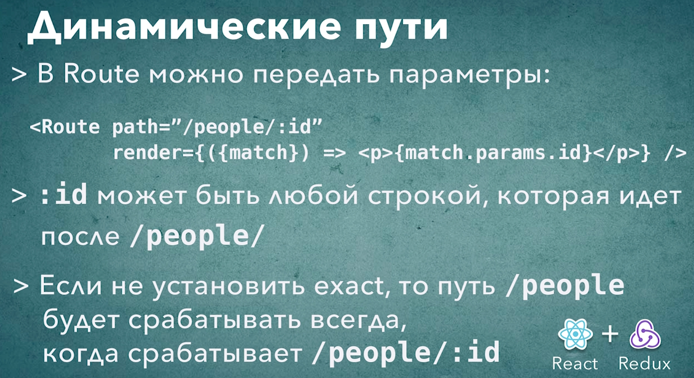

# 005_Динамические_пути


И так конкретно в этом блоке сталкнулся с проблемой динамических путей. То что поддерживалось в версии 4.3.1, в версии 6 не поддерживается. И вообще в твитере разработчика библиотеки говорится о том что они только планирую поддержку классовых компонентов. А App у меня классовый. Что бы закончить этот блок перехожу на врсию библиотеки 4.3.1.


```shell
npm uninstall react-router-dom

```

```shell
npm install react-router-dom@4.3.1

```

```json
{
  "name": "star_db",
  "version": "0.1.0",
  "private": true,
  "dependencies": {
    "@testing-library/jest-dom": "^5.16.2",
    "@testing-library/react": "^12.1.4",
    "@testing-library/user-event": "^13.5.0",
    "prop-types": "^15.8.1",
    "react": "^18.0.0",
    "react-dom": "^18.0.0",
    "react-router-dom": "^4.3.1",
    "react-scripts": "5.0.0",
    "web-vitals": "^2.1.4"
  },
  "scripts": {
    "start": "react-scripts start",
    "build": "react-scripts build",
    "test": "react-scripts test",
    "eject": "react-scripts eject"
  },
  "eslintConfig": {
    "extends": [
      "react-app",
      "react-app/jest"
    ]
  },
  "browserslist": {
    "production": [
      ">0.2%",
      "not dead",
      "not op_mini all"
    ],
    "development": [
      "last 1 chrome version",
      "last 1 firefox version",
      "last 1 safari version"
    ]
  }
}

```

```js
//src/component/app?App.js
import React, { Component } from "react";
import Header from "../header/header";
import "./App.css";
import SwapiService from "../../services/SwapiService";
import ErrorBoundary from "../errorBoundary/errorBoundary";
import { SwapiServiceProvider } from "../swapiServiceContext/swapiServiceContext";
import DummySwapiService from "../../services/dummySwapiService";
import RandomPlanet from "../randomPlanet/randomPlanet";
import PeoplePage from "../pages/peoplePage/peoplePage";
import PlanetsPage from "../pages/planetsPage/planetsPage";
import StarshipPage from "../pages/starshipPage/starshipPage";

import {
  BrowserRouter as Router,
  Switch,
  Route,
  Redirect,
} from "react-router-dom";
import StarshipDetails from "../sw-components/starshipDetails";

class App extends Component {
  state = {
    swapiService: new SwapiService(),
  };

  //Функция переключения сервисов API
  onServiceChange = () => {
    this.setState(({ swapiService }) => {
      //Наш новый сервис зависит от того какой тип у текущего сервиса
      const Service =
        swapiService instanceof SwapiService ? DummySwapiService : SwapiService;
      // Проверяю переключение
      console.log("switched to", Service.name);
      //Возвращаю обновленную часть состояния
      return {
        swapiService: new Service(),
      };
    });
  };

  render() {
    const { swapiService } = this.state;
    return (
      <ErrorBoundary>
        <SwapiServiceProvider value={swapiService}>
          <Router>
            <div className="stardb-app">
              <Header onServiceChange={this.onServiceChange} />
              <RandomPlanet />

              <Switch>
                <Route
                  path="/"
                  render={() => <h2>Welcome to StarDB</h2>}
                  exact
                />
                <Route path="/people" component={PeoplePage} />
                <Route path="/planets" component={PlanetsPage} />
                <Route path="/starships" component={StarshipPage} />
              </Switch>
            </div>
          </Router>
        </SwapiServiceProvider>
      </ErrorBoundary>
    );
  }
}

export default App;

```

И так динамические пути. В веб-приложениях очень часто встречается такой паттерн. На одной из страниц пользователь видит каталог элементов с кратким описанием. А затем кликнув на один из элеменов, пользователь переходит на страницу с детальным описанием этого элемента. По такому принципу работает мноэество интернет приложений.

Мы возьмем страницу Starships и сделаем так что бы на этой странице отображался только каталог кораблей. А при клике на один из кораблей пользователь будет переходить на отдельную страницу с деталями конкретного корабля.


Сначало сделаем новую страницу с деталями корабля.


К примеру было бы удобно если все космические корабли, доступные по пути "/starships", то космический корабль с id=4 был юы доступен по вот такому адресу  "/starships/4".

Нам нужно будет добавить еще несколько роутов в этом блоке. Ну и совершенно очевидно мы не можем себе позволить добавлять по одному роуту на каждый id корабля который существует. Кораблей могут быть тысячи.

В React Router есть специальный механизм который позволяет описать параметры для пути. Т.е. есть возможность добавлять в path специальные блоки, которые будут динамическими, которые будут изменяться в зависимости от параметра. Копирую роут starships и оббавляю после прямого слеша :id.


Такой путь будет срабатывать для вообще любого id который будет идти после прямого слеша.

В :id не обязательно должно быть число. Здесь может быть любое значение которое идет после "/starships/".


Теперь давайте реализуем страничку с деталями космического корабля. А затем мы отредактируем страничку starships для того что бы там отображался только список космических кораблей.

Есть два способа это сделать:

1. Первый способ это component={Component} или component={()=> <Component/>}
2. А второй способ использовать render функцию.


Если мы пойдем по пути создания нового компонента страницы, то единственное что будет делать эта страница это оборачивать другой существующий компонент StarshipDetails.

По этому в нашем случае нам хватит меленькой render функции.


И теперь нам нужно добавить параметр exact в роут "/starships" так как это теперь относительный корневой рут т.е. если мы не добавим exact, то роут "/starships" будет срабатывать всегда когда срабатывает "/starships/:id" поскольку "/starships" это часть роута "/starships/:id".


```js
//src/component/app?App.js
import React, { Component } from "react";
import Header from "../header/header";
import "./App.css";
import SwapiService from "../../services/SwapiService";
import ErrorBoundary from "../errorBoundary/errorBoundary";
import { SwapiServiceProvider } from "../swapiServiceContext/swapiServiceContext";
import DummySwapiService from "../../services/dummySwapiService";
import RandomPlanet from "../randomPlanet/randomPlanet";
import PeoplePage from "../pages/peoplePage/peoplePage";
import PlanetsPage from "../pages/planetsPage/planetsPage";
import StarshipPage from "../pages/starshipPage/starshipPage";

import {
    BrowserRouter as Router,
    Switch,
    Route,
    Redirect,
} from "react-router-dom";
import StarshipDetails from "../sw-components/starshipDetails";
import PlanetDetails from "../planetDetails/planetDetails";
import PersonDetails from "../sw-components/personDetails";

class App extends Component {
    state = {
        swapiService: new SwapiService(),
    };

    //Функция переключения сервисов API
    onServiceChange = () => {
        this.setState(({ swapiService }) => {
            //Наш новый сервис зависит от того какой тип у текущего сервиса
            const Service =
                swapiService instanceof SwapiService ? DummySwapiService : SwapiService;
            // Проверяю переключение
            console.log("switched to", Service.name);
            //Возвращаю обновленную часть состояния
            return {
                swapiService: new Service(),
            };
        });
    };

    render() {
        const { swapiService } = this.state;
        return (
            <ErrorBoundary>
                <SwapiServiceProvider value={swapiService}>
                    <Router>
                        <div className="stardb-app">
                            <Header onServiceChange={this.onServiceChange} />
                            <RandomPlanet />

                            <Switch>
                                <Route
                                    path="/"
                                    render={() => <h2>Welcome to StarDB</h2>}
                                    exact
                                />
                                <Route path="/people" component={PeoplePage} exact />
                                <Route path="/people/:id" render={() => <PersonDetails />} />
                                <Route path="/planets" component={PlanetsPage} exact />
                                <Route path="/planets/:id" render={() => <PlanetDetails />} />
                                <Route path="/starships" component={StarshipPage} exact />
                                <Route
                                    path="/starships/:id"
                                    render={() => <StarshipDetails />}
                                />
                            </Switch>
                        </div>
                    </Router>
                </SwapiServiceProvider>
            </ErrorBoundary>
        );
    }
}

export default App;

```


И так PlanetDetails был классовым компонентом. Переписал что бы был как все.

```js
import React from "react";
import "./planetDetails.css";
import ItemDetails from "../itemDetails/itemDetails";
import { Record } from "../itemDetails/record/record";
import withSwapiService from "../hoc-helpers/withSwapiService";

const PlanetDetails = (props) => {
  return (
    <ItemDetails {...props}>
      <Record field="model" label="Model" />
      <Record field="length" label="Length" />
      <Record field="costInCredits" label="Cost" />
    </ItemDetails>
  );
};

const mapMethodsToProps = (swapiService) => {
  return {
    getData: swapiService.getPlanet,
    getImageUrl: swapiService.getPlanetImage,
  };
};

export default withSwapiService(mapMethodsToProps)(PlanetDetails);

```

````js
import React from "react";
import ItemDetails from "../itemDetails/itemDetails";
import { Record } from "../itemDetails/record/record";
import withSwapiService from "../hoc-helpers/withSwapiService";

const PersonDetails = (props) => {
  return (
    <ItemDetails {...props}>
      {" "}
      <Record field="gender" label="Gender" />
      <Record field="eyeColor" label="Eye Color" />
    </ItemDetails>
  );
};

const mapMethodsToProps = (swapiService) => {
  return {
    getData: swapiService.getPerson,
    getImageUrl: swapiService.getPersonImage,
  };
};

export default withSwapiService(mapMethodsToProps)(PersonDetails);

````

````js
import React from "react";
import ItemDetails from "../itemDetails/itemDetails";
import { Record } from "../itemDetails/record/record";
import withSwapiService from "../hoc-helpers/withSwapiService";

const StarshipDetails = (props) => {
  return (
    <ItemDetails {...props}>
      <Record field="model" label="Model" />
      <Record field="length" label="Length" />
      <Record field="costInCredits" label="Cost" />
    </ItemDetails>
  );
};

const mapMethodsToProps = (swapiService) => {
  return {
    getData: swapiService.getStarship,
    getImageUrl: swapiService.getStarshipImage,
  };
};

export default withSwapiService(mapMethodsToProps)(StarshipDetails);

````

```js
import React from "react";
import SwapiService from "../../services/SwapiService";
import ErrorButton from "../errorButton/errorButton";
import "./itemDetails.css";
import withDetailsData from "../hoc-helpers/withDetailsData";

const ItemDetails = (props) => {
  const { item, image } = props;

  if (!item) {
    return <span>Select a item from a list</span>;
  }
  return (
    <div className="person-details card">
      
      <div className="card-body">
        <h4>{item.name}</h4>
        <ul className="list-group list-group-flush">
          {React.Children.map(props.children, (child) => {
            //Если прилетает строка а не объект, то ничего не делать
            if (typeof child === "string") {
              return;
            }
            return React.cloneElement(child, { item });
          })}
        </ul>
        <ErrorButton />
      </div>
    </div>
  );
};

const { getPerson } = new SwapiService();
export default withDetailsData(ItemDetails, getPerson);
// export default ItemDetails;

```


Пока что эти элементы ничего не отображают поскольку мы не передали id в этот компонент. Но он отображается сам, тому свидетельсво Select a item from a list.


Теперь возникает вопрос, как передать id в компонент? Напомним для точто бы StarshipDetails начал грузить какие-нибудь данные о корабле нужно ему передать itemId. Как эе нам получить это значение?


Ведь до этого этим значением занимался компонент StarshipPage. Именно этот компонент знал что при клике на списки нужно сохранить и передать в StarshipDetails новый itemId. Но теперь StarshipPage вообще не участвует в прорисовке нашей страницы, а само значение закодировано в url


Сделать это на самом деле очень просто. В render функцию React Router передаст объект с тремя специальными параметрами, тремя объектами которые используются для роутинга. Эти объекты это:

1. match - в этом объекте содержатся детали о том как именно вот этот path="/starships/:id" совпал с тем конкретным адресом, который сечас находится в строке браузера. B частрости вв объекте match есть те переметры которые мы передали в этот объект.
2. location - содержит детальную информацию о текущем состоянии роутера, о текущем положении, о текущей странице которая отображается.
3. history - используется для того что бы програмно перейти на другую страницу. history это тот API который внутри себя использует роутер для того что бы организовать переходы между страницами.


params - это как раз значение тех параметров которые мы передали. И здесь внутри params есть свойство id. Ну и кроме того есть два дополнительных параметра path: "/starships/:id", то значение path которое мы передали в роут, и url: "/starships/1", т.е. тот кусочек url который совпал с path.

Из всего этого объекта нас интересует params:{id:"5"}.

Передаю значение из params:{id:"5"} в наш компонент StarshipDetails. 


И так была проблема в компоненте ItemDetails. Какой запрос я бы не делал запрос делал, со страницы people, planets или starships, запрос происходил на получение персонажей. 

Вот решение


````js
import React from "react";
import SwapiService from "../../services/SwapiService";
import ErrorButton from "../errorButton/errorButton";
import "./itemDetails.css";
import withDetailsData from "../hoc-helpers/withDetailsData";

const ItemDetails = (props) => {
  const { item, image } = props;
  if (!item) {
    return <span>Select a item from a list</span>;
  }
  return (
    <div className="person-details card">
      
      <div className="card-body">
        <h4>{item.name}</h4>
        <ul className="list-group list-group-flush">
          {React.Children.map(props.children, (child) => {
            //Если прилетает строка а не объект, то ничего не делать
            if (typeof child === "string") {
              return;
            }
            return React.cloneElement(child, { item });
          })}
        </ul>
        <ErrorButton />
      </div>
    </div>
  );
};

const { getPerson, getPlanet, getStarship } = new SwapiService();

const Person = withDetailsData(ItemDetails)(getPerson);
const Planet = withDetailsData(ItemDetails)(getPlanet);
const Starship = withDetailsData(ItemDetails)(getStarship);
export { Person, Planet, Starship };

````

И в компонентах PersonDetails, StarshipDetails, PlanetDetails вместо того что бы возвращать ItemDetail, возвращаю каждому компоненту соответствующий ему обработанный и созданный компонент с помощью HOC withDetailsData.

```js
import React, { Component } from "react";

const withDetailsData = (View) => (getData) => {
  return class extends Component {
    state = {
      item: null,
      image: null,
    };

    componentDidMount() {
      this.updateDetails();
    }

    componentDidUpdate(prevProps, prevState, snapshot) {
      if (
        this.props.itemId !== prevProps.itemId ||
        this.props.getData !== prevProps.getData ||
        this.props.getImageUrl !== prevProps.getImageUrl
      ) {
        this.updateDetails();
      }
    }

    //Функция обновления
    updateDetails() {
      const { itemId, getImageUrl } = this.props;
      // в самом начале personId может быть null делаю проверку
      if (!itemId) {
        return;
      }
      //Получаю данные
      getData(itemId).then((item) => {
        this.setState({ item, image: getImageUrl(item) });
      });
    }
    render() {
      const { item, image } = this.state;

      return <View {...this.props} item={item} image={image} />;
    }
  };
};

export default withDetailsData;

```

```js
import React from "react";
import { Person } from "../itemDetails/itemDetails";
import { Record } from "../itemDetails/record/record";
import withSwapiService from "../hoc-helpers/withSwapiService";
import SwapiService from "../../services/SwapiService";
import withDetailsData from "../hoc-helpers/withDetailsData";

const PersonDetails = (props) => {
  return (
    <Person {...props}>
      <Record field="gender" label="Gender" />
      <Record field="eyeColor" label="Eye Color" />
    </Person>
  );
};

const mapMethodsToProps = (swapiService) => {
  return {
    getData: swapiService.getPerson,
    getImageUrl: swapiService.getPersonImage,
  };
};
const { getPerson } = new SwapiService();

export default withSwapiService(mapMethodsToProps)(PersonDetails);

```

```js
import React from "react";
import { Starship } from "../itemDetails/itemDetails";
import { Record } from "../itemDetails/record/record";
import withSwapiService from "../hoc-helpers/withSwapiService";

const StarshipDetails = (props) => {
  return (
    <Starship {...props}>
      <Record field="model" label="Model" />
      <Record field="length" label="Length" />
      <Record field="costInCredits" label="Cost" />
    </Starship>
  );
};

const mapMethodsToProps = (swapiService) => {
  return {
    getData: swapiService.getStarship,
    getImageUrl: swapiService.getStarshipImage,
  };
};

export default withSwapiService(mapMethodsToProps)(StarshipDetails);

```

```js
import React from "react";
import { Planet } from "../itemDetails/itemDetails";
import { Record } from "../itemDetails/record/record";
import withSwapiService from "../hoc-helpers/withSwapiService";

const PlanetDetails = (props) => {
  return (
    <Planet {...props}>
      <Record field="population" label="Population" />
      <Record field="rotationPeriod" label="Rotation Period" />
      <Record field="diameter" label="Diameter" />
    </Planet>
  );
};

const mapMethodsToProps = (swapiService) => {
  return {
    getData: swapiService.getPlanet,
    getImageUrl: swapiService.getPlanetImage,
  };
};

export default withSwapiService(mapMethodsToProps)(PlanetDetails);

```




