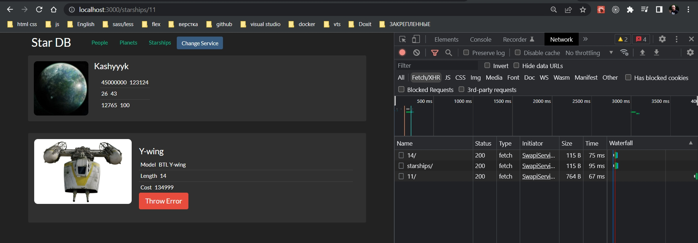
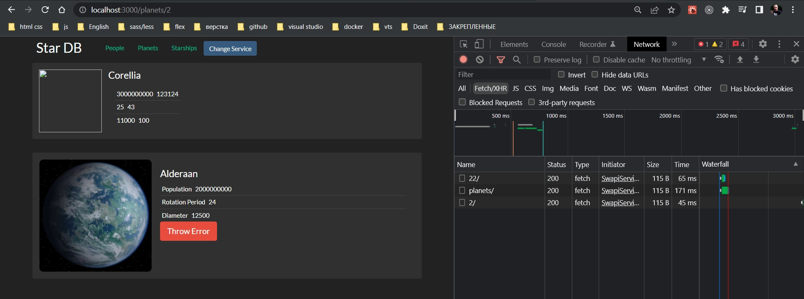

# 006_withRouter

Следующее что мне нужно сделать это обновить наши страницы. Ведь они до сих пор отображают список слева и компонент детального описания справа.

А я хочу сделать так что бы при клике на список мы переходили на страницу детального описания.

Начну со страницы StarshipPage

```js
import React, { Component } from "react";
import { StarshipList } from "../../sw-components/itemLists";
import StarshipDetails from "../../sw-components/starshipDetails";
import Row from "../../row/row";

class StarshipPage extends Component {
  state = { selectedItem: null };

  onItemSelected = (selectedItem) => {
    this.setState({ selectedItem });
  };
  render() {
    const { selectedItem } = this.state;
    return (
      <Row
        left={<StarshipList onItemSelected={this.onItemSelected} />}
        right={<StarshipDetails itemId={selectedItem} />}
      />
    );
  }
}

export default StarshipPage;

```

Прямо сейчас этот компонент отвечает за то, что бы слушать клики по списку кораблей. И как только пользователь выбирает новый корабль, этот корабль устанавливается в state и затем из state он попадает в StarshipDetails.

Теперь нам не нужна вот эта логика


поскольку теперь id корабля будет закодирован в url страницы а не хранится в StarshipPage.

Так как состояния у меня здесь больше нет. То данный компонент будет отвечать только за отрисовку. В StarshipList пока что добавляю пустую функцию, которая будет отвечать за добавление id в url строку.

```js
import React from "react";
import { StarshipList } from "../../sw-components/itemLists";

const StarshipPage = () => {
  return <StarshipList onItemSelected={() => {}} />;
};

export default StarshipPage;

```

Внутри нашей функции мы должны получать itemId и мы должны сделать что-то что бы пользователь перешел на новую страницу, адрес которой будет


Вопрос. Что нужно сделать что бы пользователь перешел по этому пути?

В App когда мы использовали в компоненте Route render функцию, React Router передавал в нее несколько объектов match, location, history.

Так вот объект history который передается в render функцию умеет это делать. Он умеет сделать так что бы пользователь перешел на какой-нибудь конкретный адрес.

Но когда вы используете Route вместе с component, то React Router не будет автоматически, в свойства этого компонента, добавлять match, location, history.

По этому что бы получить доступ к объекту нам нужно использовать компонент высшего порядка, который использует контекст в свою очередь внутри себя, для того что бы достать match, location, history, для нашего компонента StarshipPage.

На самом деле код очень-очень простой.

Все что нам нужно сделать это импортировать withRouter из react-router-dom.

```js
import React from "react";
import { StarshipList } from "../../sw-components/itemLists";
import { withRouter } from "react-router-dom";

const StarshipPage = () => {
  return (
    <StarshipList
      onItemSelected={(itemId) => {
        const newPath = `/starships/${itemId}`;
      }}
    />
  );
};

export default withRouter(StarshipPage);

```

Теперь этот компонент высшего порядка withRouter, передаст в StarshipPage те самые три объекта которые использует react-router-dom.



```js
import React from "react";
import { PlanetList } from "../../sw-components/itemLists";
import { withRouter } from "react-router-dom";

const PlanetsPage = ({ history }) => {
  return (
    <PlanetList
      onItemSelected={(itemId) => {
        history.push(`/planets/${itemId}`);
      }}
    />
  );
};

export default withRouter(PlanetsPage);

```

```js
import React from "react";
import { PersonList } from "../../sw-components/itemLists";
import { withRouter } from "react-router-dom";

const PeoplePage = ({ history }) => {
  return (
    <PersonList
      onItemSelected={(itemId) => {
        history.push(`/people/${itemId}`);
      }}
    />
  );
};

export default withRouter(PeoplePage);

```




