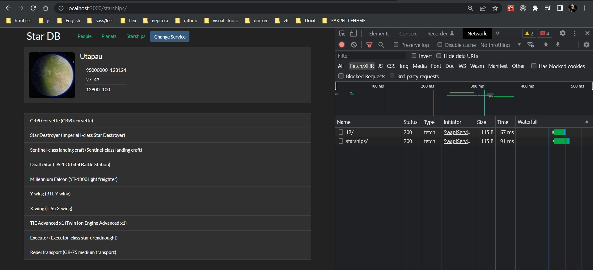
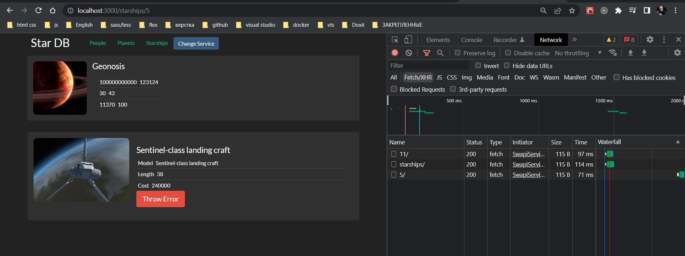
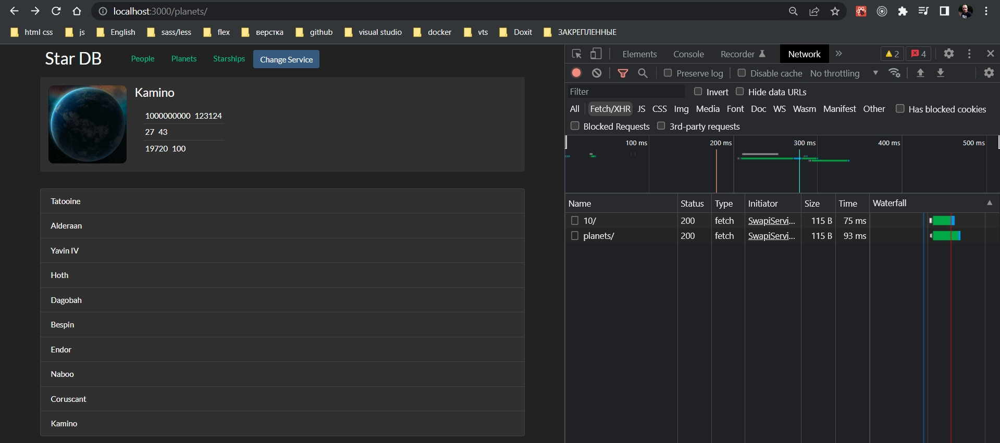
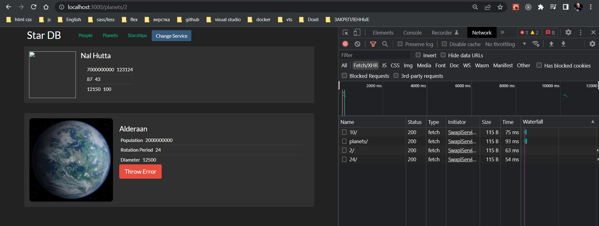
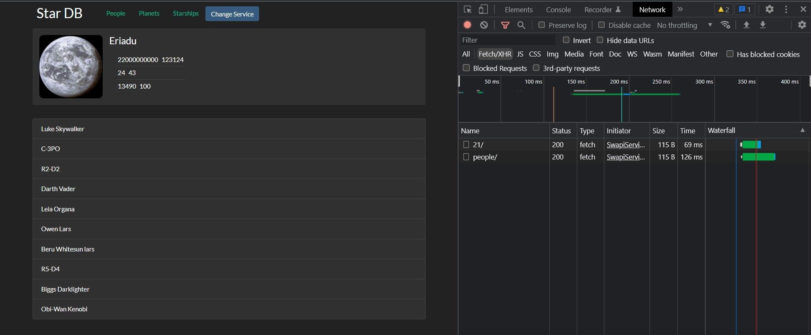
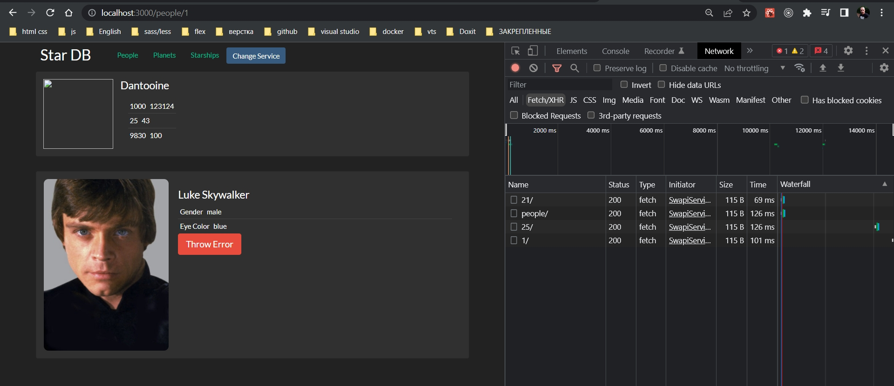

# 007_Относительные_пути

Мы с вами научились программно переключать странички в нашем приложении и для этого мы использовали объект history

```js
import React from "react";
import { StarshipList } from "../../sw-components/itemLists";
import { withRouter } from "react-router-dom";

const StarshipPage = ({  history }) => {
  return (
    <StarshipList
      onItemSelected={(itemId) => {
        history.push(`/starships/${itemId}`);
      }}
    />
  );
};

export default withRouter(StarshipPage);

```

Мы вызывали метод history.push и передавали туда абсолютный путь к нашему новому ресурсу.

Но в большом приложении, где есть много путей которые вложены друг в друга, было бы намного удобнее если бы нам не приходилось использовать абсолютную часть пути.

Т.е. я бы хотел использовать относительные пути вместо абсолютных. И React Router умеет это делать. Но перед тем как мы обновим наш код, важно понять каким именно образом работают абсолютные и относительные пути в вебе в целом.

И вот два пути.


```
/starships/

/starships
```

Эти два пути отличаются одной маленькой деталью.  Один путь заканчивается слешом, а второй нет.

Семантика веба говорит о том что первый путь указывает на папку, в которой содержаться другие ресурсы.

Ну а второй путь указывает на какой-нибудь файл.

Но важный аспект заключается в том как именно будет интерпретироваться относительный путь, когда мы будем вызывать его из одного из этих путей.

Так вот если мы возьмем /starships/ и добавим к этому пути относительный путь с каким-нибудь id, то мы получим тот путь который мы и ожидаем получить.

```
/starships/ + 5 = /starships/5

/starships
```

Здесь все будет работать замечательно.

Ну а если мы воспользуемся вторым путем

```
/starships/ + 5 = /starships/5

/starships + 5 = /5
```

Логика и здравый смысл в таком поведении,/starships + 5 = /5, как ни странно есть. Путь /starships не заканчивается прямым слешом, а значит это не папка, а файл, и интерпретировать его стоит как файл. Внутрь файла мы зайти не можем что бы взять из него какой-нибудь дополнительный ресурс. По этому относительный путь означает что мы хотим этот файл,/starships, заменить на другой файл /starships + 5.

В этом случае /starships/ + 5 = /starships/5 мы говорим что starships это папка. И когда мы говорим что мы хотим перейти по относительному пути  + 5, т.е. относительно этой папки, мы заходим внутрь этой папки и добавляем этот относительный путь к нашему абсолютному пути /starships/5.

Вот такое вот маленькое различие /starships/ + 5 = /starships/5 с одним закрывающим прямым слешом, как привило, стоит довольно много времени на отладку вашего приложения, поскольку React Router работает точно так же.

```js
//src/component/header/header.js
import React from "react";
import { Link } from "react-router-dom";
import "./header.css";

const Header = ({ onServiceChange }) => {
  return (
    <div className="header d-flex">
      <h3>
        <Link to="/">Star DB</Link>
      </h3>
      <ul className="d-flex">
        <li>
          <Link to="/people/">People</Link>
        </li>
        <li>
          <Link to="/planets/">Planets</Link>
        </li>
        <li>
          <Link to="/starships/">Starships</Link>
        </li>
      </ul>
      <button className="btn btn-primary bt-sm" onClick={onServiceChange}>
        Change Service
      </button>
    </div>
  );
};

export default Header;

```

```js
import React from "react";
import { StarshipList } from "../../sw-components/itemLists";
import { withRouter } from "react-router-dom";

const StarshipPage = ({ history }) => {
  return (
    <StarshipList
      onItemSelected={(itemId) => {
        history.push(`${itemId}`);
      }}
    />
  );
};

export default withRouter(StarshipPage);

```

```js
import React from "react";
import { PlanetList } from "../../sw-components/itemLists";
import { withRouter } from "react-router-dom";

const PlanetsPage = ({ history }) => {
  return (
    <PlanetList
      onItemSelected={(itemId) => {
        history.push(`${itemId}`);
      }}
    />
  );
};

export default withRouter(PlanetsPage);

```

```js
import React from "react";
import { PersonList } from "../../sw-components/itemLists";
import { withRouter } from "react-router-dom";

const PeoplePage = ({ history }) => {
  return (
    <PersonList
      onItemSelected={(itemId) => {
        history.push(`${itemId}`);
      }}
    />
  );
};

export default withRouter(PeoplePage);

```













Следите что бы адреса ваших промежуточных страниц заканчивались на прямой слеш и тогда относительные пути в React Router будут работать без проблем.


