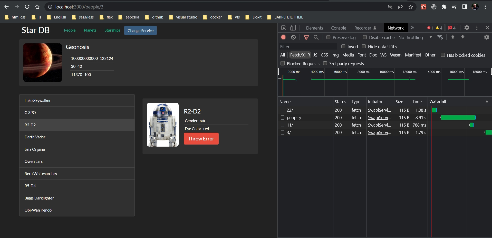
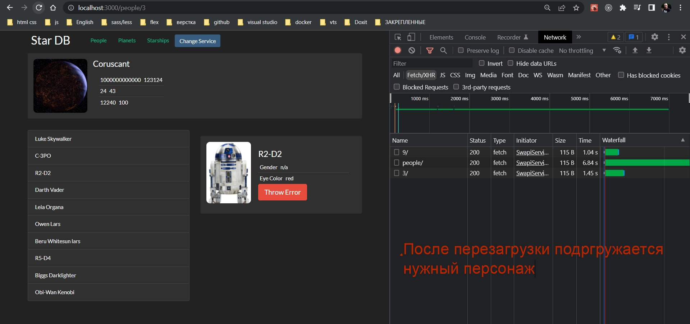
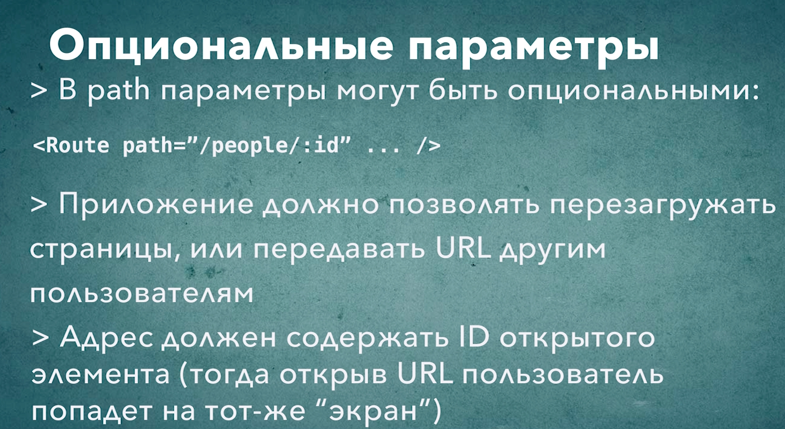

# 008_Опциональные_параметры

Мы использовали React Router для того что бы немного изменить структуру нашего приложени и заодно упростить код.

И так для этого урока мне нужно вернуть компонент PeoplePage в то состояние когда он отображал два блока. 

И так хотелось бы что бы эта страница тоже сохраняла адрес выбранного персонажа.

В прошлом примере у меня было две страницы path="/people/" и path="/people/:id".

В этом же случае для отображения двух компонентов у меня используется одна страница path="/people/".

Если я добавлю path="/people/:id", то компонент PeoplePage не будет отображаться. Тогда мы просто перейдем на адрес path="/people/"


Если я после id добавлю вопросительный знак будет срабатывать и для блока people и для блока id. Т.е. вот этот кусочек пути :id? будет считаться опциональным.

```js
//src/component/app?App.js
import React, { Component } from "react";
import Header from "../header/header";
import "./App.css";
import SwapiService from "../../services/SwapiService";
import ErrorBoundary from "../errorBoundary/errorBoundary";
import { SwapiServiceProvider } from "../swapiServiceContext/swapiServiceContext";
import DummySwapiService from "../../services/dummySwapiService";
import RandomPlanet from "../randomPlanet/randomPlanet";
import PeoplePage from "../pages/peoplePage/peoplePage";
import PlanetsPage from "../pages/planetsPage/planetsPage";
import StarshipPage from "../pages/starshipPage/starshipPage";

import {
  BrowserRouter as Router,
  Switch,
  Route,
  Redirect,
} from "react-router-dom";
import StarshipDetails from "../sw-components/starshipDetails";
import PlanetDetails from "../sw-components/planetDetails";
import PersonDetails from "../sw-components/personDetails";

class App extends Component {
  state = {
    swapiService: new SwapiService(),
  };

  //Функция переключения сервисов API
  onServiceChange = () => {
    this.setState(({ swapiService }) => {
      //Наш новый сервис зависит от того какой тип у текущего сервиса
      const Service =
        swapiService instanceof SwapiService ? DummySwapiService : SwapiService;
      // Проверяю переключение
      console.log("switched to", Service.name);
      //Возвращаю обновленную часть состояния
      return {
        swapiService: new Service(),
      };
    });
  };

  render() {
    const { swapiService } = this.state;
    return (
      <ErrorBoundary>
        <SwapiServiceProvider value={swapiService}>
          <Router>
            <div className="stardb-app">
              <Header onServiceChange={this.onServiceChange} />
              <RandomPlanet />

              <Switch>
                <Route
                  path="/"
                  render={() => <h2>Welcome to StarDB</h2>}
                  exact
                />
                <Route path="/people/:id?" component={PeoplePage} exact />
                <Route path="/planets" component={PlanetsPage} exact />
                <Route path="/starships" component={StarshipPage} exact />

                <Route
                  path="/planets/:id/"
                  render={({ match }) => {
                    const { id } = match.params;
                    return <PlanetDetails itemId={id} />;
                  }}
                />

                <Route
                  path="/starships/:id/"
                  render={({ match }) => {
                    const { id } = match.params;
                    return <StarshipDetails itemId={id} />;
                  }}
                />
              </Switch>
            </div>
          </Router>
        </SwapiServiceProvider>
      </ErrorBoundary>
    );
  }
}

export default App;

```

Теперь PeoplePage нужно получить доступ к тем объектам которые использует React Router. А именно объект history который используется для переключения путей и объект match который используется для того что бы получить параметры текущего пути.

```js
import React from "react";
import { PersonList } from "../../sw-components/itemLists";
import { withRouter } from "react-router-dom";
import PersonDetails from "../../sw-components/personDetails";
import Row from "../../row/row";

const PeoplePage = ({ history, match }) => {
  const { id } = match.params;
  return (
    <Row
      left={<PersonList onItemSelected={(id) => history.push(`${id}`)} />}
      right={<PersonDetails itemId={id} />}
    />
  );
};

export default withRouter(PeoplePage);

```







