# 001_Введение_в_Redux 

Когда вы работаете с UI приложениями, управление состояниеми данными приложения - это одна из основных задач разработчика. Если модель данных разработана правильно и она предсказуемо обновляется и корректно реагирует на события, то отображение этих данных - это задача уже куда более простая.

Посмотрим на предыдущие два приложения.

Первое приложение Todo List.

Todo List работал с централизованной моделью данных. Схеметически это можно было бы представить вот так.

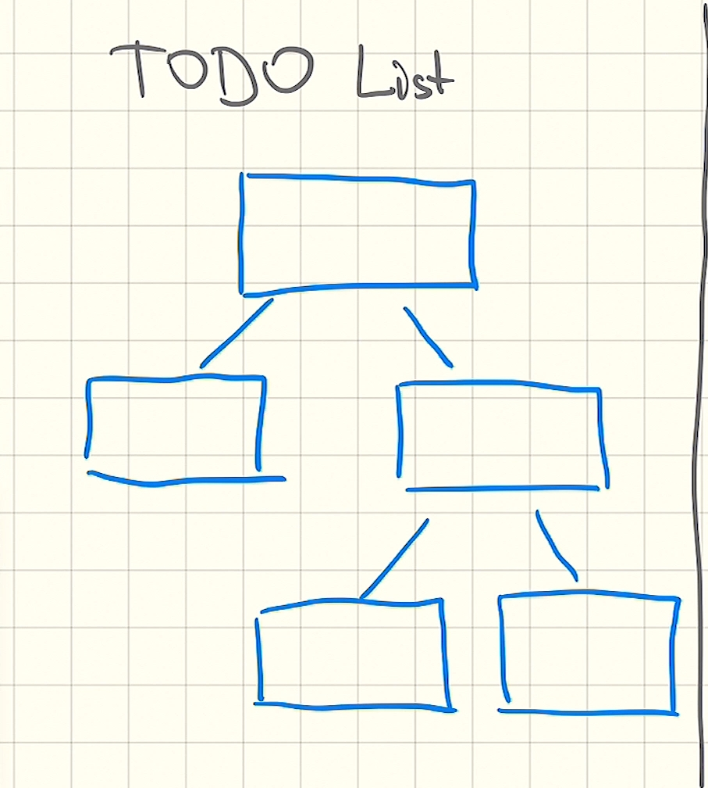

Синие прямоугольники - это компоненты нашего React приложения. 

Так вот в Todo List наше состояние хранилось централизированно в компоненте самого верхнего уровня - это был компонент App.

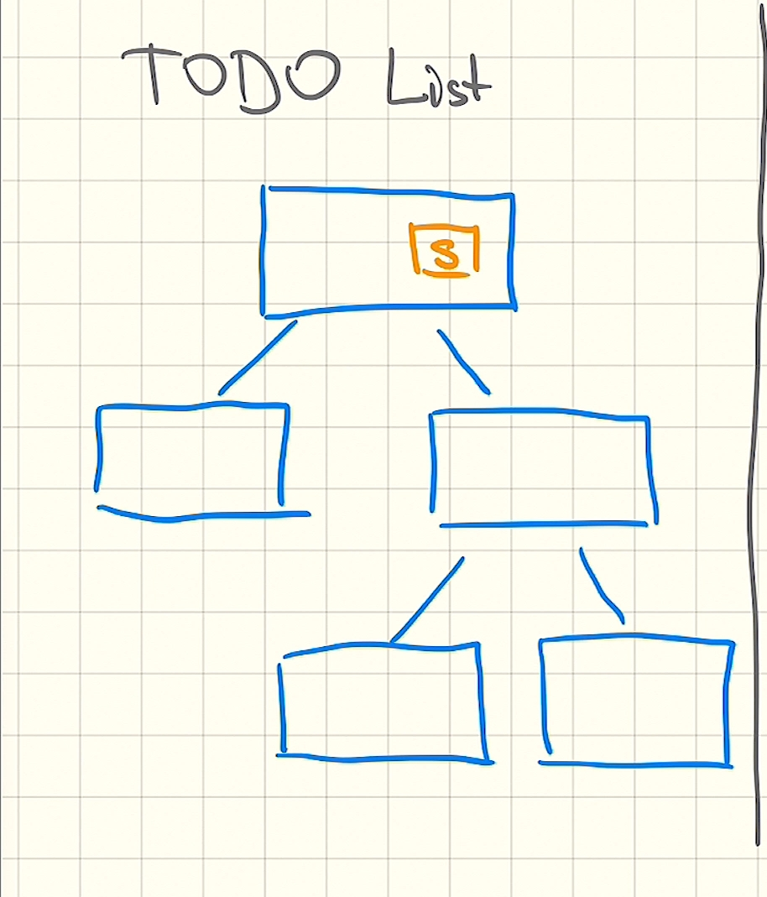

И затем этот state в виде props передавался дальше, компонентам ниже по иерархии, которые занимались только тем что отображали этот state.

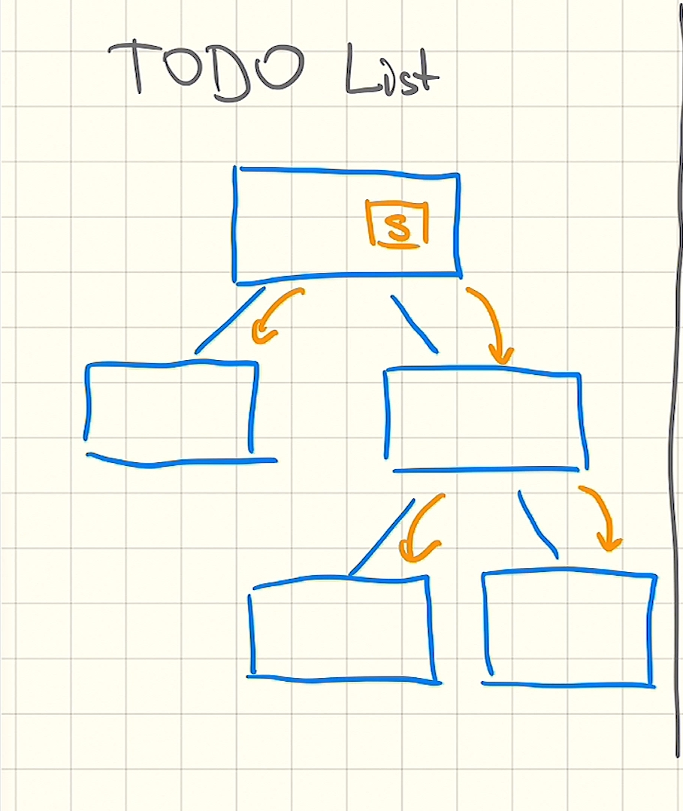

Ну а если нам нужно было обновить это глобальное состояние, то мы использовали механизм событий. Таким образом компоненты ниже по иерархии могли передавать инфрмацию компонентам выше по иерархии.

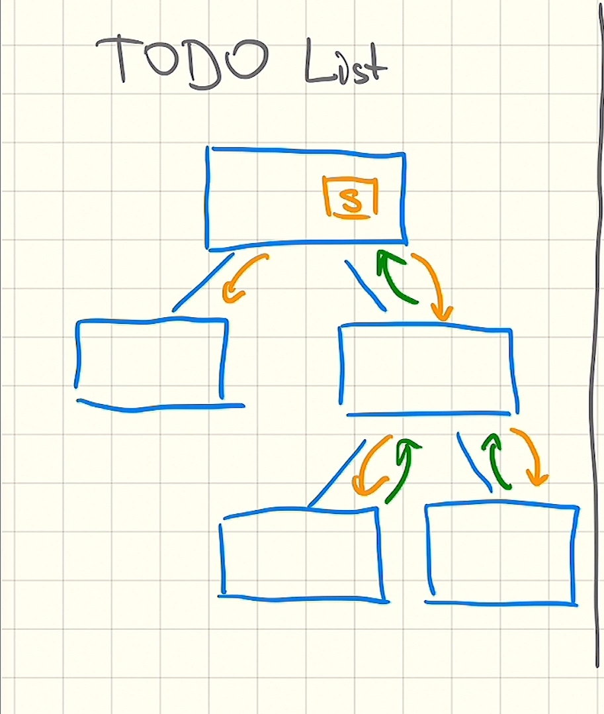

Плюсом этого подхода было то что в нашем приложении был единый источник истины, один самый главный state который обновлялся тоже централизованно. 

Но за это приходилось платить.

Для того что бы дать возможность компонентам ниже по иерархии работать с этим самым глобальным состоянием, мы должны были передать его по всей цепочке вниз до самых маленьких компонентов.

А что бы обновлять это состояние, мы должны были поднимать события вверх, от самых нижних компонентов, до верхушки иерархии. 

Эта проблема в React называется Property Drill.([Как управлять состоянием React приложения без сторонних библиотек](https://habr.com/ru/post/507572/)) . Мы как будто сверлом проходим сквозь все слои нашего приложения для того что бы передать вниз нужные свойства. Но а следы от этой передачи свойств остаются на всех уровнях. Даже если самому компоненту не нужны некоторые свойства, он вынужден с ними работать просто ради того что бы передать их ниже по иерархии.

А теперь посмотрим на альтернативный подход, наше второе приложение StarDB. Там мы пошли по другому пути. Вместо того что бы хранить данные централизованно, мы сделали так что бы каждый компонент самостоятельно отвечал за свои данные и за свой state. Схаматически этот подход можно было бы изобразить вот так.

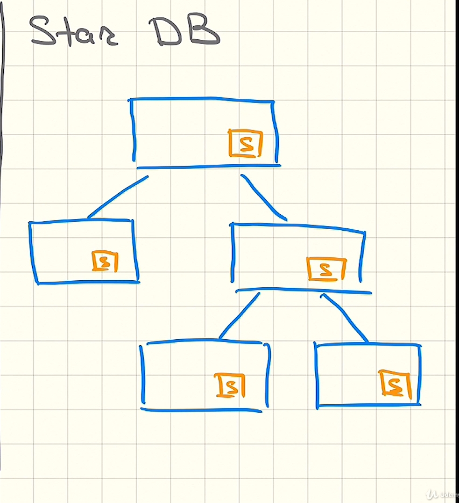

Почти каждый основной компонент в StarDB самостоятельно отвечал за то что бы управлять своим состоянием. И в StarDB этот метод хорошо работал. Между компонетами было минимум зависимостей. Но такой подход сложно масштабировать, особенно когда компонентов становится больше и они начинают зависить дуг от друга. МЫ РИСКУЕМ УПУСТИТЬ КАКУЮ-НИБУДЬ ДЕТАЛЬ ОБНОВЛЕНИЯ СОСТОЯНИЯ И ПОПРОСТУ  СЛОМАТЬ НАШУ МОДЕЛЬ КОГДА У НАС ЕСТЬ ВОТ ТАКОЙ ФРАГМЕНТИРОВАННЫЙ STATE 

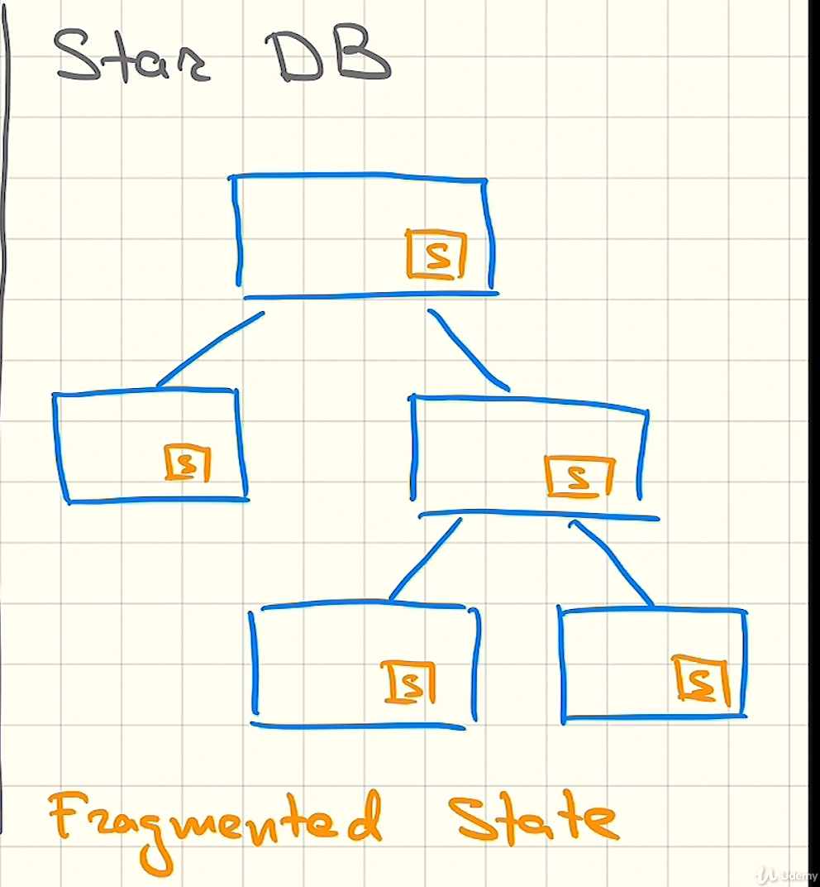

А приложение с неконсистентным состоянием - это даже хуже, чем приложение которое полностью поломано. Потому что поломанное приложение просто не работает. А приложение не с консистентным состоянием может привести к тому что пользователь выполнит действие которое он выполнять не хотел. К примеру отправит письмо не тому получателю, или переведет деньги на неправильный счет. 

Как видите у каждого из двух подходов есть плюсы и минусы. И каждый подход хорошо работает в определенных сценариях. 

Todo List - это простой приложение с взаимосвязанными компонентами. 

Но а StarDB - это пример немножко более сложного приложения с независимыми компонентами.

Но как же быть если у нас с вами есть сложное приложение с зависимыми компонентами?

Нужно сказать что эта проблема совершенно не новая. Вопрос распределения обязанностей между визуальными компонентами, выделение логики приложения, управление моделью данных. Этот вопрос существовал еще на заре разработки сложных динамических интерфейсов.

Разработчики уже давно пришли к выводу что разделение логики и рендеринга - это хорошо.

Разделение компонентов и модели данных - это тоже хорошо.

И создали на основании этих идей несколько паттернов.

Самый известный паттерн это MVC [Паттерны для новичков: MVC vs MVP vs MVVM](https://habr.com/ru/post/215605/).

Как вы видите задача управления данными и разделение обязанностей в UI приложениях совершенно не новая и не уникальная для React приложений. Эта задача существовала задоло до появления React и Redux.

Но все же вернемся к нашему примеру сложного нетривиального приложения с взаимосвязанными компонентами. Схематически изобразим такое приложение.

Каждый компонент в React приложении может хранить state.

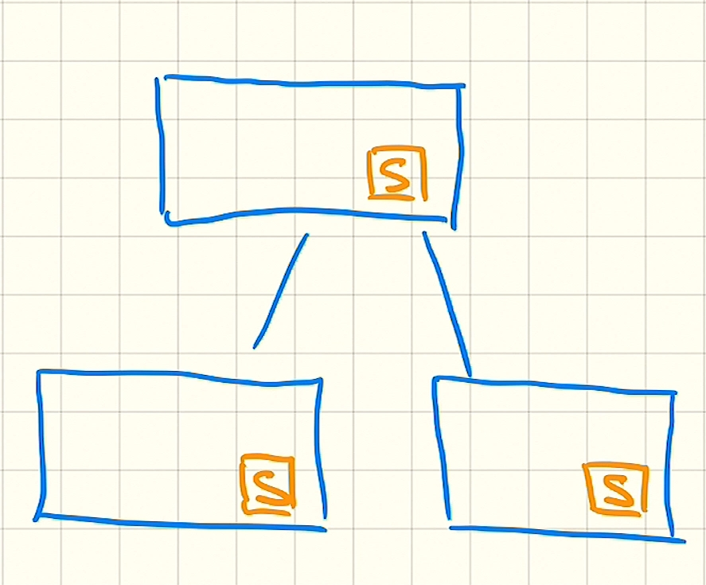

Кроме того у каждого компонента может быть логика по которой этот state обновляется.

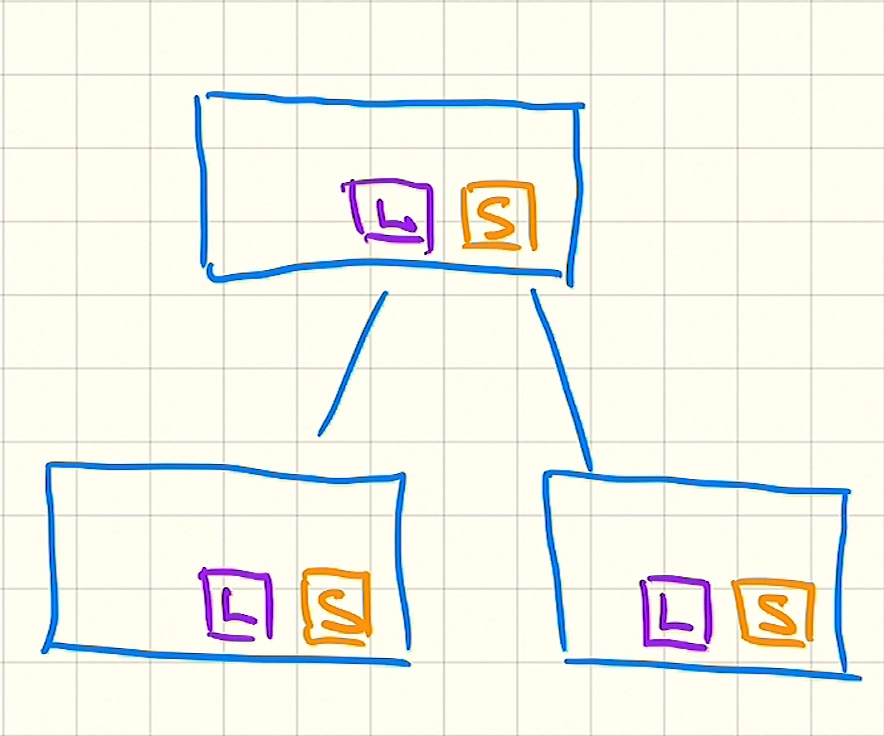

Ну и конечно компоненты могут заниматся рендерингом, отображением UI элементов.

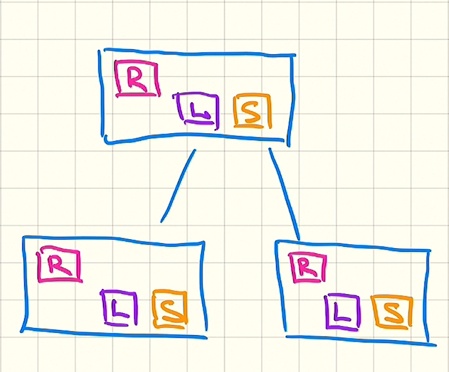

Теперь давайте представим что мы работаем с большим и не тривиальным приложением у которого некоторые компоненты взаимосвязаны. С одной стороны мы не хотим в каждом компоненте хранить свой кусочек состояния. Ну а с другой стороны мы не хотим получить проблему property drill и передавать ниши свойства через много-много слоев приложения.

А что если мы возьмем и в нашем приложении мы откажемся от всех этих маленьких локальных стейтов в компонентах. И вместо этого мы договоримся что абсолютно все данные приложения будут хранится централизованно в одном большом state. И этот state будет доступен каждому компоненту.

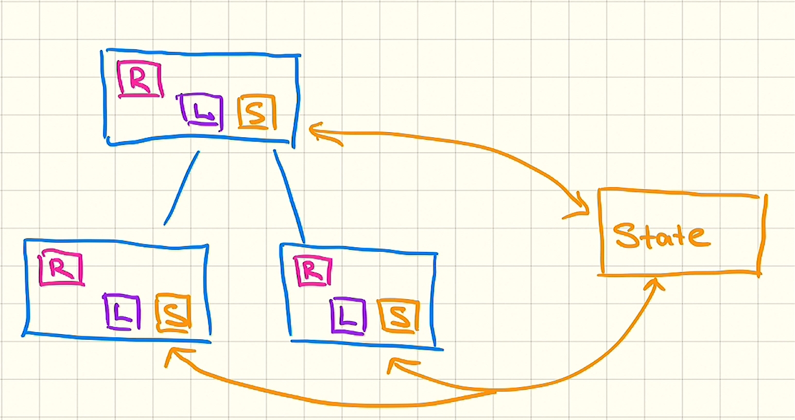

Тогда мы бы смогли убрать все локальные маленькие стеты и работать с одним большим стейтом.

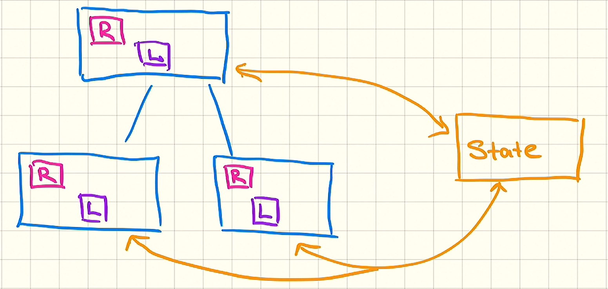

Даже визуально на схеме наши компоненты стали проще потому что мы забрали чисть обязанностей по хранению стейтов из этих компонентов. Нам даже не сложно представить как можно было бы реализовать такую архитектуру используя к примеру Context в React.

Проблема решена!!! Или нет?

На самом деле эта схема абсолютно абсурдна

оснавная причина почему  никогда это не будет работать - это полная потеря над изменениями в состоянии. Каждый компонент теперь может читать или писать в глобальный объект все что ему вздумается. И поддерживать такой код со временем стало бы попросту невозможно.

Давайте пока не будем забрасывать эту идею и попробуем придумать как бы мы смогли сделать обновление этого самого глобального состояния немного более контролируемым.

А что если мы с вами устраним эту проблему и запретим компонентам обновлять это самое глобальное хранилище. Нашим компонентам можно будет читать из глобального state. Но будет строго настрого запрещено в него записывать.

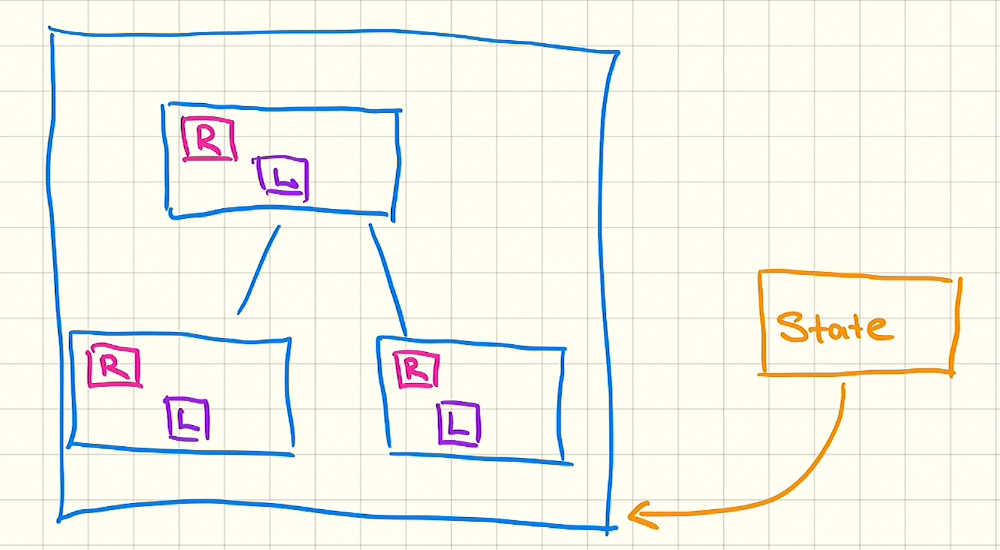

Но тогда если не компоненты, то кто же будет обновлять наш state? Кто же будет реализовывать бизнес логику?

В нашем приложении мы пойдем еще на шаг дальше и после того как мы вынесли весь state из всех компонентов в глобальный state.

Мы точно так же поступим и с логикой. И создадим большое, глобальное хранилище бизнеслогики. 

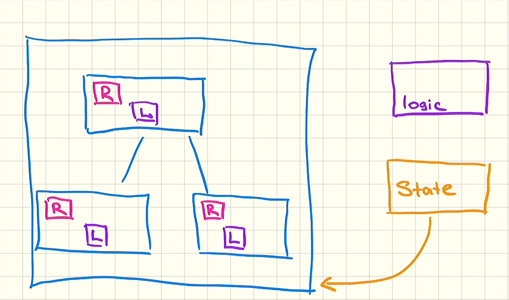

Квадрат Logic это попросту функция. Эта функция знает что делать и как обновлять наше глобальное состояние. Пользователь кликнул на удалить элемент из списка дел, наша функция знает что нужно удалить элемент из массива state, и пересчитать сколько осталось всего дел в списке, сколько из них в статусе done ну и т.д. Эту функцию мы назовем reducer. Это крайне не удачное имя, но так уж повелось.

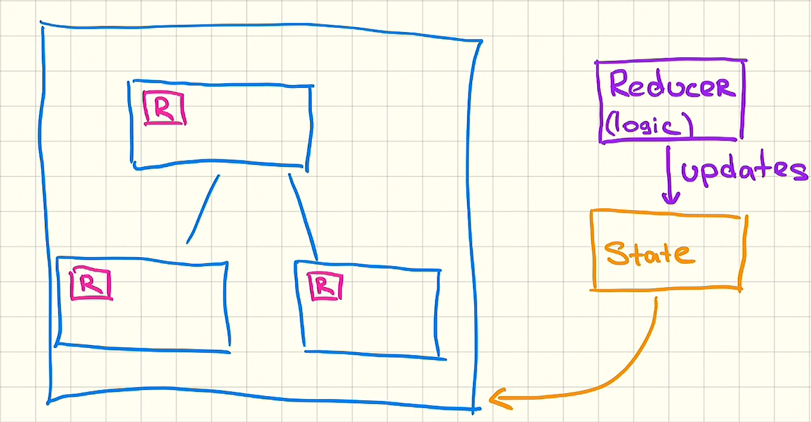

Ну и остался последний вопрос. Как связать наши компоненты с функцией reducer? Да точно так же как мы раньше организовывали взаимодействие между компонентами на разных уровнях, ПРИ ПОМОЩИ СОБЫТИЙ. МЫ СКАЖЕМ ЧТО КОМПОНЕНТЫ НАПРЯМУЮ НЕ МОГУТ МЕНЯТЬ STATE НО КОМПОНЕНТЫ МОГУТ СОЗДАВАТЬ СОБЫТИЯ КОТОРЫЕ МЫ БУДЕМ ПЕРЕДАВАТЬ В ЭТУ САМУЮ ФУНКЦИЮ REDUCER И КОТОРАЯ БУДЕТ ЗНАТЬ КАК ОБНОВИТЬ СОСТОЯНИЕ ДЛЯ СОВЕРШЕННО ЛЮБОГО СОБЫТИЯ В НАШЕМ ПРТЛОЖЕНИИ.

События в Redux называются Actions т.е. действия.

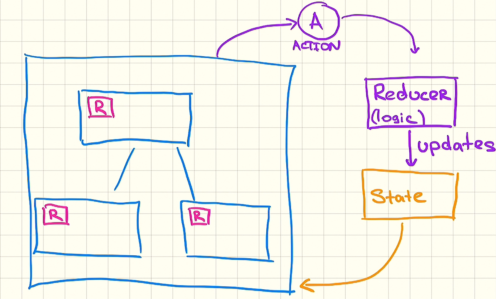

И есть еще один компонент который организовывает работу функции reducer и контролирует обновление state, этот компонент называется store

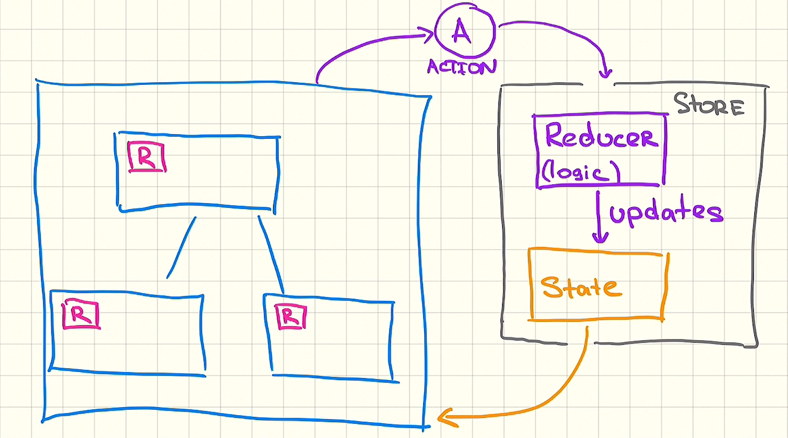

Что бы сделать эту схему еще понятнее. Представте себе что вы взяли обычное React приложение, все локальные стейты компонентов вы объеденили в один большой state. Затем вы взяли всю логику которая изменяет state и вынесли в отдельную функцию которую мы назвали reducer. Ну а для того что бы обновить state, к примеру в ответ на то что пользователь нажимает какую-нибудь кнопку, React компонент может создать специальное событие которое в терминах Redux называется action т.е. действие. 

Это действие Action по сути обычный JS объект который описывает что именно ноужно сделать. 

Ну а reducer знает как это сделать. reducer обновляет state и state делает так что React компонент отрендеривает новое состояние на UI.

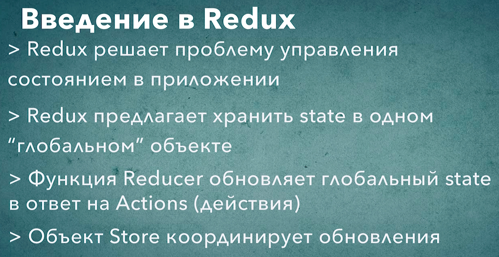

