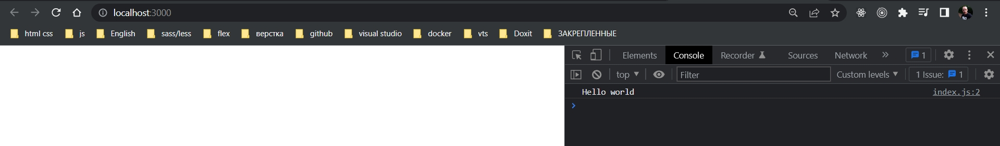
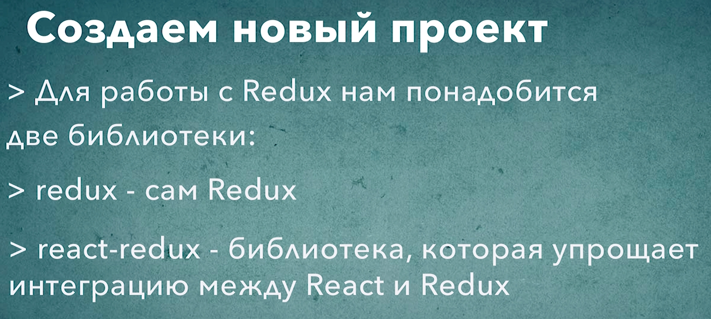

# 002_Установка_библиотек

Следующие несколько уроков мы посвятим тому что бы разобрать то как работает Redux.

И начнем мы с того что будем работать с Redux без React. Ведь Redux не коем образом не связан с  React. Он хорошо работает с React, но React это не коем образом не обязателльная часть.

Называю проект redux-sandbox и в директории с проектом

```shell
npx create-react-app .
```

Теперь установим пару дополнительных зависимостей.

```shell
npm install redux react-redux
```

В папке public удаляю все кроме index.html. В папке src удаляю все кроме index.js.

```html
<!DOCTYPE html>
<html lang="en">
  <head>
    <meta charset="utf-8" />
    <meta name="viewport" content="width=device-width, initial-scale=1" />
    <title>Redux Sandbox</title>
  </head>
  <body>
    <div id="root"></div>
  </body>
</html>

```

```js
//src/index.js
console.log("Hello world");

```



Тем самым убеждаюсь что js скрипты подгрузились. 

И добавлю ссылку на 

```html
<!DOCTYPE html>
<html lang="en">
  <head>
    <meta charset="utf-8" />
    <meta name="viewport" content="width=device-width, initial-scale=1" />
    <link rel="stylesheet" href="https://stackpath.bootstrapcdn.com/bootstrap/4.1.3/css/bootstrap.min.css">
    <title>Redux Sandbox</title>
  </head>
  <body>
    <div id="root"></div>
  </body>
</html>

```




