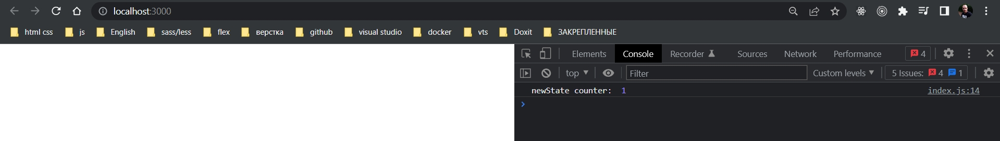

# 003_Reducer

И так мы снова возвращаемся к основам. Мы создадим максимально простое приложение и будем использовать Redux для управления состоянием в этом приложении.

Мы будем писать счетчик. Это самое простое приложение. Оно будет просто увеличивать значение каждый раз когда мы будем кликать на кнопку. Проще может быть только Hello World.

Но наша цель посмотреть на Redux в изоляции, посмотреть как работают компоненты Redux. Вспомним как у нас работает Redux.


И так у нас есть глобальный state и из него можно читать значение. Т.е. наши компоненты которые занимаются отображением в приложении могут читать state, но не записывать в него.

Для того что бы изменить state мы создаем объекты action и передаем их в store. Эта операция называется dispatch.

И store использует функцию, которую мы называем reducer котораяиспользуется что бы обновить глобальный state.

Как видно центральный объект для Redux - это Redux Store


И в этом объекте самое главное место занимает reducer - функция которая умеет реагировать на actions и обновлять наш state.


В этом видео мы начнем с того что рассмотрим как работает функция reducer. И как создавать бъекты action.

И так у нашего приложения будет первоначальное состояние.

```js
//src/index.js

//инициализация состояния
const initialState = 0;

```

Теперь создадим функцию reducer. И эта функция будет работать почти как функция в setState в React. Функция reducer на вход принимает текущий state.

```js
//src/index.js

//инициализация состояния
const initialState = 0;

const reducer = (state) => {};

```

Кроме того функции reducer нужно знать чего мы от нее хотим. Нам нужно знать какое действие мы хотим выполнить над этим state. Т.е. вторым аргументом функция reducer принимает action.

```js
//src/index.js

//инициализация состояния
const initialState = 0;

const reducer = (state, action) => {};

```

Ну а возвращать эта функция будет новый state по аналогии с тем как работает setState в React.

По началу сделаю так что бы эта функция просто возвращала 0.

```js
//src/index.js

//инициализация состояния
const initialState = 0;

const reducer = (state, action) => {
  return 0;
};

```

Как бы мы теперь могли бы изменить счетчик на единичку?

Создаю переменную let state и присваиваю результат функции reducer(). Первым аргументом передаю initialState, а вторым параметром передаю объект в котором говорю что хочу выполнить действие с типом {type:'INCREMENT'}

```js
//src/index.js

//инициализация состояния
const initialState = 0;

const reducer = (state, action) => {
  return 0;
};

let state = reducer(initialState, { type: "INCREMENT" });

```

Когда мы работаем с Redux, action - это самый обычный JS объект. У объекта может быть любая структура. Но главное что бы у него был поле type, и у этого поля было какое-нибудь значение, строка которая описывает тип действия, которое мы собираемся собственно совершить.

И теперь мы можем дописать немного логики в нашу функцию reducer.

```js
//src/index.js

//инициализация состояния
const initialState = 0;

const reducer = (state, action) => {
  if (action.type === "INCREMENT") {
    return state + 1;
  }
  return 0;
};

let state = reducer(initialState, { type: "INCREMENT" });

```

В Redux state может быть любого типа - это может быть строка, число, объект или массив. Ограничений здесь нет.

Мы сохраняем значение в новом state. Для наглядности лучше напишу newState

```js
//src/index.js

//инициализация состояния
const initialState = 0;

const reducer = (state, action) => {
    if (action.type === "INCREMENT") {
        return state + 1;
    }
    return 0;
};

let newState = reducer(initialState, { type: "INCREMENT" });
console.log("newState counter: ", newState);

```



Если я  еще раз выполню это действие только передам уже текущий стейт.

```js
//src/index.js

//инициализация состояния
const initialState = 0;

const reducer = (state, action) => {
    if (action.type === "INCREMENT") {
        return state + 1;
    }
    return 0;
};

let newState = reducer(initialState, { type: "INCREMENT" });
console.log("newState counter: ", newState);
newState = reducer(newState, { type: "INCREMENT" });
console.log("newState counter: ", newState);

```


Как правило наша функция Reducer будет поддерживать больше чем одно действие. По этому этот код удобнее писать как switch.

```js
//src/index.js

//инициализация состояния
const initialState = 0;

const reducer = (state, action) => {
  switch (action.type) {
    case "INCREMENT":
      return state + 1;
    default:
      return state;
  }
  return 0;
};

let newState = reducer(initialState, { type: "INCREMENT" });
console.log("newState counter: ", newState);

```

Есть одно правило в функции reducer. Если action.type в параметре switch не знает какое действие он должен выполнить, т.е. действие которое мы должны выполнить не распознанно, то поумолчанию он должен вернуть текущий стейт.

И еще одно маленькое условие. Если в функции reducer, первый параметр state это undefined, то у нас еще нет состояния, мы еще не знаем какое у нас будет состояние. И наша функция reducer должна вернуть первоначальное состояние т.е. initialState

```js
//src/index.js

//инициализация состояния
const initialState = 0;

const reducer = (state, action) => {
  if (state === undefined) {
    return 0;
  }

  switch (action.type) {
    case "INCREMENT":
      return state + 1;
    default:
      return state;
  }
  return 0;
};

let newState = reducer(initialState, { type: "INCREMENT" });
console.log("newState counter: ", newState);

```

либо

```js
//src/index.js

//инициализация состояния
const initialState = 0;

const reducer = (state = 0, action) => {
  switch (action.type) {
    case "INCREMENT":
      return state + 1;
    default:
      return state;
  }
  return 0;
};

let newState = reducer(initialState, { type: "INCREMENT" });
console.log("newState counter: ", newState);

```

И теперь я вообще могу избавиться от initialState.

```js
//src/index.js

const reducer = (state = 0, action) => {
  switch (action.type) {
    case "INCREMENT":
      return state + 1;
    default:
      return state;
  }
  return 0;
};

let newState = reducer(undefined, {});
newState = reducer(newState, { type: "INCREMENT" });
console.log("newState counter: ", newState);

```

Повторим. reducer - это функция которая принимает два значения. Первым параметром она принимает текущее значение состояния state, а второе значение - это action действие которое нам нужно совершить. action - это обычный объект у которого есть type. Мы можем проверить этот type в конструкции switch и в зависимости от type выполнить какое-нибудь действие.

Если мы получили action type которого мы не знаем то по умолчанию мы возвращаем состояние не тронутым т.е. мы его возвращаем в том виде в котором мы его получили.

И если state в функции reducer undefined, то мы должны вернуть первоначальное значение т.е. тот стейт с которым мы проинициализировали начальное состояние.


ЗАМЕТЬТЕ ПОКА ЧТО МЫ НЕ ИСПОЛЬЗУЕМ REDUX!!!! МЫ ПИШЕМ КОД НА ЧИСТОМ JS.


