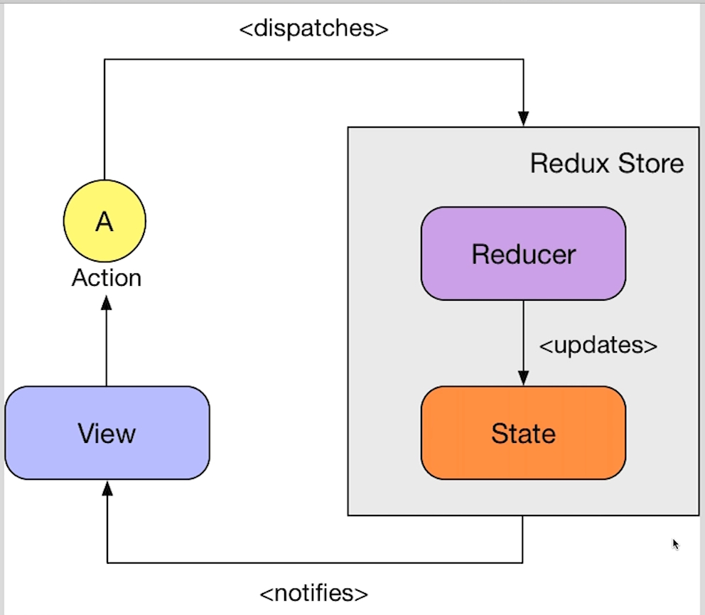
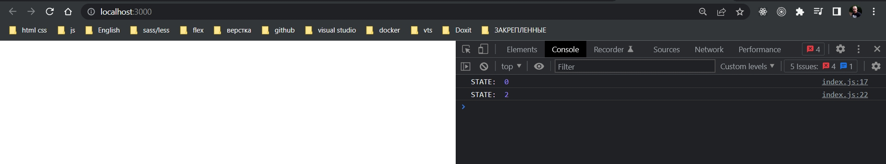
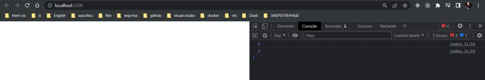
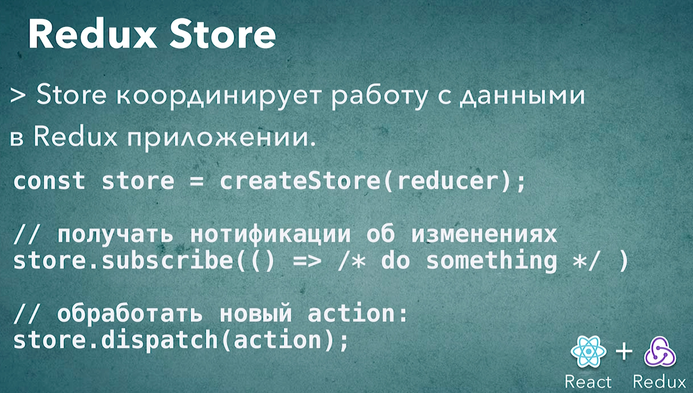

# 004_Redux_Store

Мы уже знаем как создать функцию reducer и как использовать action действие для того что бы из reducer получить новый state.

```js
//src/index.js

const reducer = (state = 0, action) => {
  switch (action.type) {
    case "INCREMENT":
      return state + 1;
    default:
      return state;
  }
  return 0;
};

let newState = reducer(undefined, {});
newState = reducer(newState, { type: "INCREMENT" });
console.log("newState counter: ", newState);

```

Таким образом мы написали миниатюрную версию Redux не используя пока что сам Redux.


Самое время начать использовать Redux.



Redux Store - это центральный объект в экосистеме Redux. Его задача - это координировать работу других компонентов.

Как вы видите центральное место в Redux Store занимает функция reducer. И для того что бы создать Store нам нужен reducer.

Что касается State который тоже изображен на диаграмме. Мы с вами видили что State можно получить из функции reduce. Если мы в качестве первого аргумента передадим undefined, то по соглашению наша функция reducer должна вернуть первоначальный state.

Соответственно что бы создать Redux Store нам достаточно иметь функцию reducer. Функция reducer у нас есть. По этому Redux Store мы можем создать прямо сейчас.


Удаляю тот код там где мы вручную вызывали reducer. И вместо этого импортирую функцию createStore из библиотеки redux.

```js
//src/index.js
import { createStore } from "redux";

const reducer = (state = 0, action) => {
  switch (action.type) {
    case "INCREMENT":
      return state + 1;
    default:
      return state;
  }
  return 0;
};

//Создаю store
const store = createStore(reducer);

```

И теперь я могу начать работать с нашим объектом store. К примеру мы можем вывести первоначальное состояние нашего приложения. Для этого я использую функцию getState.

После чего я могу попросить store выполнить одно из действий. Для этого я вызываю метод dispatch(), и в эту функцию я передаю то действие которое я хочу выполнить.

```js
//src/index.js
import { createStore } from "redux";

const reducer = (state = 0, action) => {
    switch (action.type) {
        case "INCREMENT":
            return state + 1;
        default:
            return state;
    }
    return 0;
};

//Создаю store
const store = createStore(reducer);
//получаю состояние
console.log("STATE: ", store.getState());
//выполняю действие
store.dispatch({ type: "INCREMENT" });
store.dispatch({ type: "INCREMENT" });
//получаю состояние
console.log("STATE: ", store.getState());

```



Первое значение мы получаем начальное состояние.

Второе значение мы получаем после того как мы увеличили счетчик на два.

State обновляется внутри store. 

Теперь нам не нужно вручную создавать объект state и вручную передавать в него нужные действия. store за нас это все сделает.

Таким образом обновлять state намного удобнее.

И у store есть еще один очень полезный метод который называется store.subscribe(). subscribe - позволяет получать нотификации когда store каким-то образом изменился.

```js
//src/index.js
import { createStore } from "redux";

const reducer = (state = 0, action) => {
  switch (action.type) {
    case "INCREMENT":
      return state + 1;
    default:
      return state;
  }
  return 0;
};

//Создаю store
const store = createStore(reducer);

//Получаю каждое изменение состояния
store.subscribe(() => {
  console.log(store.getState());
});

store.dispatch({ type: "INCREMENT" });
store.dispatch({ type: "INCREMENT" });

```



После первого dispatch, когда мы передали первое действие с типом { type: "INCREMENT" }, store вызвал ту функцию которую мы зарегистрировали через subscribe и где мы вызываем состояние. Т.е. после первого инкремента состояние стало 1. Ну а после второго инкремента соответственно состояние стало 2.

Вот таким вот образом работает store в Redux. 

На самом деле store - это очень тонкая обертка вокруг функции reducer, и в store не намного больше функциональности чем те функции которые мы уже рассмотрели.

Для того что бы получить текущий state мы вызываем store.getState().

Для того что бы обработать какое-нибудь действие мы вызываем store.dispatch() и рередаем туда действие { type: "INCREMENT" }.

И кроме того мы можем подписаться на eventListener который будет слушать обновление store c с помощью store.subscribe() которая в себя принимает этот eventListener.



