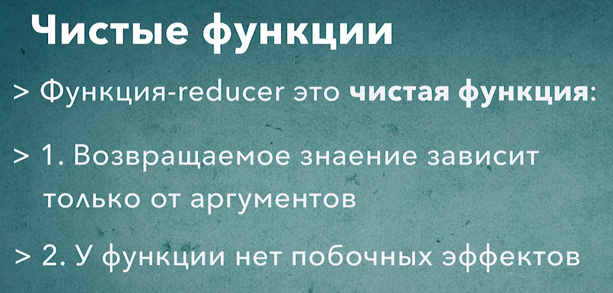

# 005_Чистые_функции


В функциональном программировании есть понятие "Чистая Функция". И это понятие будет для нас довольно важным. Поскольку функция reducer, которая используется в Redux, должна быть чистой функцией.

Определение чистой функции или [Pure Function](https://zen.yandex.ru/media/nuancesprog/funkcionalnoe-programmirovanie-v-javascript-rukovodstvo-s-prakticheskimi-primerami-5ed68defa2e0fe7c6c3e8fe5) очень простое. Функция называется чистой если она выполняет два условия.

Чистая функция

1. Возвращаемое значение зависит только от аргументов.
2. У функции нет побочных эфектов.

Разберем оба троебования немного подробне.

С первым требованием все просто. Мы должны считать результат основываясь только на аргументах. Никаких других значений использовать нельзя.

К примеру вот такая функция которая возвращает большее из двух чисел является чистой функцией.

```js
(a , b) => a > b ? a : b;
```

Поскольку для того что бы вычислить значение, результат который мы возвращаем, мы используем только аргументы a и b.

Ну а вот такая функция - это уже не чистая функция

```js
(a) => Math.random() * a;
```

Поскольку первое условие нарушено. Для вычисления результата используется не только аргумент, но и генератор случайных чисел.

Из первого условия следует одно очень важное свойство. Для одинаковых наборов аргументов чистая функция всегда будет возвращать одинаковые результаты. К примеру для этой функции

```js
(a , b) => a > b ? a : b;
```

независимо от того сколько раз и когда мы вызовем эту функцию со значениями 5 и 8, результат этой функции всегда будет оставаться 8.


Второе свойство это когда у функций нет побочных эфектов. Побочный эфект - это любое изменение внешнего состояния, внешнего состояния по отношению к функции. К примеру запись значения в какую-нибудь глобальную переменную. Обновление DOM дерева. Запись значения в кэш. Запись в БД если вы работаете на сервере. Другими словами функция может изменять только свое собственного локальное состояние. Только свои собственные локальные переменные.

Изменение аргументов тоже является побочным эффектом. По этому чистая функция не может их изменять.

```js
const render = () => {
    return document.getElementById('root').innerHTML = 'hi'
}
```
это не чистая функция, поскольку она изменяет внешнее значение. В этом случае node в DOM дерева которую мы получили через глобальную переменную document.

Ну а что на счет такой реализации? Что будет если мы мередадим в функцию элемент в качестве аргумента? И в функции мы просто будем уснанавливать значение innerHTML в этот элемент?

```js
const render = (el) => {
    el.innerHTML = 'hi'
}
```

Это все равно не чистая функция поскольку у нее есть побочный эфект, она модифицирует аргумент функции. А чистой функции этого делать нельзя.

Любые функции которые модифицируют DOM, вызывают server, устанавливают timeout, используют случайные числа, или текущее время, гарантированно не являются чистыми поскольку они зависят от внешних ресурсов.

Адепты функционального программирования предпочитают чистые функции. Потому что с ними легко работать и их легко тестировать. Ведь если вы нашли проблему логики чистой функции - это значить что поиск проблемы ограничивается исключительно самой функцией. Ведь она не зависит не от чего, кроме аргументов. А отказ от побочных эфектов позволяет вызывать функцию сколько угодно раз не заботясь о том изменит ли она состояние приложения. Если функция чиста, то вы точно знаете что состояние не измениться.

Когда мы разрабатываем функцию reducer, она должна соотвествовать тем же требованиям. Возвращаемое значение может зависить только от аргументов. Напомню в функции reducer аргументы это текущий state и деййствие action. И результат работы этой функции т.е. тот новый state который мы возвращаем, он должен зависить исключительно от предыдущего state и action.

К примеру в функции reducer нам строго на строго запрещено использовать текущее время или генератор случайных чисел. Или вызывать сервер. Любое из этих этих действий нарушит условие чистоты функции. 

Второе условие тоже должно выполняться для функции reducer. У нашего reducer не должно быть побочных эффектов. Мы не должны устанавливать timeout, не должны устанавливать interval, не должны вызывать сервер или записывать значение в localStorage. Все это тоже нарушает условие чистоты функции.

В этом месте у многих разработчиков возникает вопрос. Зачем себя так ограничивать?

Все дело в том что у архитектуры управления данными на основании Redux есть одно очень-очень класное свойство. Если у вас есть набор действий который выполняется в вашем приложении

```js
[a1, a2, a3, a4, ...a150]
```

и в какой-то момент мы обращаем внимаение что наше приложение поломано. Оно работает не так как оно должно работать. Т.е. одно из этих действий, где то в середине, оно привело к тому что store стал в неправильном состоянии.

Если наш reducer  это чистая функция, то повторяя все эти действия, а эти действия можно легко записать, а затем просто переиграть заново, мы можем найти то самое действие которое вызвало проблему. И если наш reducer это фистая функция, то он зависит исключительно от state и action который он получает. И нам будет совсем не сложно найти в нашем приложении ту комбинацию state и action который ломает наш reducer. 

Каждый раз когда мы будем передавать в наш store одинаковую последовательность действий, если reducer это чиста функция, мы гарантированно на выходе получим одинаковый state. А это очень помогает в очень крупных приложениях когда работа со state и переход от одного state к другому при помощи action т.е. что что делает наша функция reducer. Это одна из основных частей нашего приложения и один из самых сложных блоков логики приложения.

Когда функция reducer Чистая Функция, отлаживать логику приложения намного проще.



