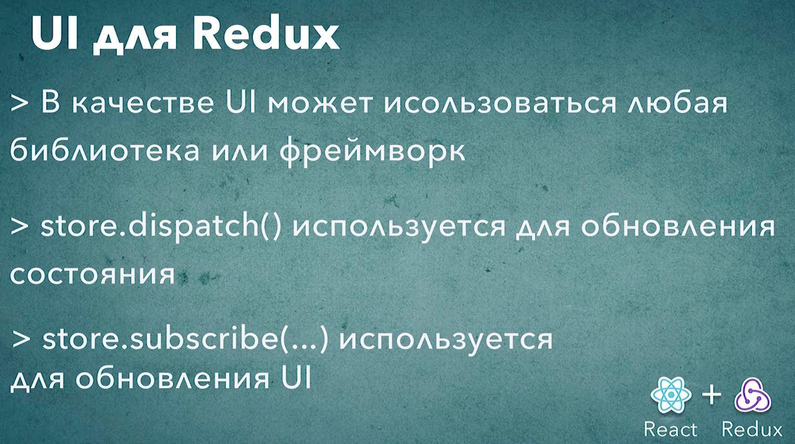

# 006_Ui_для_Redux

Давайте в этом уроке добавим минималистичный пользовательский интерфес так что бы наше Redux приложение действительно работало в браузере с кнопками и контролами браузера а не только в консоли.
Ну и кроме того вспомним как писались интерфейсы до того как появился React.

Нашему div с id root задам class.

```html
<!DOCTYPE html>
<html lang="en">
<head>
    <meta charset="utf-8" />
    <meta name="viewport" content="width=device-width, initial-scale=1" />
    <link rel="stylesheet" href="https://stackpath.bootstrapcdn.com/bootstrap/4.1.3/css/bootstrap.min.css">
    <title>Redux Sandbox</title>
</head>
<body>
<div id="root" class="jumbotron">
    <h2 id="counter">0</h2>
    <button id="dec" class="btn btn-primary btn-lg">DECREMENT</button>
    <button id="inc" class="btn btn-primary btn-lg">INCREMENT</button>
</div>
</body>
</html>

```


Теперь давайте вернемся к index.js и сделаем так что бы эти кнопки работали

```js
//src/index.js
import { createStore } from "redux";

const reducer = (state = 0, action) => {
  switch (action.type) {
    case "INCREMENT":
      return state + 1;
    case "DECREMENT":
      return state - 1;
    default:
      return state;
  }
  return 0;
};

//Создаю store
const store = createStore(reducer);


```

И теперь добавлю обработчики событий для наших двух кнопок.

```js
//src/index.js
import { createStore } from "redux";

const reducer = (state = 0, action) => {
  switch (action.type) {
    case "INCREMENT":
      return state + 1;
    case "DECREMENT":
      return state - 1;
    default:
      return state;
  }
  return 0;
};

//Создаю store
const store = createStore(reducer);

//Увеличение счетчика
document.getElementById("inc").addEventListener("click", () => {
  return store.dispatch({ type: "INCREMENT" });
});

//Уменьшение счетчика
document.getElementById("dec").addEventListener("click", () => {
  return store.dispatch({ type: "DECREMENT" });
});

```

Теперь я буду кликать по кнопкам они будут диспатчить события. Но пока что мы ничего не увидим поскольку мы ничего не делаем когда store обновляется.

Для этого нам нужно создать еще одну функцию. Назову ее update. И мы будем вызывать эту функцию каждый раз когда store обновляется.

И сразу зарегистрируем функция в нашем store

```js
//src/index.js
import { createStore } from "redux";

const reducer = (state = 0, action) => {
  switch (action.type) {
    case "INCREMENT":
      return state + 1;
    case "DECREMENT":
      return state - 1;
    default:
      return state;
  }
  return 0;
};

//Создаю store
const store = createStore(reducer);

//Увеличение счетчика
document.getElementById("inc").addEventListener("click", () => {
  return store.dispatch({ type: "INCREMENT" });
});

//Уменьшение счетчика
document.getElementById("dec").addEventListener("click", () => {
  return store.dispatch({ type: "DECREMENT" });
});

//Функция обновления store
const update = () => {
  document.getElementById("counter").innerHTML = store.getState();
};

//Регистрирую функцию update в store
store.subscribe(update);

```


И так здесь мы используем Redux для того что бы управлять состоянием нашего приложения. Ну и кроме того Redux нам сообщает когда состояние state внури store обновилось для того что бы мы могли обновить наш UI.




