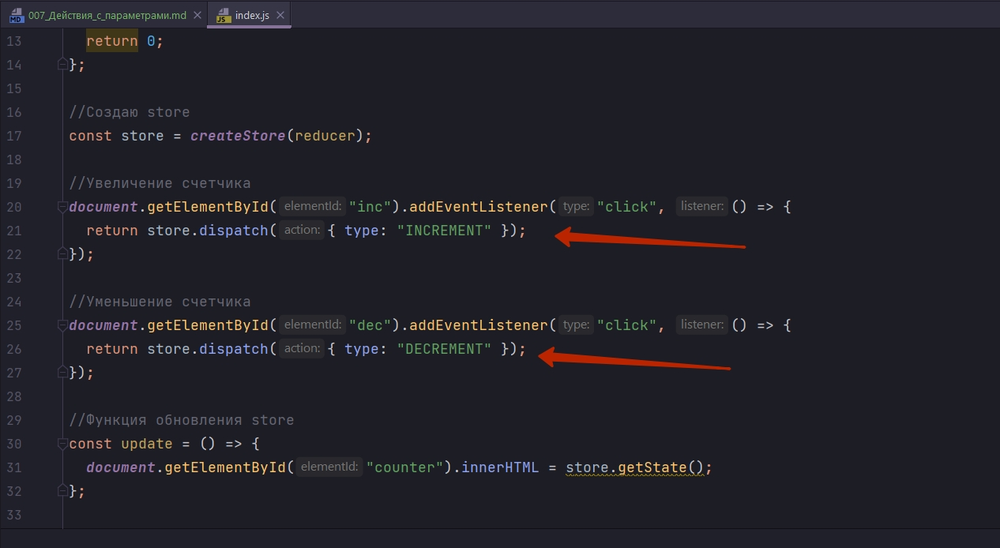
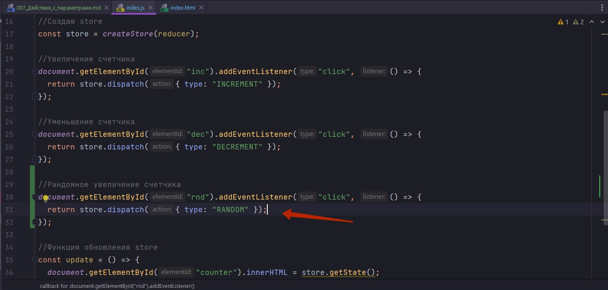
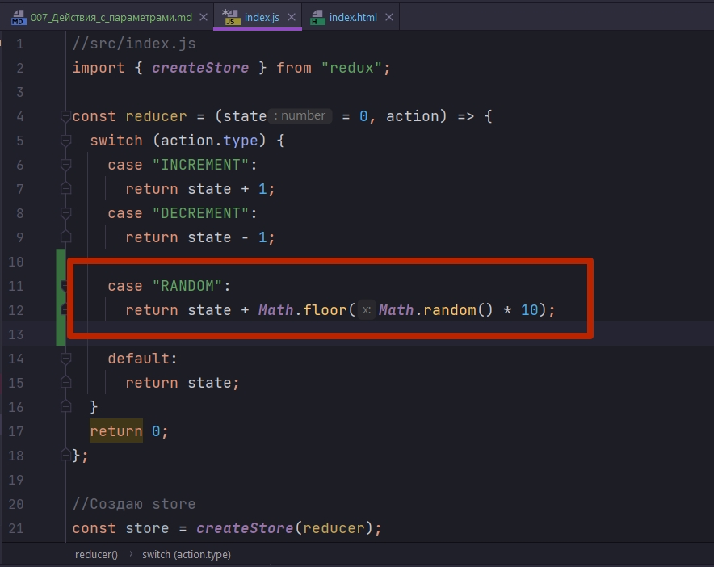
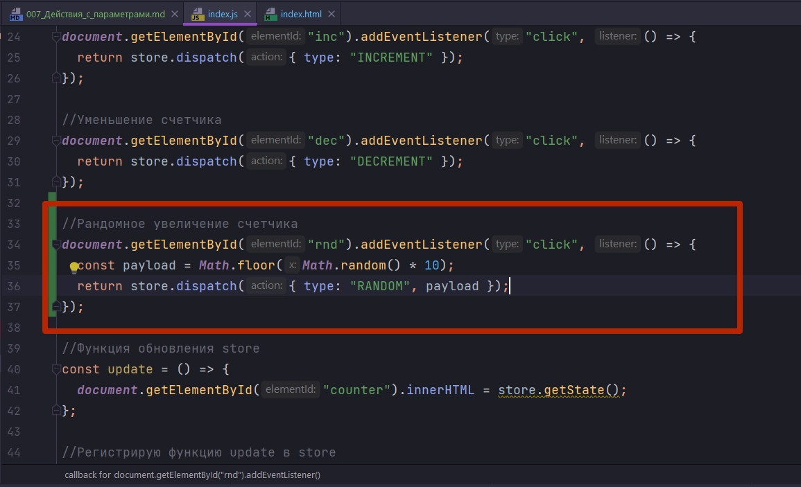
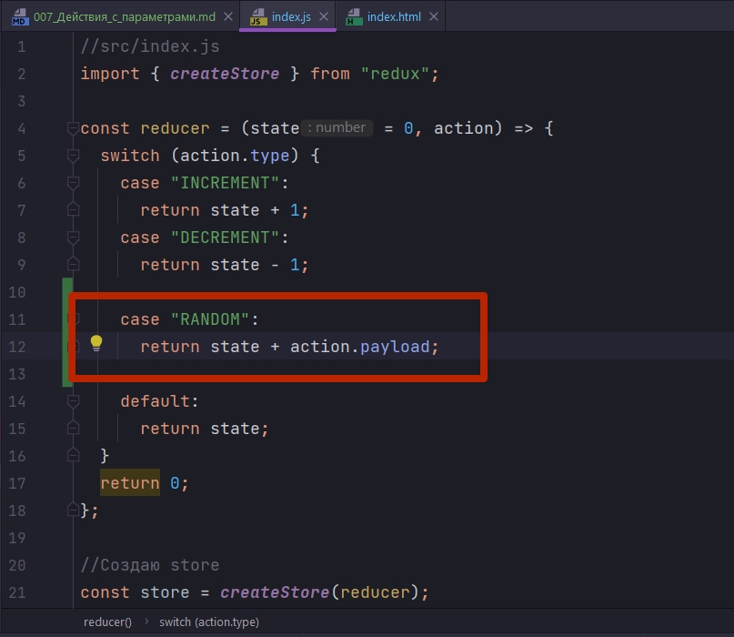
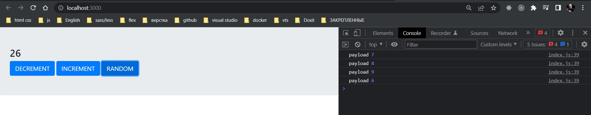

# 007_Действия_с_параметрами

В нашем приложении те действия которые мы используем, они совсем простые. В них нет ничего кроме собственно type.



Но это не всегда должно быть так.

Давайте попробуем немного расширить наше приложение так что бы показать как вместе с действием dispatch мы можем передать дополнительные параметры.

Давайте добавм еще одну кнопку которая будет увеличивать наш счетчик на случайное значение.

```html
<!DOCTYPE html>
<html lang="en">
  <head>
    <meta charset="utf-8" />
    <meta name="viewport" content="width=device-width, initial-scale=1" />
    <link rel="stylesheet" href="https://stackpath.bootstrapcdn.com/bootstrap/4.1.3/css/bootstrap.min.css">
    <title>Redux Sandbox</title>
  </head>
  <body>
    <div id="root" class="jumbotron">
      <h2 id="counter">0</h2>
      <button id="dec" class="btn btn-primary btn-lg">DECREMENT</button>
      <button id="inc" class="btn btn-primary btn-lg">INCREMENT</button>
      <button id="rnd" class="btn btn-primary btn-lg">RANDOM</button>
    </div>
  </body>
</html>

```

Но теперь одного type действия нам не достаточно для того что бы увеличить счетчик на случайное значение



Теперь в addEventListener нам нужно посчитать случайное значение и затем добавить его в action. 


Но перед тем как мы перейдем к этому коду посмотрим на альтернативный вариант реализации.

В reducer возьму и добавлю еще одно действие.



Но это не хорошее решение так как наша функция reduce перестает быть чистой функцией.

Забираем это значение и переношу его в то место гда мы создаем собственно action. В action создаю дополнительну константу payload. payload - это типичное имя для дополнительных параметров которые мы передаем вместе с action.



теперь вместо самого action я еще передаю и payload. Совершенно не обязательно в собственном коде использовать название payload. ЭТО БАНАН!!!

Теперь кроме типа действия мы еще передаем и дополнительное значение payload.

И в нашей функции reducer мы можем прочитать это значение с помощью action.payload.



```js
//src/index.js
import { createStore } from "redux";

const reducer = (state = 0, action) => {
    switch (action.type) {
        case "INCREMENT":
            return state + 1;
        case "DECREMENT":
            return state - 1;
        case "RANDOM":
            return state + action.payload;
        default:
            return state;
    }
    return 0;
};

//Создаю store
const store = createStore(reducer);

//Увеличение счетчика
document.getElementById("inc").addEventListener("click", () => {
    return store.dispatch({ type: "INCREMENT" });
});

//Уменьшение счетчика
document.getElementById("dec").addEventListener("click", () => {
    return store.dispatch({ type: "DECREMENT" });
});

//Функция обновления store
const update = () => {
    document.getElementById("counter").innerHTML = store.getState();
};

//Рандомное увеличение счетчика
document.getElementById("rnd").addEventListener("click", () => {
    const payload = Math.floor(Math.random() * 10);
    console.log("payload", payload);
    store.dispatch({ type: "RANDOM", payload });
});

//Регистрирую функцию update в store
store.subscribe(update);

```



Вот таким вот не сложным образом можно передавать любую дополнительную информацию которая нужна будет reducer для того что бы это действие какм-то образом выполнить. 

ОЧЕНЬ ВАЖНО!!! Вся информация которая нужна reducer для того что бы обновить state, содержалась либо в текущем state, либо в том объекте action который вы передаете!!!


