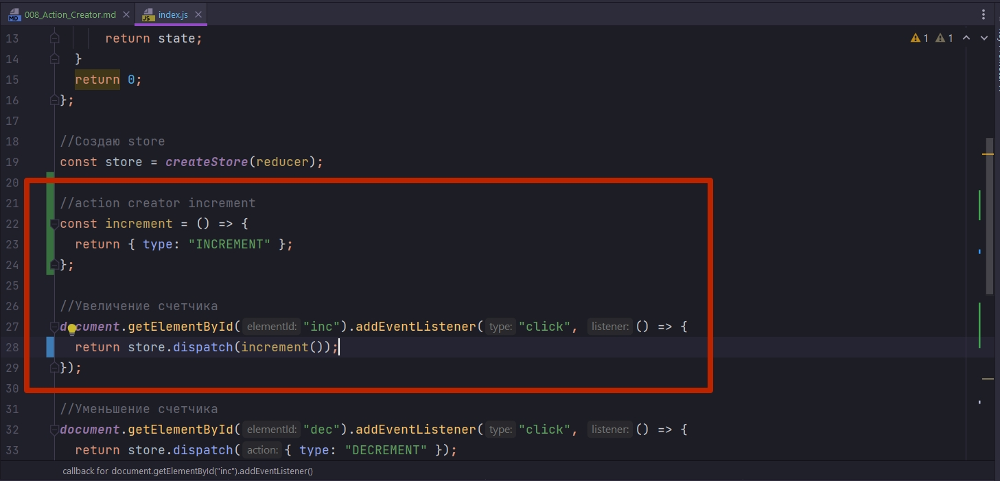

# 008_Action_Creator

Если посмотреть на код типичного приложения который использует Redux 

```js
//src/index.js
import { createStore } from "redux";

const reducer = (state = 0, action) => {
  switch (action.type) {
    case "INCREMENT":
      return state + 1;
    case "DECREMENT":
      return state - 1;
    case "RANDOM":
      return state + action.payload;
    default:
      return state;
  }
  return 0;
};

//Создаю store
const store = createStore(reducer);

//Увеличение счетчика
document.getElementById("inc").addEventListener("click", () => {
  return store.dispatch({ type: "INCREMENT" });
});

//Уменьшение счетчика
document.getElementById("dec").addEventListener("click", () => {
  return store.dispatch({ type: "DECREMENT" });
});

//Функция обновления store
const update = () => {
  document.getElementById("counter").innerHTML = store.getState();
};

//Рандомное увеличение счетчика
document.getElementById("rnd").addEventListener("click", () => {
  const payload = Math.floor(Math.random() * 10);
  console.log("payload", payload);
  store.dispatch({ type: "RANDOM", payload });
});

//Регистрирую функцию update в store
store.subscribe(update);

```

Становится понятным что объекты action - это интерфейс общения между компонентами приложения и объектом store. Это механизм с помощью которого мы изменяем состояние. Т.е. action мы используем довольно часто.

Ну и конечно в настоящем большом приложении, которое может поддерживать десятки, если не сотни разных действий, названия вроде "INCREMENT" работать не будут. Скорее всего ваши типы будут выглядеть вот так {type: "ADMIN_USER_LOADED_STARTED"}. К примеру это может быть название вашего действия. И затем в коде когда вам нужно будет вызвать это действие, вам всегда нужно будет писать название этого действия. Что может быть не очено удобно.

Совершенно очевидно что для более сложных действий, когда вы создаете вот такие объекты {type: "ADMIN_USER_LOADED_STARTED"} во время создания объекта допустить опечатку совсем не сложно.


Для того что бы упростить работу с действиями, упростить создание действий, удобно использовать отдельные функции.

Эти функции называются Action Creators или создатели действий.


В нашем приложении есть три действия INCREMENT, DECREMENT, RANDOM.

Создадим три Action Creators.

Начну с INCREMENT. Это будет самая обычная функция которая возвращает тот самый объект, который мы создаем когда хотим выполнить дейтсвие.


и теперь что бы каждый раз создавать вручную вот такой объект { type: "INCREMENT" } когда нам нужно использовать действие INCREMENT, мы можем просто вызвать функцию increment



Этот принцип очень похож на то, как работают обычные конструкторы JS. По сути constructor это просто функция, которая создает объект с определенной структурой.

Ну и Action Creator - это тоже функция которая создает определенный объект action с определенной внутренней структурой.

```js
//src/index.js
import { createStore } from "redux";

const reducer = (state = 0, action) => {
  switch (action.type) {
    case "INCREMENT":
      return state + 1;
    case "DECREMENT":
      return state - 1;
    case "RANDOM":
      return state + action.payload;
    default:
      return state;
  }
  return 0;
};

//Создаю store
const store = createStore(reducer);

// Action Creators

//action creator increment
const increment = () => {
  return { type: "INCREMENT" };
};

//action creator decrement
const decrement = () => {
  return { type: "DECREMENT" };
};

//action creator random
const random = (payload) => {
  return { type: "RANDOM", payload };
};

//Actions

//Увеличение счетчика
document.getElementById("inc").addEventListener("click", () => {
  return store.dispatch(increment());
});

//Уменьшение счетчика
document.getElementById("dec").addEventListener("click", () => {
  return store.dispatch(decrement());
});

//Рандомное увеличение счетчика
document.getElementById("rnd").addEventListener("click", () => {
  const payload = Math.floor(Math.random() * 10);
  store.dispatch(random(payload));
});

// Store

//Функция обновления store
const update = () => {
  document.getElementById("counter").innerHTML = store.getState();
};

//Регистрирую функцию update в store
store.subscribe(update);

```

Это совсем маленький рефакторинг, который тем не менее улучшил то как выглядит наш код. Например теперь если допустить опечатку в названии Action Creator, то любая среда разработки покажет вам что что-то не так.


C другой стороы если допустить опечаткув строке или в названии поля  которое вы передаете вместе с type в действии, то среда разработки вам ничего не скажет. И вам придется подождать до того момента когда вы запустите свое приложение и оно будет работать не совсем так как вам нужно.

Кроме этого у Action Creator есть еще несколько применений. Но это позже...


