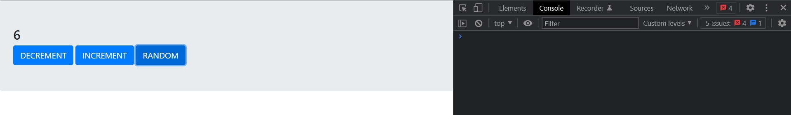
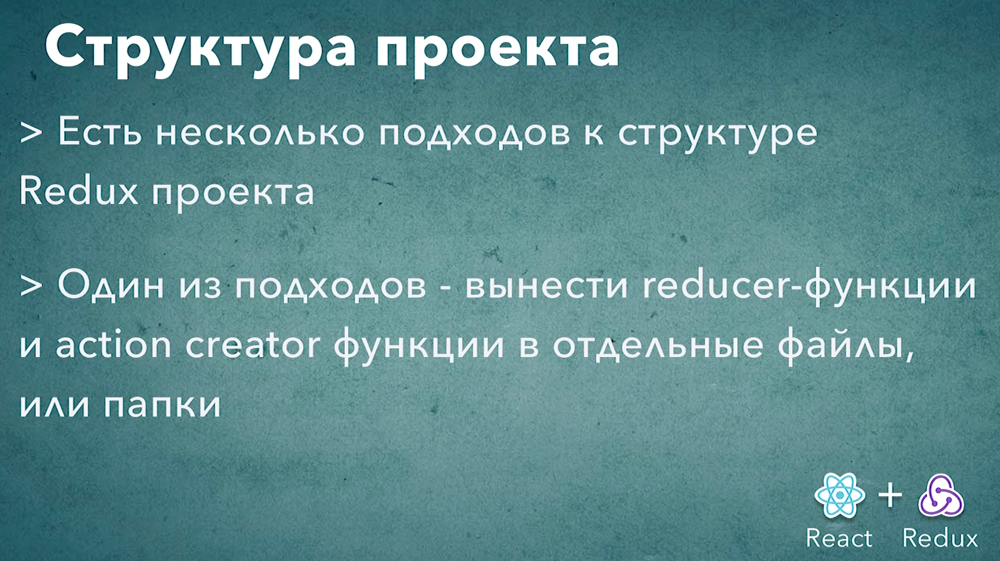

# 009_Структура_проекта

В нашем коде появилось довольно много разных сущностей. Давайте сделаем так что бы структура нашего проекта была немножечко более аккуратной.

Создаю отдельный файл actions

```js
//src/actions.js

// Action Creators

//action creator increment
export const increment = () => {
  return { type: "INCREMENT" };
};

//action creator decrement
export const decrement = () => {
  return { type: "DECREMENT" };
};

//action creator random
export const random = (payload) => {
  return { type: "RANDOM", payload };
};

```

В какой-то момент из actions.js можно сделать папку если действий станет действительно много.

```js
//src/reducer.js
const reducer = (state = 0, action) => {
  switch (action.type) {
    case "INCREMENT":
      return state + 1;
    case "DECREMENT":
      return state - 1;
    case "RANDOM":
      return state + action.payload;
    default:
      return state;
  }
  return 0;
};

export default reducer;

```

```js
//src/index.js
import { createStore } from "redux";
import reducer from "./reducer";
import { increment, decrement, random } from "./actions";

//Создаю store
const store = createStore(reducer);

//Actions

//Увеличение счетчика
document.getElementById("inc").addEventListener("click", () => {
  return store.dispatch(increment());
});

//Уменьшение счетчика
document.getElementById("dec").addEventListener("click", () => {
  return store.dispatch(decrement());
});

//Рандомное увеличение счетчика
document.getElementById("rnd").addEventListener("click", () => {
  const payload = Math.floor(Math.random() * 10);
  store.dispatch(random(payload));
});

// Store

//Функция обновления store
const update = () => {
  document.getElementById("counter").innerHTML = store.getState();
};

//Регистрирую функцию update в store
store.subscribe(update);

```





