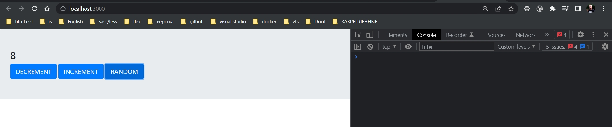

# 010_bindActionCreators()

Еще немного улучшим наш код.

В первую очередь избавимся от этих вот объектов store.


Что мы можем сделать? 

Мы можем просто использовать функцию dispatch без store и она замечательно будет работать!!!


```js
//src/index.js
import { createStore } from "redux";
import reducer from "./reducer";
import { increment, decrement, random } from "./actions";

//Создаю store
const store = createStore(reducer);
const { dispatch } = store;

//Actions

//Увеличение счетчика
document.getElementById("inc").addEventListener("click", () => {
  dispatch(increment());
});

//Уменьшение счетчика
document.getElementById("dec").addEventListener("click", () => {
  dispatch(decrement());
});

//Рандомное увеличение счетчика
document.getElementById("rnd").addEventListener("click", () => {
  const payload = Math.floor(Math.random() * 10);
  dispatch(random(payload));
});

// Store

//Функция обновления store
const update = () => {
  document.getElementById("counter").innerHTML = store.getState();
};

//Регистрирую функцию update в store
store.subscribe(update);

```

Нам даже не нужно будет использовать функции вроде bind что бы убедится что dispatch вызывается на правильном store или значение this в dispatch не изменяется. Все дело в том что код dispatch уже написан таким образом что он будет всегда работать с тем store на котором он был создан.

Теперь посмотрим на вот этот паттерн в нашем коде.


Каждый раз когда мы обрабатываем событие. Мы сначало создаем action при помощи Action Creator, а затем передаю его в dispatch. И этот процесс повторяется в каждой функции.

Можем ли мы создать одну функцию, которую мы будем использовать вместо этих функций? Т.е. заменить композицию этих функций одной функцией?


```js
//src/index.js
import { createStore } from "redux";
import reducer from "./reducer";
import { increment, decrement, random } from "./actions";

//Создаю store
const store = createStore(reducer);
const { dispatch } = store;

//Функции dispatch
const incrementDispatch = () => dispatch(increment());
const decrementDispatch = () => dispatch(decrement());
const randomDispatch = (payload) => dispatch(random(payload));

//Actions

//Увеличение счетчика
document.getElementById("inc").addEventListener("click", incrementDispatch);

//Уменьшение счетчика
document.getElementById("dec").addEventListener("click", decrementDispatch);

//Рандомное увеличение счетчика
document.getElementById("rnd").addEventListener("click", () => {
    const payload = Math.floor(Math.random() * 10);
    randomDispatch(payload);
});

// Store

//Функция обновления store
const update = () => {
    document.getElementById("counter").innerHTML = store.getState();
};

//Регистрирую функцию update в store
store.subscribe(update);

```

Но совершенно очевидно что если у нас будет большое приложение. Скажем унас будет 100 Action Creators нам будет не удобно вручную создавать такие функции для того что бы обернуть каждый Action Creator в dispatch.


Давайте создадим функцию которая нам поможет делать действие dispatch.

Называю функцию bindActionCreator. Мы создадим функцию которая связывает наш Action Creator и конкретную функцию dispatch которая передаст наш action конкретному store.

bindActionCreator нужно два аргумента:

1. creator - это наш Action Creator
2. dispatch

И bindActionCreator будет возвращать новую функцию которая будет делать dispatch(creator()).


При этом мне необходимо не забыть что Action Creator принимают дополнительные аргументы. При этом в bindActionCreator мы конкретно не знаем сколько аргументов хочет получить Action Creator. 

По этому в этом коде мы можем использовать синтаксис rest аргументов и просто собрать все аргументы в массив. И затем использовать точно такой же синтаксис, только это будет деструктуризация массива, для того что бы передать все эти аргументы в том же порядке нашему Action Creator.


```js
//src/index.js
import { createStore } from "redux";
import reducer from "./reducer";
import { increment, decrement, random } from "./actions";

//Создаю store
const store = createStore(reducer);
const { dispatch } = store;

//Связываю Action Creators
const bindActionCreator =
  (creator, dispatch) =>
  (...args) => {
    dispatch(creator(...args));
  };

//Функции dispatch
const incrementDispatch = bindActionCreator(increment, dispatch);
const decrementDispatch = bindActionCreator(decrement, dispatch);
const randomDispatch = bindActionCreator(random, dispatch); // здесь мы автоматически передаем все аргументы

//Actions

//Увеличение счетчика
document.getElementById("inc").addEventListener("click", incrementDispatch);

//Уменьшение счетчика
document.getElementById("dec").addEventListener("click", decrementDispatch);

//Рандомное увеличение счетчика
document.getElementById("rnd").addEventListener("click", () => {
  const payload = Math.floor(Math.random() * 10);
  randomDispatch(payload);
});

// Store

//Функция обновления store
const update = () => {
  document.getElementById("counter").innerHTML = store.getState();
};

//Регистрирую функцию update в store
store.subscribe(update);

```

В качестве дополнительного плюса, когда мы используем нашу новую функцию bindActionCreator мы автоматически передаем все аргументы в Action Creator. Нам не нужно помнить сколько аргументов хочет получить функция random.


Вот эта наша реализация функции bindActionCreator т.е. паттерн настолько типичный, что даже в Redux есть специальная функция которая позволяет это сделать.

Мы написали bindActionCreator исключительно для иллюстрации, поскольку в Redux уже есть своя версия такой же функции, только она немножечко еще более мощная. И называется она bindActionCreators.


```js
//src/index.js
import { createStore, bindActionCreators } from "redux";
import reducer from "./reducer";
import { increment, decrement, random } from "./actions";

//Создаю store
const store = createStore(reducer);
const { dispatch } = store;

//Функции dispatch
const incrementDispatch = bindActionCreators(increment, dispatch);
const decrementDispatch = bindActionCreators(decrement, dispatch);
const randomDispatch = bindActionCreators(random, dispatch); // здесь мы автоматически передаем все аргументы

//Actions

//Увеличение счетчика
document.getElementById("inc").addEventListener("click", incrementDispatch);

//Уменьшение счетчика
document.getElementById("dec").addEventListener("click", decrementDispatch);

//Рандомное увеличение счетчика
document.getElementById("rnd").addEventListener("click", () => {
  const payload = Math.floor(Math.random() * 10);
  randomDispatch(payload);
});

// Store

//Функция обновления store
const update = () => {
  document.getElementById("counter").innerHTML = store.getState();
};

//Регистрирую функцию update в store
store.subscribe(update);

```

Но поскольку чаще всего в Redux вы работаете не с одним Action Creator а с несколькими. То в bindActionCreators есть возможность обернуть сразу несколько функций.

Вместо первого аргумента в bindActionCreators мы можем передать объект. Ключи этого объекта - это будет названия этих функций которые мы хотим получить.

К примеру я хочу получить функцию incrementDispatch: имы хотим получить эту функцию обернув Action Creator increment.


В качестве результата bindActionCreators возвращает объект. И ключи у этого объекта будут точно такими же как у того объекта который мы передали в bindActionCreators. А вместо оригинальных Action Creators там будут их обернутые версии т.е. те самые версии которые создают объект action и сразу передают его в фукцию dispatch. И логично что мы можем деструктурировать эти функции из полученного объекта.


```js
//src/index.js
import { createStore, bindActionCreators } from "redux";
import reducer from "./reducer";
import { increment, decrement, random } from "./actions";

//Создаю store
const store = createStore(reducer);
const { dispatch } = store;

//Связанные Action Creators
const { incrementDispatch, decrementDispatch, randomDispatch } =
  bindActionCreators(
    {
      incrementDispatch: increment,
      decrementDispatch: decrement,
      randomDispatch: random,
    },
    dispatch
  );

//Actions

//Увеличение счетчика
document.getElementById("inc").addEventListener("click", incrementDispatch);

//Уменьшение счетчика
document.getElementById("dec").addEventListener("click", decrementDispatch);

//Рандомное увеличение счетчика
document.getElementById("rnd").addEventListener("click", () => {
  const payload = Math.floor(Math.random() * 10);
  randomDispatch(payload);
});

// Store

//Функция обновления store
const update = () => {
  document.getElementById("counter").innerHTML = store.getState();
};

//Регистрирую функцию update в store
store.subscribe(update);

```



Этот код можно сделать еще немножечко симпотичнее.

Давайте в import где я получаю все три функции increment, decrement, random


Импортирую их как один цельный объект actions который содержит в себе все три функции.


Теперь вместо передачи объекта и прописывания названий методов и присваивания им функций, деструктурируемых из import {} from "./actions".

Я просто в bindActionCreators передаю объект actions.


Теперь bindActionCreators создаст новые функции которые называются точно так же как те Action Creator которые мы определили в нашем файле actions.

```js
//src/actions.js

// Action Creators

//action creator increment
export const increment = () => {
  return { type: "INCREMENT" };
};

//action creator decrement
export const decrement = () => {
  return { type: "DECREMENT" };
};

//action creator random
export const random = (payload) => {
  return { type: "RANDOM", payload };
};

```


```js
//src/index.js
import { createStore, bindActionCreators } from "redux";
import reducer from "./reducer";
import * as actions from "./actions";

//Создаю store
const store = createStore(reducer);
const { dispatch } = store;

//Связанные Action Creators
const { increment, decrement, random } = bindActionCreators(actions, dispatch);
/*increment, decrement, random это не оригинальные функции c actions.js*/
/*теперь increment, decrement, random это функции которые передают созданный action в dispatch*/

//Actions

//Увеличение счетчика
document.getElementById("inc").addEventListener("click", increment);

//Уменьшение счетчика
document.getElementById("dec").addEventListener("click", decrement);

//Рандомное увеличение счетчика
document.getElementById("rnd").addEventListener("click", () => {
  const payload = Math.floor(Math.random() * 10);
  random(payload);
});

// Store

//Функция обновления store
const update = () => {
  document.getElementById("counter").innerHTML = store.getState();
};

//Регистрирую функцию update в store
store.subscribe(update);

```

Наш с вами код визуалнее стал намного чище. Но еще более важна та трансформация которая произошла с нашими визуальными компонентами.


Если до этого наши визуальные компоненты знали о том что существует store, о том что есть Redux. И для того что бы обновить state нужно было передать какой-то action, то теперь единственное от чего зависят наши визуальные компоненты это от функций increment, decrement, random. Что конкретно делают эти функции не так важно. А важно то что теперь наш визуальный слой приложения не знает что в приложении используется Redux.


