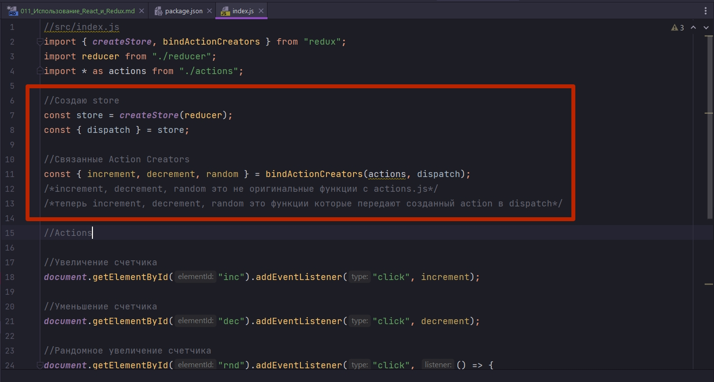

# 011_Использование_React_и_Redux

Наше с вами приложение, которое пока что работает без React, только с помощью Redux и базового DOM API, уже работает довольно не плохо.

Наш счетчик считает инкременты и декременты и даже умеет добавлять случайные числа.

Пришло время попробовать сделать тоже самое приложение, только вместо того что бы использовать базовый DOM API, использовать React для того что бы отрисовать наш UI.


Нужно заметить что бы для того что бы съинтегрировать React и Redux существует отдельный пакет котрый называется react-redux. У него это версия 5.1.1. А у меня


Это отдельная маленькая библиотека которая содержит вспомогательные компоненты и функции которые намного упрощают процесс интеграции React и Redux.

Но в этом видео мы попробуем съинтегрировать React и Redux вручную для того что бы посмотреть как это может работать на практике.

Посмотрим на структуру нашего index.js

```js
//src/index.js
import { createStore, bindActionCreators } from "redux";
import reducer from "./reducer";
import * as actions from "./actions";

//Создаю store
const store = createStore(reducer);
const { dispatch } = store;

//Связанные Action Creators
const { increment, decrement, random } = bindActionCreators(actions, dispatch);
/*increment, decrement, random это не оригинальные функции c actions.js*/
/*теперь increment, decrement, random это функции которые передают созданный action в dispatch*/

//Actions

//Увеличение счетчика
document.getElementById("inc").addEventListener("click", increment);

//Уменьшение счетчика
document.getElementById("dec").addEventListener("click", decrement);

//Рандомное увеличение счетчика
document.getElementById("rnd").addEventListener("click", () => {
  const payload = Math.floor(Math.random() * 10);
  random(payload);
});

// Store

//Функция обновления store
const update = () => {
  document.getElementById("counter").innerHTML = store.getState();
};

//Регистрирую функцию update в store
store.subscribe(update);

```

У нас здесь есть две части которые очень ярко выражены. Первая часть эта та часть которая косается Redux



Ну а вторая часть это та часть которая косается отрисовки. Там где мы работаем с DOM деревом.


Эту вторую часть мы и заменим на React.

Начну с того что создам отдельный React компонент. называю файл counter.js.

```js
import React from "react";

const Counter = () => {
  return (
    <div className="jumbotron">
      <h2>0</h2>
      <button className="btn btn-primary btn-lg">DECREMENT</button>
      <button className="btn btn-primary btn-lg">INCREMENT</button>
      <button className="btn btn-primary btn-lg">RANDOM</button>
    </div>
  );
};

export default Counter;

```

```js
//src/index.js
import React from "react";
import { createRoot } from "react-dom/client";
import { createStore, bindActionCreators } from "redux";
import reducer from "./reducer";
import * as actions from "./actions";
import Counter from "./counter";

//Создаю store
const store = createStore(reducer);
const { dispatch } = store;

//Связанные Action Creators
const { increment, decrement, random } = bindActionCreators(actions, dispatch);
/*increment, decrement, random это не оригинальные функции c actions.js*/
/*теперь increment, decrement, random это функции которые передают созданный action в dispatch*/

//Работа с DOM

// Store

//Функция обновления store
const update = () => {};

//Регистрирую функцию update в store
store.subscribe(update);

const root = createRoot(document.getElementById("root"));

root.render(<Counter />);

```


И так для того что бы компонент Counter начал работать ему понадобится несколько параметров. 

1. Первый параметр это counter т.е. значение, число которое будет отображаться в h2.
2. Ну и конечно нам понадобится три eventListener, по одному для каждой кнопки.

```js
import React from "react";

const Counter = ({ counter, increment, decrement, random }) => {
  return (
    <div className="jumbotron">
      <h2>{counter}</h2>
      <button className="btn btn-primary btn-lg" onClick={decrement}>
        DECREMENT
      </button>
      <button className="btn btn-primary btn-lg" onClick={increment}>
        INCREMENT
      </button>
      <button className="btn btn-primary btn-lg" onClick={random}>
        RANDOM
      </button>
    </div>
  );
};

export default Counter;

```

Теперь у нас свами появился маленький, компактный, но вполне рабочий React компонент который умеет отображать counter и умеет диспатчить события. Этот компонент не знает ничего как именно будет обновляться counter. 

Но если в результате того что компонент вызовет функцию increment, counter увеличится на 1, то обновленное значение конечно же отрисуется на экране. И это именно то что мы сейчас попытаемся сделать.


Функция random которую мы получили в резултате bindActionCreators, занимается исключительно тем что передает событие, а само случайное значение, которое мы передадим в random, мы должны сгенерировать в каком-то другом месте. 

В props random я могу сгенерировать такую функцию. В первую очередь она будет генерировать случайное число, а затем она будет вызывать нашу функцию random с этим случайным числом, которое затем попадет в store.

```js
//src/index.js
import React from "react";
import { createRoot } from "react-dom/client";
import { createStore, bindActionCreators } from "redux";
import reducer from "./reducer";
import * as actions from "./actions";
import Counter from "./counter";

//Создаю store
const store = createStore(reducer);
const { dispatch } = store;

//Связанные Action Creators
const { increment, decrement, random } = bindActionCreators(actions, dispatch);
/*increment, decrement, random это не оригинальные функции c actions.js*/
/*теперь increment, decrement, random это функции которые передают созданный action в dispatch*/

//Работа с DOM

// Store

//Функция обновления store
const update = () => {};

//Регистрирую функцию update в store
store.subscribe(update);

const root = createRoot(document.getElementById("root"));

root.render(
  <Counter
    counter={store.getState()}
    increment={increment}
    decrement={decrement}
    random={() => {
      const value = Math.floor(Math.random() * 10);
      random(value);
    }}
  />
);

```


И КАЖЕТСЯ ЧТО НАВЕРНОЕ ВСЕ!!! ОДНАКО НЕТ. REACT НЕ ЗНАЕТ ЧТО НУЖНО ОБНОВИТЬ КОМПОНЕНТЫ.

ПРЯМО СЕЙЧАС В НАШЕМ ПРИЛОЖЕНИИ У REACT НЕТ СПОСОБА СКАЗАТЬ ЧТО НУЖНО ОБНОВИТЬ НАШ КОМПОНЕНТ. И ДЛЯ ТОГО ЧТО БЫ ЭТО СДЕЛАТЬ МЫ КАК РАЗ ВОСПОЛЬЗУЕМСЯ ФУНКЦИЕЙ update.

В функцию update передаю функцию render с нужным мне компонентом. И для первой отрисовки функцию update нужно вызвать вручную.  Последующее обновление компонента будет отслеживаться функцией subscribe.

```js
//src/index.js
import React from "react";
import { createRoot } from "react-dom/client";
import { createStore, bindActionCreators } from "redux";
import reducer from "./reducer";
import * as actions from "./actions";
import Counter from "./counter";

//Создаю store
const store = createStore(reducer);
const { dispatch } = store;

//Связанные Action Creators
const { increment, decrement, random } = bindActionCreators(actions, dispatch);
/*increment, decrement, random это не оригинальные функции c actions.js*/
/*теперь increment, decrement, random это функции которые передают созданный action в dispatch*/

//Работа с DOM

// Store

const root = createRoot(document.getElementById("root"));

//Функция обновления store
const update = () => {
  root.render(
    <Counter
      counter={store.getState()}
      increment={increment}
      decrement={decrement}
      random={() => {
        const value = Math.floor(Math.random() * 10);
        random(value);
      }}
    />
  );
};

// Первоначальная отрисовка компонента
update();

//Регистрирую функцию update в store
store.subscribe(update);

```


Последующие обновления т.е. вызов функции update, которые отслеживаются функцией subscribe, будут вызываться в результате обновления store. Наш Redux store будет как бы управлять процессом обновления интерфейса нашего приложения.

Вот таким вот простым способом можно связать React и Redux.

Обратите внимание на два важных аспекта.

1. Мы не коснулись того кода который работает с Redux. Т.е. код логики нашего приложения остался не изменным. Мы обновили исключительно ту часть кода которая занимается отрисовкой.
2. Второй важный аспект. Наш компонент Counter ни как не зависит от Redux. Ничего что связано непосредственно с Redux, в логике компонента Counter нет. Точно так же как обычные React компоненты он получает некоторые свойства. Некоторые из этих свойств это callback которые вызываются при нажатии на определенные кнопки. Но что происходит за кулисами и каким имеено образом обновляется counter наш компонент не знает.

И ЭТО ПРАВИЛЬНЫЙ ПОДХОД ПРИ РАЗРАБОТКЕ КОМПОНЕНТОВ. НАШИ ВИЗУАЛЬНЫЕ КОМПОНЕНТЫ ДОЛЖНЫ ЗАНИМАТЬСЯ ИСКЛЮЧИТЕЛЬНО ОТРИСОВКОЙ.

ДЕТАЛИ БИЗНЕС ЛОГИКИ ДОЛЖНЫ БЫТЬ СКРЫТЫ В SERVICES НУ ИЛИ В ЭТОМ СЛУЧАЕ В REDUX.


