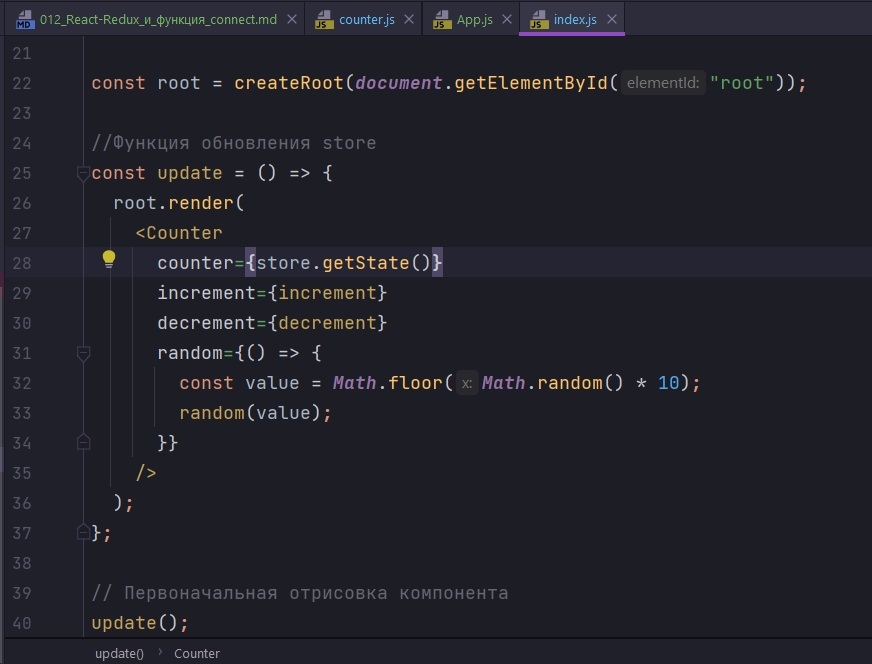

# 012_React-Redux_и_функция_connect

Давайте сделаем наш код немножечко аккуратнее потому что  index.js  начинает делать через чур много разных вещей.

выделяю все компоненты в папку components. перешошу counter.js. Созддаю отдельный компонент App. App будет отвечать за то что бы инициализировать всю структуру приложения.

```js
import React from "react";
import Counter from "./counter";

const App = () => {
  return <Counter />;
};

export default App;

```

Теперь для того что бы этот компонент заработал нам нужно будет передать в Counter значение для его свойств. А имеено counter, increment, decrement, random.

Напомню для того что бы создать функции  increment, decrement, random нам нужен Redux store. Именно таким образом мы создаем эти функции и получаем эти значения в файле index.js.



Для того что бы передать counter нам нужен store.

Для того что бы создать функции increment, decrement, random мы используем bindActionCreators и в том числе использую функцию dispatch которая происходит из того же store.


Вопрос как в другом компоненте, который находится где-то в глубине иерархии вашего  React приложения нам получить этот самый store который мы проинициализировали в index.js?

И здесь если вы внимательно смотрели наш блок посвященный паттернам React вы можете сказать. Ok, да я знаю решение!!! Ведь мы можем использовать Context для того что бы передать какое-нибудь значение, а в этом случае это будет store, по всей иерархии компонентов до компонентов самого нижнего уровня.

И здесь мы могли бы начать писать свой собственный Context для того что бы передать store по всей иерархии компонентов. А затем писать компонент высшего порядка для того что бы нам было немного удобнее использовать store.

Но все это уже реализовано и сделано за нас в пакете который называется react-redux.

Для начало начну с того что импортирую этот пакет.

В этом пакете есть несколько вспомогательных элементов.

1. Первый элемент который нам понадобится это Provider. Он работает точно так же как Provider в контексте. импортирую и оборачиваю приложение.


Как видим Provider имеет параметр по умолчанию store. И мы в этот параметр должны передать наш store.

Теперь удаляю все не нужное в этом компоненте.

```js
//src/index.js
import React from "react";
import { createRoot } from "react-dom/client";
import { createStore } from "redux";
import { Provider } from "react-redux";
import reducer from "./reducer";

import App from "./components/App";

//Создаю store
const store = createStore(reducer);

const root = createRoot(document.getElementById("root"));

root.render(
  <Provider store={store}>
    <App />
  </Provider>
);

```

Компонент Provider который мы импортировали из пакета react-redux, нутри себя уже реализует подписку на изменение store, и делает так что бы наше приложение обновлялось как только значения в store обновляются. Соответственно нам больше не нужно вручную следить за update и код store.subscribe(update) мы можем удалить.

Как только компонент ниже по иерархии вызовет dispatch на нашем store, и обновит state, наш компонент Provider будет знать о том что state обновился и нужно обновить оставшуюся часть приложения. Весь код который обеспечивал детали интеграции теперь скрыт внутри Provider.


Но теперь нам нужно решить вопрос. Каким же образом нам сделать так что бы в Counter попали нужные значения из store?

Теперь я могу перейди в компонент Counter и получить доступ store. Делается это при помощи функции высшего порядка из пакета react-redux которая называется connect.

У многих функция connect остается недопонятой темой. 

Во-первых connect это функция высшего порядка. Это означает что функция connect создает новый компонент. Т.е. когда мы будем вызывать эту функцию мы будем работать с ней точно так же как мы работали с нашими собственными функциями высшего порядка.

Когда мы создавали приложение StarDB нам нужно было использовать SwapiService. И для того что бы использовать функции из этого service мы создавали свой собственную функцию компонент высшего порядка withSwapiService.

Так вот функция connect работает точно так же как наша функция withSwapiService.

Как это выглядит?

Мы используем connect - затем это функция которая возвращает функцию. Т.е. ЗДЕСЬ ИСПОЛЬЗУЕТСЯ ЧАСТИЧНОЕ ПРИМЕРЕНИЕ ФУНКЦИИ. В первый вызов я передаю какие-то параметры конфигурации о которых поговорим чуть позже. И затем во второй вызов вложенной функции в функцию counter я передаю сам компонент Counter.

```js
import React from "react";
import { connect } from "react-redux";

const Counter = ({ counter, increment, decrement, random }) => {
  return (
    <div className="jumbotron">
      <h2>{counter}</h2>
      <button className="btn btn-primary btn-lg" onClick={decrement}>
        DECREMENT
      </button>
      <button className="btn btn-primary btn-lg" onClick={increment}>
        INCREMENT
      </button>
      <button className="btn btn-primary btn-lg" onClick={random}>
        RANDOM
      </button>
    </div>
  );
};

export default connect()(Counter);

```

Функция counter возвращает новый компонент который оборачивает Counter. И этот самый новый компонент будет знать про Redux. Это будет тот самый компонент который связывает Redux и компонент Counter. Этот новый компонент будет брать значения из store, которые нужны Counter для работы и передавать их в компонент Counter.

В этом месте может возникнуть естественный вопрос. А какм образом этот новый компонент будет знать какие же именно свойства нужны Counter? И каким образом из store мы можем получить counter, increment, decrement, random?

И ответ здесь в конфигурации функции connect!!! для того что бы функция connect заработала ей нужно рассказать как из Redux store достать нужное значение которое мы передадим в Counter.


И для того что бы это сделать мы создадим две функции.

Первая функция mapStateToProps - это функция которая получит текущий state из Redux store. И ее задача вернуть те значения props которые получит в  результате Counter. mapStateToProps принимает параметром state и возвращает объект в котором я называю ключ counter и который в свою очередь принимает весь state.

```js
import React from "react";
import { connect } from "react-redux";

const Counter = ({ counter, increment, decrement, random }) => {
  return (
    <div className="jumbotron">
      <h2>{counter}</h2>
      <button className="btn btn-primary btn-lg" onClick={decrement}>
        DECREMENT
      </button>
      <button className="btn btn-primary btn-lg" onClick={increment}>
        INCREMENT
      </button>
      <button className="btn btn-primary btn-lg" onClick={random}>
        RANDOM
      </button>
    </div>
  );
};

const mapStateToProps = (state) => {
  return {
    counter: state,
  };
};

export default connect(mapStateToProps)(Counter);

```

Если я поменяю начальное состояние

```js
//src/reducer.js
const reducer = (state = 15, action) => {
  switch (action.type) {
    case "INCREMENT":
      return state + 1;
    case "DECREMENT":
      return state - 1;
    case "RANDOM":
      return state + action.payload;
    default:
      return state;
  }
  return 0;
};

export default reducer;

```


И ТАК ЕЩЕ РАЗ. connect - это HOC. connect внутри себя создает новый компонент. Этот компонент оборачивает наш компонент Counter. Внутри этого компонента, используя Context API мы получаем доступ ко всему store, и для того что бы каким-то образом получить значение из store и передать их в компонент Counter мы используем функцию mapStateToProps. На вход mapStateToProps передается текущий state т.е. текущее состояние из store. В reducer мы установили initialState = 15. Соответственно когда компонент получает store он вызывает функцию mapStateToProps, получит текущий state. текущий state мы присваиваем свойству counter. Это свойство получит компонент обертка, который в свою очередь передаст это свойство в компонент Counter.

Но это еще не все. Мне нужны три функции increment, decrement, random. И как привильно их проинициализировать мы посмотрим в следующем видео.


