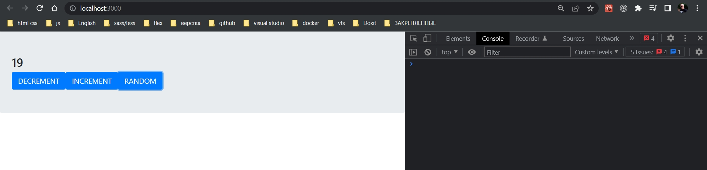
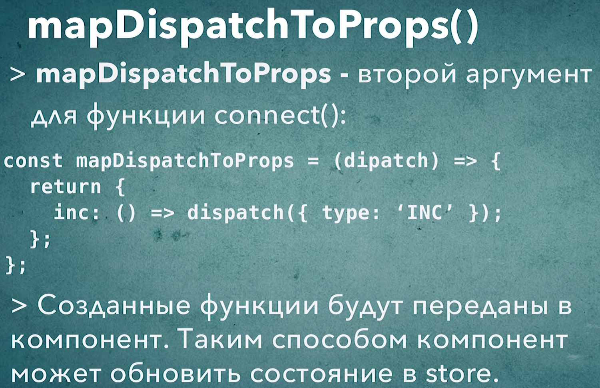

# 013_Функция_mapDispatchToProps

Мы узнали как при помощи функции connect и функции mapStateToProps получить значение из глобального redux store и записать их в качестве свойств в наш компонент Counter.

```js
import React from "react";
import { connect } from "react-redux";

const Counter = ({ counter, increment, decrement, random }) => {
  return (
    <div className="jumbotron">
      <h2>{counter}</h2>
      <button className="btn btn-primary btn-lg" onClick={decrement}>
        DECREMENT
      </button>
      <button className="btn btn-primary btn-lg" onClick={increment}>
        INCREMENT
      </button>
      <button className="btn btn-primary btn-lg" onClick={random}>
        RANDOM
      </button>
    </div>
  );
};

const mapStateToProps = (state) => {
  return {
    counter: state,
  };
};

export default connect(mapStateToProps)(Counter);

```

Таким образом наш Counter как бы слушает store и получает обновленное значение из нашего глобального state.

Но для того что бы можно было наш компонент полноценно считать проинтегрированным с Redux нужно сделать еще одно действие. Нужно сделать так что бы Counter умел передавать в store новые действия action т.е. использовать функцию dispatch.

Прямо сейчас мы получаем значение из store. Мы как бы можем читать из store. Нужно сделать так что бы мы могли его обновлять.

Для этого есть вторая функция которая работает почти так же как mapStateToProps. И эта функция называется mapDispatchToProps. И выполняет эта функция точно те же действия что и mapStateToProps только вместо того что бы работать со state, вторая функция работает с функцией dispatch. На вход мы получем функцию dispatch. В теле функции мы возвращаем объект. В качестве ключей в объекте будут те свойства которые мы хотим присвоить нашему компоненту counter. Ну а в качестве значений будут те функции которые мы присваиваем.

mapDispatchToProps передаем в качестве второго аргумента в функцию connect.

```js
import React from "react";
import { connect } from "react-redux";

const Counter = ({ counter, increment, decrement, random }) => {
    return (
        <div className="jumbotron">
            <h2>{counter}</h2>
            <button className="btn btn-primary btn-lg" onClick={decrement}>
                DECREMENT
            </button>
            <button className="btn btn-primary btn-lg" onClick={increment}>
                INCREMENT
            </button>
            <button className="btn btn-primary btn-lg" onClick={random}>
                RANDOM
            </button>
        </div>
    );
};

//Читаю из state
const mapStateToProps = (state) => {
    return {
        counter: state,
    };
};

//изменяю state
const mapDispatchToProps = (dispatch) => {
    return{
        increment: () => dispatch({type:"INCREMENT"}),
        decrement:() => dispatch({type:"DECREMENT"}),
        random: () =>{
            const payload = Math.floor(Math.random()* 10)
            dispatch({type:"RANDOM", payload})}

    }
}

export default connect(mapStateToProps, mapDispatchToProps)(Counter);

```

Когда пользователь например нажмет на кнопку INCREMENT то произойдет сразу несколько действий. Вызовется функция increment. Функция increment вызовет функцию dispatch и передаст в store новый action т.е. {type:"INCREMENT"}. Наша функция reducer получит это дейтсвие и обновит значение в store. И после этого новое значение counter снова придет в компонент Counter благодаря той функции которую мы разобрали в прошлом видео mapStateToProps. Компонент получит новый props, отрисуется и покажет на экране новое значение счетчика.

И так, если мы будем использовать Action Creators, то код будет чище. Приступаю. В файле actions.js у меня уже есть эти функции.

```js
//src/actions.js

// Action Creators

//action creator increment
export const increment = () => {
  return { type: "INCREMENT" };
};

//action creator decrement
export const decrement = () => {
  return { type: "DECREMENT" };
};

//action creator random
export const random = (payload) => {
  return { type: "RANDOM", payload };
};

```

```js
import React from "react";
import { connect } from "react-redux";
import {increment, decrement, random} from '../actions'

const Counter = ({ counter, increment, decrement, random }) => {
  return (
    <div className="jumbotron">
      <h2>{counter}</h2>
      <button className="btn btn-primary btn-lg" onClick={decrement}>
        DECREMENT
      </button>
      <button className="btn btn-primary btn-lg" onClick={increment}>
        INCREMENT
      </button>
      <button className="btn btn-primary btn-lg" onClick={random}>
        RANDOM
      </button>
    </div>
  );
};

//Читаю из state
const mapStateToProps = (state) => {
  return {
    counter: state,
  };
};

//изменяю state
const mapDispatchToProps = (dispatch) => {
    return{
        increment: () => dispatch(increment()),
        decrement:() => dispatch(decrement()),
        random: () =>{
            const payload = Math.floor(Math.random()* 10)
            dispatch(random(payload))}

    }
}

export default connect(mapStateToProps, mapDispatchToProps)(Counter);

```

```js
//src/reducer.js
const reducer = (state = 0, action) => {
  switch (action.type) {
    case "INCREMENT":
      return state + 1;
    case "DECREMENT":
      return state - 1;
    case "RANDOM":
      return state + action.payload;
    default:
      return state;
  }
};

export default reducer;

```



И остался еще один маленький аспект как мы можем улучшить код функции mapDispatchToProps. 

В одном из прошлых видео мы рассматривали функцию которая называется bindActionCreators -эта функция связывает функцию dispatch и Action Creator таким образом что новая функция автоматически создает действие и передает это действие в dispatch.

В первую очередь мне понадобится bindActionCreators из пакета redux.

Далее я импортирую функции increment, decrement, random в виде одного объекта actions  в котором будут эти три функции.

В теле mapDispatchToProps вызываю bindActionCreators(). Напомню в первый аргумент bindActionCreators мы
передаем наш объект с действиями actions. А вторым аргументом мы передаем функцию dispatch. bindActionCreators вернет объект у которого точно такая же структура как и у объекта actions. По этому мы можем сразу деструктурировать нужные функции.

```js
import React from "react";
import { connect } from "react-redux";
import {bindActionCreators} from 'redux'
import * as actions from '../actions'

const Counter = ({ counter, increment, decrement, random }) => {
  return (
    <div className="jumbotron">
      <h2>{counter}</h2>
      <button className="btn btn-primary btn-lg" onClick={decrement}>
        DECREMENT
      </button>
      <button className="btn btn-primary btn-lg" onClick={increment}>
        INCREMENT
      </button>
      <button className="btn btn-primary btn-lg" onClick={random}>
        RANDOM
      </button>
    </div>
  );
};

//Читаю из state
const mapStateToProps = (state) => {
  return {
    counter: state,
  };
};

//изменяю state
const mapDispatchToProps = (dispatch) => {

    const {increment, decrement ,random} = bindActionCreators(actions, dispatch)
    return{
        increment,
        decrement,
        random: () =>{
            const payload = Math.floor(Math.random()* 10)
            random(payload)}

    }
}

export default connect(mapStateToProps, mapDispatchToProps)(Counter);

```

Теперь у нас есть полноценная интеграция нашего компонента с Redux store.


ИТОГ: мы как бы соеденили наш компонент с Redux store благодаря функции connect. Функция connect это HOC которая создает новый компонент обертку который отвечает за то что бы проинтегрировать наш компонент Counter с Redux store.

Для того что бы этот новый компонент работал ему нужно знать какие именно значения получить из store и как обработать функцию dispatch. И для этого у нас с вами есть две функции которые мы должны передать в connect.

1. Первая функция это mapStateToProps - она принимает на вход state и возвращает объект ключи у которых это свойства которые мы присвоим нашему компоненту. Ну а значения это какие-нибудь значения из state которые мы получим или вычислим.
2. А вторая функция называется mapDispatchToProps. Она работает точно так же как mapStateToProps, только вместо того что бы использовать state, она внутри себя ипользует функцию  dispatch. И в качестве значений мы передаем функции которые наш компонент сможет использовать для того что бы dispatch события в store т.е. для того что бы изменять глобальное состояние. 

Нужно заметить что благодаря такой интеграции, наш компонент Counter ничего про redux. Этот компонент Counter полностью независим от Redux store. Точно так же мы смогли бы использовать компонент Counter в обычном приложении если бы передали туда нужные значения  increment, decrement, random.




