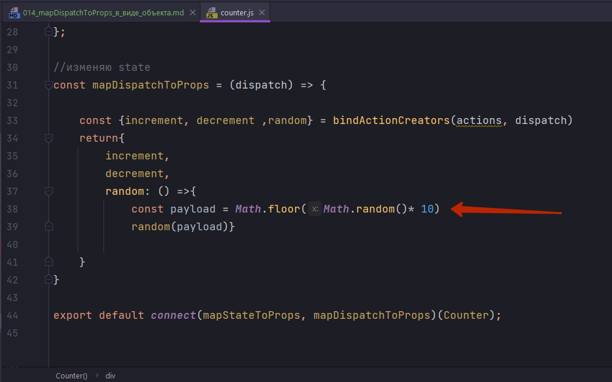
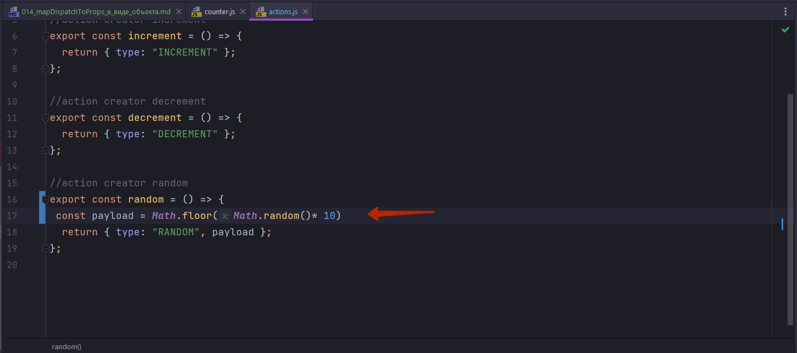
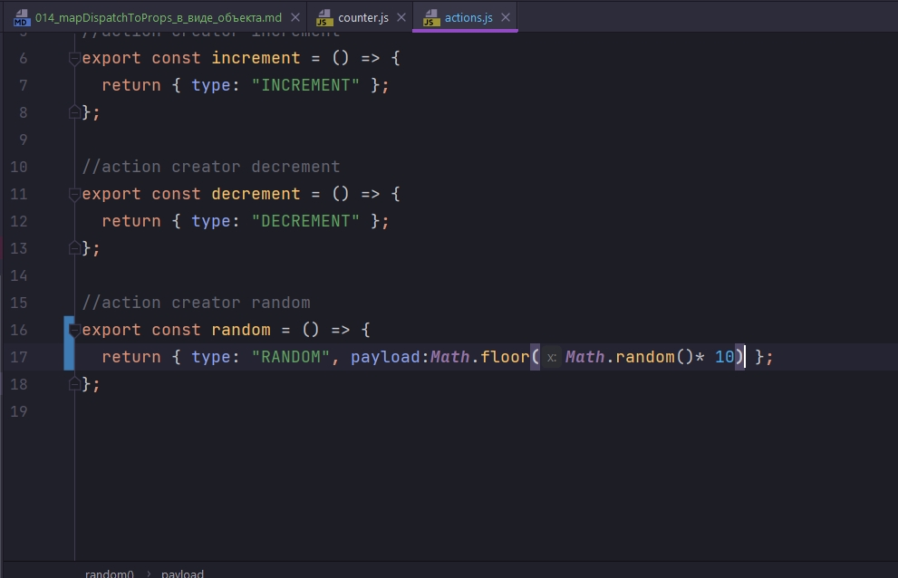
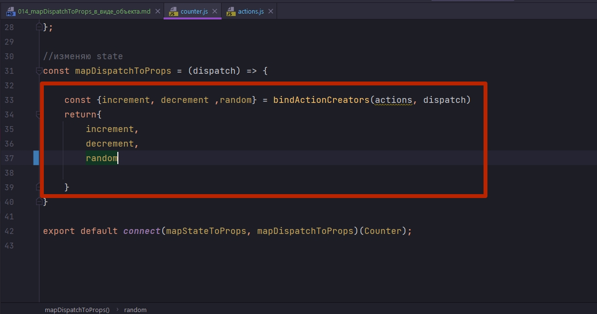
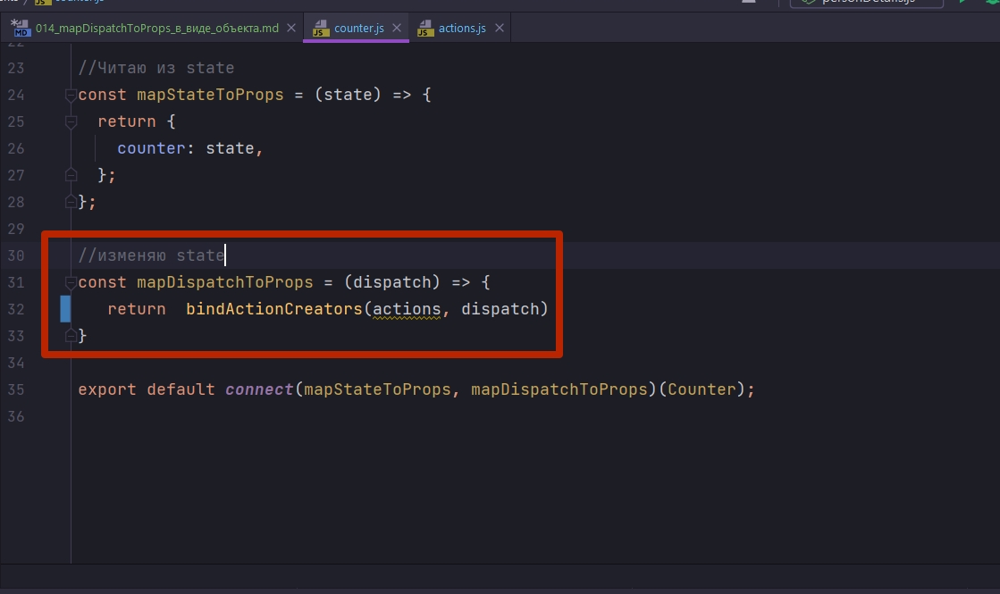
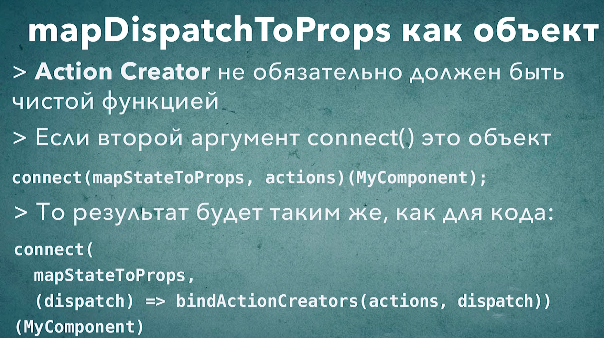

# 014_mapDispatchToProps_в_виде_объекта

Давайте посмотрим как еще немножечко можно улучшить наш код mapDispatchToProps.

В первую очередь мне хотелось бы избавиться вот от этой строки



Дело в том что такая строка здесь уместна только тогда когда у нас есть один компонент которому нужно это случайное значение.

Но давайте предположим не секундочку что у нас есть приложение где вот такой вот action исполняется во многих разных компонентах.

В таком случае нам придется копировать эту строку из одного компонента в другой. А нам хотелось бы этого избежать.

Мы уже касались этого вопроса. И мы обсуждали можноли такой код переместить к примеру в reducer. И когда мы рассматривали этот вариант, мы решили что нет нельзя!!!! Поскольку reducer должен быть чистой функцией. А такой код, который использует генератор случайных чисел, он нарушает чистоту функции, поскольку функция уже зависит не только от своих аргументов, но еще и от генератора случайных чисел.

Но что если мы переместим этот код прямо в Action Creator т.е. в функцию random.

И теперь смотрите. Переношу строку в Action Creator



Однако зачем мне создавать лишнюю переменную. Присваиваю ключу payload результат функции.



Допустим ли такой код для Action Creator. Может ли Action Creator быть не чистой функцией? Да, action creator может не быть чистой функцией. ТОЛЬКО ДЛЯ ФУНКЦИИ REDUCER СУЩЕСТВУЕТ ТАКОЕ ОГРАНИЧЕНИЕ!!! ТОЛЬКО REDUCER ДОЛЖЕН БЫТЬ ЧИСТОЙ ФУНКЦИЕЙ ЧТО БЫ АРХИТЕКТУРА REDUX РАБОТАЛА!!! НА ACTION CREATORS ЭТИ ОГРАНИЧЕНИЯ НЕ НАКЛАДЫВАЮТСЯ!!! Но тем не менее чистые функции имееют много преимуществ. Если возможно action creators тоже делаете чистыми функциями.


```js
//src/actions.js

// Action Creators

//action creator increment
export const increment = () => {
  return { type: "INCREMENT" };
};

//action creator decrement
export const decrement = () => {
  return { type: "DECREMENT" };
};

//action creator random
export const random = () => {
  return { type: "RANDOM", payload:Math.floor(Math.random()* 10) };
};

```

Теперь в Counter функцию random я могу передать в том виде в котором она есть.

```js
import React from "react";
import { connect } from "react-redux";
import {bindActionCreators} from 'redux'
import * as actions from '../actions'

const Counter = ({ counter, increment, decrement, random }) => {
  return (
    <div className="jumbotron">
      <h2>{counter}</h2>
      <button className="btn btn-primary btn-lg" onClick={decrement}>
        DECREMENT
      </button>
      <button className="btn btn-primary btn-lg" onClick={increment}>
        INCREMENT
      </button>
      <button className="btn btn-primary btn-lg" onClick={random}>
        RANDOM
      </button>
    </div>
  );
};

//Читаю из state
const mapStateToProps = (state) => {
  return {
    counter: state,
  };
};

//изменяю state
const mapDispatchToProps = (dispatch) => {

    const {increment, decrement ,random} = bindActionCreators(actions, dispatch)
    return{
        increment,
        decrement,
        random

    }
}

export default connect(mapStateToProps, mapDispatchToProps)(Counter);

```

И теперь вот этот код 



я могу сделать еще лаконичнее. Мы можем удалить создание возвращаемого объекта. И из нашей функции мы можем просто вернуть bindActionCreators.

```js
import React from "react";
import { connect } from "react-redux";
import {bindActionCreators} from 'redux'
import * as actions from '../actions'

const Counter = ({ counter, increment, decrement, random }) => {
  return (
    <div className="jumbotron">
      <h2>{counter}</h2>
      <button className="btn btn-primary btn-lg" onClick={decrement}>
        DECREMENT
      </button>
      <button className="btn btn-primary btn-lg" onClick={increment}>
        INCREMENT
      </button>
      <button className="btn btn-primary btn-lg" onClick={random}>
        RANDOM
      </button>
    </div>
  );
};

//Читаю из state
const mapStateToProps = (state) => {
  return {
    counter: state,
  };
};

//изменяю state
const mapDispatchToProps = (dispatch) => {
   return  bindActionCreators(actions, dispatch)
}

export default connect(mapStateToProps, mapDispatchToProps)(Counter);

```

Этот код делает несколько вещей. Он берет все Action Creators которые мы ипортировали, под темиже именами под которыми мы их импортировали. Эти Action Creators связываются с функцией dispatch и результирующие свойства присваиваются нашему объекту. Т.е. точно так же как и раньше наш объект получит три свойства increment, decrement и random, но только теперь мы потратили намного меньше кода для того что бы описать эти свойства.

Такой паттерн встречается очень часто. Настолько часто что функция connect умеет делать действие bindActionCreators за нас. Если в функцию connect, в качестве второго аргумента передавать не функцию, а объект, то функция connect выполнит точно такое же действие как мы написали в функции mapDispatchToProps.



Теперь вместо второго аргумента в функцию connect я могу передать наш объект actions.

```js
import React from "react";
import { connect } from "react-redux";
import {bindActionCreators} from 'redux'
import * as actions from '../actions'

const Counter = ({ counter, increment, decrement, random }) => {
  return (
    <div className="jumbotron">
      <h2>{counter}</h2>
      <button className="btn btn-primary btn-lg" onClick={decrement}>
        DECREMENT
      </button>
      <button className="btn btn-primary btn-lg" onClick={increment}>
        INCREMENT
      </button>
      <button className="btn btn-primary btn-lg" onClick={random}>
        RANDOM
      </button>
    </div>
  );
};

//Читаю из state
const mapStateToProps = (state) => {
  return {
    counter: state,
  };
};


export default connect(mapStateToProps, actions)(Counter);

```

При этом наши action creators уже будут связаны с нужной функцией dispatch. Такой синтаксис намного лаконичнее и вы его будете часто встречать в React-Redux проектах.

Но это не означает что синтаксис который мы рассмотрели ранее с функцией mapDispatchToProps что он не нужен. Этот синтаксис позволяет немного более гибко работать с функцией dispatch и строить немножечко более сложные функции для вашего компонента.

Но если все что вы хотите сделать это взять Action Creators и передать их в ваш компонент, обернув их в bindActionCreators, то вот такой синтаксис, как на скрине выше, сохранит вам пару строк кода.



