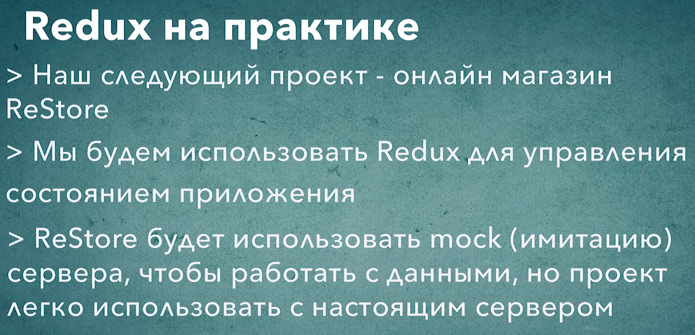

# 001_Наш_следующий_проект

Что бы лучше понять как использовать Redux в реальных условиях мы создадим еще одно приложение намного более интересное чем счетчик.

Приложение ReStore - это онлайн магазин книг по программированию. Который будет написан на React и Redux.

Это приложение состоит из двух основных частей:

1. Первая часть это список книг. Тут пользователь может посмотреть на описание книги и цену.
2. Вторая часть это корзина. Пользователь может добавлять книги в корзину. При этом если пользователь добавил несколько экземпляров одной и той же книги. Мы не будем создавать отдельные записи в таблице. Вместо этого мы обновим количество книг в строке и общую сумму заказа.

Для доступа к данным мы будем использовать точно такой же подход как мы использовали в приложении StarDB. Мы создадим отдельный класс сервис который будет скрывать детали того как мы получаем данные от остальных компонентов нашего приложения.

Мы даже написали два разных сервиса. Один для работы с реальным API, а второй тестовый, для того что бы показать как можно использовать заранее подготовленные наборы данных что бы упростить тестирование приложения.

Так вот в этом приложении мы не будем работать с реальным API. 

Вместо этого мы создадим класс сервис который будет имитировать работу настоящего сервера и будем использовать его. 

Но это совершенно не означает что наш магазин сможет работать только с тестовыми данными. Как вы видили в прошлых уроках нам будет достаточно заменить тестовые данные на вызов реальных API, реального сервера, что бы наш магазин заработал с настоящим back-end.

