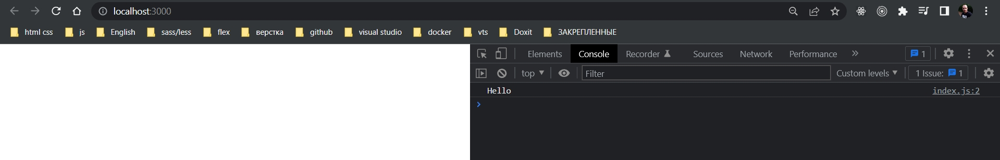
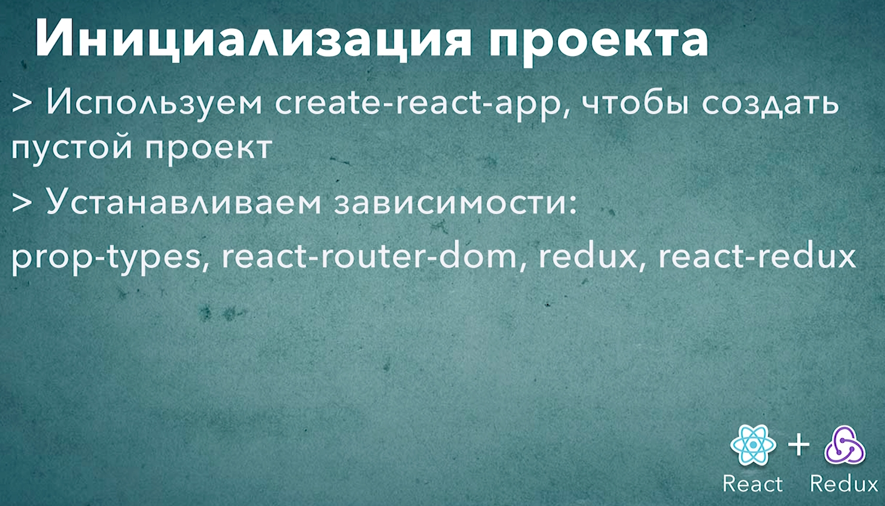

# 002_Инициализация_проекта

В этом уроке мы проинициализируем наше новое React приложение и установим необходимые зависимости.

создаю проект либо 

```shell
npx create-react-app re-store
```

Либо если я нахожусь в дирректории

```shell
npx create-react-app .
```

После установки устанавливаю еще несколько дополнительных зависимостей.

```shell
npm install prop-types react-router-dom redux react-redux
```

* prop-types - для того что бы описывать свойства наших компонентов
* react-router-dom - для того что бы организовать роутинг в нашем приложении
* redux - стейт менеджер
* redux react-redux - для интеграции с React

```json
{
  "name": "re-store",
  "version": "0.1.0",
  "private": true,
  "dependencies": {
    "@testing-library/jest-dom": "^5.16.4",
    "@testing-library/react": "^13.0.1",
    "@testing-library/user-event": "^13.5.0",
    "prop-types": "^15.8.1",
    "react": "^18.0.0",
    "react-dom": "^18.0.0",
    "react-redux": "^7.2.8",
    "react-router-dom": "^6.3.0",
    "react-scripts": "5.0.1",
    "redux": "^4.1.2",
    "web-vitals": "^2.1.4"
  },
  "scripts": {
    "start": "react-scripts start",
    "build": "react-scripts build",
    "test": "react-scripts test",
    "eject": "react-scripts eject"
  },
  "eslintConfig": {
    "extends": [
      "react-app",
      "react-app/jest"
    ]
  },
  "browserslist": {
    "production": [
      ">0.2%",
      "not dead",
      "not op_mini all"
    ],
    "development": [
      "last 1 chrome version",
      "last 1 firefox version",
      "last 1 safari version"
    ]
  }
}

```

И почистим проект от тех зависимостей которые мы использовать не будем.

```js
//index.js
console.log("Hello");

```





