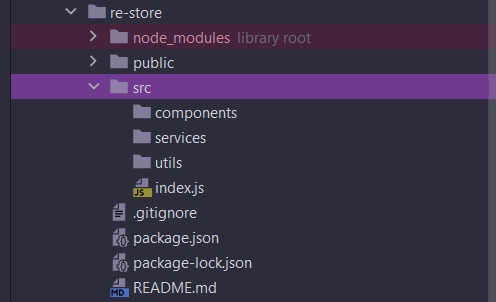
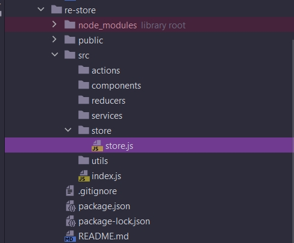
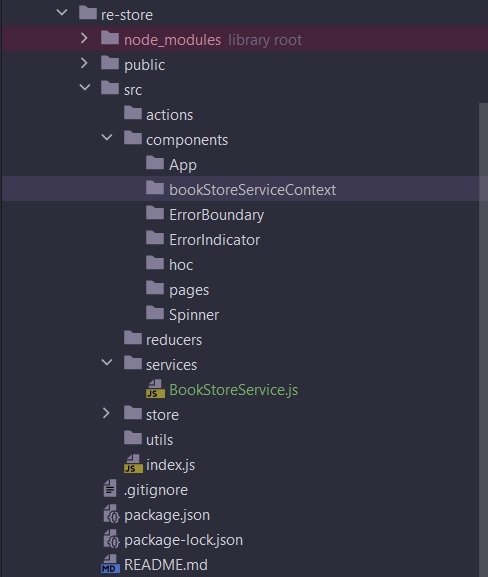
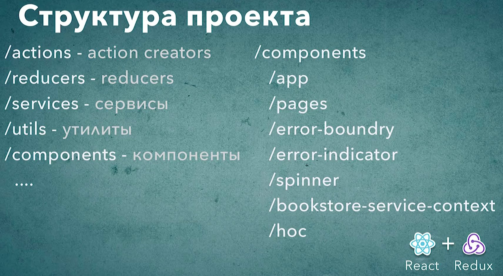

# 003_Структура_React-Redux_проекта

У нас с вами есть пустой проект со всеми необходимыми зависимостями для того что бы написать React-Redux приложение. 

Ну а в этом видео создадим структуру дирректорий и проинициализируем базовые компоненты которые понадобяться для любого React-Redux приложения.

Начну с создания самых базовых папок components, services, utils - для маленьких утилит вроде функций compose которую мы создавали в блоке Паттерны React. Это те три папки которые позволяют комфортно писать React приложение. 



Но мы с вами пишем не просто React приложение, а React-Redux приложение. Redux добавляет новые сущности и для этих новых сущностей нам нужны отдельные директории.

Создаем папку actions - здесь будут все Action Creators.

И создадим директорию reducers. У вас может возникнуть вопрос почему мы создаем директорию reducers? Ведь reducers это одна функция!!! Но в действительности когда функция reducer становится большой ее можно разбить на несколько маленьких функций. И вот когда мы разбиваем нашу большую функцию reducer на маленькие функции - эти самые маленькие функции удобно хранить в отдельных файлах. Ну а файлы все будут храниться в директории reducers.

И создадим еще одну директорию и назову ее store. В которой создаю файл store.js. В этом файле будет хранится код который Redux store.



Давайте теперь создадим несколько файлов для того что бы проинициализировать основные компоненты. В services создам bookStoreService.js поскольку мы будем показывать книги то наш основной сервис будет называться bookStoreService.js Этот сервис будет заниматься за получение данных о книгах. В настоящем приложении этот сервис работал бы с сервером. Но в нашем приложении мы будем работать с заранее подготовенными данными. 

Ну и конечно если в какой-то момент вы захотите работать с настоящим сервером все что вам нужно будет сделать это переписать реализаию этого маленького класса.

```js
//src/services/bookStoreService
import React, { Component } from "react";

class BookStoreService extends Component {
  getBookStore() {
    return [];
  }
}

export default BookStoreService;

```

Пока что эта функция будет синхронной. Но в следующих видео мы посмотрим как работать с асинхронными данными в Redux. Постепенно дойдем до этой темы.

Теперь когда у нас есть сервис, самое время подумать о том какая у нас будет структура у наших компонентов.

Компонент App - это тот самый корневой компонент который инициализирует приложение.

Но конечно компонента App нам будет не достаточно. Для того что бы написать полноценное приложение нам обязательно нужно иметь несколько вспомогательных компонентов. К примеру компоненте который будет отображать Spinner пока данные загружаются. Или компонент который отображает ошибку. Или ErrorBoundary компонент который отлавливает неожиданные ошибки и делает что бы сообщение об этих ошибках было ккласивое. 

Создадим папки для этих компонентов. 

Первая папка будет Spinner. Затем создадим папку ErrorIndicator. Создадим ErrorBoundary. Кроме того создадим отдельную папку для компонентов высшего порядка hoc. 

И последний компонент который нам понадобится в приложении это компонент контекст который будет поддерживать наш BookStoreService.js. Ведь мы захотим передавать BookStoreService через контекст.

Для того что бы этот компонент работал нам нужно создать компонент для контекста bookStoreServiceContext.

Ну и поскольку наше приложение будет состоять из нескольких страниц мы создадим отдельную папку pages. 



И конечно для того что б эта структура заработала вместе, нам нужно написать реализацию для этих самых компонентов папки для которых мы создали.



