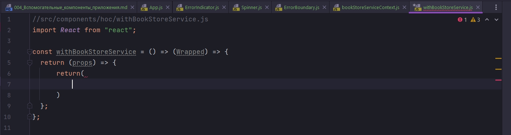
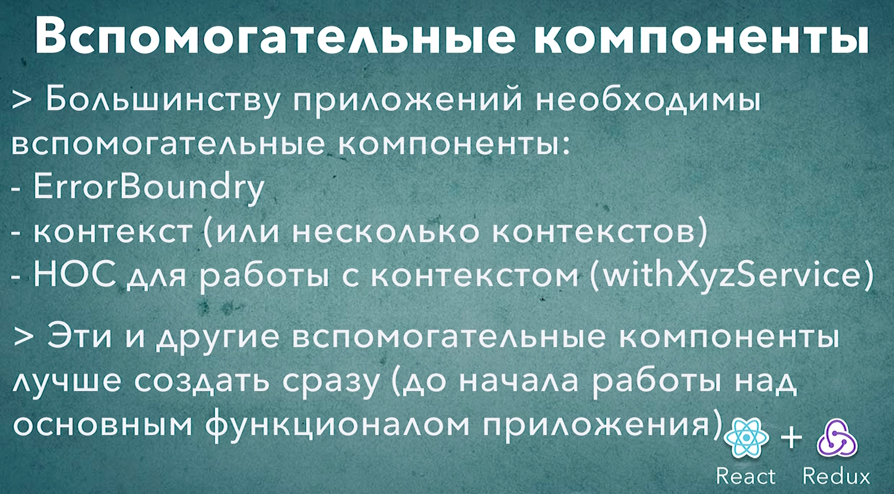

# 004_Вспомогательные_компоненты_приложения

В этом видео я буду создавать простые компоненты заглушки. В первую очередь я реализую компоненты App, ErrorIndicator и Spinner. Это самые простые, самые обычные компоненты мы уже несколько десятков раз писали в этом курсе.

```js
import React from "react";
import "./App.css";

const App = () => {
  return <div>App</div>;
};

export default App;

```

```js
import React from "react";
import "./ErrorIndicator.css";

const ErrorIndicator = () => {
  return <div>ErrorIndicator</div>;
};

export default ErrorIndicator;

```

```js
import React from "react";
import "./Spinner.css";

const Spinner = () => {
  return <div>Loading...</div>;
};

export default Spinner;

```

Теперь пришло время заняться немного более интересными компонентами ErrorBoundary и bookStoreServiceContext.

Начну с ErrorBoundary. Вы наверняка помните что ErrorBoundary это компонент у которое есть метод жизненного цикла componentDidCatch. Поскольку у этого компонента есть метод жизненного цикла нам нужно сделать его компонентом классом.

```js
import React, { Component } from "react";

class ErrorBoundary extends Component {
  componentDidCatch(error, errorInfo) {}

  render() {
    return <div></div>;
  }
}

export default ErrorBoundary;

```

Напомню componentDidCatch вызовется тогда когда в одном из компонентов ниже по иерархии от ErrorBoundary, возникла ошибка, в методе render или в другом любом жизненного цикле компонента. И в componentDidCatch мы должны сохранить это состояние и переключить наш ErrorBoundary в режим отображения ошибки.

Ну и для этого нам конено понадобится state. Начальное состояние hasError бует false т.е. ошибки нет.

Но если ошибка возникает, с помощью setState, в методе жизненного цикла componentDidCatch, перевожу состояние hasError в true.

Далее в методе render проверяю. Если у меня есть ошибка То мы отрисуем ErrorIndicator.

А если же ошибки нет, то мы отрисуем this.props.children.

```js
import React, { Component } from "react";
import ErrorIndicator from "../ErrorIndicator/ErrorIndicator";

class ErrorBoundary extends Component {
  state = {
    hasError: false,
  };
  componentDidCatch(error, errorInfo) {
    this.setState({ hasError: true });
  }

  render() {
    if (this.state.hasError === true) {
      return <ErrorIndicator />;
    } else {
      return this.props.children;
    }
  }
}

export default ErrorBoundary;

```

Вот таким вот не сложным способом мы реализовали компонент ErrorBoundary. 

Если что то не понятно, то возвращайся к разделу Жизненные циклы компонента.

<br/>
<br/>
<br/>

Теперь реализуем bookStoreServiceContext. Это тот самый компонент который позволит нам передать наш сервис всем компонентам нашего приложения используя Context API React.

Напомню для того что бы реализовать контекст нам понадобится два компонента который называется Provider и Consumer. Эти компоненты создаются при помощи функции React.createContext().

```js
import React from "react";

const {
  Provider: BookStoreServiceProvider,
  Consumer: BookStoreServiceConsumer,
} = React.createContext();

export { BookStoreServiceProvider, BookStoreServiceConsumer };

```

Для того что бы использовать BookStoreServiceConsumer было немного удобнее, мы создадим отдельный HOC компонент, который мы назовем withBookStoreService.

withBookStoreService - Это будет функция, которая возвращает функцию. Возвращаемая функция принимает компонент который мы будем оборачивать Wrapped. Т.е. в компоненте высшего порядка мы создаем новый компонент.

Из компонента высшего порядка мы возвращаем функцию. Она принимает props. И эта функция будет возвращать кусочек JSX разметки.



Что же мне нужно сделать в теле этого компонента?

В первую очередь нам нужно использовать BookStoreServiceConsumer для того что бы получить доступ к сервису. Импортирую BookStoreServiceConsumer и оборачиваю в него наш компонент Wrapped. Напомню для того что бы получить данные из BookStoreServiceConsumer я должен в него передать render функцию. Эта функция которая в качестве своего значения примет тот сервис, который мы передадим через контекст. на вход данная функция принимает bookStoreService, потому что это именно тот сервис который мы будем передавать. И вернуть мы должны тот самый компонент который оборачиваем. И не забываем передать в него все те свойства props которые получил наш собственный компонент.
Ну и конечно по мимо props в наш компонент мы передаем и bookStoreService т.е. тот сервис который мы получили из контекста.

```js
//src/components/hoc/withBookStoreService.js
import React from "react";
import { BookStoreServiceConsumer } from "../bookStoreServiceContext/bookStoreServiceContext";

const withBookStoreService = () => (Wrapped) => {
  return (props) => {
    return (
      <BookStoreServiceConsumer>
        {/* Для того что бы получить данные я должен передать render функцию*/}
        {(bookStoreService) => {
          return <Wrapped {...props} bookStoreService={bookStoreService} />;
        }}
      </BookStoreServiceConsumer>
    );
  };
};
export default withBookStoreService;

```

Теперь создать в нашем коде компонент который будет получать bookStoreService из контекта будет совсем не сложно. Будет достаточно обернуть любой существуюший компонент при помощи компонента высшего порядка withBookStoreService

Таким образом мы создали все компоненты для нашего каркаса React-Redux приложения.

Ну а в следующем видео мы поговорим как проинициализировать базовую структуру для redux - это actions и reducers и конечно store. И затем о том как связать все эти компоненты водном приложении.




