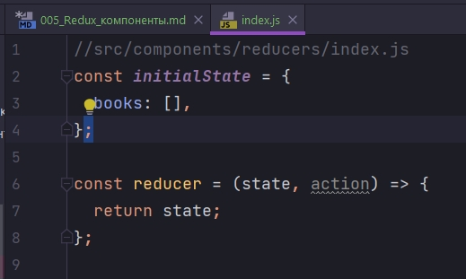
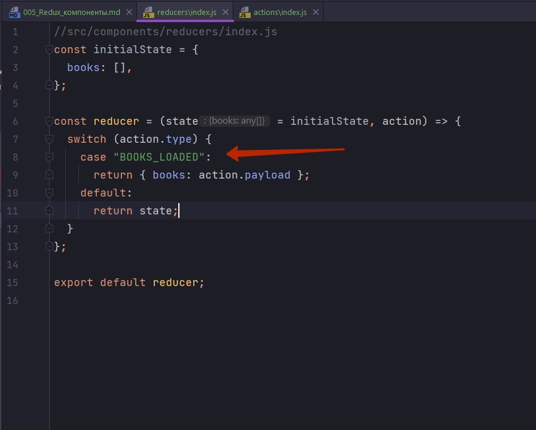
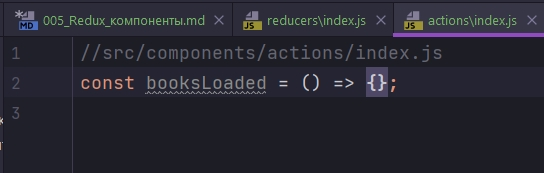
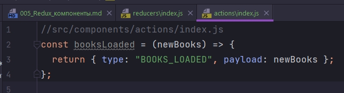
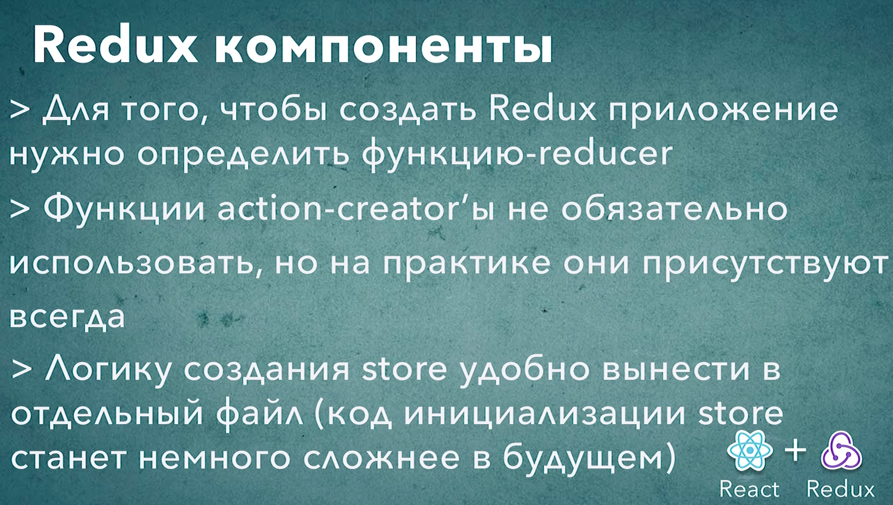

# 005_Redux_компоненты

И так в нашем приложении появился необходимый минимум React компонентов.

Самое время перейти к Redux компонентам.

Я начну писать код с Reducer. Ведь reducer как бы ядро нашего приложения. Это та часть которая отвечает за логику обновления данных. И по этому будет вполне естественно начать разработку с этого файла.

Пока что в reducers создам файл index.js. Затем когда у нас будет немножко больше файлов  в папке reducers мы дадим им красивые имена.

И давайте вспомним что такое reducer? reducer - это обычная функция которая принимает два аргумента.

1. state - текущий state
2. action - действие которое мы пытаемся выполнить

reducer должен вернуть какой-то новый state. Если мы вернули точно тот же state который получили, то это будет reducer который ровным счетом ни делает ничего. Но тем не менее это допустимый валидный reducer который можно использовать в коде.

По правилам Redux если state к нам пришел undefined мы должны вернуть initialState т.е. первоначальное состояние в нашем приложении.

Имеет смысл вынести в отдельную константу initialState.

Для начало что бы сделать минимальное простое приложение, мы сделаем минимальный простой state. В нашем самом простом state будет один массив который называется books.



books - это пустой массив. Затем когда мы начнем разрабатывать основную логику нашего приложения можно будет добавить к нашему initialState к примеру card. card - это информация о тех книгах, которые пользователь положил в свою покупательскую карзину, в свой shopping card.

```js
//src/components/reducers/index.js
const initialState = {
  books: [],
};

const reducer = (state = initialState, action) => {
  return state;
};

export default reducer;

```

Давайте добавим к нашему reducer поддержку одного простого действия. И оно будет называться BOOKS_LOADED т.е. книжки загружены. И передать массив книг которые мы получили от сервиса, ну или из сервера в зависимости от того с чем будет работать наш сервис.

Добавляю switch в параметры которого передаю action.type. Помните, у каждого action долэен быть type. type -это обязательно строка. Если произойдет BOOKS_LOADED то мы буем расчитывать что action.payload будет содержать новый  массив книг, который мы загрузили. Соответственно нам нужно будет вернуть новое состояние в котором books:action.payload.

```js
//src/components/reducers/index.js
const initialState = {
  books: [],
};

const reducer = (state = initialState, action) => {
  switch (action.type) {
    case "BOOKS_LOADED":
      return { books: action.payload };
    default:
      return state;
  }
};

export default reducer;

```

Вот теперь у нас с вами есть более интересный reducer, поскольку у нас есть action, у нас есть действие.

Будет логичным сделать Action Creator. Та функция которая позволит более просто создавать объекты action. 

Для этого перемещаюсь в папку actions. Создаю там новый файл index.js. И создаю новую функцию booksLoaded. Функцию называю точно так же как наше действие в Redux Store т.е. в функции reducer.





Это конечно не обязательно, но будет логично если действие которое называется BOOKS_LOADED будет создаваться функцией которая называется точно также booksLoaded. Этой функции для работы нужен список новых книг, назову параметр newBooks и мы должны вернуть новый объект action у которого type точно такой же как ожидает наш Redux store т.е. type:"BOOKS_LOADED", а payload:newBooks.



Иногдакогда приложение достаточно большое, рекомендуется строки тоже выносить в отдельные константы. Тогда к примеру в наш проект мы можем добавить еще одну папку которая будет называться actionTypes или просто types и хранить там все эти константы. Но поскольку наше приложение достаточно простое и в нем будет совсем немного разных действий, мы можем работать просто со строками.

```js
//src/components/actions/index.js
const booksLoaded = (newBooks) => {
  return { type: "BOOKS_LOADED", payload: newBooks };
};

export { booksLoaded };

```

И так у нас есть reducer, у нас есть action creator booksLoaded. И теперь мы можем создать польноценно store.

Перехожу в store.js. Что бы создать Redux store нам нужно проимпортировать функцию createStore из пакета redux.

Кроме того что бы проинициализировать store нам конечноже нужен reducer.

```js
//src/components.store/store.js
import { createStore } from "redux";
import reducer from "../reducers/index";

//Создаю store
const store = createStore(reducer);

export default store;

```

Это все что нам нужно сделать на этапе создания store.

У вас может возникнуть вопрос. А стоитли для создания store выделять отдельный файл? Но в седующих видео мы увидим что конфигурация store может быть несколько сложной и включать в себя немножко больше логики, по этому вот этот код станет немножко больше.

И так теперь у нас с вами есть минимальный набор компонентов для того что бы создать Redux приложение

Самое время перейти к тому что бы объеденить эти все компоненты вместе, компоненты React и компоненты Redux, и посмотреть как они все вместе могут работать.




