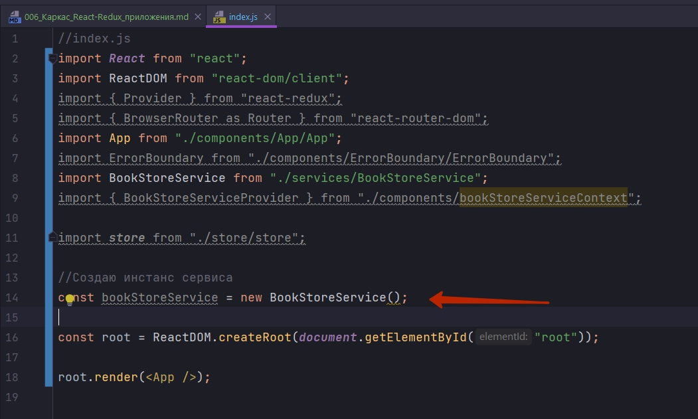
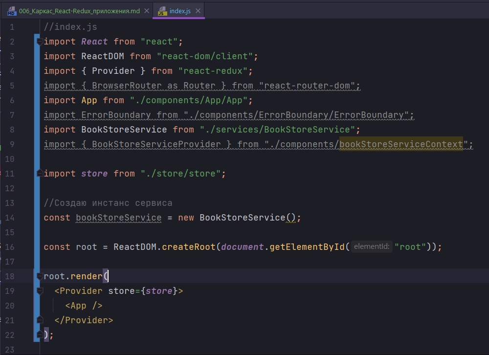
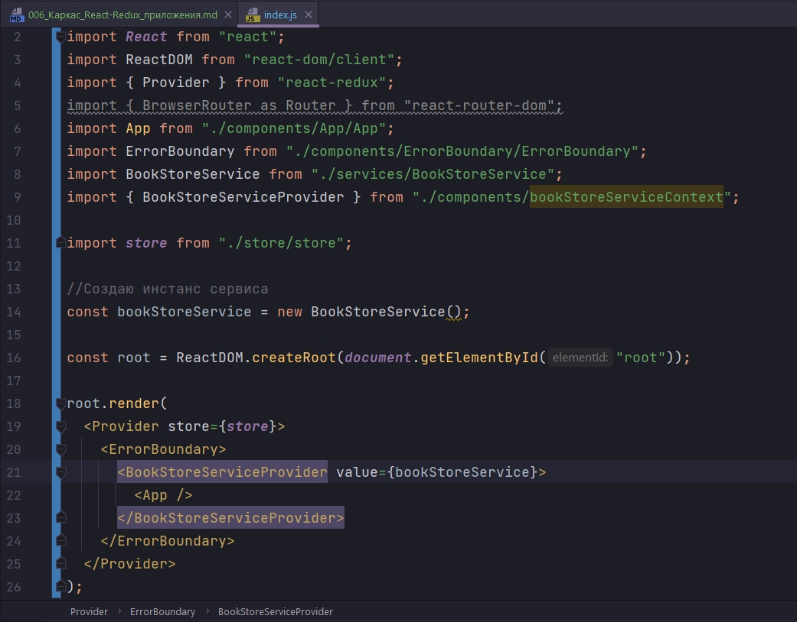
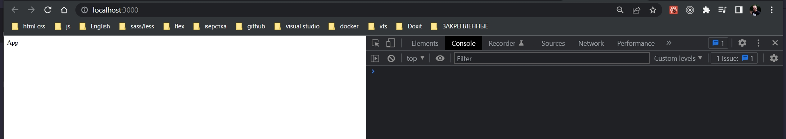
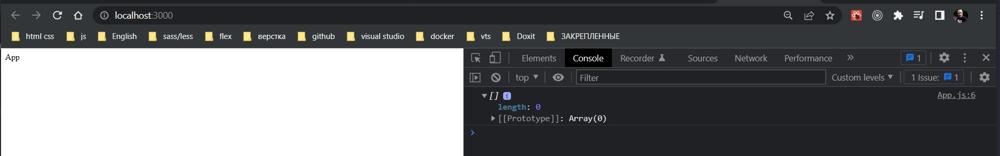
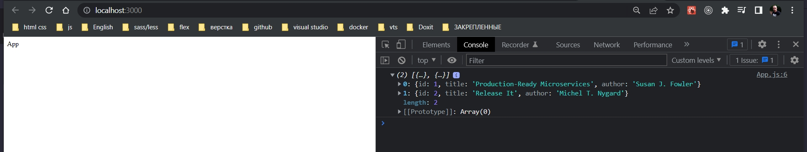
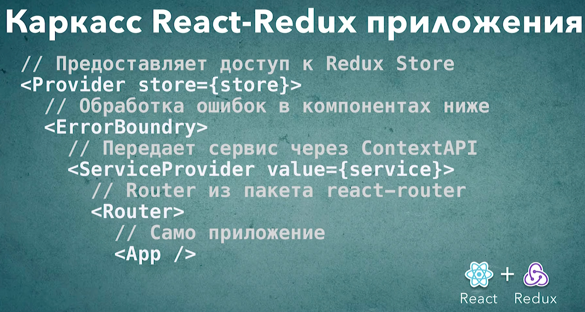

# 006_Каркас_React-Redux_приложения

И так у нас есть все маленькие строительные блоки для того что бы создать полноценное, масштабируемое React-Redux приложение.

И в этом видео мы объеденим эти компоненты в одно приложение.

Наши первоначальные приложения, они эволюционировали в течении нашего курса. Так вот эта версия уже довольно близка к настоящим production приложениям.

И так перехожу в index.js 

```js
//index.js
import React from "react";
import ReactDOM from "react-dom/client";
import App from "./components/App/App";

const root = ReactDOM.createRoot(document.getElementById("root"));

root.render(<App />);

```

И так продолжаю. Для того что бы дать доступ нашим компонентам к Redux store нам понадобится Provider из react-redux. И для того что бы реализовать роутинг нам понадобится BrowserRouter. Это что касается библиотек.

Импортирую компоненты. Для начало импортирую App. Нам понадобится ErrorBoundary. Для того что бы получить доступ к данным нам понадобится BookStoreService. Ну а для того что бы наши компоненты получили доступ к этому сервису нам нужет BookStoreServiceProvider. Ну и конечно нам понадобится store для того что бы управлять данными в приложении.

```js
//index.js
import React from "react";
import ReactDOM from "react-dom/client";
import { Provider } from "react-redux";
import { BrowserRouter as Router } from "react-router-dom";
import App from "./components/App/App";
import ErrorBoundary from "./components/ErrorBoundary/ErrorBoundary";
import BookStoreService from "./services/BookStoreService";
import { BookStoreServiceProvider } from "./components/bookStoreServiceContext/bookStoreServiceContext";


import store from "./store/store";

const root = ReactDOM.createRoot(document.getElementById("root"));

root.render(<App />);

```

Теперь попробуем все это богадство объеденить в одном приложении.

Для начало нам понадобится новый истанс нашего сервиса BookStoreService что бы с ним можно было работать и его можно было передавать другим компонентам.



Делее перехожу к функции render. Отрисуем дерево элементов на нашей страничке.

Что именно и в каком порядке мы будем отрисовывать? ЭТО ОЧЕН ВАЖНЫЙ МОМЕНТ КОТОРЫЙ ЗАДАЕТ СТРУКТУРУ ВАШЕГО ПРИЛОЖЕНИЯ,Т.Е. ТЕ ВОЗМОЖНОСТИ, ТОТ ФУНКИОНАЛ КОТОРЫЙ БУДЕТ ДОСТУПЕН ВСЕМ ОСТАЛЬНЫМ КОМПОНЕНТАМ ВНУТРИ ВАШЕГО ПРИЛОЖЕНИЯ. ПОСКОЛЬКУ ЭТО ПРИЛОЖЕНИЕ УПРАВЛЯЕТСЯ REDUX, И ФАКТИЧЕСКИ REDUX ЯВЛЯЕТСЯ ЦЕНРОМ ЛОГИКИ НАШЕГО ПРИЛОЖЕНИЯ БУДЕТ ЛОГИЧНО НА САМОМ ВЕРХНЕМ УРОВНЕ ОТРЕНДЕРИТ КОМПОНЕНТ PROVIDER ИЗ REACT-REDUX. Для того что бы Provider работал мы должны передать ему store. И в качесве store мы передадим наш store который мы создали в одном из пришлых видео.



Теперь внутри Provider можно рендерить остальные компоненты нашего приложения. 

Следующий компонент который мы отрендерим это ErrorBoundary. Я хочу его отрендерить как можно выше в иерархии. ErrorBoundary обрамляет все компоненты неже себя. Соответственно если в каком-нибудь компоненте ниже по иерархии возникнет ошибка ErrorBoundary ее поймает и покажет красивый экранчик с ошибкой. И по этому ErrorBoundary идет сразу за Provider.

Возможно у вас возникает вопрос почему бы ErrorBoundary не поставить на самом верхнем уровне? Да все потому что ErrorBoundary могут быть необходимы данные из redux store. К примеру если ErrorBoundary будет отрисовывать компонент который будет описывать ошибку на языке пользователя, то язык пользователя скорее всего будет хранится в store. Соответственно ErrorBoundary должен быть внутри Provider.


За ErrorBoundary мы поместим наш BookStoreServiceProvider что бы все компоненты ниже имели  доступ к нашему сервису. В параметры передаю ключевое слово value. И в качестве value передаю наш инстанс класса bookStoreService



Теперь у всех компонентов ниже по иерархии будет доступ к контексту. Затем все что нам остается отрендерить это Router для того что бы все компоненты ниже имели доступ к функциональность роутинга.

```js
//index.js
import React from "react";
import ReactDOM from "react-dom/client";
import { Provider } from "react-redux";
import { BrowserRouter as Router } from "react-router-dom";
import App from "./components/App/App";
import ErrorBoundary from "./components/ErrorBoundary/ErrorBoundary";
import BookStoreService from "./services/BookStoreService";
import { BookStoreServiceProvider } from "./components/bookStoreServiceContext/bookStoreServiceContext";


import store from "./store/store";

//Создаю инстанс сервиса
const bookStoreService = new BookStoreService();

const root = ReactDOM.createRoot(document.getElementById("root"));

root.render(
  <Provider store={store}>
    <ErrorBoundary>
      <BookStoreServiceProvider value={bookStoreService}>
        <Router>
          <App />
        </Router>
      </BookStoreServiceProvider>
    </ErrorBoundary>
  </Provider>
);

```

Что же нам далет такая структура? 

Если она вам кажется немного сложноватой, на самом деле она не сложная поскольку каждый компонент здесь отвечает здесь за свой маленький аспект. И все эти аспекты становятся доступны тем элементам которые находятся ниже по иерархии в компоненте App. Другими словами все компоненты нашего приложения будут иметь доступ к роутингу Router, иметь доступ к нашему bookStoreService который находится в контексте. Если в них будут происходить ошибки эти ошибки будут отлавливаться ErrorBoundary. И вконце концов все компоненты ниже по иерархии будут иметь доступ к нашему Redux store т.е. Provider store={store}. И мы сможем делать компоненты которые зависят от данных в store и которые могут диспатчить туда новые события, новые actions. 

И вот так будет выглядеть файл который создает, запускает и инициализирует основные части нашего приложения.



По краней мере все работает. Но мы все еще не знаем сможет ли App работать с нашим сервисом bookStoreService. И сможет ли App получать данные из Redux store и диспатчить события в redux store.

Немножко обновим код нашего приложения и проверим есть ли у компонентов нашего приложения доступ к сервису и к redux.

Перехожу в компонент App. И сделаем этот компонент немного интереснее. Для начало добавлю к нему сервис withBookStoreService. И обернем наш компонент App в этот компонент высшего порядка.

```js
import React from "react";
import "./App.css";
import withBookStoreService from "../hoc/withBookStoreService";

const App = () => {
  return <div>App</div>;
};

export default withBookStoreService()(App);

```

После того как мы это сделали у компонента App в props должен появится наш bookStoreService

```js
import React from "react";
import "./App.css";
import withBookStoreService from "../hoc/withBookStoreService";

const App = ({ bookStoreService }) => {
  console.log(bookStoreService.getBookStore());
  return <div>App</div>;
};

export default withBookStoreService()(App);

```

Если я все сделала правильно, то в консоли я должен увидет пустой массив.



Мы можем получить данные. И так передам некоторые моковые данные из BookStoreService.

```js
//src/services/bookStoreService
import React, { Component } from "react";

class BookStoreService extends Component {
    getBookStore() {
        return [
            {
                id: 1,
                title: "Production-Ready Microservices",
                author: "Susan J. Fowler",
            },
            {
                id: 2,
                title: "Release It",
                author: "Michel T. Nygard",
            },
        ];
    }
}

export default BookStoreService;

```






