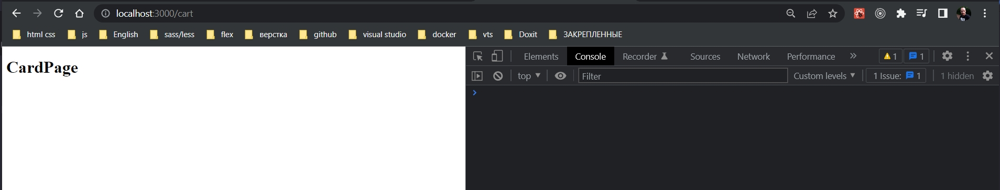

# 007_Роутинг


И так в прошлом видео мы проверили что наш сервис работает и та инфракструктура которую мы написали, наш компонент высшего порядка withBookStoreService

```js
import React from "react";
import "./App.css";
import withBookStoreService from "../hoc/withBookStoreService";

const App = ({ bookStoreService }) => {
  console.log(bookStoreService.getBookStore());
  return <div>App</div>;
};

export default withBookStoreService()(App);

```

```js
//src/components/hoc/withBookStoreService.js
import React from "react";
import { BookStoreServiceConsumer } from "../bookStoreServiceContext/bookStoreServiceContext";

const withBookStoreService = () => (Wrapped) => {
    return (props) => {
        return (
            <BookStoreServiceConsumer>
                {/* Для того что бы получить данные я должен передать render функцию*/}
                {(bookStoreService) => {
                    return <Wrapped {...props} bookStoreService={bookStoreService} />;
                }}
            </BookStoreServiceConsumer>
        );
    };
};
export default withBookStoreService;

```

Наш контекст

```js
import React from "react";

const {
  Provider: BookStoreServiceProvider,
  Consumer: BookStoreServiceConsumer,
} = React.createContext();

export { BookStoreServiceProvider, BookStoreServiceConsumer };

```

```js
//index.js
import React from "react";
import ReactDOM from "react-dom/client";
import { Provider } from "react-redux";
import { BrowserRouter as Router } from "react-router-dom";
import App from "./components/App/App";
import ErrorBoundary from "./components/ErrorBoundary/ErrorBoundary";
import BookStoreService from "./services/BookStoreService";
import { BookStoreServiceProvider } from "./components/bookStoreServiceContext/bookStoreServiceContext";

import store from "./store/store";

//Создаю инстанс сервиса
const bookStoreService = new BookStoreService();

const root = ReactDOM.createRoot(document.getElementById("root"));

root.render(
  <Provider store={store}>
    <ErrorBoundary>
      <BookStoreServiceProvider value={bookStoreService}>
        <Router>
          <App />
        </Router>
      </BookStoreServiceProvider>
    </ErrorBoundary>
  </Provider>
);

```

Они тоже работают.

Мы сделали так что наш компонент App отображает данные которые мы получаем из bookStoreService.

Код компонента высшего порядка пока что удалю из компонента App, так как это будет обязанность других компонентов.

```js
import React from "react";
import "./App.css";

const App = () => {
  return <div>App</div>;
};

export default App;

```

И проверим что другие аспекты нашего каркаса, нашего приложения тоже работают хорошо.

Давайте убедимся что Router тоже работает корректно. Построим небольшой роутинг в нашем приложении.

Для того что бы наш роутинг заработал нам нужно создать пару компонентов для страниц. В папке pages добавляю homePage.js и cardPage.js

```js
import React from "react";

const HomePage = () => {
  return <div>HomePage</div>;
};

export default HomePage;

```
```js
import React from "react";

const CartPage = () => {
  return <div>CartPage</div>;
};

export default CartPage;

```

Теперь вконце концов мы можем в компоненте App настроить роутинг.

Импортирую несколько компонентов из пакета react-router-dom.

```js
import React from "react";
import { Route, Switch } from "react-router-dom";
import HomePage from "../pages/homePage";
import CartPage from "../pages/cardPage";
import "./App.css";

const App = () => {
  return (
    <Switch>
      <Route path="/" component={HomePage} exact />
      <Route path="/cart" component={CartPage} />
    </Switch>
  );
};

export default App;

```

И так.Switch это со старой верссии библиотеки. Еще раз попробую в работать с 6 -й версией react-router-dom.

```js
import React from "react";
import { Route, Routes } from "react-router-dom";
import HomePage from "../pages/homePage";
import CartPage from "../pages/cartPage";
import "./App.css";

const App = () => {
    return (
        <Routes>
            <Route path="/" element={<HomePage />} />
            <Route path="/cart" element={<CartPage />} />
        </Routes>
    );
};

export default App;

```




И давайте на этом не остановимся и сделаем ток что бы на homePage появился наш список книг. 

Для того что бы отрендерить список мы создадим два компонента. Первый компонент это bookList.js который собственно будет отвечать за рендеринг списка книг. Ну а второй компонент как всегда bookListItem.js будет отвечать за рендеринг одного элемента списка.

Начну с BookListItem. Это будет функциональный компонент который принимает в кчествте свойств book. И рендерить он ее будет очень просто.

```js
import React from "react";
import "./BookListItem.css";

const BookListItem = ({ book }) => {
  const { title, author } = book;
  return (
    <>
      <span>{title}</span>
      <span>{author}</span>
    </>
  );
};

export default BookListItem;

```

Теперь точно также минималистично создадим BookList. Он будет более интересным компонентом поскольку как только он загружается, он будет запрашивать данные. Соответственно у этого компонента будет метод жизненного цикла. Он делает его классом. 

Из пропсов достаю массив книг. И мы вернем этот самый массив отрендеренный в виде элементов списка.

```js
import React, { Component } from "react";
import "./BookList.css";
import BookListItem from "../bookListItem/bookListItem";

class BookList extends Component {
    render() {
        const { books } = this.props;
        return (
            <ul>
                {books.map((book) => (
                    <li key={book.id}>
                        <BookListItem book={book} />
                    </li>
                ))}
            </ul>
        );
    }
}

export default BookList;


```


Пока что наш компонент BookList не работает с Redux и не использует сервис для того что бы подгрузить нужные данные. 

Сейчас в принципе провери что он работает.

```js
import React from "react";
import BookList from "../bookList/bookList";

const HomePage = () => {
  return (
      <BookList  books={[]}/>
  );
};

export default HomePage;

```

Проверяю работает ли с пустым массивом.

Теперь исключительно ради теста. Копирую массив с данными из нашего сервиса

```js
//src/services/bookStoreService
import React, { Component } from "react";

class BookStoreService extends Component {
  getBookStore() {
    return [
      {
        id: 1,
        title: "Production-Ready Microservices",
        author: "Susan J. Fowler",
      },
      {
        id: 2,
        title: "Release It",
        author: "Michel T. Nygard",
      },
    ];
  }
}

export default BookStoreService;

```

```js
import React from "react";
import BookList from "../bookList/bookList";

const HomePage = () => {
  const books = [
    {
      id: 1,
      title: "Production-Ready Microservices",
      author: "Susan J. Fowler",
    },
    {
      id: 2,
      title: "Release It",
      author: "Michel T. Nygard",
    },
  ];
  return <BookList books={books} />;
};

export default HomePage;

```


Пока что этот компонент не умеет работать с Redux store. Но по крайней мере мы видим что текст у нас появился. 

На каркас уде доказанно рабатает на 70%.

Если взглянем на index.js

```js
//index.js
import React from "react";
import ReactDOM from "react-dom/client";
import { Provider } from "react-redux";
import { BrowserRouter as Router } from "react-router-dom";
import App from "./components/App/App";
import ErrorBoundary from "./components/ErrorBoundary/ErrorBoundary";
import BookStoreService from "./services/BookStoreService";
import { BookStoreServiceProvider } from "./components/bookStoreServiceContext/bookStoreServiceContext";

import store from "./store/store";

//Создаю инстанс сервиса
const bookStoreService = new BookStoreService();

const root = ReactDOM.createRoot(document.getElementById("root"));

root.render(
  <Provider store={store}>
    <ErrorBoundary>
      <BookStoreServiceProvider value={bookStoreService}>
        <Router>
          <App />
        </Router>
      </BookStoreServiceProvider>
    </ErrorBoundary>
  </Provider>
);

```

Router - работает,BookStoreServiceProvider - работает, ErrorBoundary - работает.

В конце концов нам остается доказать что работает Provider и посмотреть на то как работает Redux.


