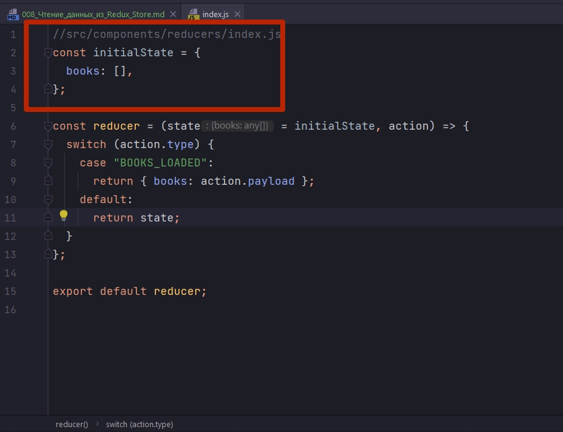
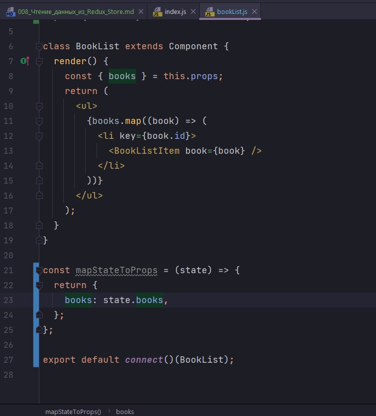
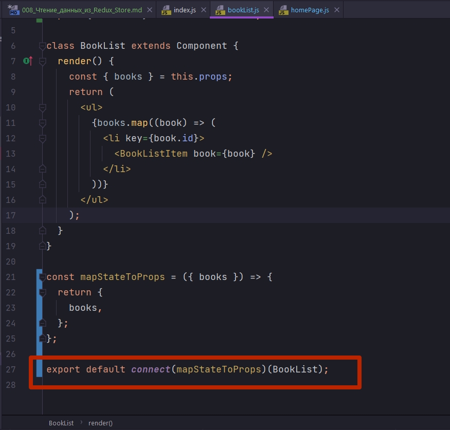
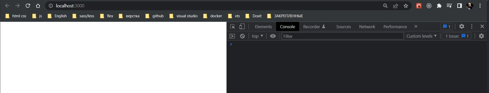
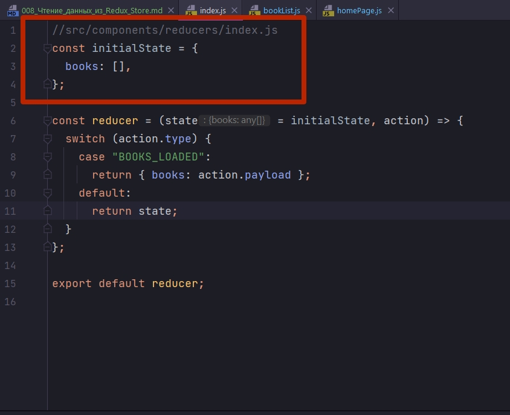
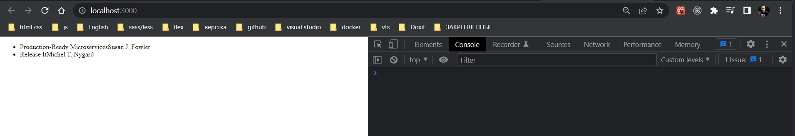
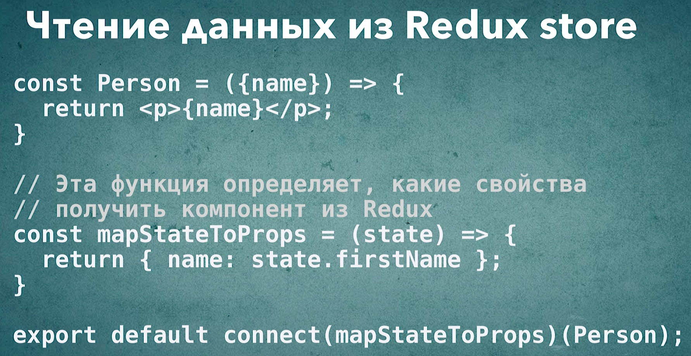

# 008_Чтение_данных_из_Redux_Store

И так мы дошли до самой интересной темы. В этом уроке мы увидим как подключить наш компонент BookList к Redux Store. И сделаем так что бы BookList Получал свои данные из Redux, и что бы BookList мог обновлять эти данные.

Конечно на прямую BookList не может получить доступ к Redux Store. Но BookList может передать туда дейсвие action и наш reducer сделает так что бы данные обновились.

В этот раз мы будем работать с настоящим компонентом, в контексте настоящего приложения, по этому это видео будет немножечко интереснее. 

Часть материала конечно будет небольшим повторением!!!

Вы наверняка помните, что бы подключить компонент к Redux Store нам нужно использовать компонент высшего порядка который называется connect.

Импортирую connect из redux в компоненте BookList. 

connect - это функция которая создает новый компонент. Для того что бы ее использовать. Для того что бы ее использовать нам нужно обернуть наш существующий компонент в функцию которую возвращает функция connect т.е. вот так, connect()(BookList). Я сам напоминаю что в первый вызов функции connect я передаю опциональные параметры, т.е. конфигурацию как именно мы хотим подключать наш BookList, а во второй вызов передаю только компонент который я хочу обработать. ВСЯ ЭТА КОНСТРУКЦИЯ ВОЗВРАЩАЕТ НОВЫЙ КОМПОНЕНТ КОТОРЫЙ УЖЕ БУДЕТ ЗНАТЬ О REDUX STORE И СМОЖЕТ РАБОТАТЬ С REDUX STORE.

НО ДЛЯ ТОГО ЧТО БЫ РАБОТАТЬ С REDUX STORE НАМ НУЖНО ОПРЕДЕЛИТЬ КОНФИГУРАЦИЮ ДЛЯ НАШЕЙ ФУНКЦИИ CONNECT.

1. ПЕРВАЯ ЧАСТЬ КОНФИГУРАЦИИ ОПИСЫВАЕТ ТО КАКИЕ ДАННЫЕ НАШ КОМПОНЕНТ ДУЛЕТ ПОЛУЧАТЬ ИЗ REDUX STORE.

Откроем функцию reducer и посмотрим на наш store.



Форма у нашего Store очень простая. У нас есть только массив books. 

Именно этот массив мы и захотим передать в наш компонент BookList.

Для того что бы это сделать нам нужно определить функцию которая называется mapStateToProps. Эта функция принимает state, и возвращает объект там где ключи - это будут названия свойств, которые мы присвоим нашему компоненту. Ну а значения это будут собственно те значения из state которые мы присвоим.



другими словами эта функция,mapStateToProps, говорит что наш компонент,BookList, нужно передать передать свойство books, а в качестве значения для этого свойства будет выступать state.books где state - это наш глобальный state из Redux Store.

Ну и конечно мы можем немного сократить написание функции mapStateToProps. Я могу сразу из state деструктурировать массив books, и раз уж ключ и значение в объекте совпадают, то я могу просто передать books.

```js
import React, { Component } from "react";
import "./BookList.css";
import BookListItem from "../bookListItem/bookListItem";
import { connect } from "react-redux";

class BookList extends Component {
  render() {
    const { books } = this.props;
    return (
      <ul>
        {books.map((book) => (
          <li key={book.id}>
            <BookListItem book={book} />
          </li>
        ))}
      </ul>
    );
  }
}

//Эта функция определяет, какие свойства
// получит компонент из Redux
const mapStateToProps = ({ books }) => {
  return {
    books,
  };
};

export default connect(mapStateToProps)(BookList);

```

Вот теперь наш компонент будет получать книги из нашего Redux Store.

В HomePage с прошлого видео удаляю все лишнее.

```js
import React from "react";
import BookList from "../bookList/bookList";

const HomePage = () => {
  return <BookList />;
};

export default HomePage;

```

Теперь в HomePage я вызываю компонент BookList без каких-либо параметров. Заметьте, HomePage импортирует все тот же BookList из файла BookList.js. Но в этот раз это не оригинальный BookList, а тот самый BookList который уже обернут функцией connect. 

Если мы вернемся в BookList и посмотрим что мы экспортируем.



Мы экспортируем не BookList, а экспортируем результат функции connect.

Запускаю приложение.



И нивижу ничего. Это потому что по умолчанию в нашем reducer initialState описан как пустой массив.



Ради теста пробую изменить initialState. Я возьму снова эти книги из нашего сервиса.

```js
//src/services/bookStoreService
import React, { Component } from "react";

class BookStoreService extends Component {
  getBookStore() {
    return [
      {
        id: 1,
        title: "Production-Ready Microservices",
        author: "Susan J. Fowler",
      },
      {
        id: 2,
        title: "Release It",
        author: "Michel T. Nygard",
      },
    ];
  }
}

export default BookStoreService;

```

```js
//src/components/reducers/index.js
const initialState = {
  books: [
    {
      id: 1,
      title: "Production-Ready Microservices",
      author: "Susan J. Fowler",
    },
    {
      id: 2,
      title: "Release It",
      author: "Michel T. Nygard",
    },
  ],
};

const reducer = (state = initialState, action) => {
  switch (action.type) {
    case "BOOKS_LOADED":
      return { books: action.payload };
    default:
      return state;
  }
};

export default reducer;

```



Теперь данные появляются в reducer, и из reducer эти данные попадут в наш bookList и отобразяться на экране.

Наш компонент bookList получил данные и смог прочитать данные из Redux Store. При этом наш компонент HomePage не знает вообще ничего откуда именно BookList будет получать данные.

Таким образом мы научились читать из Redux Store. При помощи функции mapStateToProps и функции connect, которая подключает наш компонент BookList к Redux Store



