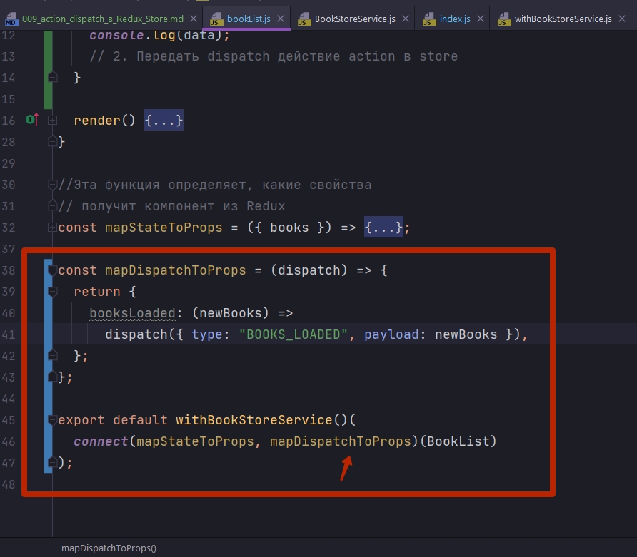

# 009_action_dispatch_в_Redux_Store

А теперь вторая часть задачи. Мы уже умеем читать из Redux Store. Самое время научится в него записывать.

Ну конечно мы не можем напрямую изменять Redux Store. Но наш компонент может передавать в Redux Store actions действия. И тогда наша функция reducer получит эти действия и сможет обновить store.

Когда BookList будет отображен на экране, мы хотим получить список книг, и передать этот список книг в Redux Store.

Для начало в BookList нам понадобится метод жизненного цикла componentDidMount. Внутри этого метода нам нужно сделать две вещи:

1. Получить данные
2. Передать dispatch действие action в store


Для того что бы получить данные нам нужно вызвать метод из сервиса. А серввис мы можем получить из контекста при помощи компонента высшего порядка который мы сами написали withBookStoreService. 

Импортирую withBookStoreService. withBookStoreService так же возвращает функцию в которую я передаю результат функции connect. Первый вызов функции так же принимает опциональные параметры.


Получается что как бы наш компонент BookList оборачивается двумя компонентамы высшего порядка. Сначало он оборачивается connect а затем withBookStoreService.

Вот сам компонент withBookStoreService

```js
//src/components/hoc/withBookStoreService.js
import React from "react";
import { BookStoreServiceConsumer } from "../bookStoreServiceContext/bookStoreServiceContext";

const withBookStoreService = () => (Wrapped) => {
  return (props) => {
    return (
      <BookStoreServiceConsumer>
        {/* Для того что бы получить данные я должен передать render функцию*/}
        {(bookStoreService) => {
          return <Wrapped {...props} bookStoreService={bookStoreService} />;
        }}
      </BookStoreServiceConsumer>
    );
  };
};
export default withBookStoreService;

```

Если мы все сделали правильно, то наш компонент сможет получить данные при момощи сервиса withBookStoreService. 

Возвращаюсь в componentDidMount. Из props получаю bookStoreService


```js
import React, { Component } from "react";
import "./BookList.css";
import BookListItem from "../bookListItem/bookListItem";
import { connect } from "react-redux";
import withBookStoreService from "../hoc/withBookStoreService";

class BookList extends Component {
    componentDidMount() {
        // 1. Получить данные
        const { bookStoreService } = this.props;
        const data = bookStoreService.getBookStore();
        console.log(data);
        // 2. Передать dispatch действие action в store
    }

    render() {
        const { books } = this.props;
        return (
            <ul>
                {books.map((book) => (
                    <li key={book.id}>
                        <BookListItem book={book} />
                    </li>
                ))}
            </ul>
        );
    }
}

//Эта функция определяет, какие свойства
// получит компонент из Redux
const mapStateToProps = ({ books }) => {
    return {
        books,
    };
};

export default withBookStoreService()(connect(mapStateToProps)(BookList));

```

Чищу reducer c прошлого видео

```js
//src/components/reducers/index.js
const initialState = {
  books: [],
};

const reducer = (state = initialState, action) => {
  switch (action.type) {
    case "BOOKS_LOADED":
      return { books: action.payload };
    default:
      return state;
  }
};

export default reducer;

```


В консоли выводятся данные которые мы получиили из сервиса.

Первую нашу задачу мы выполнили. Мы получили данные из сервиса.


Осталась вторая часть задачи. Нам нужно передать эти данные в Redux Store.

Для того что бы передать action действие в Store, нам так или иначе нужно вызвать функцию dispatch.

Для того что бы это сделать есть вторая часть конфигурации функции connect которая называется mapDispatchToProps. Давайте быстренько вспомним как рабатает mapDispatchToProps и какие формы бывают у этого второго агрумента.

У mapDispatchToProps есть две формы:

1. Его первая форма это обычная фукция которая принимает dispatch и возвращает объект где ключи это свойства properties которые мы будем присваивать нашему компоненту. Ну а значение это функция которую мы будем вызывать. Мы могли бы передать свойство booksLoaded, и в качестве значения этого свойства будет функция которая будет принимать newBooks и будет диспатчить действие с типом BOOKS_LOADED, и payload у него будет newBooks.



Компоненты высшего порядка нужно будет немного красивее оформить при помощи функции compose. Но пока что мы не реализовали эту функцию в папке utils.

mapDispatchToProps Нужно передать в качестве второго аргумента в функцию connect. 

```js
import React, { Component } from "react";
import "./BookList.css";
import BookListItem from "../bookListItem/bookListItem";
import { connect } from "react-redux";
import withBookStoreService from "../hoc/withBookStoreService";

class BookList extends Component {
  componentDidMount() {
    // 1. Получить данные
    const { bookStoreService } = this.props;
    const data = bookStoreService.getBookStore();
    console.log(data);
    // 2. Передать dispatch действие action в store
  }

  render() {
    const { books } = this.props;
    return (
      <ul>
        {books.map((book) => (
          <li key={book.id}>
            <BookListItem book={book} />
          </li>
        ))}
      </ul>
    );
  }
}

//Эта функция определяет, какие свойства
// получит компонент из Redux
const mapStateToProps = ({ books }) => {
  return {
    books,
  };
};

const mapDispatchToProps = (dispatch) => {
  return {
    booksLoaded: (newBooks) =>
      dispatch({ type: "BOOKS_LOADED", payload: newBooks }),
  };
};

export default withBookStoreService()(
  connect(mapStateToProps, mapDispatchToProps)(BookList)
);

```

Теперь у нашего компонента появится новое свойство booksLoaded. 

Теперь в componentDidMount я могу вызвать это свойство.


В booksLoaded передаю те самые данные которые мы получили из сервиса.


как видим наш код работает. И он реализует полный цикл работы с Redux Store. Сначало мы передаем в Redux Store данные. А затем когда эти данные обновляются, наш компонент отрендеривает их на экране. И это модель по которой работают все React Redux приложения.

Давайте сделаем код немного лучше. Вспомним что у нас есть замечательная функция которая называется Action Creator. И задача этой функции сделать так что бы нам не нужно было вручную создавать объекты Actions.


и задача этой функции зделать так что бы нам не пришлось вручную создавать вот эти объекты actions объекты события.

Эта функция action у нас уже создана в

```js
//src/components/actions/index.js
const booksLoaded = (newBooks) => {
  return { type: "BOOKS_LOADED", payload: newBooks };
};

export { booksLoaded };

```

Иммпортирую функцию в нашем компоненте BookList


```js
import React, { Component } from "react";
import "./BookList.css";
import BookListItem from "../bookListItem/bookListItem";
import { connect } from "react-redux";
import withBookStoreService from "../hoc/withBookStoreService";
import { booksLoaded } from "../../actions";

class BookList extends Component {
  componentDidMount() {
    // 1. Получить данные
    const { bookStoreService } = this.props;
    const data = bookStoreService.getBookStore();
    // 2. Передать dispatch действие action в store
    this.props.booksLoaded(data);
  }

  render() {
    const { books } = this.props;
    return (
      <ul>
        {books.map((book) => (
          <li key={book.id}>
            <BookListItem book={book} />
          </li>
        ))}
      </ul>
    );
  }
}

//Эта функция определяет, какие свойства
// получит компонент из Redux
const mapStateToProps = ({ books }) => {
  return {
    books,
  };
};

const mapDispatchToProps = (dispatch) => {
  return {
    booksLoaded: (newBooks) => dispatch(booksLoaded(newBooks)),
  };
};

export default withBookStoreService()(
  connect(mapStateToProps, mapDispatchToProps)(BookList)
);

```

Этот код полностью эквивалентен предыдущему.


но как вы помните мы можем пойти еще дальше. Мы можем создать дополнительную вспомогательную функцию которая называется bindActionCreators. напомню эта функция находится в пакете redux.

После импортирования bindActionCreators я могу ее использовать в mapDispatchToProps. 

Напомню функция bindActionCreators возвращает объект у которого точно такая же структура как у того объекта который мы должны вернуть из mapDispatchToProps. bindActionCreators создана лишь для того что бы хорошо работать с функцией mapDispatchToProps.

Мы возвращаем из mapDispatchToProps функцию bindActionCreators, в качестве первого аргумента которой я передаю объект с action creators которые нам будут нужны в этом компоненте. А в качестве второго аргумента мы передаем dispatch.


bindActionCreators обернет наши Action Creators и сделает так что как только мы вызываем функцию booksLoaded, она автоматически будет создавать нужное действие и передавать его в метод dispatch. Соответственно нам не нужно писать этот код вручную.

```js
import React, { Component } from "react";
import { connect } from "react-redux";
import { bindActionCreators } from "redux";
import BookListItem from "../bookListItem/bookListItem";
import withBookStoreService from "../hoc/withBookStoreService";
import { booksLoaded } from "../../actions";
import "./BookList.css";

class BookList extends Component {
  componentDidMount() {
    // 1. Получить данные
    const { bookStoreService } = this.props;
    const data = bookStoreService.getBookStore();
    // 2. Передать dispatch действие action в store
    this.props.booksLoaded(data);
  }

  render() {
    const { books } = this.props;
    return (
      <ul>
        {books.map((book) => (
          <li key={book.id}>
            <BookListItem book={book} />
          </li>
        ))}
      </ul>
    );
  }
}

//Эта функция определяет, какие свойства
// получит компонент из Redux
const mapStateToProps = ({ books }) => {
  return {
    books,
  };
};

const mapDispatchToProps = (dispatch) => {
  return bindActionCreators({ booksLoaded }, dispatch);
};

export default withBookStoreService()(
  connect(mapStateToProps, mapDispatchToProps)(BookList)
);

```


2. И теперь самое время вспомнить про альтернативный формат mapDispatchToProps. Вместо того что бы передавать функцию  mapDispatchToProps в качестве второго аргумета в функцию connect. Мы можем передать объект. Если мы вместо функции передаем объект, то этот объект попадет в качестве первого аргумента в bindActionCreators.

В mapDispatchToProps мы можем просто вернуть booksLoaded. ну а все остальное Redux сделает за нас. Обернет booksLoaded в bindActionCreators и сделает так что как только наш компонент дулет вызывать функцию booksLoaded, будет не только создаваться новое действие, но оно будет сразу передаваться в dispatch и сразу же попадать в наш store


```js
import React, { Component } from "react";
import { connect } from "react-redux";
import BookListItem from "../bookListItem/bookListItem";
import withBookStoreService from "../hoc/withBookStoreService";
import { booksLoaded } from "../../actions";
import "./BookList.css";

class BookList extends Component {
  componentDidMount() {
    // 1. Получить данные
    const { bookStoreService } = this.props;
    const data = bookStoreService.getBookStore();
    // 2. Передать dispatch действие action в store
    this.props.booksLoaded(data);
  }

  render() {
    const { books } = this.props;
    return (
      <ul>
        {books.map((book) => (
          <li key={book.id}>
            <BookListItem book={book} />
          </li>
        ))}
      </ul>
    );
  }
}

//Эта функция определяет, какие свойства
// получит компонент из Redux
const mapStateToProps = ({ books }) => {
  return {
    books,
  };
};

const mapDispatchToProps = {
  booksLoaded,
};

export default withBookStoreService()(
  connect(mapStateToProps, mapDispatchToProps)(BookList)
);

```


как видим тоже отлично работает.

Давайте еще раз посмотрим с высоты птичьего полета на то как работает компонент BookList. Потому что эта система работы, этот принцип он будет распостраняться на все остальные компоненты которые будут работать с Redux.

И так в нашем приложении мы начинаем с пустого массива в Redux Store, у нас нет ни каких книг.


Как только компонент BookList загружается, происходит несколько интересных действий


Функция connect оборачивает наш компонент BookList в компонент высшего порядка, который подключается к Redux Store. Мы конфигурируем это самое подключение при помощи функций mapStateToProps, mapDispatchToProps.

mapStateToProps - описывает то какие данные наш компонент хочет получить из Redux Store. И мы хотим получить только массив books.


mapDispatchToProps - описывает то какие действия захочет выполнить наш компонет, какие action он будет передавать в store.

Таким образом когда наш компонент появляется на экране происходит несколько действий.

Во-первых мы получаем bookStoreService из контекста 


Мы его получаем при помощи другого компонента высшего порядка withBookStoreService


И так у нас есть доступ к сервису bookStoreService, а это значит что мы можем получить данные. Мы получаем данные и сразу вызываем функцию booksLoaded. booksLoaded - это уже не обычный action creator, он не просто создает действие, а автоматически передает этот самый action в Redux Store. Мы передеем те данные котоые мы получили от сервиса в store. 


Store вызывает наш reducer, reducer получает действие BOOKS_LOADED и обновляет список книг в store ... books:action.payload


Обновленный список книг снова возвращается к нашему компоненту BookList. 

Через mapStateToProps через коллекцию books


наш компонент получает обновленный список книг и в функции render отрисовывает этот список. 

Вот такой вот жизненный цикл проходит наш компонент.


Сделаем наш код еще немного лучше. В папке utils создаю файл index.js и добавим ту самую утилиту которую мы использовали в нашем приложении StarDB. Это была функция которая называлась compose. Она позволяла нам сделать функциональную композицию из компонентов высшего порядка.

Когда мы используем функцию compose, тот код который оборачивает наш компонент в несколько компонентов высшего порядка, становится намного более удобным для чтения.

Здесь я буду использовать код из нашего прошлого проекта. Если интересно как работате функция compose, то смотрите блок там где мы создаем эту функцию.

```js
//src/utils/index.js
const compose =
  (...funcs) =>
  (component) => {
    return funcs.reduceRight((wrapped, f) => f(wrapped), component);
  };

export default compose;

```

теперь можно использовать эту функцию в BookList


```js
import React, { Component } from "react";
import { connect } from "react-redux";
import BookListItem from "../bookListItem/bookListItem";
import withBookStoreService from "../hoc/withBookStoreService";
import { booksLoaded } from "../../actions";
import compose from "../../utils";
import "./BookList.css";

class BookList extends Component {
  componentDidMount() {
    // 1. Получить данные
    const { bookStoreService } = this.props;
    const data = bookStoreService.getBookStore();
    // 2. Передать dispatch действие action в store
    this.props.booksLoaded(data);
  }

  render() {
    const { books } = this.props;
    return (
      <ul>
        {books.map((book) => (
          <li key={book.id}>
            <BookListItem book={book} />
          </li>
        ))}
      </ul>
    );
  }
}

//Эта функция определяет, какие свойства
// получит компонент из Redux
const mapStateToProps = ({ books }) => {
  return {
    books,
  };
};

const mapDispatchToProps = {
  booksLoaded,
};

export default compose(
  withBookStoreService(),
  connect(mapStateToProps, mapDispatchToProps)
)(BookList);

```


