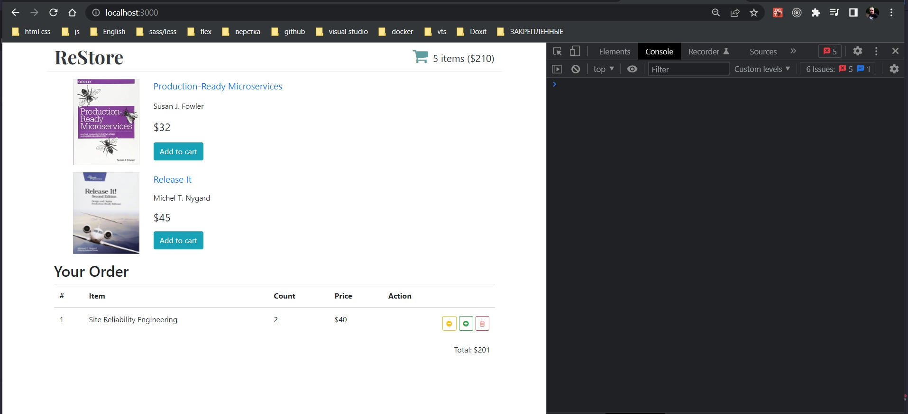

# 010_Стили_Опциональное_видео

Наш каркас маленького, но полноценного React-Redux приложения готов. Самое время сделать так что бы это приложение выглядело немножечко приятнее.

Мы не будем добавлять вообще ни какое поведение к нашим компонентам. Мы создадим каркас JSX разметку для наших компонентов и добавим необходимые стили что бы наше приложение выглядело немножечко симпатичнее.

Подключаю bootstrap

```html
<!DOCTYPE html>
<html lang="en">
<head>
    <meta charset="utf-8" />
    <meta name="viewport" content="width=device-width, initial-scale=1" />
    <link
            rel="stylesheet"
            href="https://stackpath.bootstrapcdn.com/bootstrap/4.2.1/css/bootstrap.min.css"
    />
    <link
            rel="stylesheet"
            href="https://stackpath.bootstrapcdn.com/font-awesome/4.7.0/css/font-awesome.min.css"
    />
    <link rel="preconnect" href="https://fonts.googleapis.com" />
    <link rel="preconnect" href="https://fonts.gstatic.com" crossorigin />
    <link
            href="https://fonts.googleapis.com/css?family=Playfair+Display:700"
            rel="stylesheet"
    />

    <title>ReStore</title>
</head>
<body>
<div id="root"></div>
</body>
</html>

```

Кароче подключаю [botstrapcdn.com](botstrapcdn.com) и font-awesome отсюда же, и шрифтPlayfair c google fonts.

```js
import React, { Component } from "react";
import { connect } from "react-redux";
import BookListItem from "../bookListItem/bookListItem";
import withBookStoreService from "../hoc/withBookStoreService";
import { booksLoaded } from "../../actions";
import compose from "../../utils";
import "./BookList.css";

class BookList extends Component {
  componentDidMount() {
    // 1. Получить данные
    const { bookStoreService } = this.props;
    const data = bookStoreService.getBookStore();
    // 2. Передать dispatch действие action в store
    this.props.booksLoaded(data);
  }

  render() {
    const { books } = this.props;
    return (
      <ul className="book-list">
        {books.map((book) => (
          <li key={book.id}>
            <BookListItem book={book} />
          </li>
        ))}
      </ul>
    );
  }
}

//Эта функция определяет, какие свойства
// получит компонент из Redux
const mapStateToProps = ({ books }) => {
  return {
    books,
  };
};

const mapDispatchToProps = {
  booksLoaded,
};

export default compose(
  withBookStoreService(),
  connect(mapStateToProps, mapDispatchToProps)
)(BookList);

```

```css
.book-list {
  list-style: none;
}

```

```js
import React from "react";
import { Route, Routes } from "react-router-dom";
import HomePage from "../pages/homePage";
import CartPage from "../pages/cartPage";
import "./App.css";

const App = () => {
  return (
    <main role="main" className="container">
      <Routes>
        <Route path="/" element={<HomePage />} />
        <Route path="/cart" element={<CartPage />} />
      </Routes>
    </main>
  );
};

export default App;

```

```js
import React from "react";
import "./BookListItem.css";

const BookListItem = ({ book }) => {
  const { title, author, price } = book;
  return (
    <div className="book-list-item">
      <div className="book-cover"></div>
      <div className="book-details">
        <a href="#" className="book-title">
          {title}
        </a>
        <div className="book-author">{author}</div>
        <div className="book-price">{price}</div>
      </div>
    </div>
  );
};

export default BookListItem;

```

Для того что бы наши тестовые данные были полными нам еще понадобится цена книжки и ссылка на картинку с обложкой книги. По этому я сейчас добавлю эти поля к нашим тестовым данным.

```js
//src/services/bookStoreService
import React, { Component } from "react";

class BookStoreService extends Component {
  getBookStore() {
    return [
      {
        id: 1,
        title: "Production-Ready Microservices",
        author: "Susan J. Fowler",
        price: 32,
        coverImage:
          "https://images-na.ssl-images-amazon.com/images/I/41yJ75gpV-L._SX381_BO1,204,203,200_.jpg",
      },
      {
        id: 2,
        title: "Release It",
        author: "Michel T. Nygard",
        price: 45,
        coverImage:
          "https://images-na.ssl-images-amazon.com/images/I/414CRjLjwgL._SX403_BO1,204,203,200_.jpg",
      },
    ];
  }
}

export default BookStoreService;

```

```js
import React from "react";
import "./BookListItem.css";

const BookListItem = ({ book }) => {
    const { title, author, price, coverImage } = book;
    return (
        <div className="book-list-item">
            <div className="book-cover">
                
            </div>
            <div className="book-details">
                <a href="#" className="book-title">
                    {title}
                </a>
                <div className="book-author">{author}</div>
                <div className="book-price">${price}</div>
                <button className="btn btn-info to-cart">Add to cart</button>
            </div>
        </div>
    );
};

export default BookListItem;

```

```css
.book-list-item {
  display: flex;
  margin: 15px 0px;
}

.book-list-item .book-cover {
  flex-shrink: 0;
  width: 140px;
  margin-right: 30px;
}

.book-list-item .book-cover img {
  max-width: 100%;
}
.book-list-item .book-details {
  display: flex;
  flex-direction: column;
  justify-content: space-between;
  padding-bottom: 10px;
  align-items: flex-start;
}

.book-list-item .book-details .book-title {
  font-size: 1.2rem;
}

.book-list-item .book-details .book-price {
  font-size: 1.4rem;
}

```


В нашем приложении пока что нет компонента для Header по этому прямо сейчас мы его создадим.

```js
import React from "react";
import "./shopHeader.css";

const ShopHeader = ({ numItems, total }) => {
    return (
        <header className="shop-header row">
            <a className="logo text-dark" href="#">
                ReStore
            </a>
            <a className="shopping-cart">
                <i className="cart-icon fa fa-shopping-cart" />
                {numItems} items (${total})
            </a>
        </header>
    );
};

export default ShopHeader;


```

```js
import React from "react";
import { Route, Routes } from "react-router-dom";
import HomePage from "../pages/homePage";
import CartPage from "../pages/cartPage";
import ShopHeader from "../shopHeader/shopHeader";
import "./App.css";

const App = () => {
  return (
    <main role="main" className="container">
      <ShopHeader numItems={5} total={210} />
      <Routes>
        <Route path="/" element={<HomePage />} />
        <Route path="/cart" element={<CartPage />} />
      </Routes>
    </main>
  );
};

export default App;

```


Компонент ShopHeader получился очень простым и поведения у ниго никакого нет. Добавлю css.

```css
.shop-header {
  border-bottom: 1px solid #e5e5e5;
  margin-bottom: 1rem;
  display: flex;
  justify-content: space-between;
}

.shop-header .logo {
  font-family: "PlayFair Display", Georgia, serif;
  font-size: 2.5rem;
  padding-left: 1rem;
}

.shop-header .shopping-cart {
  align-self: center;
  font-size: 1.3rem;
  padding-right: 1rem;
}

.shop-header .shopping-cart .cart-icon {
  font-size: 2.2rem;
  color: cadetblue;
  margin-right: 10px;
}

```


и последнее что нам осталось сделать это добавить компонент для отображения деталей заказа. Какие именно книги и в каком количестве заказал наш пользователь.

```js
import React from "react";

const ShoppingCartTable = () => {
  return (
    <div className="shopping-cart-table">
      <h2>Your Order</h2>
    </div>
  );
};

export default ShoppingCartTable;

```

```js
import React from "react";
import "./shoppingCartTable.css";

const ShoppingCartTable = () => {
    return (
        <div className="shopping-cart-table">
            <h2>Your Order</h2>
            <table className="table">
                <thead>
                    <tr>
                        <th>#</th>
                        <th>Item</th>
                        <th>Count</th>
                        <th>Price</th>
                        <th>Action</th>
                    </tr>
                </thead>
                <tbody>
                    <tr>
                        <td>1</td>
                        <td>Site Reliability Engineering</td>
                        <td>2</td>
                        <td>$40</td>
                        <td>
                            {" "}
                            <button className="btn btn-outline-danger btn-sm float-right">
                                <i className="fa fa-trash-o" />
                            </button>
                            <button className="btn btn-outline-success btn-sm float-right">
                                <i className="fa fa-plus-circle" />
                            </button>
                            <button className="btn btn-outline-warning btn-sm float-right">
                                <i className="fa fa-minus-circle" />
                            </button>
                        </td>
                    </tr>
                </tbody>
            </table>
            <div className="total">Total: $201</div>
        </div>
    );
};

export default ShoppingCartTable;


```

```css
.shopping-cart-table .total {
  text-align: right;
  font-size: 1rem;
  margin-right: 10px;
}

.shopping-cart-table button {
  margin-left: 5px;
  margin-top: 5px;
}

```

Обратите внимание в этот раз мы тоже отображаем коллекцию элементов, но мы не разбиваем наши компоненты на две части:

1. На List
2. И на ListItem

Все потому что в этот раз я решил использовать для верстки таблицу. А одна строка таблицы достаточно сильно связана со структурой всей остальной родительской таблицы. 

По этому если бы мы разбили бы эту разметку на два компонента, то эти бы компоненты небыли бы независимыми. Они могли бы использоваться только друг с другом. По этому здесь разбивать на два компонента на List и ListItem нет смысла.

И так у нас свами появился каркас приложения которое состоит из нескольких взаимосвязанных компонентов. Когда мы будем выполнять действие на одном из компонентов. Значения в совершенно других компонентах могут обновляться. И это идеальный кейс для того что бы показать как работает Redux и какие сильные стороны у этой маленькой библиотеки управления состоянием.




