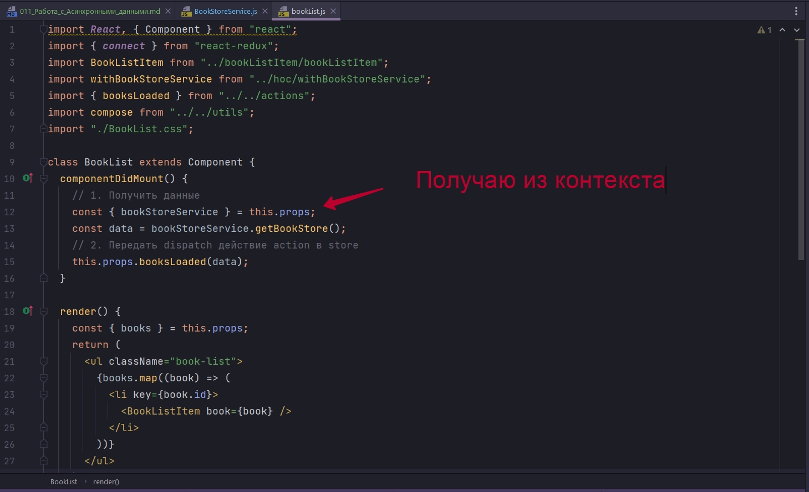
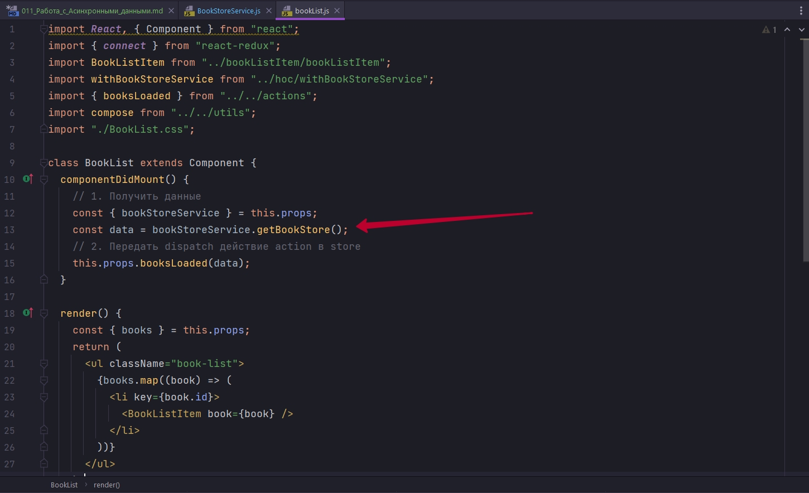
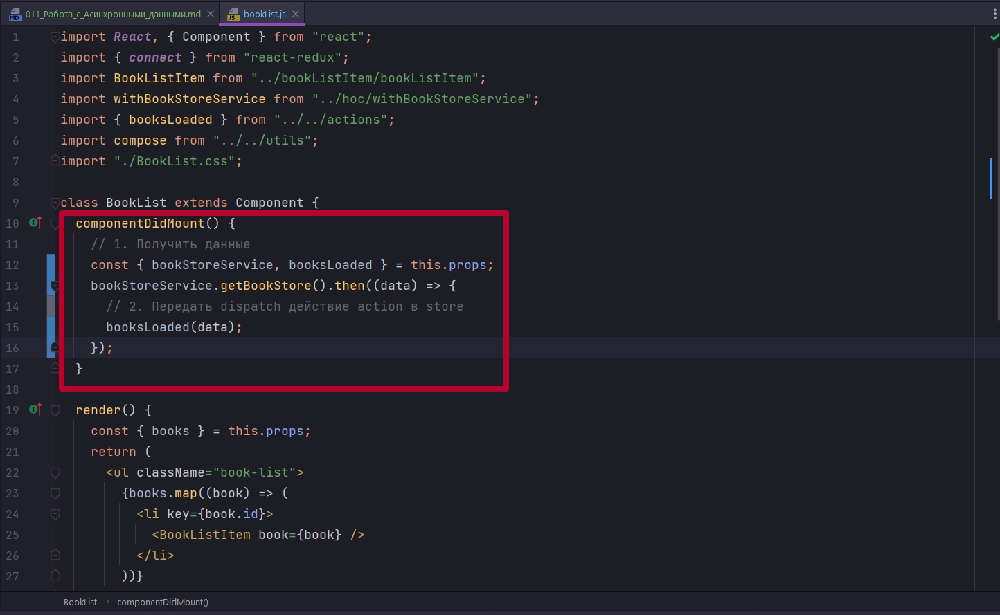
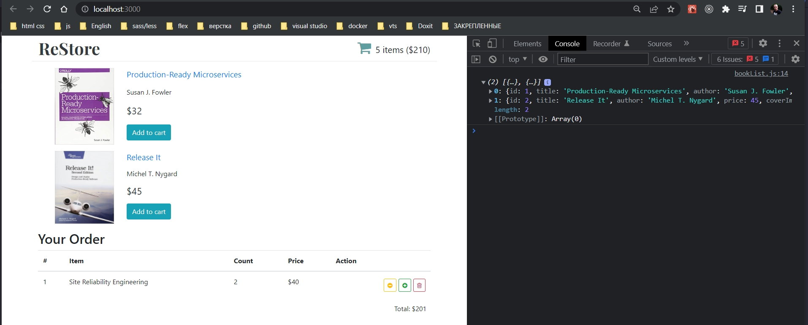
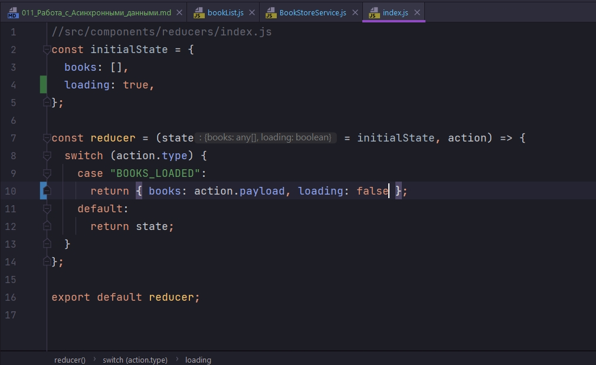
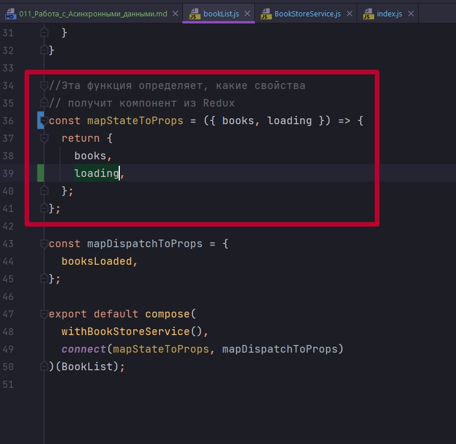
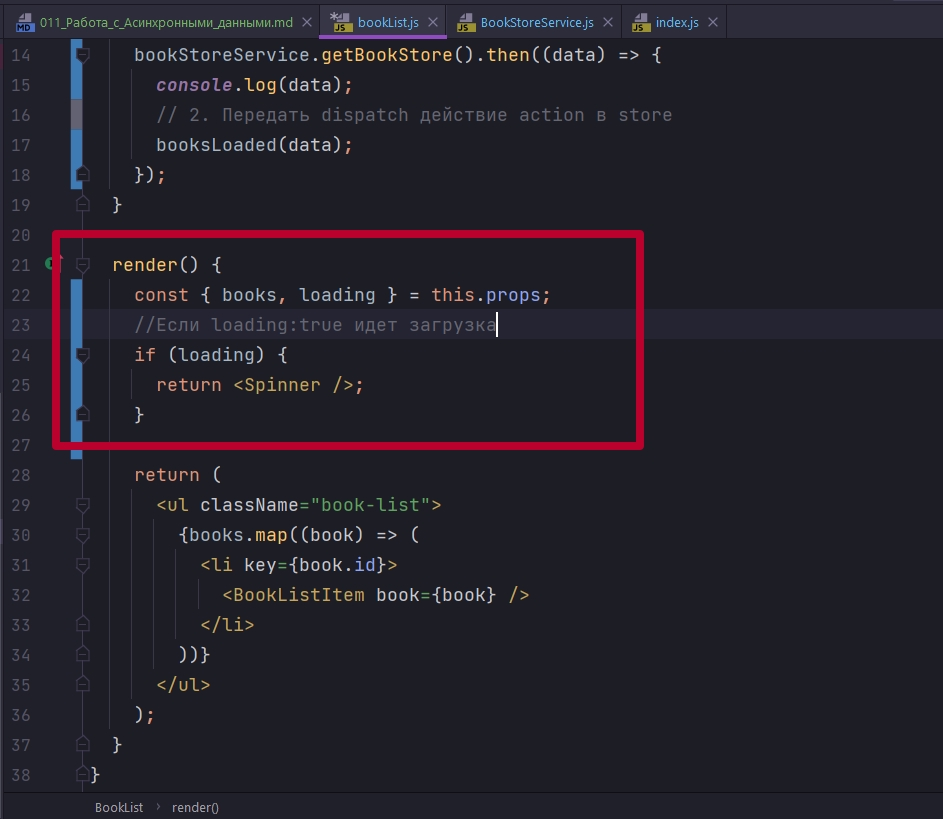
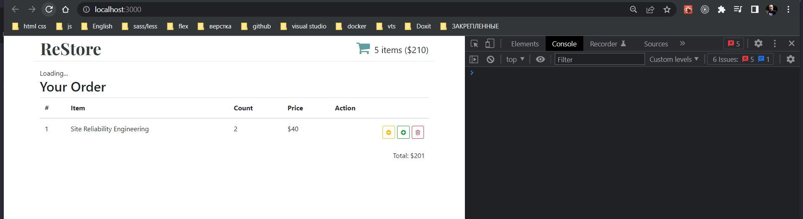

# 011_Работа_с_Асинхронными_данными

Сейчас наш BookStoreService работает не совсем так как работает обычное нормальное API. Дело в том что BookStoreService возвращает данные синхронно. А как вы знаете с настоящими API, когда мы запрашиваем данные, то данные появляются через некоторое время. И к примеру fetch возвращает не результат, не данные, а promise из кторого можно будет со временем получить сами данные.

Сделаем так что бы наш BookStoreService работал таким же образом. 

Кроме того что бы съэмитировать работу настоящего сервера я ставлю в функции getBooks небольшую задержку. 

Для начало все данные я вынесу в поле data. 

Теперь я могу обновить функцию getBooks. Она будет возвращать new Promise(). В Promise мы должны передать функцию. Эта функция принимает две функции resolve и reject. resolve мы вызываем тогда когда мы получаем данные. Reject мы можем вызвать для того что бы сказать что у нас была ошибка. Но пока что наш getBooks не будет возвращать ни каких ошибок.

```js
//src/services/bookStoreService
import React, { Component } from "react";

class BookStoreService extends Component {
    data = [
        {
            id: 1,
            title: "Production-Ready Microservices",
            author: "Susan J. Fowler",
            price: 32,
            coverImage:
                "https://images-na.ssl-images-amazon.com/images/I/41yJ75gpV-L._SX381_BO1,204,203,200_.jpg",
        },
        {
            id: 2,
            title: "Release It",
            author: "Michel T. Nygard",
            price: 45,
            coverImage:
                "https://images-na.ssl-images-amazon.com/images/I/414CRjLjwgL._SX403_BO1,204,203,200_.jpg",
        },
    ];
    getBookStore() {
        return new Promise((resolve, reject) => {
            if (resolve) {
                setTimeout(() => resolve(this.data), 700);
            } else {
                reject(() => console.log(`Что то пошло не так`));
            }
        });
    }
}

export default BookStoreService;


```

Поскольку мы изменили getBooks, нам теперь нужно изменить компонент который испольует getBooks. Это компонент BookList.

Давайте вспомним как BookList получает данные. В первую очередь мы получаем bookStoreService из контекста. 



Затем мы вызываем функцию getBooks для того что бы получить данные. Сейчас эта функция будет возвращать Promise по этому вот эту строку нам нужно будет изменить



И когда у нас есть данные мы вызываем this.props.booksLoaded() - это Action Creator который вызывает dispatch и передает данные data, передает список книг в redux store.

И затем в функции render мы получаем это список книг из redux store  и отрисовываем его на экране.

```js
import React, { Component } from "react";
import { connect } from "react-redux";
import BookListItem from "../bookListItem/bookListItem";
import withBookStoreService from "../hoc/withBookStoreService";
import { booksLoaded } from "../../actions";
import compose from "../../utils";
import "./BookList.css";

class BookList extends Component {
  componentDidMount() {
    // 1. Получить данные
    const { bookStoreService } = this.props;
    bookStoreService.getBookStore().then((data) => {
      // 2. Передать dispatch действие action в store
      this.props.booksLoaded(data);
    });
  }

  render() {
    const { books } = this.props;
    return (
      <ul className="book-list">
        {books.map((book) => (
          <li key={book.id}>
            <BookListItem book={book} />
          </li>
        ))}
      </ul>
    );
  }
}

//Эта функция определяет, какие свойства
// получит компонент из Redux
const mapStateToProps = ({ books }) => {
  return {
    books,
  };
};

const mapDispatchToProps = {
  booksLoaded,
};

export default compose(
  withBookStoreService(),
  connect(mapStateToProps, mapDispatchToProps)
)(BookList);

```

И этот код я могу сделать еще немного аккуратнее. Получаю  booksLoaded из props при помощи деструктуризации.



```js
import React, { Component } from "react";
import { connect } from "react-redux";
import BookListItem from "../bookListItem/bookListItem";
import withBookStoreService from "../hoc/withBookStoreService";
import { booksLoaded } from "../../actions";
import compose from "../../utils";
import "./BookList.css";

class BookList extends Component {
  componentDidMount() {
    // 1. Получить данные
    const { bookStoreService, booksLoaded } = this.props;
    bookStoreService.getBookStore().then((data) => {
      // 2. Передать dispatch действие action в store
      booksLoaded(data);
    });
  }

  render() {
    const { books } = this.props;
    return (
      <ul className="book-list">
        {books.map((book) => (
          <li key={book.id}>
            <BookListItem book={book} />
          </li>
        ))}
      </ul>
    );
  }
}

//Эта функция определяет, какие свойства
// получит компонент из Redux
const mapStateToProps = ({ books }) => {
  return {
    books,
  };
};

const mapDispatchToProps = {
  booksLoaded,
};

export default compose(
  withBookStoreService(),
  connect(mapStateToProps, mapDispatchToProps)
)(BookList);

```




Для того что бы отобразить LoadingIndicator нам понадобится еще одно свойство которое хранится в Redux. В функции reducer в initialState добавляю еще одно свойство loading:true поскольку в начале данные еще не загрузились и мы можем смело показывать LoadingIndicator. 



Теперь когда мы получили книги BOOKS_LOADED - это значит что книги уже загружены, и в этот момент, кроме того что мы обновляем книги, нам нужно сказать что loading теперь будет false.

```js
//src/components/reducers/index.js
const initialState = {
  books: [],
  loading: true,
};

const reducer = (state = initialState, action) => {
  switch (action.type) {
    case "BOOKS_LOADED":
      return { books: action.payload, loading: false };
    default:
      return state;
  }
};

export default reducer;

```

И даже этого маленького фрагмента кода нам будет достаточно для того что бы отобразить LoadingIndicator.

Возвращаемся в компонент BookList. У нас теперь появилось новое свойство которое нужно этому компоненту. Свойство называется loading. Добавляю loading в mapStateToProps



И теперь кусочек Redux состояния доступен нашему компоненту BookList в виде свойства props. 

И теперь мы можем обновить нашу функцию render




```js
import React, { Component } from "react";
import { connect } from "react-redux";
import BookListItem from "../bookListItem/bookListItem";
import withBookStoreService from "../hoc/withBookStoreService";
import { booksLoaded } from "../../actions";
import compose from "../../utils";
import "./BookList.css";
import Spinner from "../Spinner/Spinner";

class BookList extends Component {
  componentDidMount() {
    // 1. Получить данные
    const { bookStoreService, booksLoaded } = this.props;
    bookStoreService.getBookStore().then((data) => {
      console.log(data);
      // 2. Передать dispatch действие action в store
      booksLoaded(data);
    });
  }

  render() {
    const { books, loading } = this.props;
    //Если loading:true идет загрузка
    if (loading) {
      return <Spinner />;
    }

    return (
      <ul className="book-list">
        {books.map((book) => (
          <li key={book.id}>
            <BookListItem book={book} />
          </li>
        ))}
      </ul>
    );
  }
}

//Эта функция определяет, какие свойства
// получит компонент из Redux
const mapStateToProps = ({ books, loading }) => {
  return {
    books,
    loading,
  };
};

const mapDispatchToProps = {
  booksLoaded,
};

export default compose(
  withBookStoreService(),
  connect(mapStateToProps, mapDispatchToProps)
)(BookList);

```



В ShopHeader вместо того что бы использовать теги а, поскольку мы используем react-router-dom мы будем использовать Link

```js
import React from "react";
import { Link } from "react-router-dom";
import "./shopHeader.css";

const ShopHeader = ({ numItems, total }) => {
  return (
    <header className="shop-header row">
      <Link to="/">
        <div className="logo text-dark">ReStore</div>
      </Link>
      <Link to="/cart">
        <div className="shopping-cart">
          <i className="cart-icon fa fa-shopping-cart" />
          {numItems} items (${total})
        </div>
      </Link>
    </header>
  );
};

export default ShopHeader;

```

И здесь убираю тег а, использую span.

```js
import React from "react";
import "./BookListItem.css";

const BookListItem = ({ book }) => {
  const { title, author, price, coverImage } = book;
  return (
    <div className="book-list-item">
      <div className="book-cover">
        
      </div>
      <div className="book-details">
        <span className="book-title">{title}</span>
        <div className="book-author">{author}</div>
        <div className="book-price">${price}</div>
        <button className="btn btn-info to-cart">Add to cart</button>
      </div>
    </div>
  );
};

export default BookListItem;

```


