# 012_Отличия_setState_и_reducer

После нашего прошлого видео наш state который мы храним в redux стал немножечко сложнее. До этого мы всегда хранили максимум одно поле в state. Ну а теперь у нас два поля books и loading.

И перед тем как разрабатывать новые части нашего приложения имеет смысл рассмотреть немного детальнее чем наша функция reducer отличается от функции setState которую мы использовали в чистом React. Дело в то м что между этими двумя функциями есть одно очень важное различие.

Давайте сначало вспомним как работает setState в react. 

И давайте скажем что перед тем как мы вызываем setState наш state имеет вот такое значение

```md
React: setState()
-----------------

{a: 0, b: 0} // initial state
```

Затем в нашем приложении, возможно клика на кнопку, мы вызываем setState и мы в setState передаем вот такой объект.

```md
React: setState()
-----------------

{a: 0, b: 0} // initial state

setState({ a: 100 });

//И значения state становится
{a: 100, b: 0}

```

Т.е. когда мы вызываем setState в чистом React, React берет объект который мы передали в setState({ a: 100 }); и как бы объеденяет его с тем объектом который сейчас находится в state т.е. с {a: 0, b: 0} // initial state

таким образом наш обновленный state содержит обя поля обновленный a и тот b который был в initial state, не смотря на то что b в явном виде мы не передавали в setState. Нам не обязательно указывать другие поля из стейта когда мы работаем с чистым реактом.

Но Redux работает немножечко по другому. Теперь посмотрим как такой же код будет работать в Redux. В Redux у нас нет функции setState, но зато у нас есть функция reducer которая отвечает за то что бы обновлять наш state. Предположим у нас точно такой же initial State.


```md
React: setState()
-----------------

{a: 0, b: 0} // initial state

setState({ a: 100 });

//И значения state становится
{a: 100, b: 0}

Redux: reducer
-----------------
{a: 0, b: 0} // initial state

```

И для примера скажем что у нас есть функция reducer которая работает вот так.

```md
React: setState()
-----------------

{a: 0, b: 0} // initial state

setState({ a: 100 });

//И значения state становится
{a: 100, b: 0}

Redux: reducer
-----------------
{a: 0, b: 0} // initial state

const reducer = (state, action) =>{
return { a: 100 };
}

```

В функции reducer в не зависимости от того какой у нас был state и какой action мы пытаемся выполнить, мы всегда будем возвращать объект { a: 100 }. 

Но каким же будет результирующий state если этот reducer сработает?

И ответ может быть несколько не очевидным для React разработчиков. значение нового state будет { a: 100 }

```md
React: setState()
-----------------

{a: 0, b: 0} // initial state

setState({ a: 100 });

//И значения state становится
{a: 100, b: 0}

Redux: reducer
-----------------
{a: 0, b: 0} // initial state

const reducer = (state, action) =>{
return { a: 100 };
}
//Новый state
{ a: 100 }

```

Значение b попросту пропадет из state. Все дело в том что в Redux функция reducer должна вернуть полное состояние. Не частичное состояние, не только те ключи которые  в действительности нужно обновить, а полностью тот объект который будет новым state. И если мы вернем объект в котором есть только ключ а, в результирующем стейте у нас соответственно будет ключ а.


Если мы хотим в reducer установить ключ a: 100, а b: сохранить точно таким же как он был раньше, то мы должны написать что то вроде { a: 100, b: state.b }, и тогда результирующий state будет { a: 100, b: 0 }

```md
React: setState()
-----------------

{a: 0, b: 0} // initial state

setState({ a: 100 });

//И значения state становится
{a: 100, b: 0}

Redux: reducer
-----------------
{a: 0, b: 0} // initial state

const reducer = (state, action) =>{
return { a: 100, b: state.b };
}
//Новый state
{ a: 100, b: 0 }

```


Ну и конечно мы здесь можем использовать все техники которые мы использовали ранее для обновления объектов. К примеру мы можем использовать синтаксис Object Spreed. И взять все значения из state и затем перезаписать только значение для а.

```md
React: setState()
-----------------

{a: 0, b: 0} // initial state

setState({ a: 100 });

//И значения state становится
{a: 100, b: 0}

Redux: reducer
-----------------
{a: 0, b: 0} // initial state

const reducer = (state, action) =>{
return { ...state, a: 100 };
}
//Новый state
{ a: 100, b: 0 }

```


ИТОГ: Важное различие того как работает setState в React, и тем как работает reducer в Redux. В том что в setState можно передавать только те части объекта, те части state которые вы хотите обновить.

Но в Redux вы должны вернуть полноее состояние, полный объект state.

А теперь давайте закрепим понимание этого различия на приктике.

И так если в нашем приложении обновим страницу то мы увидим индикатор загрузки.

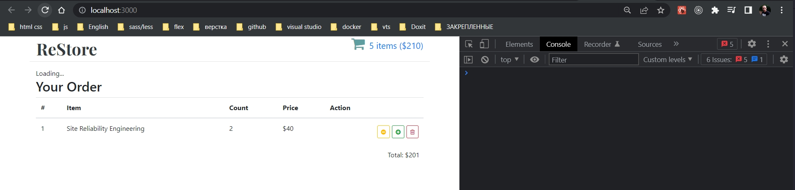

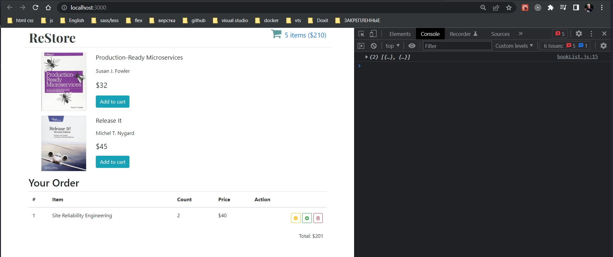

Но у нас есть еще одна страничка Cart

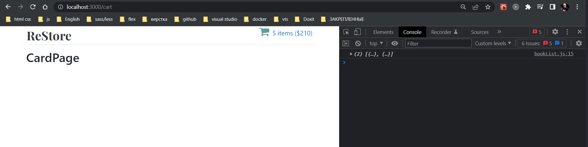

Если находясь на этой странице я нажму на ReStore, то я совершу переход на главную страницу, наш компонент BookList заново пошлетзапрос на сервер и получит свежий список книг.

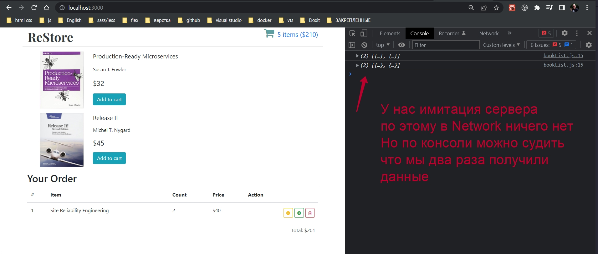

Только вот в чем проблема. Мы не отображаем LoadingIndicator когда мы второй раз переходим на ту же страницу.

Почему же это происходит?

Все очень просто, та модель store которую мы разработали в прошлом видео подразумевает что мы загружаем данные только один раз.

```js
//src/components/reducers/index.js
const initialState = {
  books: [],
  loading: true,
};

const reducer = (state = initialState, action) => {
  switch (action.type) {
    case "BOOKS_LOADED":
      return { books: action.payload, loading: false };
    default:
      return state;
  }
};

export default reducer;

```

Т.е. в самом начале у нас loading: true, после того как у нас книги загружены loading: false. И у нас больше нет ни одного действия которое вернуло бы loading снова в true.

Для того что бы мы могли отображать LoadingIndicator каждый раз когда у нас загружается список книг нам нужно добавить еще одно действие которое скажет нашему store что я начал загрузку книг. Тогда мы сможем снова вернуть loading:true.

Создаю новое действие BOOKS_REQUESTED. Поскольку мы находимся в Redux нам нужно кроме loading в явном виде передать значение books. Мы можем взять books из текущего значения state т.е. books: state.books.

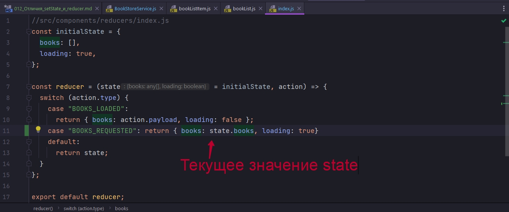

Либо, поскольку мы начинаем загружать новые книги, то старая коллекция книг нас в принципе больше не интересует. По этому мы можем сказать что books это пустой массив.

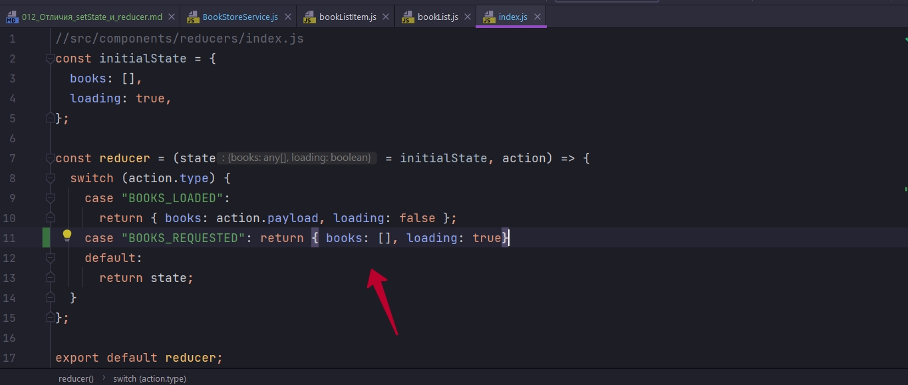

Если в результирующем объекте мы не передадим значение books, то в результирующем state books не будет вообще, значение books будет undefined.

```js
//src/components/reducers/index.js
const initialState = {
  books: [],
  loading: true,
};

const reducer = (state = initialState, action) => {
  switch (action.type) {
    case "BOOKS_LOADED":
      return { books: action.payload, loading: false };
    case "BOOKS_REQUESTED": return { books: [], loading: true}
    default:
      return state;
  }
};

export default reducer;

```

Поскольку мы добавили новое действие будет логично зайти в actions и добавить новый Action Creator

```js
//src/components/actions/index.js
const booksLoaded = (newBooks) => {
  return { type: "BOOKS_LOADED", payload: newBooks };
};

const booksRequested = () =>{
  return {type : "BOOKS_REQUESTED"}
}

export { booksLoaded, booksRequested };

```

Action Creator booksRequested совсем простой, он создает объект у которого есть только тип действия. Это все что нам нужно для того что бы установить loading в true.

И теперь когда у нс есть новый action creator мы можем использовать его в нашем компоненте BookList. Импортирую и не забываю передать action creator через mapDispatchToProps. После чего я могу перейти в componentDidMount и начать использовать новое действие booksRequested.

И затем перед тем как мы отправим запрос на получение новых книг, мы вызовем этот action creator booksRequested() и соответственно установим значение loading:true. И после этого мы начнем отображать спиннер до тех пор пока не появятся данные. 

```js
import React, { Component } from "react";
import { connect } from "react-redux";
import BookListItem from "../bookListItem/bookListItem";
import withBookStoreService from "../hoc/withBookStoreService";
import { booksLoaded, booksRequested } from "../../actions";
import compose from "../../utils";
import "./BookList.css";
import Spinner from "../Spinner/Spinner";

class BookList extends Component {
  componentDidMount() {
    // 1. Получить данные
    const { bookStoreService, booksLoaded, booksRequested } = this.props;
    //каждый раз когда будем переходить на BookList
    // c поощью action creator booksRequested будет устанавливаться loading:true
    booksRequested();
    //загрузка данных
    bookStoreService.getBookStore().then((data) => {
      console.log(data);
      // 2. Передать dispatch действие action в store
      booksLoaded(data);
    });
  }

  render() {
    const { books, loading } = this.props;
    //Если loading:true идет загрузка
    if (loading) {
      return <Spinner />;
    }

    return (
      <ul className="book-list">
        {books.map((book) => (
          <li key={book.id}>
            <BookListItem book={book} />
          </li>
        ))}
      </ul>
    );
  }
}

//Эта функция определяет, какие свойства
// получит компонент из Redux
const mapStateToProps = ({ books, loading }) => {
  return {
    books,
    loading,
  };
};

const mapDispatchToProps = {
  booksLoaded,
  booksRequested
};

export default compose(
  withBookStoreService(),
  connect(mapStateToProps, mapDispatchToProps)
)(BookList);

```

Первоначальная загрузка данных 

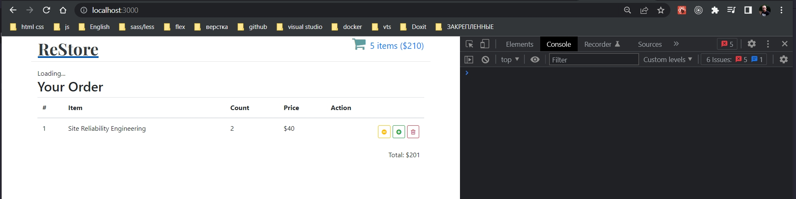

Данные загружены

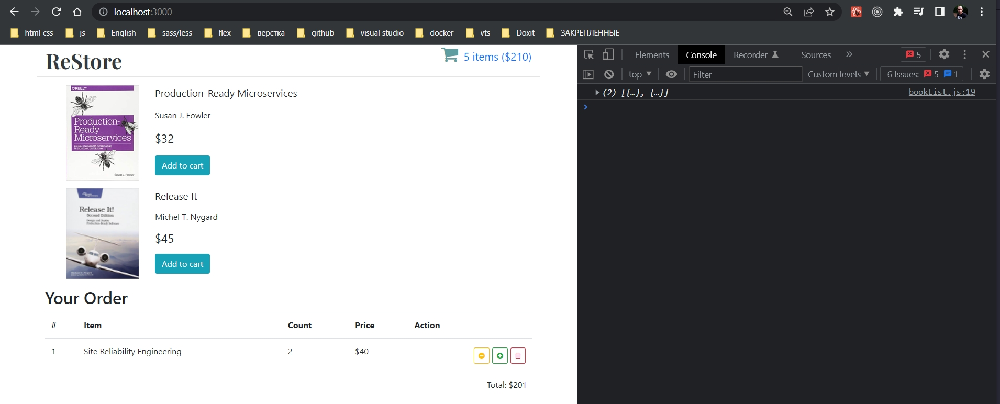

Перехожу на страницу

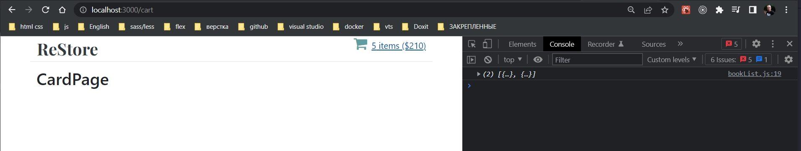

Кликаю по ReStore, Происходи переход на BookList, и снова отображается Spinner.

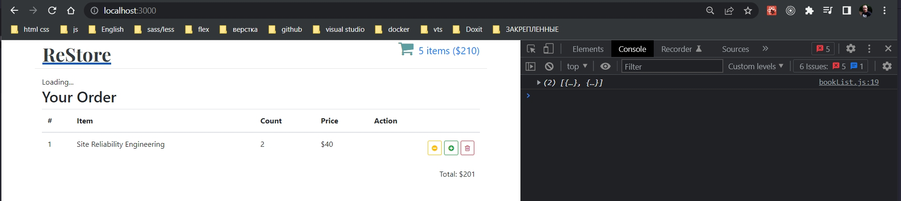


И повторная загрузка данных.

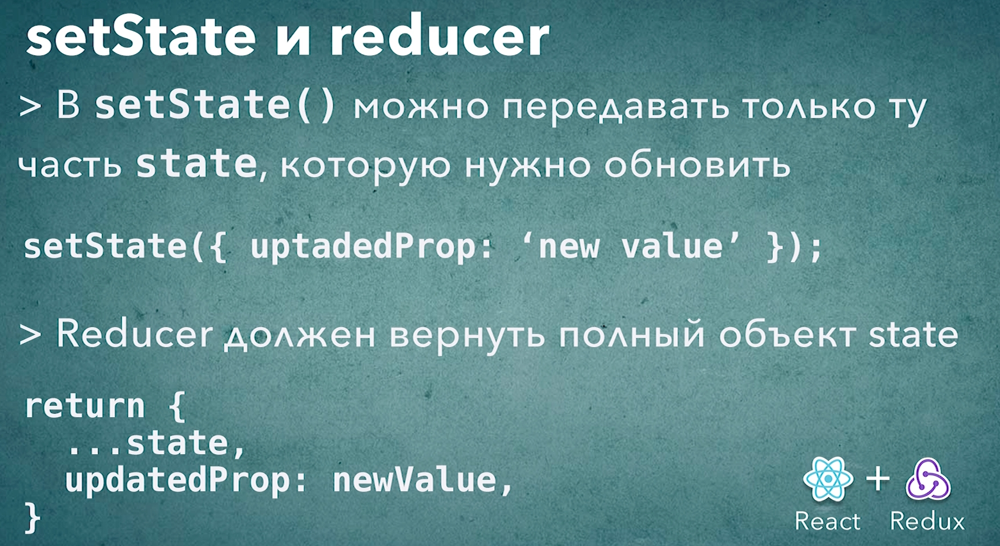

