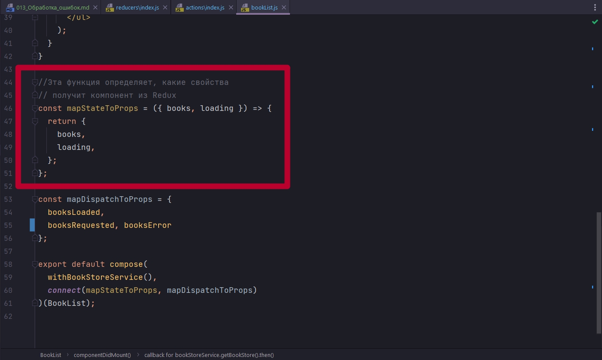
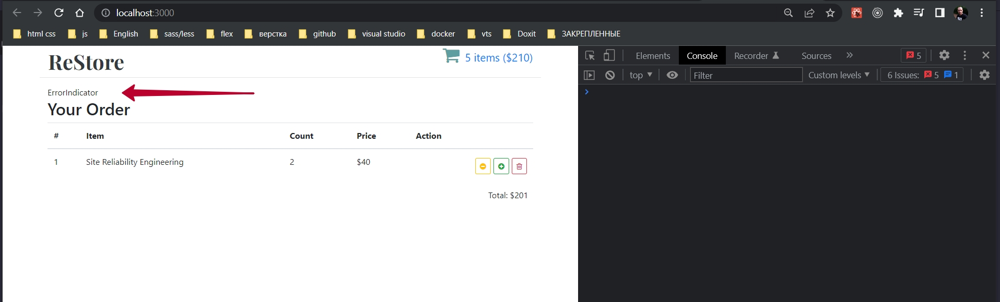
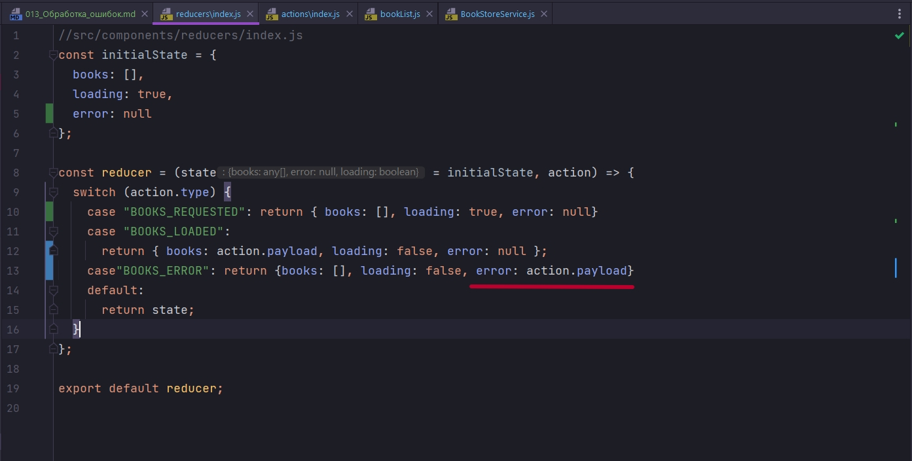
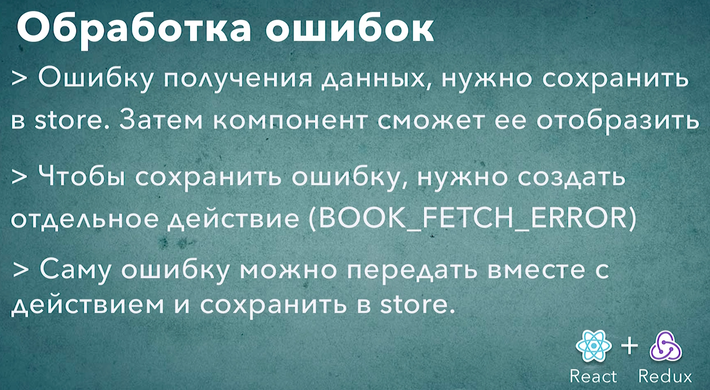

# 013_Обработка_ошибок

Для того что бы полноценно закончить работу с асинхронными данными, нам нужно разобрать как именно обрабатывать ошибки получения данных, ошибки сервиса, если вы работаете с Redux. У нас есть два типа действия

```js
//src/components/reducers/index.js
const initialState = {
    books: [],
    loading: true,
};

const reducer = (state = initialState, action) => {
    switch (action.type) {
        case "BOOKS_REQUESTED": return { books: [], loading: true}
        case "BOOKS_LOADED":
            return { books: action.payload, loading: false };
        default:
            return state;
    }
};

export default reducer;


```

BOOKS_REQUESTED, Мы говорим что мы начали загрузку данных и переставляем значение loading в true для того что бы отобразить LoadingIndicator.

Ну а второй тип действия BOOKS_LOADED. Мы диспатчим его тогда когда мы успешно получили новую коллекцию книг. Мы обновляем коллекцию books: action.payload и говорим что loading: false т.е. что LoadingIndicator нам не нужен.

По аналогии с этими двумя дейсвиями нам нужно будет добавить третье действие, которое скаже - мы попытались получить книжки, но у нас к сожалению возникла ошибка.

Добавляю этот тип действия BOOKS_ERROR. 

Что же нам нужно будет вернуть для того что бы сказать что у нас произошла ошибка?

1. Нужно вернуть books: [] - это будет пустой массив, поскольку если мы получили ошибку, значит книг у нас нет.
2. loading мы установим в false - поскольку когда мы получили ошибку это значит что загрузка завершена.
3. Кроме того этих двух значений мне нужно сохранять error - это сам объект с деталями ошибки.

Добавляем error прямо в наш state. В initialState error по умолчанию это null.

В BOOKS_REQUESTED error:null поскольку мы только начали новый запрос. Ошибок еще нет.

Если мы успешно загрузили книжки BOOKS_LOADED мы снова скажем что error:null

Т.е. error будет null во всех случаях  кроме одного - это когда нам пришла ошибка.

Ну а если у нас произошла ошибка BOOKS_ERROR то мы получим ее из action.payload.

```js
//src/components/reducers/index.js
const initialState = {
  books: [],
  loading: true,
  error: null
};

const reducer = (state = initialState, action) => {
  switch (action.type) {
    case "BOOKS_REQUESTED": return { books: [], loading: true, error: null}
    case "BOOKS_LOADED":
      return { books: action.payload, loading: false, error: null };
    case"BOOKS_ERROR": return {books: [], loading: false, error: action.payload}
    default:
      return state;
  }
};

export default reducer;

```
Теперь любой компонент в нашем приложении сможет прочитать детали той ошибки которая у нас произошла  при загрузке книг и заем решить каким именно способом отобразить эту ошибку. В нашем случае мы просто отобразим ErrorIndicator.

Теперь перехожу в actions и создаю новый Action Creator.

```js
//src/components/actions/index.js
const booksLoaded = (newBooks) => {
  return { type: "BOOKS_LOADED", payload: newBooks };
};

const booksRequested = () =>{
  return {type : "BOOKS_REQUESTED"}
}

const booksError = (error) =>{
  return {type: "BOOKS_ERROR", payload:error }
}

export { booksLoaded, booksRequested, booksError };

```

Вот такая не большая функция booksError которая принимает на вход ошибку которую мы получили от сервиса. Создает новый объект действия с типом BOOKS_ERROR. Ну и затем сохраняет наш объект с ошибкой под именем payload в объекте action.

И теперь в нашем компоненте BookList мы можем начать его тоже использовать. Импортируем Action Creator booksError. Передадим его в компонент через в mapDispatchToProps.

После чего можно перейти в componentDidMount. Достаю наш новый Action Creator booksError из props. И далее будет логично поместить его в блок catch нашего промиса.

```js
import React, { Component } from "react";
import { connect } from "react-redux";
import BookListItem from "../bookListItem/bookListItem";
import withBookStoreService from "../hoc/withBookStoreService";
import { booksLoaded, booksRequested, booksError } from "../../actions";
import compose from "../../utils";
import "./BookList.css";
import Spinner from "../Spinner/Spinner";

class BookList extends Component {
  componentDidMount() {
    // 1. Получить данные
    const { bookStoreService, booksLoaded, booksRequested, booksError } = this.props;
    //каждый раз когда будем переходить на BookList
    // c поощью action creator booksRequested будет устанавливаться loading:true
    booksRequested();
    //загрузка данных
    bookStoreService.getBookStore().then((data) => {
      console.log(data);
      // 2. Передать dispatch действие action в store
      booksLoaded(data);
    }).catch((error)=> booksError(error));
  }

  render() {
    const { books, loading } = this.props;
    //Если loading:true идет загрузка
    if (loading) {
      return <Spinner />;
    }

    return (
      <ul className="book-list">
        {books.map((book) => (
          <li key={book.id}>
            <BookListItem book={book} />
          </li>
        ))}
      </ul>
    );
  }
}

//Эта функция определяет, какие свойства
// получит компонент из Redux
const mapStateToProps = ({ books, loading }) => {
  return {
    books,
    loading,
  };
};

const mapDispatchToProps = {
  booksLoaded,
  booksRequested, booksError
};

export default compose(
  withBookStoreService(),
  connect(mapStateToProps, mapDispatchToProps)
)(BookList);

```

Теперь наш компонент умеет обрабатывать ошибки и передавать в store новое действие BOOKS_ERROR. И теперь глобальный state из redux будет сохранять детали этой ошибки, и если она произойдет. 

Конечно для того что бы закончить этот код нам нужно обновить функцию render для того что бы она учитывала что у нас может быть ошибка. И в случае если ошибка действительно появилась, она отображала ErrorIndicator.

Для начало вернусь к нашей функции mapStateToProps и mapDispatchToProps. 

Пока что в mapStateToProps в наш компонент мы передаем books и loading. Т.е. читаю из store.



И для того что бы наш компонент знал стоит ли ему отображать ошибку ему нужно передать еще значение error.

И после чего пишу условие в render.

```js
import React, { Component } from "react";
import { connect } from "react-redux";
import BookListItem from "../bookListItem/bookListItem";
import withBookStoreService from "../hoc/withBookStoreService";
import { booksLoaded, booksRequested, booksError } from "../../actions";
import compose from "../../utils";
import "./BookList.css";
import Spinner from "../Spinner/Spinner";
import ErrorIndicator from "../ErrorIndicator/ErrorIndicator";

class BookList extends Component {
  componentDidMount() {
    // 1. Получить данные
    const { bookStoreService, booksLoaded, booksRequested, booksError } = this.props;
    //каждый раз когда будем переходить на BookList
    // c поощью action creator booksRequested будет устанавливаться loading:true
    booksRequested();
    //загрузка данных
    bookStoreService.getBookStore().then((data) => {
      console.log(data);
      // 2. Передать dispatch действие action в store
      booksLoaded(data);
    }).catch((error)=> booksError(error));
  }

  render() {
    const { books, loading, error } = this.props;
    //Если loading:true идет загрузка
    if (loading) {
      return <Spinner />;
    }

    if(error){
      return <ErrorIndicator />
    }

    return (
      <ul className="book-list">
        {books.map((book) => (
          <li key={book.id}>
            <BookListItem book={book} />
          </li>
        ))}
      </ul>
    );
  }
}

//Эта функция определяет, какие свойства
// получит компонент из Redux
const mapStateToProps = ({ books, loading, error }) => {
  return {
    books,
    loading,
    error
  };
};

//Передаю значения в store
const mapDispatchToProps = {
  booksLoaded,
  booksRequested, booksError
};

export default compose(
  withBookStoreService(),
  connect(mapStateToProps, mapDispatchToProps)
)(BookList);

```

Теперь обновим наш сервис так, что бы он возвращал ошибку.

```js
//src/services/bookStoreService
import { Component } from "react";

class BookStoreService extends Component {
  data = [
    {
      id: 1,
      title: "Production-Ready Microservices",
      author: "Susan J. Fowler",
      price: 32,
      coverImage:
        "https://images-na.ssl-images-amazon.com/images/I/41yJ75gpV-L._SX381_BO1,204,203,200_.jpg",
    },
    {
      id: 2,
      title: "Release It",
      author: "Michel T. Nygard",
      price: 45,
      coverImage:
        "https://images-na.ssl-images-amazon.com/images/I/414CRjLjwgL._SX403_BO1,204,203,200_.jpg",
    },
  ];
  getBookStore() {
    return new Promise((resolve, reject) => {
        setTimeout(() => {
          // resolve(this.data)
          reject(new Error('Something bad happened'))
        }, 7000);
    });
  }
}

export default BookStoreService;

```



ИТОГ: Для того что бы отображать ошибки нам нужно их где-то сохранять. И это где-то наш глобальный state который управляется Redux.

```js
//src/components/reducers/index.js
const initialState = {
  books: [],
  loading: true,
  error: null
};

const reducer = (state = initialState, action) => {
  switch (action.type) {
    case "BOOKS_REQUESTED": return { books: [], loading: true, error: null}
    case "BOOKS_LOADED":
      return { books: action.payload, loading: false, error: null };
    case"BOOKS_ERROR": return {books: [], loading: false, error: action.payload}
    default:
      return state;
  }
};

export default reducer;

```
По этому в глобальный state, initialState мы добавляем новое поле error: null. 

Мы не заьываем обнулять это поле когда делаем новый запрос BOOKS_REQUESTED, или когда к нам приходит успешный ответ BOOKS_LOADED


У нас появляется новое действие ошибка получения данных  BOOKS_ERROR. И в этом действии мы передаем в payload объект ошибку.



Затем наши компоненты смогут взять эти детали и показать соотвествующее сообщение об ошибке.


Ну и конечно что бы весь этот механизм заработал нам нужно было добавить новый Action Creator.

```js
//src/components/actions/index.js
const booksLoaded = (newBooks) => {
  return { type: "BOOKS_LOADED", payload: newBooks };
};

const booksRequested = () =>{
  return {type : "BOOKS_REQUESTED"}
}

const booksError = (error) =>{
  return {type: "BOOKS_ERROR", payload:error }
}

export { booksLoaded, booksRequested, booksError };

```

Мы добавили новый Action Creator booksError и экспортировали его для использования в компонентах.

Наш компонент использует Action Creator в componentDidMount. Когда наш promise getBooks возвращает ошибку, мы в блоке catch диспатчим booksError(error) в который передаем объект с ошибкой в Action Creator.

```js
import React, { Component } from "react";
import { connect } from "react-redux";
import BookListItem from "../bookListItem/bookListItem";
import withBookStoreService from "../hoc/withBookStoreService";
import { booksLoaded, booksRequested, booksError } from "../../actions";
import compose from "../../utils";
import "./BookList.css";
import Spinner from "../Spinner/Spinner";
import ErrorIndicator from "../ErrorIndicator/ErrorIndicator";

class BookList extends Component {
  componentDidMount() {
    // 1. Получить данные
    const { bookStoreService, booksLoaded, booksRequested, booksError } = this.props;
    //каждый раз когда будем переходить на BookList
    // c поощью action creator booksRequested будет устанавливаться loading:true
    booksRequested();
    //загрузка данных
    bookStoreService.getBookStore().then((data) => {
      console.log(data);
      // 2. Передать dispatch действие action в store
      booksLoaded(data);
    }).catch((error)=> booksError(error));
  }

  render() {
    const { books, loading, error } = this.props;
    //Если loading:true идет загрузка
    if (loading) {
      return <Spinner />;
    }

    if(error){
      return <ErrorIndicator />
    }

    return (
      <ul className="book-list">
        {books.map((book) => (
          <li key={book.id}>
            <BookListItem book={book} />
          </li>
        ))}
      </ul>
    );
  }
}

//Эта функция определяет, какие свойства
// получит компонент из Redux
const mapStateToProps = ({ books, loading, error }) => {
  return {
    books,
    loading,
    error
  };
};

//Передаю значения в store
const mapDispatchToProps = {
  booksLoaded,
  booksRequested, booksError
};

export default compose(
  withBookStoreService(),
  connect(mapStateToProps, mapDispatchToProps)
)(BookList);

```

Этот action передается в наш reducer, reducer обновляет соответствующее поле и затем в нашем компоненте мы можем прочитать значение поля error и отобразить ErrorIndicator.




 
