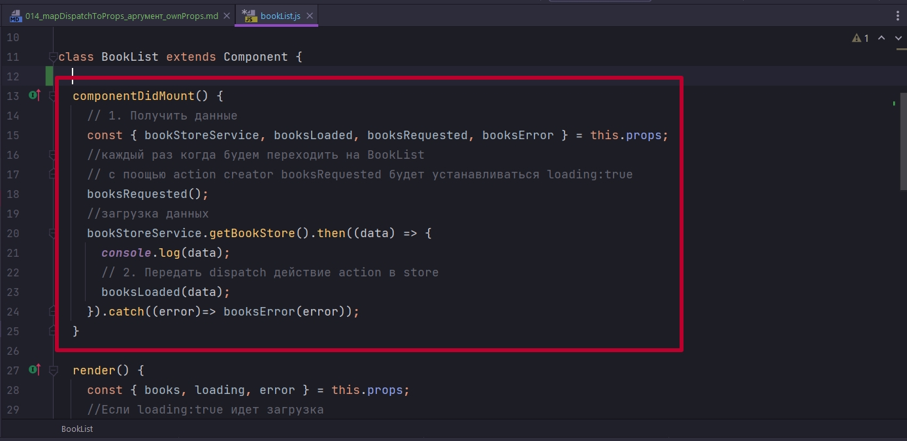

# 014_mapDispatchToProps_аргумент_ownProps

Перед тем как продолжать разработку этого приложения я предлагаю посмотреть на код компонента BookList и подумать, быть может мы сможем сделать этот код немножечко аккуратнее или структурировать его немножечко лучше.

```js
import React, { Component } from "react";
import { connect } from "react-redux";
import BookListItem from "../bookListItem/bookListItem";
import withBookStoreService from "../hoc/withBookStoreService";
import { booksLoaded, booksRequested, booksError } from "../../actions";
import compose from "../../utils";
import "./BookList.css";
import Spinner from "../Spinner/Spinner";
import ErrorIndicator from "../ErrorIndicator/ErrorIndicator";

class BookList extends Component {
  componentDidMount() {
    // 1. Получить данные
    const { bookStoreService, booksLoaded, booksRequested, booksError } = this.props;
    //каждый раз когда будем переходить на BookList
    // c поощью action creator booksRequested будет устанавливаться loading:true
    booksRequested();
    //загрузка данных
    bookStoreService.getBookStore().then((data) => {
      console.log(data);
      // 2. Передать dispatch действие action в store
      booksLoaded(data);
    }).catch((error)=> booksError(error));
  }

  render() {
    const { books, loading, error } = this.props;
    //Если loading:true идет загрузка
    if (loading) {
      return <Spinner />;
    }

    if(error){
      return <ErrorIndicator />
    }

    return (
      <ul className="book-list">
        {books.map((book) => (
          <li key={book.id}>
            <BookListItem book={book} />
          </li>
        ))}
      </ul>
    );
  }
}

//Эта функция определяет, какие свойства
// получит компонент из Redux
const mapStateToProps = ({ books, loading, error }) => {
  return {
    books,
    loading,
    error
  };
};

//Передаю значения в store
const mapDispatchToProps = {
  booksLoaded,
  booksRequested, booksError
};

export default compose(
  withBookStoreService(),
  connect(mapStateToProps, mapDispatchToProps)
)(BookList);

```

Давайте посмотрим внимательнее на метод componentDidMount.



Для того что бы этот код сработал мы добавляем аж четыре зависимости к нашему компоненту  bookStoreService, booksLoaded, booksRequested, booksError.

А далее по суте наш метод componentDidMount реализует логику получения данных и обработки ошибок для получения коллекции книг.


Но на самом деле всю эту функциональность, весь этот код, будет довольно сложно назвать прямой обязанностью компонента. Ведь в действительности все что нужно знать этому компоненту это вот эти методы которые мы используем в методе render а именно books, loading, error


Именно на основании books, loading, error работает логика отрисовки нашего компонента.

Давайте посмотрим получится ли у нас вынести вот эту логику 


логику получения данных и обработки ошибок из компонента. В идеальном случае мне бы хотелось что бы наш компонент принимал одно свойство через props, к примеру функцию которая называлась бы fetchBooks. И вызывая эту функцию наш компонент запускал бы логику получения данных.

Ну а затем за что единственное отвечал бы наш компонент это за рендеринг.


Давайте посмотрим как написать такую функцию и самое главное где бы мы могли ее написать?

Давайте еще раз посмотрим на свойство mapStateToProps и mapDispatchToProps которые мы передаем в функцию connect.


mapStateToProps берет части нашего глобального стейта { books, loading, error } и передает эти части в качестве свойств нашему компоненту


mapDispatchToProps делает тоже самое, только вместо что бы работать со state, он работает с функцией dispatch и передает в наш компонент другие функции. Прямо сейчас мы передаем в наш компонент объект с Action Creators а именно  booksLoaded,
booksRequested, booksError. И функция connect делает так что когда мы вызываем один из Action Creators в действительности вызывается функция dispatch в которую передается объект который создал наш Action Creator. 

Но мы с вами решили что наш компонент не должен знать слишком много про процесс получения данных и мы не хотим ему передавать вот эти Action Creators. Вместо этого мы хотим передать ему функцию.

Давайте вспомним. mapDispatchToProps имеет еще и функциональную форму.

Т.е. это может быть функция которя принимает метод dispatch и возвращает эта функция объект. В качестве ключей мы передаем название свойств которые получит наш компонент. Мы решили что хотим передать функцию которая называется fetchBooks. В качестве значения может быть не только Action Creators ну и вообще любая функция которая делает все что угодно


```js
import React, { Component } from "react";
import { connect } from "react-redux";
import BookListItem from "../bookListItem/bookListItem";
import withBookStoreService from "../hoc/withBookStoreService";
import { booksLoaded, booksRequested, booksError } from "../../actions";
import compose from "../../utils";
import "./BookList.css";
import Spinner from "../Spinner/Spinner";
import ErrorIndicator from "../ErrorIndicator/ErrorIndicator";

class BookList extends Component {
  componentDidMount() {
    this.props.fetchBooks()
    // // 1. Получить данные
    // const { bookStoreService, booksLoaded, booksRequested, booksError } = this.props;
    //
    // //каждый раз когда будем переходить на BookList
    // // c поощью action creator booksRequested будет устанавливаться loading:true
    // booksRequested();
    // //загрузка данных
    // bookStoreService.getBookStore().then((data) => {
    //   console.log(data);
    //   // 2. Передать dispatch действие action в store
    //   booksLoaded(data);
    // }).catch((error)=> booksError(error));
  }

  render() {
    const { books, loading, error } = this.props;
    //Если loading:true идет загрузка
    if (loading) {
      return <Spinner />;
    }

    if(error){
      return <ErrorIndicator />
    }

    return (
      <ul className="book-list">
        {books.map((book) => (
          <li key={book.id}>
            <BookListItem book={book} />
          </li>
        ))}
      </ul>
    );
  }
}

//Эта функция определяет, какие свойства
// получит компонент из Redux
const mapStateToProps = ({ books, loading, error }) => {
  //передаю свойства из глобального state в компонент
  // далее в компоненте достаю их из props
  return {
    books,
    loading,
    error
  };
};

//Передаю значения в store
const mapDispatchToProps = (dispatch)=>{
  return {
    fetchBooks: () =>{
      console.log('Fetching books')
    }
  }
}
export default compose(
  withBookStoreService(),
  connect(mapStateToProps, mapDispatchToProps)
)(BookList);

```


Это значит что наша функция fetchBooks отлично перешла в наш компонент и наш компонент вызвал ее в componentDidMount. Но поскольку эта функция ничего не делает, то состояние не изменяется и компонент будет вечно показывать нам loading...

Это значит что в fetchBooks мы могли бы перенести ту же логику, которую мы до этого писали внутри компонента.

Но перед тем как использовать код из функции fetchBooks нам нужно его немножечко отредактировать. 

Во-первых booksRequested сейчас это обычный Action Creator т.е. он не связан с dispatch. По этому для того что бы он сработал нам нужно вызвать dispatch и затем передать результат booksRequested. Тоже самое с booksLoaded и точно так же с booksError.


Но осталась одна большая проблема!!! Где нам взять bookStoreService? Ведь когда мы работали в компоненте мы использовали компонент высшего порядка withBookStoreService. Он передаваля в качестве props нашему компоненту. А прямо сейчас мы находимся не в компоненте а в функции mapDispatchToProps которая в принципе с компонентом то не связана.

Как же нам теперь из компонента получить bookStoreService?

Давайте еще раз посмотрим на вот этот блок кода.


Когда мы создаем компонент мы возвращаем композицию из двух компонентов высшего порядка. Первый компонент высшего порядка это withBookStoreService, а второй компонент высшего порядка это connect.

Другими словами сначало наш компонент оборачивается в connect, а затем он оборачивается в withBookStoreService.

Именно такая иерархия получится у наших компонентов если бы мы рассматривали бы их структуру. На самом верхнем уровне withBookStoreService. Все что добавляет withBookStoreService будет доступно компоненту connect. Все что добавляет компонент connect будет в результате доступно компоненту BookList. 

Если withBookStoreService добавляет новое свойство нашему компоненту, то это свойство уже должно быть доступно компонету который создается функцией connect.

и остается один едиственный вопрос. А как же это свойство получить?

И для того что бы получить эти свойства есть второй аргумент у функции mapDispatchToProps, ну и в принципе у mapDispatchToProps тоже есть это свойство, которое называется ownProps.

ownProps - это как раз те свойства которые перешли  вот этому компоненту   connect(mapStateToProps, mapDispatchToProps), компоненту который создает connect.

Другими словами в ownProps у нас будет тот сервис withBookStoreService(), который мы хотим получить из этого компонента высшего порядка.

Все что мне нужно сделать это получить   const {bookStoreService} = ownProps


```js
import React, { Component } from "react";
import { connect } from "react-redux";
import BookListItem from "../bookListItem/bookListItem";
import withBookStoreService from "../hoc/withBookStoreService";
import { booksLoaded, booksRequested, booksError } from "../../actions";
import compose from "../../utils";
import "./BookList.css";
import Spinner from "../Spinner/Spinner";
import ErrorIndicator from "../ErrorIndicator/ErrorIndicator";

class BookList extends Component {
  componentDidMount() {
    this.props.fetchBooks()
  }

  render() {
    const { books, loading, error } = this.props;
    //Если loading:true идет загрузка
    if (loading) {
      return <Spinner />;
    }

    if(error){
      return <ErrorIndicator />
    }

    return (
      <ul className="book-list">
        {books.map((book) => (
          <li key={book.id}>
            <BookListItem book={book} />
          </li>
        ))}
      </ul>
    );
  }
}

//Эта функция определяет, какие свойства
// получит компонент из Redux
const mapStateToProps = ({ books, loading, error }) => {
  //передаю свойства из глобального state в компонент
  // далее в компоненте достаю их из props
  return {
    books,
    loading,
    error
  };
};

//Передаю значения в store
const mapDispatchToProps = (dispatch, ownProps)=>{
  const {bookStoreService} = ownProps
  return {
    fetchBooks: () =>{
     dispatch(booksRequested()) ;
      //загрузка данных
      bookStoreService.getBookStore().then((data) => {
        console.log(data);
        // 2. Передать dispatch действие action в store
        dispatch(booksLoaded(data));
      }).catch((error)=> dispatch(booksError(error)) );
    }
  }
}
export default compose(
  withBookStoreService(),
  connect(mapStateToProps, mapDispatchToProps)
)(BookList);

```

И так долгое время получал ошибку не понимая что происходит. Оказывается в прошлом видео разбирал как обрабатывать ошибки в котором в BookStoreService в функции getBookStore я намеренно получал ошибку. Теперь все исправил

```js
//src/services/bookStoreService
import { Component } from "react";

class BookStoreService extends Component {
  data = [
    {
      id: 1,
      title: "Production-Ready Microservices",
      author: "Susan J. Fowler",
      price: 32,
      coverImage:
        "https://images-na.ssl-images-amazon.com/images/I/41yJ75gpV-L._SX381_BO1,204,203,200_.jpg",
    },
    {
      id: 2,
      title: "Release It",
      author: "Michel T. Nygard",
      price: 45,
      coverImage:
        "https://images-na.ssl-images-amazon.com/images/I/414CRjLjwgL._SX403_BO1,204,203,200_.jpg",
    },
  ];
  getBookStore() {
    return new Promise((resolve) => {
      setTimeout(() => {
        resolve(this.data);
      }, 700);
    });
  }
}

export default BookStoreService;

```


Повторим как получилось реализовать этот рефакторинг. Мы вынесли весь код, всю логику получения, обработки данных из componentDidMount в отдельную функцию, которую мы создали в mapDispatchToProps.

Мы изменили mapDispatchToProps, до этого это был объект, а теперь мы сделали из mapDispatchToProps функцию. Это позволило нам получить прямой доступ к методу dispatch и кроме того к свойству ownProps.

ownProps - это свойство нашего компонента, которое он получил сверху от других компонентов. 

В нашем случае компонент который находится сверху это withBookStoreService. 

Другими словами мы в ownProps мы получим наш bookStoreService из контекста. Ну и после этого внутри функции fetchBooks мы сможем использовать bookStoreService.


