# 015_Naming_Convention_для_действий

Давайте дальше продолжим делать структуру нашего кода немножечко лучше.

Если мы посмотрим на эту функцию которую мы создали в прошлом видео fetchBooks.

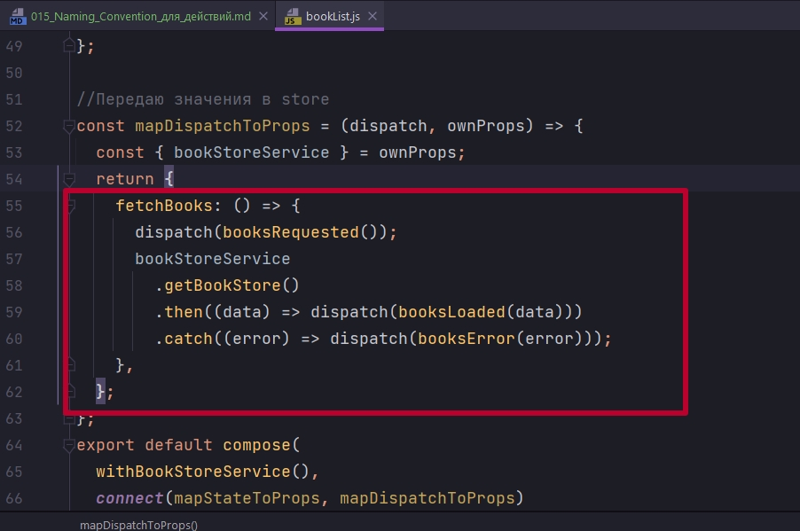

```js
import React, { Component } from "react";
import { connect } from "react-redux";
import BookListItem from "../bookListItem/bookListItem";
import withBookStoreService from "../hoc/withBookStoreService";
import { booksLoaded, booksRequested, booksError } from "../../actions";
import compose from "../../utils";
import "./BookList.css";
import Spinner from "../Spinner/Spinner";
import ErrorIndicator from "../ErrorIndicator/ErrorIndicator";

class BookList extends Component {
  componentDidMount() {
    this.props.fetchBooks();
  }

  render() {
    const { books, loading, error } = this.props;
    //Если loading:true идет загрузка
    if (loading) {
      return <Spinner />;
    }

    if (error) {
      return <ErrorIndicator />;
    }

    return (
      <ul className="book-list">
        {books.map((book) => (
          <li key={book.id}>
            <BookListItem book={book} />
          </li>
        ))}
      </ul>
    );
  }
}

//Эта функция определяет, какие свойства
// получит компонент из Redux
const mapStateToProps = ({ books, loading, error }) => {
  //передаю свойства из глобального state в компонент
  // далее в компоненте достаю их из props
  return {
    books,
    loading,
    error,
  };
};

//Передаю значения в store
const mapDispatchToProps = (dispatch, ownProps) => {
  const { bookStoreService } = ownProps;
  return {
    fetchBooks: () => {
      dispatch(booksRequested());
      bookStoreService
        .getBookStore()
        .then((data) => dispatch(booksLoaded(data)))
        .catch((error) => dispatch(booksError(error)));
    },
  };
};
export default compose(
  withBookStoreService(),
  connect(mapStateToProps, mapDispatchToProps)
)(BookList);

```

Становится ясно что функция fetchBooks может быть переиспользована и другими компонентами которым теоретически может захотеться получать список книг. Код который сейчас написан в fetchBooks это общий процесс получения книг который будет работать в нашем приложении.

И поскольку этот процесс напрямую связан с Redux и Action Creators, будет логично перенести fetchBooks в Actions. Не смотря на то что функция fetchBooks не является Action Creator в чистом смысле, эта функция используется только тогда когда и только там где используется Action Creators. По этому вполне допустимо будет положить эту функцию в actions/index.js

И так переношу fetchBooks, делаю ее функцией 

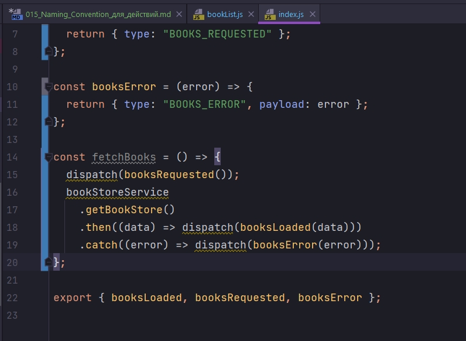

fetchBooks должна нам возвращать другую функцию. Для того что бы эта функция работала нам нужны аргументы dispatch и bookStoreService. Оборачиваю эту функцию в другую функцию и в аргументами передаю bookStoreService, dispatch

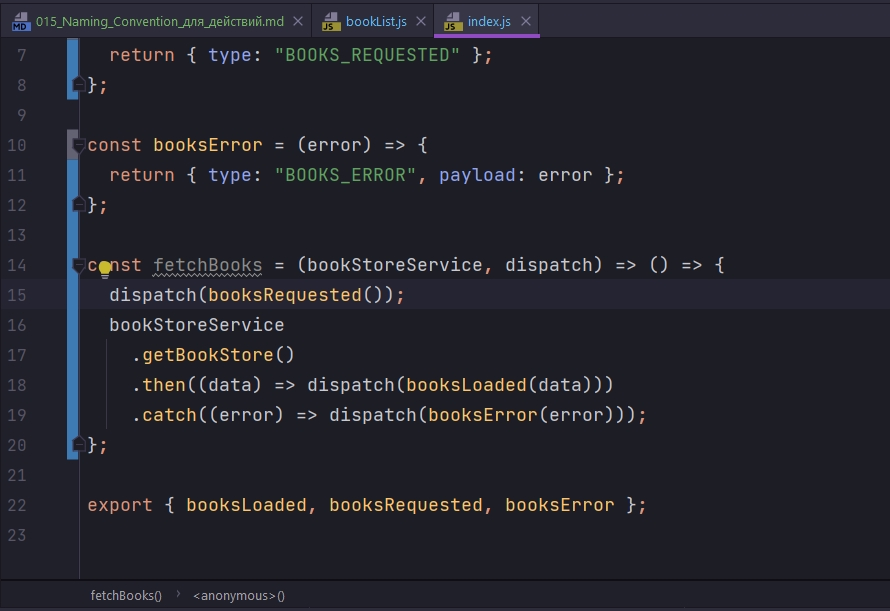

Почему я не могу передать эти параметры bookStoreService, dispatch во вторую функцию 

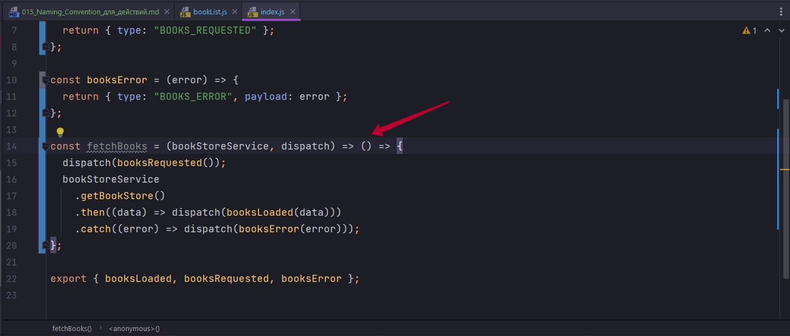

Да все потому что я не хочу что бы наша функция напрямую зависела от этих параметров. Наш компонент должен просто вызвать функцию fetchBooks, без каких либо аргументов и запустить процесс получения книг. А остальные параметры bookStoreService, dispatch не должны касаться нашего компонента. Именно по этому fetchBooks у нас будет функция которая возвращает функцию. Внутренняя функция предназначена для компонента

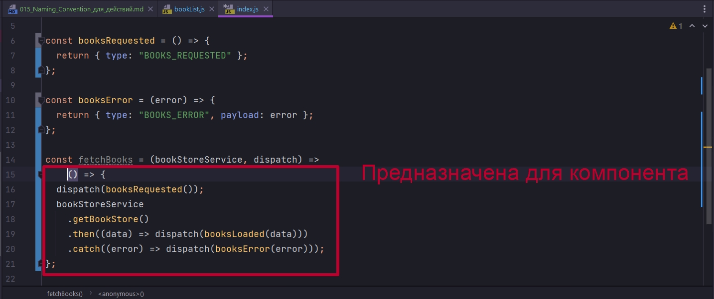

А внешняя функция предназначена для работы в mapDispatchToProps.

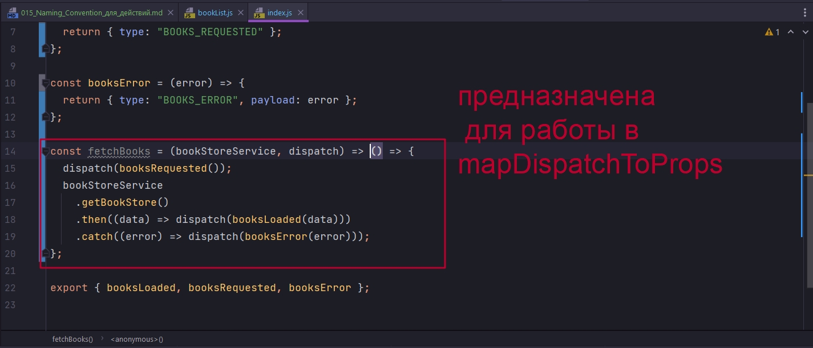

теперь в export нам болше не нужно экспортировать booksLoaded, booksRequested, booksError поскольку единственное место где используются эти Action Creators это внутри fetchBooks.

```js
//src/components/actions/index.js

// Action Creators
const booksLoaded = (newBooks) => {
  return { type: "BOOKS_LOADED", payload: newBooks };
};

const booksRequested = () => {
  return { type: "BOOKS_REQUESTED" };
};

const booksError = (error) => {
  return { type: "BOOKS_ERROR", payload: error };
};


// Функция получения книг
const fetchBooks = (bookStoreService, dispatch) => () => {
  dispatch(booksRequested());
  bookStoreService
    .getBookStore()
    .then((data) => dispatch(booksLoaded(data)))
    .catch((error) => dispatch(booksError(error)));
};

export { fetchBooks };

```

Теперь в нашем BookList нам больше не надо импортировать индивидуальные Action Creators, мы импортируем просто fetchBooks.

И в mapDispatchToProps в возвращаемом ключе fetchBooks присваиваю функцию fetchBooks(bookStoreService, dispatch) в которую передаю bookStoreService, dispatch. И еще могу сделать код короче, сразу из второго аргумента ownProps деструктурирвать { bookStoreService }

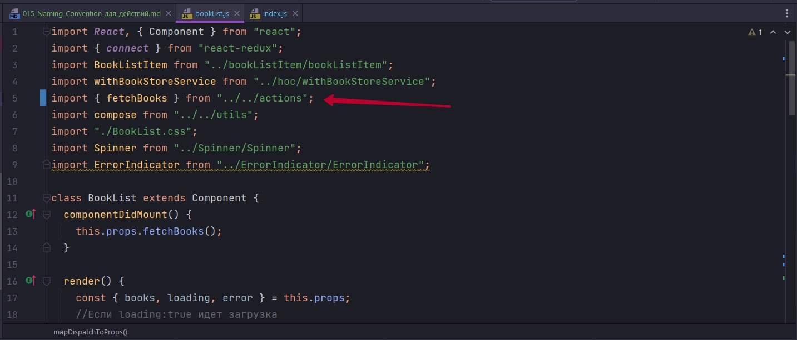

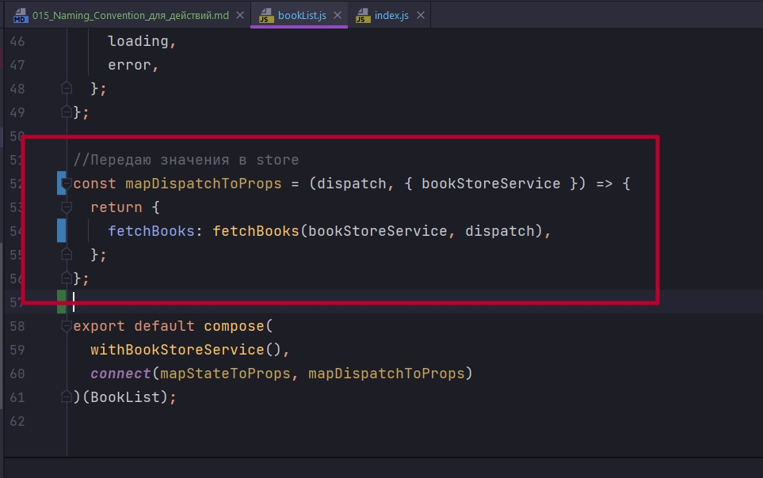

```js
import React, { Component } from "react";
import { connect } from "react-redux";
import BookListItem from "../bookListItem/bookListItem";
import withBookStoreService from "../hoc/withBookStoreService";
import { fetchBooks } from "../../actions";
import compose from "../../utils";
import "./BookList.css";
import Spinner from "../Spinner/Spinner";
import ErrorIndicator from "../ErrorIndicator/ErrorIndicator";

class BookList extends Component {
  componentDidMount() {
    this.props.fetchBooks();
  }

  render() {
    const { books, loading, error } = this.props;
    //Если loading:true идет загрузка
    if (loading) {
      return <Spinner />;
    }

    if (error) {
      return <ErrorIndicator />;
    }

    return (
      <ul className="book-list">
        {books.map((book) => (
          <li key={book.id}>
            <BookListItem book={book} />
          </li>
        ))}
      </ul>
    );
  }
}

//Эта функция определяет, какие свойства
// получит компонент из Redux
const mapStateToProps = ({ books, loading, error }) => {
  //передаю свойства из глобального state в компонент
  // далее в компоненте достаю их из props
  return {
    books,
    loading,
    error,
  };
};

//Передаю значения в store
const mapDispatchToProps = (dispatch, { bookStoreService }) => {
  return {
    fetchBooks: fetchBooks(bookStoreService, dispatch),
  };
};

export default compose(
  withBookStoreService(),
  connect(mapStateToProps, mapDispatchToProps)
)(BookList);

```

Теперь еще раз возвращаюсь в наш файл с Action Creators. И посмотрим еще на один аспект

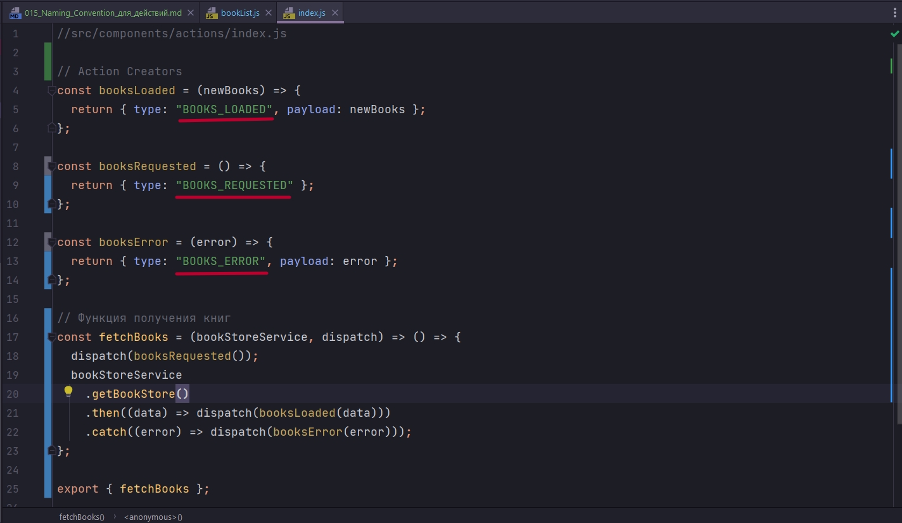


В React-Redux приложениях существует определенный Naming Conventions или договоренность об именовании для действий которые занимаются получение данных.

Дело в том что когда вы отправляете запрос на сервер этот процесс как правило ассоциируется с тремя типичными действиями.

1. Отпрака запроса т.е. начало отправки запроса BOOKS_LOADED.
2. Это получение успешного успешного результата BOOKS_REQUESTED
3. Или  получение ошибки BOOKS_ERROR.

Не зависимо от того что именно вы делаете: запрашиваете данные, или обновляете существующий жлемент в коллекции, или добавляете новый элемент. У вас всегда будут эти три действия: 1) Отправка запроса 2) получение успешного ответа 3) и получение ошибки.

По этому что бы немножечко стандартизировать этот процесс возник такой Naming Conventions. Действие которое отправляет первоначальный запрос FETCH_BOOKS_REQUEST. 

FETCH - обозначает что мы именно получаем данные

Если бы мы отправляли запрос на обновление книг, то он назывался бы UPDATE_BOOKS_REQUEST.

Для успешного запроса используется в конце SUCCESS. 


А для ошибки в конце добавляется FAILURE.

```js
//src/components/actions/index.js

// Action Creators
const booksRequested = () => {
    return { type: "FETCH_BOOKS_REQUEST" };
};

const booksLoaded = (newBooks) => {
    return { type: "FETCH_BOOKS_SUCCESS", payload: newBooks };
};

const booksError = (error) => {
    return { type: "FETCH_BOOKS_FAILURE", payload: error };
};

// Функция получения книг
const fetchBooks = (bookStoreService, dispatch) => () => {
    dispatch(booksRequested());
    bookStoreService
        .getBookStore()
        .then((data) => dispatch(booksLoaded(data)))
        .catch((error) => dispatch(booksError(error)));
};

export { fetchBooks };

```

И теперь reducer

```js
//src/components/reducers/index.js
const initialState = {
    books: [],
    loading: true,
    error: null,
};

const reducer = (state = initialState, action) => {
    switch (action.type) {
        case "FETCH_BOOKS_REQUEST":
            return { books: [], loading: true, error: null };
        case "FETCH_BOOKS_SUCCESS":
            return { books: action.payload, loading: false, error: null };
        case "FETCH_BOOKS_FAILURE":
            return { books: [], loading: false, error: action.payload };
        default:
            return state;
    }
};

export default reducer;

```

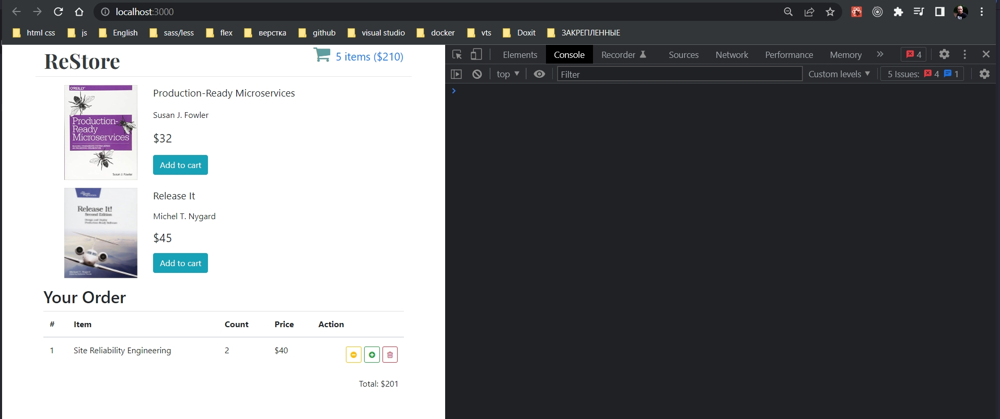


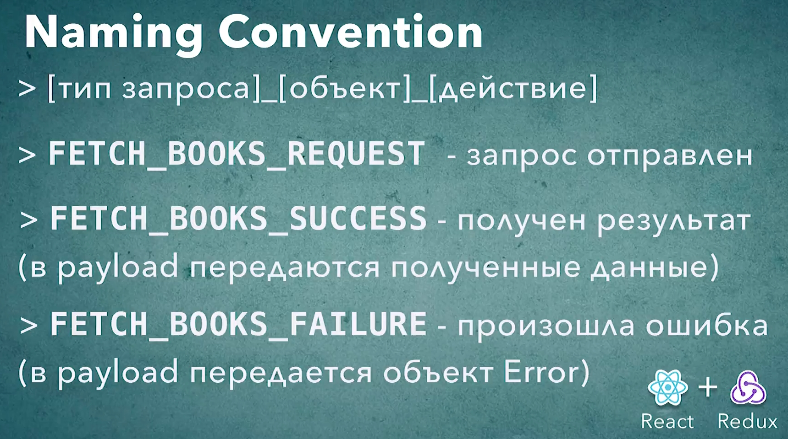

