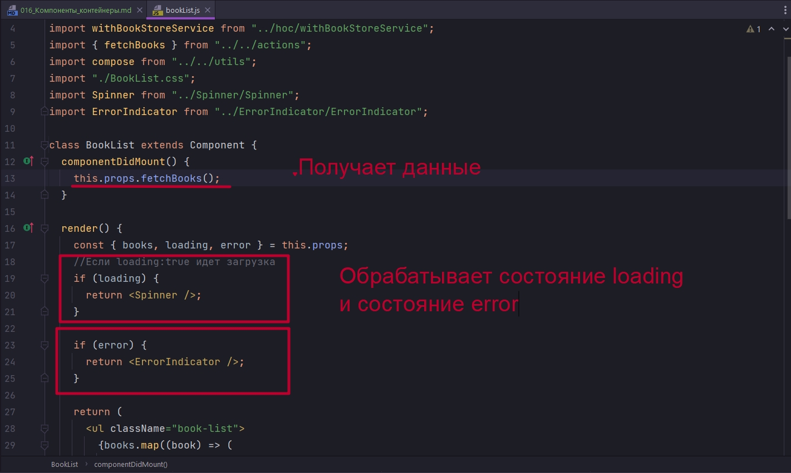
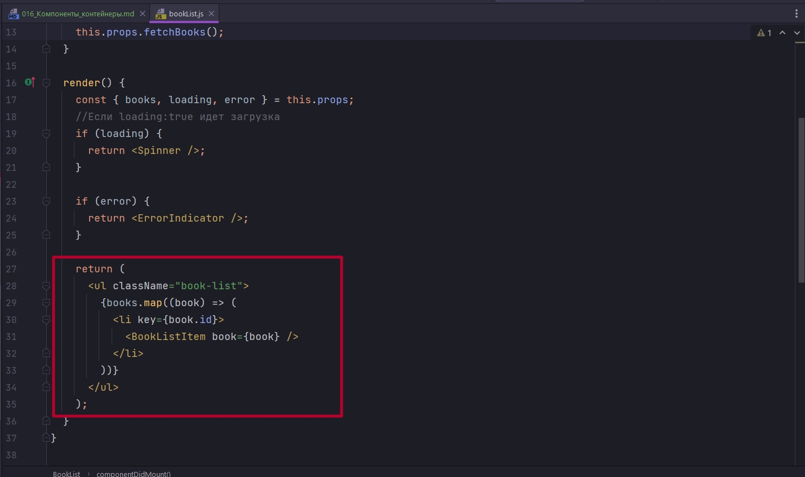
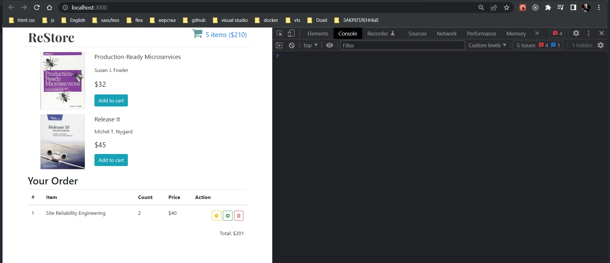
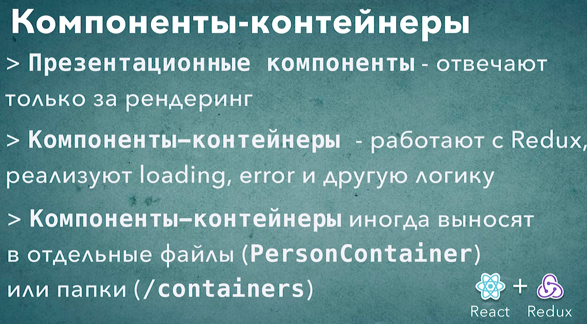

# 016_Компоненты_контейнеры

Давайте еще раз посмотрим на компонент BookList.

```js
import React, { Component } from "react";
import { connect } from "react-redux";
import BookListItem from "../bookListItem/bookListItem";
import withBookStoreService from "../hoc/withBookStoreService";
import { fetchBooks } from "../../actions";
import compose from "../../utils";
import "./BookList.css";
import Spinner from "../Spinner/Spinner";
import ErrorIndicator from "../ErrorIndicator/ErrorIndicator";

class BookList extends Component {
  componentDidMount() {
    this.props.fetchBooks();
  }

  render() {
    const { books, loading, error } = this.props;
    //Если loading:true идет загрузка
    if (loading) {
      return <Spinner />;
    }

    if (error) {
      return <ErrorIndicator />;
    }

    return (
      <ul className="book-list">
        {books.map((book) => (
          <li key={book.id}>
            <BookListItem book={book} />
          </li>
        ))}
      </ul>
    );
  }
}

//Эта функция определяет, какие свойства
// получит компонент из Redux
const mapStateToProps = ({ books, loading, error }) => {
  //передаю свойства из глобального state в компонент
  // далее в компоненте достаю их из props
  return {
    books,
    loading,
    error,
  };
};

//Передаю значения в store
const mapDispatchToProps = (dispatch, { bookStoreService }) => {
  return {
    fetchBooks: fetchBooks(bookStoreService, dispatch),
  };
};

export default compose(
  withBookStoreService(),
  connect(mapStateToProps, mapDispatchToProps)
)(BookList);

```


После нескольких последних видео его структура намного улучшилась. Но все же есть один аспект который можно улучшить в этом коде.

Если вы помните наше прошлое приложение StarDB мы в нем говорили о том что в React считается хорошей практикой разделять те компоненты которые отвечают только за поведение от компонентов которые отвечают за отображение элементов.


Прямо сейчас наш компонент BookList делает все сразу. Он получает данные. Обрабатывает состояние loading и error



И кроме того, в функции render, он формирует внешний вид нашего компонента.


Если следовать лучшим практикам React-Redux эти два аспекта следует разделить.

Возьмем вот эту часть которая отвечает за отображение



И вынесем в отдельный компонент. 

При этом переименуем наш компонент, который отвечает за поведение в BookListContainer. 

Дополнение к имени компонента Container тоже происходит из официальных рекомендаций Redux. Оно означает что наш компонент BookListContainer он как бы оборачивает компонент BookList который занимается только отображением.

Задача компонента контейнера это как бы связь нашего основного компонента с Redux Store. Ну и кроме того реализация логики получения данных, отображения loading индикатор, error индикатор и любых других состояний которые не связаны напрямую с отображением самого списка. А сам список уже отображается компонентом BookList.

В папке BookListContainer создаю вложенные компонент BookList.

```js
//src/components/bookListContainer/bookList.js
import React from "react";
import BookListItem from "../../bookListItem/bookListItem";

const BookList = ({ books }) => {
  return (
    <ul className="book-list">
      {books.map((book) => (
        <li key={book.id}>
          <BookListItem book={book} />
        </li>
      ))}
    </ul>
  );
};

export default BookList;

```

```js
import React, { Component } from "react";
import { connect } from "react-redux";
import BookListItem from "../bookListItem/bookListItem";
import withBookStoreService from "../hoc/withBookStoreService";
import { fetchBooks } from "../../actions";
import compose from "../../utils";
import "./bookListContainer.css";
import Spinner from "../Spinner/Spinner";
import ErrorIndicator from "../ErrorIndicator/ErrorIndicator";
import BookList from "./BookList/BookList";

class BookListContainer extends Component {
  componentDidMount() {
    this.props.fetchBooks();
  }

  render() {
    const { books, loading, error } = this.props;
    //Если loading:true идет загрузка
    if (loading) {
      return <Spinner />;
    }

    if (error) {
      return <ErrorIndicator />;
    }

    return <BookList books={books} />;
  }
}

//Эта функция определяет, какие свойства
// получит компонент из Redux
const mapStateToProps = ({ books, loading, error }) => {
  //передаю свойства из глобального state в компонент
  // далее в компоненте достаю их из props
  return {
    books,
    loading,
    error,
  };
};

//Передаю значения в store
const mapDispatchToProps = (dispatch, { bookStoreService }) => {
  return {
    fetchBooks: fetchBooks(bookStoreService, dispatch),
  };
};

export default compose(
  withBookStoreService(),
  connect(mapStateToProps, mapDispatchToProps)
)(BookListContainer);

```

Но в официальной документации Redux немного не так. Они рекомендуют на одном уровне с дирректорией components создать дирректорию containers и там держать компоненты контейнеры которые связывают наши презентационные компоненты, компоненты которые умеют только отображать данные с redux store и добавлять им нужное поведение.

```js
import React from "react";
import BookListContainer from "../bookListContainer/bookListContainer";
import ShoppingCartTable from "../shoppingCartTable/shoppingCartTable";

const HomePage = () => {
  return (
    <div>
      <BookListContainer />
      <ShoppingCartTable />
    </div>
  );
};

export default HomePage;

```





