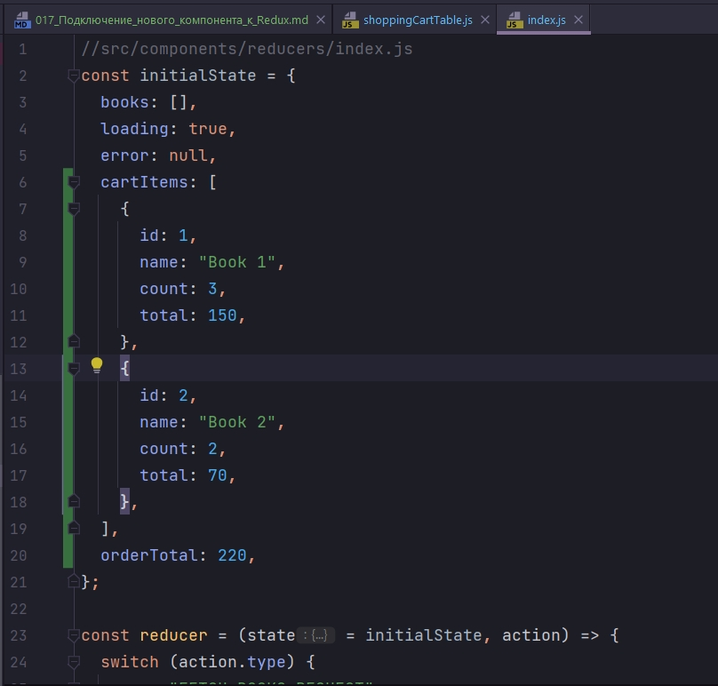

# 017_Подключение_нового_компонента_к_Redux

Пришло время реализовать вторую часть нешего магазина, а именно Shopping Cart. Покупательская тележка - это то самое место куда наш пользователь будет складывать свои товары перед тем как сделать заказ.

На примере этого компонента мы посмотрим как Redux упрощает работу с глобальным состоянием нашего приложения, и при этом не усложняет отдельные компоненты.

Посмотрим на наш интерфейс и поймем какие именно данные нужны этому компоненту что бы отображать все то что мы видим сейчас на экране.


1. И так нам нужен порядковый номер элемента. Это мы можем сгенерировать прямо в самом компоненте. Это не id а просто номер записи.
2. Затем у нас есть название книги в поле title т.е. Item.
3. У нас есть количество книг в поле Counter
4. У нас есть поле Price. На самом деле лучше назвать это поле total для того что бы мы показывали общую стоимость всех книг
5. И кроме того у нас есть три кнопки. Первая будет уменьшать количество книг, вторая будет увеличивать, ну а третья будет удалять всю строку из заказа.
6. Ну и конечно нам нужно не забыть общую сумму заказа Total. Эту сумму мог бы посчитать сам компонент на основании других данных. Но намного правильнее будет держать такую логику в reducer. Таким образом если логика станет сложнее, у нас будет одно место где нам нужно будет обновлять код для того что бы изменять эту логику.

Перехожу к компоненту ShoppingCartTable.

Те свойства которые понадобятся этому компоненту это items - это элементы той таблицы которую мы будем отображать.

total - это общая сумма заказа.

И этому компоненту нужно будет передать три event listener для трех разных кнопок которые у нас есть в интерфейсе. onIncrease, onDecrease, onDelete.


```js
import React from "react";
import "./shoppingCartTable.css";

const ShoppingCartTable = ({
  items,
  total,
  onIncrease,
  onDecrease,
  onDelete,
}) => {
  return (
    <div className="shopping-cart-table">
      <h2>Your Order</h2>
      <table className="table">
        <thead>
          <tr>
            <th>#</th>
            <th>Item</th>
            <th>Count</th>
            <th>Price</th>
            <th>Action</th>
          </tr>
        </thead>
        <tbody>
          <tr>
            <td>1</td>
            <td>Site Reliability Engineering</td>
            <td>2</td>
            <td>$40</td>
            <td>
              {" "}
              <button className="btn btn-outline-danger btn-sm float-right">
                <i className="fa fa-trash-o" />
              </button>
              <button className="btn btn-outline-success btn-sm float-right">
                <i className="fa fa-plus-circle" />
              </button>
              <button className="btn btn-outline-warning btn-sm float-right">
                <i className="fa fa-minus-circle" />
              </button>
            </td>
          </tr>
        </tbody>
      </table>
      <div className="total">Total: $201</div>
    </div>
  );
};

export default ShoppingCartTable;

```

Теперь все что нам нужно сделать это отрисовать еще одну строку в наше таблице, и добавить правильные обработчики событий для кнопок.

Вот такой вот компонент получился.

```js
import React from "react";
import "./shoppingCartTable.css";

const ShoppingCartTable = ({
                               items,
                               total,
                               onIncrease,
                               onDecrease,
                               onDelete,
                           }) => {
    const renderRow = (item, index) => {
        const { id, name, count, total } = item;
        return (
            <tr key={id}>
                <td>{index}</td>
                <td>{name}</td>
                <td>{count}</td>
                <td>${total}</td>
                <td>
                    <button
                        onClick={() => onDecrease(id)}
                        className="btn btn-outline-danger btn-sm float-right"
                    >
                        <i className="fa fa-trash-o" />
                    </button>
                    <button
                        onClick={() => onIncrease(id)}
                        className="btn btn-outline-success btn-sm float-right"
                    >
                        <i className="fa fa-plus-circle" />
                    </button>
                    <button
                        onClick={() => onDelete(id)}
                        className="btn btn-outline-warning btn-sm float-right"
                    >
                        <i className="fa fa-minus-circle" />
                    </button>
                </td>
            </tr>
        );
    };

    return (
        <div className="shopping-cart-table">
            <h2>Your Order</h2>
            <table className="table">
                <thead>
                    <tr>
                        <th>#</th>
                        <th>Item</th>
                        <th>Count</th>
                        <th>Price</th>
                        <th>Action</th>
                    </tr>
                </thead>
                <tbody>{items.map(renderRow)}</tbody>
            </table>
            <div className="total">Total: ${total}</div>
        </div>
    );
};

export default ShoppingCartTable;

```

Я вынес функцию renderRow которая отвечает за то что бы отрендерить одну строку нашей таблицы. Функция renderRow очень простая. Она принимает на вход item - это элемент нашей таблицы который мы хотим отрендерить. Он будет приходить из Redux Store когда мы подключим этот компонент к Redux Store.  И index этого элемента в массиве. Это значение передаст функция map.

Затем мы получаем данные из item id, name, count, total. id - мы будем использовать в наших обработчиках событий onIncrease,
onDecrease, onDelete.

Кроме этого у нашей записи, у нашего item будут свойства name, count, total.

name - название товара, название книги.
count - количество книг
total - общая сумма заказа для этих книг.

Теперь когда наш компонент готов рендерить реальные данные давайте попробуем подключить его к Redux Store.


Перед тем как оборачивать компонент ShoppingCartTable в функцию connect и подключать этот компонент к Redux Store, давайте перейдем к нашему reducer и сперва обновим state для того что бы у этого компонента было все что ему нужно для работы.

Мы добавим в state два свойства items и total. items это коллекция элементов нашего Shopping Cart, и total - общая сумма заказа.

Для начало добавим тестовые данные в initialState для того что бы проверить правильно ли компонент читает из Redux Store.




cartItems и orderTotal именно эти поля будет читать наш новый компонент.

Прежде чем продолжать нужно поспотреть на существующие действия и существующий код reducer.

 Дело в том что мы с вами сейчас находимся в Redux, мы находимся в reducer, а reducer как вы помните должен возвращать полный state. Соответственно если мы с вами добавляем новые поля в state нам нужно убедится что мыс вами не будем терять их тогда когда мы обрабатываем другие события.

К примеру когда мы обрабатываем FETCH_BOOKS_REQUEST мы будем возвращать объект у которого есть три поля  books, loading, error. У этого объекта нет полей cartItems и orderTotal. По этому поля cartItems и orderTotal потеряются, они попросту будут undefined  в новом состоянии в глобальном state. 

Для того что бы их не потерять мы можем в явном виде передать эти поля при этом не изменяя их значений.


Но писать такой код в обработчике каждого события и кроме того не забывать добавлять новые поля по мере того как вы обновляете ваш глобальный state будет довольно сложно.

По этому проще будет поступить так. Мы можем использовать синтаксис деструктуризации объектов и сказать что мы берем весь существующий state, и затем в этом state мы обновляем нужные нам поля.

В будущем рассмотрим еще более элегантный способ.

```js
//src/components/reducers/index.js
const initialState = {
  books: [],
  loading: true,
  error: null,
  cartItems: [
    {
      id: 1,
      name: "Book 1",
      count: 3,
      total: 150,
    },
    {
      id: 2,
      name: "Book 2",
      count: 2,
      total: 70,
    },
  ],
  orderTotal: 220,
};

const reducer = (state = initialState, action) => {
  switch (action.type) {
    case "FETCH_BOOKS_REQUEST":
      return {
        ...state,
        books: [],
        loading: true,
        error: null,
      };
    case "FETCH_BOOKS_SUCCESS":
      return { ...state, books: action.payload, loading: false, error: null };
    case "FETCH_BOOKS_FAILURE":
      return { ...state, books: [], loading: false, error: action.payload };
    default:
      return state;
  }
};

export default reducer;

```

Теперь когда у нас еть нужные данные в глобальном state, мы можем вернуться к нашему компоненту ShoppingCartTable и подключить его к Redux.

Нам понадобится две функции mapStateToProps и mapDispatchToProps.

mapStateToProps принимает state и возвращает объект ключи которого это свойства которые мы присваиваем нашему компоненту.


Вторая функция которая нам понадобится это mapDispatchToProps. Пока что у нас нет ни каких Action Creators но давайте передадим какие-нибудь пустые реализации функций которые нужны нашему компоненту для того что бы проверить что они работают.

```js
import React from "react";
import { connect } from "react-redux";
import "./shoppingCartTable.css";

const ShoppingCartTable = ({
  items,
  total,
  onIncrease,
  onDecrease,
  onDelete,
}) => {
  const renderRow = (item, index) => {
    const { id, name, count, total } = item;
    return (
      <tr key={id}>
        <td>{index}</td>
        <td>{name}</td>
        <td>{count}</td>
        <td>${total}</td>
        <td>
          <button
            onClick={() => onDecrease(id)}
            className="btn btn-outline-danger btn-sm float-right"
          >
            <i className="fa fa-trash-o" />
          </button>
          <button
            onClick={() => onIncrease(id)}
            className="btn btn-outline-success btn-sm float-right"
          >
            <i className="fa fa-plus-circle" />
          </button>
          <button
            onClick={() => onDelete(id)}
            className="btn btn-outline-warning btn-sm float-right"
          >
            <i className="fa fa-minus-circle" />
          </button>
        </td>
      </tr>
    );
  };

  return (
    <div className="shopping-cart-table">
      <h2>Your Order</h2>
      <table className="table">
        <thead>
          <tr>
            <th>#</th>
            <th>Item</th>
            <th>Count</th>
            <th>Price</th>
            <th>Action</th>
          </tr>
        </thead>
        <tbody>{items.map(renderRow)}</tbody>
      </table>
      <div className="total">Total: ${total}</div>
    </div>
  );
};

const mapStateToProps = ({ cartItems, orderTotal }) => {
  return {
    items: cartItems,
    total: orderTotal,
  };
};

const mapDispatchToProps = () => {
  return {
    onIncrease: (id) => {
      console.log(`onIncrease ${id}`);
    },
    onDecrease: (id) => {
      console.log(`onDecrease ${id}`);
    },
    onDelete: (id) => {
      console.log(`onDelete ${id}`);
    },
  };
};

export default connect(mapStateToProps, mapDispatchToProps)(ShoppingCartTable);

```

И так прямо сейчас mapDispatchToProps не принимает dispatch, и не передает ни какие действия в store. Но мы передаем простые реализации обработчиков событий  для того что бы проверить что они работают.


Однако большинство людей начинаю счет с 1. А у нас счет идет с ноля. Исправим.


И еще event listener работают не правильно.


```js
import React from "react";
import { connect } from "react-redux";
import "./shoppingCartTable.css";

const ShoppingCartTable = ({
  items,
  total,
  onIncrease,
  onDecrease,
  onDelete,
}) => {
  const renderRow = (item, index) => {
    const { id, name, count, total } = item;
    return (
      <tr key={id}>
        <td>{index + 1}</td>
        <td>{name}</td>
        <td>{count}</td>
        <td>${total}</td>
        <td>
          <button
            onClick={() => onDelete(id)}
            className="btn btn-outline-danger btn-sm float-right"
          >
            <i className="fa fa-trash-o" />
          </button>
          <button
            onClick={() => onIncrease(id)}
            className="btn btn-outline-success btn-sm float-right"
          >
            <i className="fa fa-plus-circle" />
          </button>
          <button
            onClick={() => onDecrease(id)}
            className="btn btn-outline-warning btn-sm float-right"
          >
            <i className="fa fa-minus-circle" />
          </button>
        </td>
      </tr>
    );
  };

  return (
    <div className="shopping-cart-table">
      <h2>Your Order</h2>
      <table className="table">
        <thead>
          <tr>
            <th>#</th>
            <th>Item</th>
            <th>Count</th>
            <th>Price</th>
            <th>Action</th>
          </tr>
        </thead>
        <tbody>{items.map(renderRow)}</tbody>
      </table>
      <div className="total">Total: ${total}</div>
    </div>
  );
};

const mapStateToProps = ({ cartItems, orderTotal }) => {
  return {
    items: cartItems,
    total: orderTotal,
  };
};

const mapDispatchToProps = () => {
  return {
    onIncrease: (id) => {
      console.log(`onIncrease ${id}`);
    },
    onDecrease: (id) => {
      console.log(`onDecrease ${id}`);
    },
    onDelete: (id) => {
      console.log(`onDelete ${id}`);
    },
  };
};

export default connect(mapStateToProps, mapDispatchToProps)(ShoppingCartTable);

```

И так в этом видео мы посмотрели как подключить новый компонент к Redux. Мы начинаем с того что пишем полноценную React реализацию компонента. Эта версия компонента ничего не знает про Redux и это правильный подход.

Мы с вами должны забыть что у нас в приложении используется Redux. Откуда приходять данные когда мы пишем реализацию компонента. Компонент должен быть не зависим от источника данных.

Ну а затем когда компонент готов мы обновляем Redux Store. Мы добавляем новые поля и если нужно мы обновляем существующие действия так что бы наш store не сломать.

При этом в своих собственных проектах я люблю начинать не с пустых данных а с каких то значений которые можно сразу быстро протестировать вместе с компонентом.

Ну и последний шаг. Когда ваш Redux Store готов, можно вернуться назад в компонент, реализовать функции mapStateToProps и mapDispatchToProps и подключить наш компонент к Redux. После этого мы можем проверить что данные действительно отображаются корректно.


