# 018_Redux_Добавление_элементов_в_массив

Сделаем так что бы при нажатии на кнопку Add to cart соответствующий элемент появлялся в списке покупок.

В этом видео мы научимся как добавлять элементы в Redux коллекцию. Ну а в следующих видео мы посмотрим как обновлять элементы и сделаем так что если пользователь будет нажимать несколько раз на Add to cart, то соответствующая запись в корзине будет обновляться. В корзине будет увеличиваться количество книг и увеличиваться общая цена.

Давайте повторим. Как сделать так что бы кнопка которая находится в одной част приложения обновляла данные в совершенно другой части приложения?

1. Что нам нужно сделать это добавить event listener к этой кнопке что бы она начала реагировать на события.
2. После этого мы сделаем так что бы клик по этой кнопке передавал действие в redux store.
3. Ну а затем нам останется добавить поддержку нового действия в нашем reducer.

Напомню за рендеринг каждого элемента в списке книг отвечает компонент BookListItem.

```js
import React from "react";
import "./BookListItem.css";

const BookListItem = ({ book }) => {
  const { title, author, price, coverImage } = book;
  return (
    <div className="book-list-item">
      <div className="book-cover">
        
      </div>
      <div className="book-details">
        <span className="book-title">{title}</span>
        <div className="book-author">{author}</div>
        <div className="book-price">${price}</div>
        <button className="btn btn-info to-cart">Add to cart</button>
      </div>
    </div>
  );
};

export default BookListItem;

```

Пока что этот компонент принимает одно свойство book. Добавляю еще один event listener onAddedToCart - это будет функция которую получит наш компонент и мы будем вызывать эту функцию тогда когда у нас будет клик на нашей кнопке.

```js
import React from "react";
import "./BookListItem.css";

const BookListItem = ({ book, onAddedToCart }) => {
  const { title, author, price, coverImage } = book;
  return (
    <div className="book-list-item">
      <div className="book-cover">
        
      </div>
      <div className="book-details">
        <span className="book-title">{title}</span>
        <div className="book-author">{author}</div>
        <div className="book-price">${price}</div>
        <button onClick={onAddedToCart} className="btn btn-info to-cart">
          Add to cart
        </button>
      </div>
    </div>
  );
};

export default BookListItem;

```

Теперь BookListItem умеет реагировать на события. Мы можем передать сюда функцию и узнавать когда пользователь будет нажмет на эту кнопку.


Но сам компонент BookListItem не подключен к Redux Store. Это обычный презентационный компонент который не делает практичски ничего кроме как возвращает дерево реакт элементов. 

Компонент который отвечает за подключение к Redux Store находится в файле BookList. Соответственно нам нужно обновить этот компонент тоже.

Давайте передадим в BookList еще один event listener. Передаю в этот компонент функцию onAddedToCart и теге BookListItem, в пропсах вызываю данную функцию и передаю book.id.

```js
//src/components/bookListContainer/bookList.js
import React from "react";
import BookListItem from "../../bookListItem/bookListItem";

const BookList = ({ books, onAddedToCart }) => {
  return (
    <ul className="book-list">
      {books.map((book) => (
        <li key={book.id}>
          <BookListItem
            book={book}
            onAddedToCart={() => onAddedToCart(book.id)}
          />
        </li>
      ))}
    </ul>
  );
};

export default BookList;

```

Т.е. теперь когда мы подпишемся на onAddedToCart компонента BookList мы будем знать какую именно книгу хочет добавить наш пользователь.

И теперь точно так же как в прошлом видео давайте проверим что эта функция работает. В какой-то момент мы сделаем так что бы эта функция передавала в наш Redux Store  новое действие. Но прямо сейчас мы можем проверить что эта функция работает передав туда простую реализацию которая будет просто печатать id книги в консоль.

Для этого в BookListContainer в mapDispatchToProps добавляю эту функцию

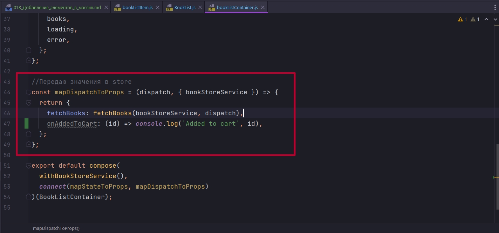

Перед тем как проверять функцию onAddedToCart нужно не забыть что наш компонент BookList обернут компонентом BookListContainer. И те функции которые мы определяем в mapDispatchToProps будут переданы именно BookListContainer. И это будет задачей BookListContainer получить эти эти функции, получить эти свойства и передать их в BookList.

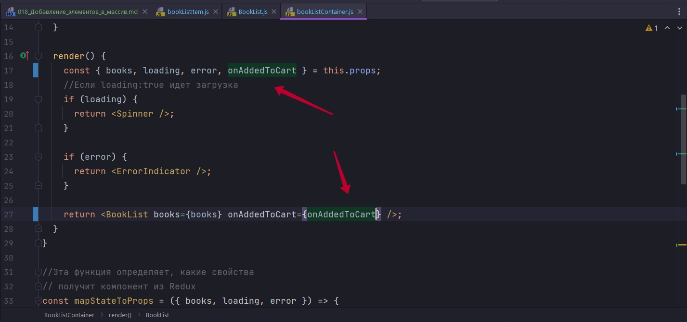

```js
import React, { Component } from "react";
import { connect } from "react-redux";
import withBookStoreService from "../hoc/withBookStoreService";
import { fetchBooks } from "../../actions";
import compose from "../../utils";
import "./bookListContainer.css";
import Spinner from "../Spinner/Spinner";
import ErrorIndicator from "../ErrorIndicator/ErrorIndicator";
import BookList from "./BookList/BookList";

class BookListContainer extends Component {
  componentDidMount() {
    this.props.fetchBooks();
  }

  render() {
    const { books, loading, error, onAddedToCart } = this.props;
    //Если loading:true идет загрузка
    if (loading) {
      return <Spinner />;
    }

    if (error) {
      return <ErrorIndicator />;
    }

    return <BookList books={books} onAddedToCart={onAddedToCart} />;
  }
}

//Эта функция определяет, какие свойства
// получит компонент из Redux
const mapStateToProps = ({ books, loading, error }) => {
  //передаю свойства из глобального state в компонент
  // далее в компоненте достаю их из props
  return {
    books,
    loading,
    error,
  };
};

//Передаю значения в store
const mapDispatchToProps = (dispatch, { bookStoreService }) => {
  return {
    fetchBooks: fetchBooks(bookStoreService, dispatch),
    onAddedToCart: (id) => console.log(`Added to cart`, id),
  };
};

export default compose(
  withBookStoreService(),
  connect(mapStateToProps, mapDispatchToProps)
)(BookListContainer);

```

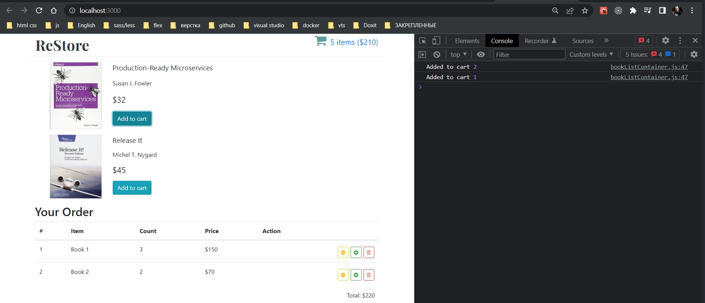


Теперь мы можем перейти к следующему плану нашего действия и добавить в наше приложение. Для начало я перейду к файлу в котором находяться все action creators.

Создадим новый action creator bookAddedToCart

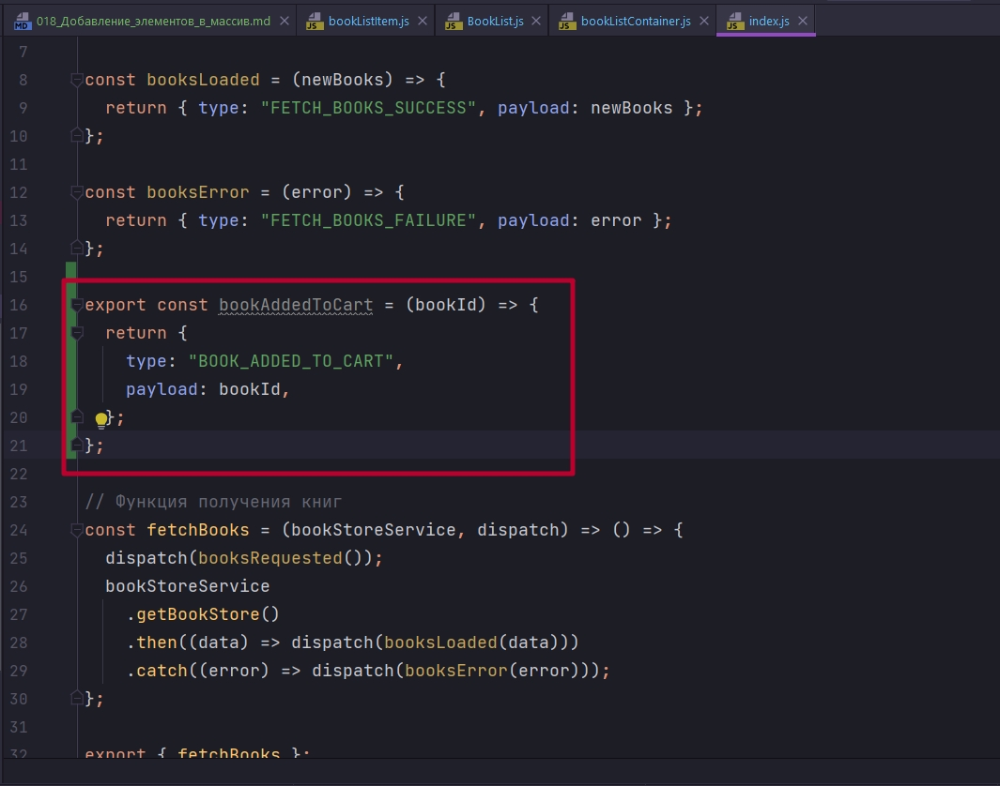

```js
//src/components/actions/index.js

// Action Creators
const booksRequested = () => {
  return { type: "FETCH_BOOKS_REQUEST" };
};

const booksLoaded = (newBooks) => {
  return { type: "FETCH_BOOKS_SUCCESS", payload: newBooks };
};

const booksError = (error) => {
  return { type: "FETCH_BOOKS_FAILURE", payload: error };
};

export const bookAddedToCart = (bookId) => {
  return {
    type: "BOOK_ADDED_TO_CART",
    payload: bookId,
  };
};

// Функция получения книг
const fetchBooks = (bookStoreService, dispatch) => () => {
  dispatch(booksRequested());
  bookStoreService
    .getBookStore()
    .then((data) => dispatch(booksLoaded(data)))
    .catch((error) => dispatch(booksError(error)));
};

export { fetchBooks };

```

Теперь когда у нас есть новый action creator bookAddedToCart и есть структура для нового действия мы можем вернутся к нашему компоненту BookListContainer, который отвечает за то что бы передать это действие в store, и в mapDispatchToProps заменить тестовую реализацию функции onAddedToCart на настоящую реализацию которая будет передавать в store новое действие.

Для этого сначало проимпортирую новый action creator. И в mapDispatchToProps мы могли бы использовать bindActionCreators но мы напишем меньше кода если будем просто использовать dispatch.

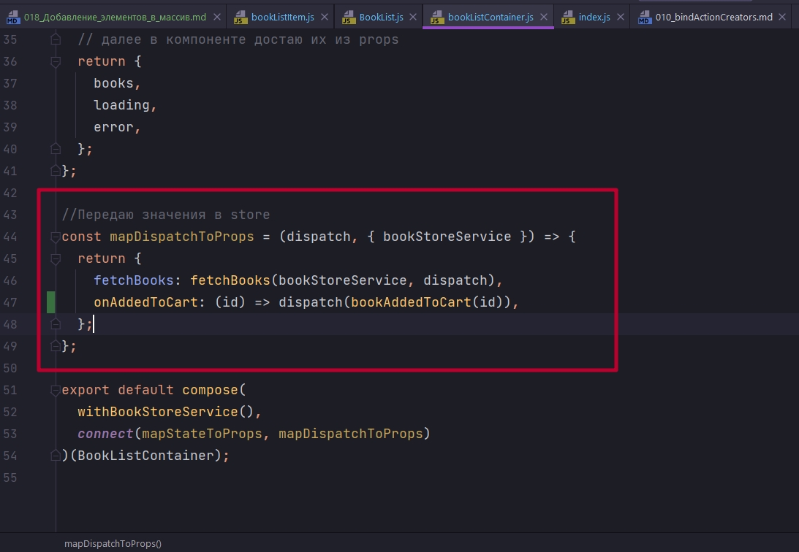

```js
import React, { Component } from "react";
import { connect } from "react-redux";
import withBookStoreService from "../hoc/withBookStoreService";
import { fetchBooks, bookAddedToCart } from "../../actions";
import compose from "../../utils";
import "./bookListContainer.css";
import Spinner from "../Spinner/Spinner";
import ErrorIndicator from "../ErrorIndicator/ErrorIndicator";
import BookList from "./BookList/BookList";

class BookListContainer extends Component {
  componentDidMount() {
    this.props.fetchBooks();
  }

  render() {
    const { books, loading, error, onAddedToCart } = this.props;
    //Если loading:true идет загрузка
    if (loading) {
      return <Spinner />;
    }

    if (error) {
      return <ErrorIndicator />;
    }

    return <BookList books={books} onAddedToCart={onAddedToCart} />;
  }
}

//Эта функция определяет, какие свойства
// получит компонент из Redux
const mapStateToProps = ({ books, loading, error }) => {
  //передаю свойства из глобального state в компонент
  // далее в компоненте достаю их из props
  return {
    books,
    loading,
    error,
  };
};

//Передаю значения в store
const mapDispatchToProps = (dispatch, { bookStoreService }) => {
  return {
    fetchBooks: fetchBooks(bookStoreService, dispatch),
    onAddedToCart: (id) => dispatch(bookAddedToCart(id)),
  };
};

export default compose(
  withBookStoreService(),
  connect(mapStateToProps, mapDispatchToProps)
)(BookListContainer);

```

Теперь наш компонент дулет передавать в store нужное действие. Давайте проверим что это действительно так зайдем в наш reducer и скажем что для каждого действия которое мы получаем мы выведем в консоли его тип.

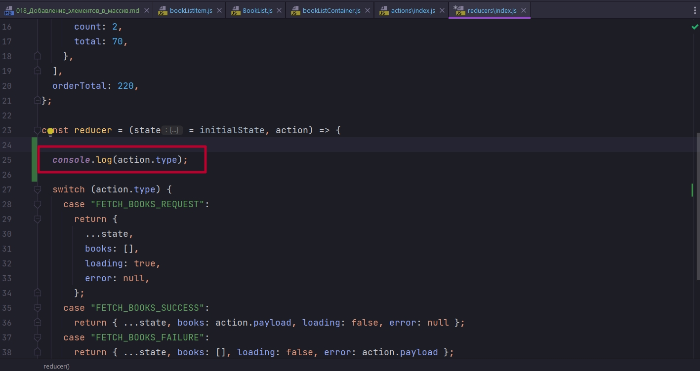

Это самый простой способ убедится что действие действительно доходит до reducer.

```js
//src/components/reducers/index.js
const initialState = {
  books: [],
  loading: true,
  error: null,
  cartItems: [
    {
      id: 1,
      name: "Book 1",
      count: 3,
      total: 150,
    },
    {
      id: 2,
      name: "Book 2",
      count: 2,
      total: 70,
    },
  ],
  orderTotal: 220,
};

const reducer = (state = initialState, action) => {
  console.log(action.type);

  switch (action.type) {
    case "FETCH_BOOKS_REQUEST":
      return {
        ...state,
        books: [],
        loading: true,
        error: null,
      };
    case "FETCH_BOOKS_SUCCESS":
      return { ...state, books: action.payload, loading: false, error: null };
    case "FETCH_BOOKS_FAILURE":
      return { ...state, books: [], loading: false, error: action.payload };
    default:
      return state;
  }
};

export default reducer;

```

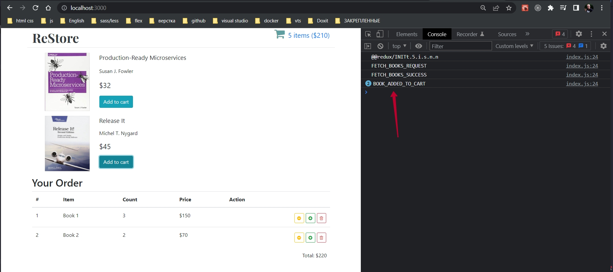

Как видим действие доходит до reducer.

Теперь мы видим что BOOK_ADDED_TO_CART это новое действие, которое перешло в reducer. теперь у нас есть почти вся цепочка. У нас есть компонент который умеет реагировать на события. У нас есть action creator который создает новое действие. И у нас есть функция которая передает это новое действие в reducer. Осталось сделать так что бы reducer понимал это новое действие.

Давайте подумаем что нам нужно для того что бы обработать это действие правильно. Первое что можно сделать это получить id книжки. И получить его из action.payload т.е. const bookId = action.payload;. После того как у нас есть id книги, былобы не плохо получить само название и узнать сколько она стоит. Для этого нам нужно по id найти книгу в коллекции state.books т.е. const book = state.books.find((book) => book.id === bookId);. Теперь у нас есть объект book и нам будет совсем не сложно будет преобразовать этот объект в ту структуру данных которая нужна нашему компоненту, который отображает список покупок.

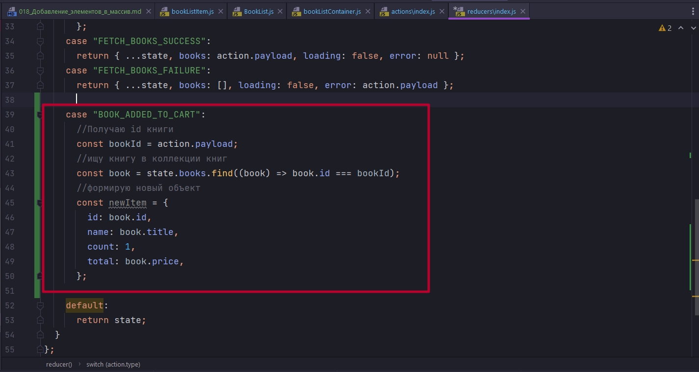

Пока что каждый раз как мы будем кликать на кнопку мы будем создавать новую запись. Но в следующих видео посмотрим как обновлять сужествующие записи и делать так что бы у нас увеличивалось количество книг и сумма заказа для этих книг. И теперь все что нам осталось сделать это передать элемент nuwItem в массив cartItems. Для этого возвращаю объект первым параметром в который копирую ...state, и вторым параметром передаю cartItems:[] массив в который копирую все элементы из состояния ...state.cartItems, и после копирования всех элементов из состоянию добавляю новый элемент newItem.

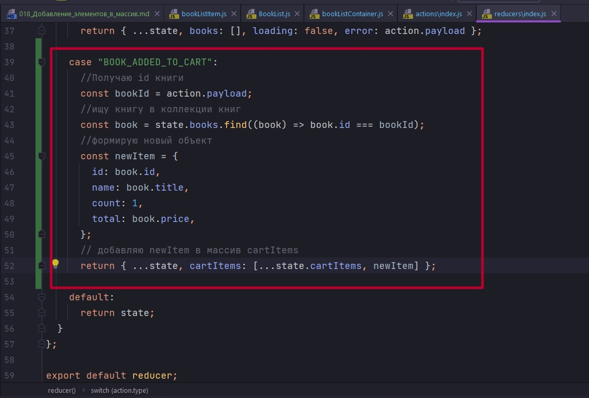

```js
//src/components/reducers/index.js
const initialState = {
  books: [],
  loading: true,
  error: null,
  cartItems: [],
  orderTotal: 220,
};

const reducer = (state = initialState, action) => {
  console.log(action.type);

  switch (action.type) {
    case "FETCH_BOOKS_REQUEST":
      return {
        ...state,
        books: [],
        loading: true,
        error: null,
      };
    case "FETCH_BOOKS_SUCCESS":
      return { ...state, books: action.payload, loading: false, error: null };
    case "FETCH_BOOKS_FAILURE":
      return { ...state, books: [], loading: false, error: action.payload };

    case "BOOK_ADDED_TO_CART":
      //Получаю id книги
      const bookId = action.payload;
      //ищу книгу в коллекции книг
      const book = state.books.find((book) => book.id === bookId);
      //формирую новый объект
      const newItem = {
        id: book.id,
        name: book.title,
        count: 1,
        total: book.price,
      };
      // добавляю newItem в массив cartItems
      return { ...state, cartItems: [...state.cartItems, newItem] };

    default:
      return state;
  }
};

export default reducer;

```

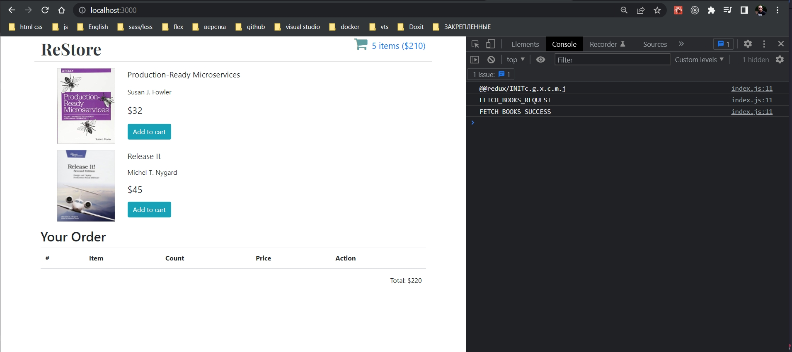


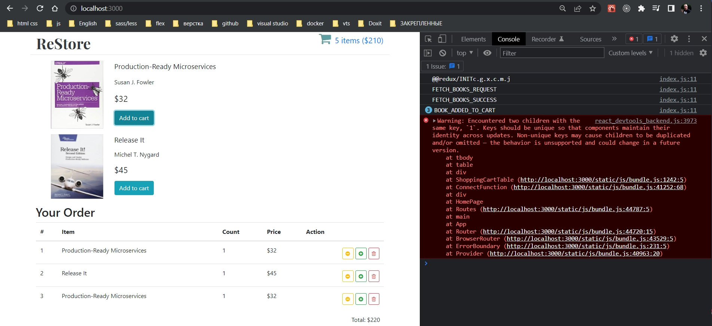

Есть кнфликт между id.

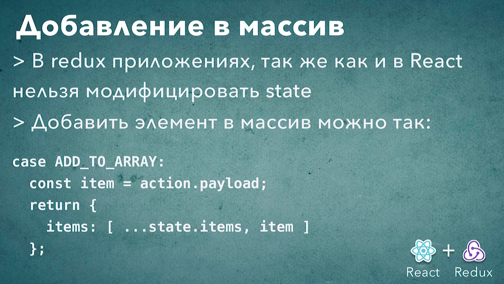


