# 019_Redux_Обновление_элементов_в_массиве

Мы уже научились добавлять элементы в массив под управлением Redux. И для того что бы это сделать мы должны следовать совершенно тем же принципам которым мы следуем при работе со state в обычном React. ЧТО БЫ МЫ НЕ ДЕЛАЛИ МЫ НЕ ДОЛЖНЫ ИЗМЕНЯТЬ СУЖЕСТВУЮЩИЙ STATE. таким образом для того что бы добавить элемент в массив мы создаем новый массив который состоит из всех элементов старого массива плюс новый элемент.

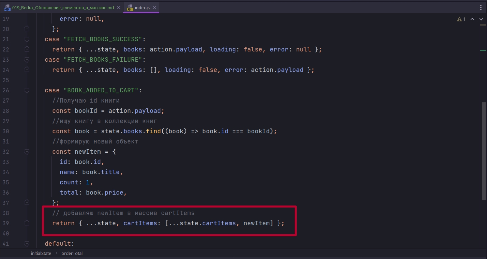

```js
//src/components/reducers/index.js
const initialState = {
  books: [],
  loading: true,
  error: null,
  cartItems: [],
  orderTotal: 220,
};

const reducer = (state = initialState, action) => {
  console.log(action.type);

  switch (action.type) {
    case "FETCH_BOOKS_REQUEST":
      return {
        ...state,
        books: [],
        loading: true,
        error: null,
      };
    case "FETCH_BOOKS_SUCCESS":
      return { ...state, books: action.payload, loading: false, error: null };
    case "FETCH_BOOKS_FAILURE":
      return { ...state, books: [], loading: false, error: action.payload };

    case "BOOK_ADDED_TO_CART":
      //Получаю id книги
      const bookId = action.payload;
      //ищу книгу в коллекции книг
      const book = state.books.find((book) => book.id === bookId);
      //формирую новый объект
      const newItem = {
        id: book.id,
        name: book.title,
        count: 1,
        total: book.price,
      };
      // добавляю newItem в массив cartItems
      return { ...state, cartItems: [...state.cartItems, newItem] };

    default:
      return state;
  }
};

export default reducer;

```

Ну а в этом видео посмотрим на то как обновлять элементы массива.

И перед тем как мы продолжим сразу скажу что обновление элементов в массиве происходит точно так же как обновление элементов массива в обычном React. МЫ ТОЖЕ ДОЛЖНЫ СЛЕДОВАТЬ ТОМУ ЖЕ ПРАВИЛУ. МЫ НЕ МОЖЕМ ИЗМЕНЯТЬ СУЩЕСТВУЮЩИЙ МАССИВ. И МЫ НЕ МОЖЕМ ИЗМЕНЯТЬ СУЩЕСТВУЮЩИЕ ЭЛЕМЕНТЫ. КАЖДЫЙ РАЗ КОГДА МЫ ХОТИМ ЧТО-ТО ИЗМЕНИТЬ НАМ НУЖНО СОЗДАВАТЬ НОВЫЙ МАССИВ ИЛИ НОВЫЙ ОБЪЕКТ.

Преред тем как продолжить исправим один маленький нюанс.

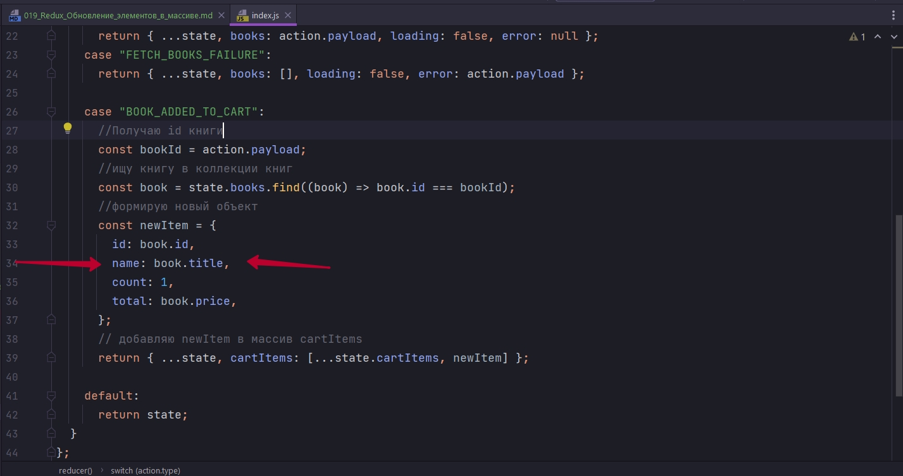

За название книги отвечает свойство title, ну а в заказе это свойство называется name. По сути это одно и тоже свойство. Когда мы используем два разных слова name и title для одного и того же свойства это прямой путь к тому что бы запутаться с нашим собственным кодом. По этому я хочу переименовать наш name в title.

```js
//src/components/reducers/index.js
const initialState = {
  books: [],
  loading: true,
  error: null,
  cartItems: [],
  orderTotal: 220,
};

const reducer = (state = initialState, action) => {
  console.log(action.type);

  switch (action.type) {
    case "FETCH_BOOKS_REQUEST":
      return {
        ...state,
        books: [],
        loading: true,
        error: null,
      };
    case "FETCH_BOOKS_SUCCESS":
      return { ...state, books: action.payload, loading: false, error: null };
    case "FETCH_BOOKS_FAILURE":
      return { ...state, books: [], loading: false, error: action.payload };

    case "BOOK_ADDED_TO_CART":
      //Получаю id книги
      const bookId = action.payload;
      //ищу книгу в коллекции книг
      const book = state.books.find((book) => book.id === bookId);
      //формирую новый объект
      const newItem = {
        id: book.id,
        title: book.title,
        count: 1,
        total: book.price,
      };
      // добавляю newItem в массив cartItems
      return { ...state, cartItems: [...state.cartItems, newItem] };

    default:
      return state;
  }
};

export default reducer;

```

```js
import React from "react";
import { connect } from "react-redux";
import "./shoppingCartTable.css";

const ShoppingCartTable = ({
  items,
  total,
  onIncrease,
  onDecrease,
  onDelete,
}) => {
  const renderRow = (item, index) => {
    const { id, title, count, total } = item;
    return (
      <tr key={id}>
        <td>{index + 1}</td>
        <td>{title}</td>
        <td>{count}</td>
        <td>${total}</td>
        <td>
          <button
            onClick={() => onDelete(id)}
            className="btn btn-outline-danger btn-sm float-right"
          >
            <i className="fa fa-trash-o" />
          </button>
          <button
            onClick={() => onIncrease(id)}
            className="btn btn-outline-success btn-sm float-right"
          >
            <i className="fa fa-plus-circle" />
          </button>
          <button
            onClick={() => onDecrease(id)}
            className="btn btn-outline-warning btn-sm float-right"
          >
            <i className="fa fa-minus-circle" />
          </button>
        </td>
      </tr>
    );
  };

  return (
    <div className="shopping-cart-table">
      <h2>Your Order</h2>
      <table className="table">
        <thead>
          <tr>
            <th>#</th>
            <th>Item</th>
            <th>Count</th>
            <th>Price</th>
            <th>Action</th>
          </tr>
        </thead>
        <tbody>{items.map(renderRow)}</tbody>
      </table>
      <div className="total">Total: ${total}</div>
    </div>
  );
};

const mapStateToProps = ({ cartItems, orderTotal }) => {
  return {
    items: cartItems,
    total: orderTotal,
  };
};

const mapDispatchToProps = () => {
  return {
    onIncrease: (id) => {
      console.log(`onIncrease ${id}`);
    },
    onDecrease: (id) => {
      console.log(`onDecrease ${id}`);
    },
    onDelete: (id) => {
      console.log(`onDelete ${id}`);
    },
  };
};

export default connect(mapStateToProps, mapDispatchToProps)(ShoppingCartTable);

```

Наш reducer это единственное место в коде которое отвечает за логику добавления элементов в карзину. И это единственное место которое нам нужно обновить для того что бы реализовать ту функциональность которую мы задумали.

Прямо сейчас не зависимо ни от чего всегда добавляетм новый элемент в массив newItem. 

В новой версии мы должны сперва проверить есть ли уже такой элемент с таким book.id книги в списке наших покупок. Если есть, то мы обновим существующий элемент вместо того что бы добавлять новый.

Для начало найду index этого элемента в массиве.  const itemIndex = state.books.findIndex(({ id }) => id === bookId); Эта строка очень простая. Мы ищем index элемента у которого id точно такой же как id книги с которой мы сейчас работаем. itemIndex может быть либо index элемента, либо -1 если такого элемента не существует. Нам понадобится этот index для того что бы понимать какой именно элемент обновлять.

И теперь точно так же мы можем получить сам элемент. const item = state.cartItems[itemIndex];

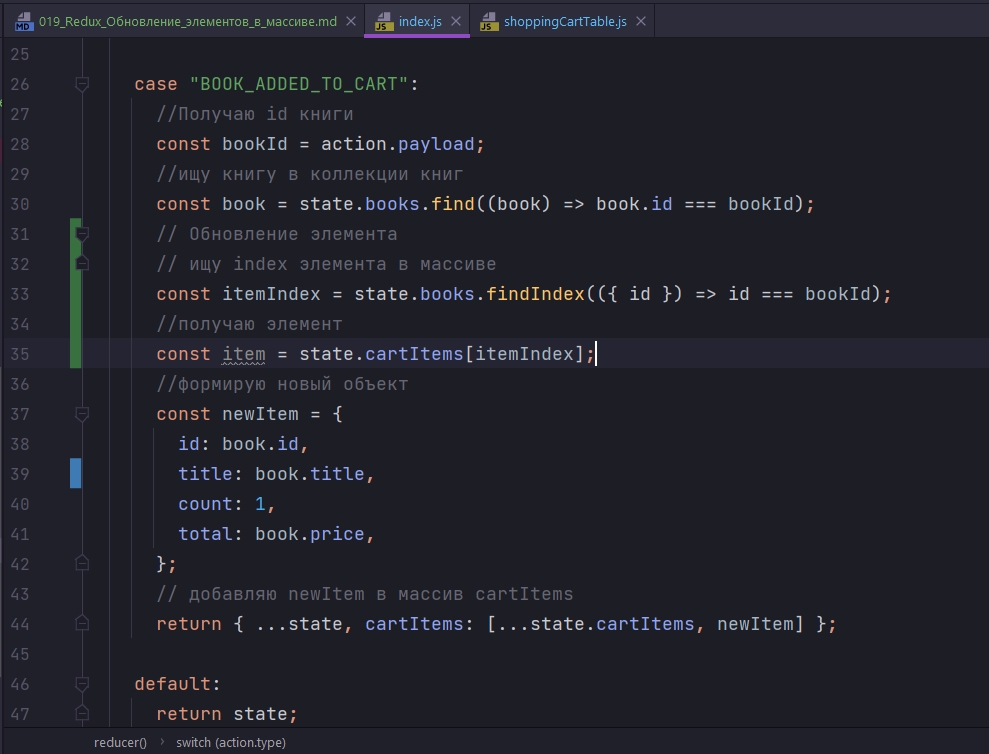

Если index -1, т.е. если этого элемента не существует, то вот это выражение const item = state.cartItems[itemIndex]; вернет undefined. Т.е. ошибки не будет, item будет просто undefined.

Отлично и теперь у меня есть элемент который нужно обновить если в действительности этот элемент существует.

Теперь нам как в прошлой версии кода нужно создать объект newItem. Все дело в том что тот item который мы получили, item который находится в старом state, мы не можем его изменять, мы его можем только читать. По этому не зависимо от того обновляем мы элемент или добавляем новый элемент, нам нужно будет создать новый объект newItem.

Только в случае добавления этого элемента мы просто дописываем его в конец массива. А в случае обновления мы заменяем старый элемент newItem на новый элемент. Таким образом мы не трогаем старый массив и старый state.

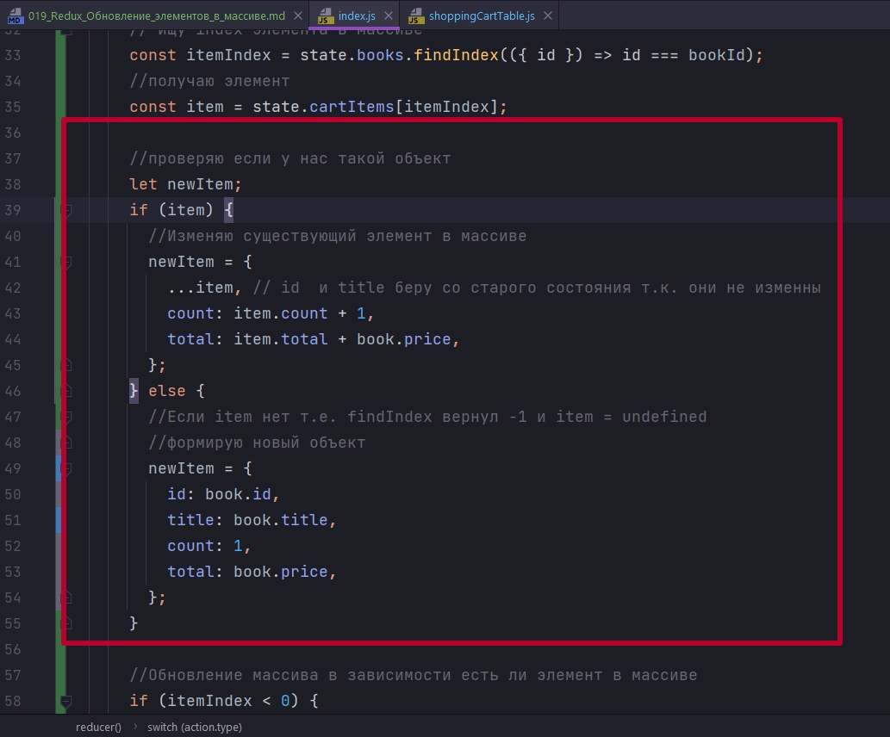

И так если такого item нет то я создаю объект newItem как и в прошлом уроке т.е. как прописано в блоке else. 

Однако если такой объект найдет и находится в item, то я обновляю объект. Поля id и title они не изменны по этому просто копирую их из старого состояния ...state. Изменяю количество для этого обращаюсь к старому  состоянию item.count и + 1 т.е. я увеличиваю на 1 старое значение count.

Точно так эе поступаю с price. total: item.total + book.price,

Теперь когда у нас есть новый элемент нам нужно обновить массив. Снова добавляю if. В условии пишу что если у нас itemIndex < 0 т.е. он -1, тот результат который возвращает findIndex(). То мы добавляем наш элемент в конец массива.

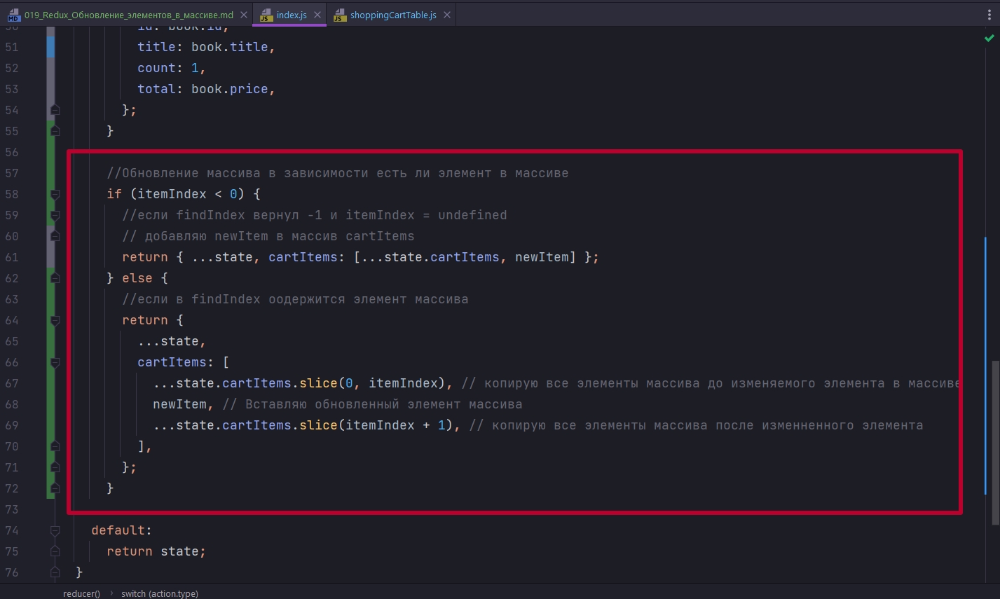

Если у нас есть существующий элемент, нам нужно вспомнить как мы обновляем массив, в случае если мы не хотим его модифицировать.

Нам нужно заменить элемент массива cartItems, элемент который находиться в itemIndex, на новый элемент. И для того что бы это сделать мы как бы разбиваем наш массив на три части.

1. Часть это все те элементы которые идут до нашего index. Для этого мы можем написать ...state.cartItems.slice(0, itemIndex) т.е. от ноля до itemIndex
2. Затем мы вставляем новфй элемент newItem
3. и нам нужно не забыть все те элементы которые идут после index.

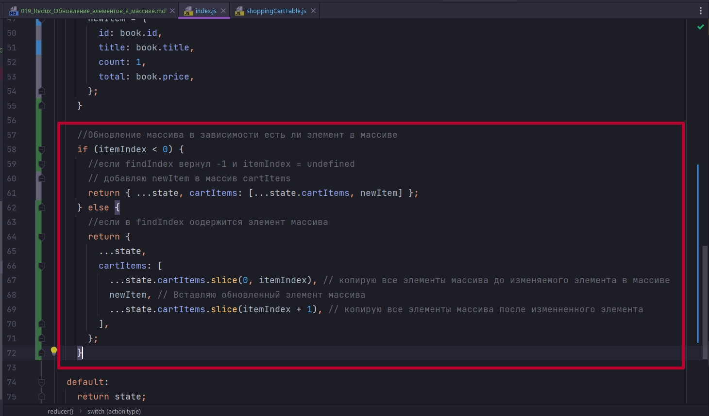

```js
//src/components/reducers/index.js
const initialState = {
    books: [],
    loading: true,
    error: null,
    cartItems: [],
    orderTotal: 220,
};

const reducer = (state = initialState, action) => {
    console.log(action.type);

    switch (action.type) {
        case "FETCH_BOOKS_REQUEST":
            return {
                ...state,
                books: [],
                loading: true,
                error: null,
            };
        case "FETCH_BOOKS_SUCCESS":
            return { ...state, books: action.payload, loading: false, error: null };
        case "FETCH_BOOKS_FAILURE":
            return { ...state, books: [], loading: false, error: action.payload };

        case "BOOK_ADDED_TO_CART":
            //Получаю id книги
            const bookId = action.payload;
            //ищу объект книги в коллекции книг
            const book = state.books.find((book) => book.id === bookId);
            // Обновление элемента
            // ищу объект по index элемента в массиве
            const itemIndex = state.books.findIndex(({ id }) => id === bookId);
            //itemIndex переменная в которой содержится индекс массива, получаю искомый объект
            const item = state.cartItems[itemIndex];

            //проверяю если у нас такой объект
            let newItem;
            if (item) {
                //Изменяю существующий элемент в массиве
                newItem = {
                    ...item, // id  и title беру со старого состояния т.к. они не изменны
                    count: item.count + 1,
                    total: item.total + book.price,
                };
            } else {
                //Если item нет т.е. findIndex вернул -1 и item = undefined
                //Создаю новый объект
                newItem = {
                    id: book.id,
                    title: book.title,
                    count: 1,
                    total: book.price,
                };
            }

            //Обновление массива в зависимости есть ли элемент в массиве
            if (itemIndex < 0) {
                //если findIndex вернул -1 и itemIndex = undefined
                // добавляю newItem в массив cartItems
                return { ...state, cartItems: [...state.cartItems, newItem] };
            } else {
                //если в findIndex оодержится элемент массива
                return {
                    ...state,
                    cartItems: [
                        ...state.cartItems.slice(0, itemIndex), // копирую все элементы массива до изменяемого элемента в массиве
                        newItem, // Вставляю обновленный элемент массива
                        ...state.cartItems.slice(itemIndex + 1), // копирую все элементы массива после изменненного элемента
                    ],
                };
            }

        default:
            return state;
    }
};

export default reducer;

```

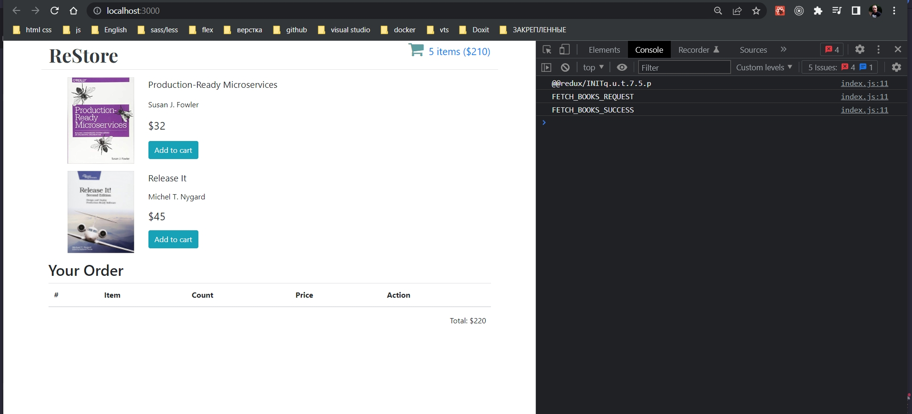

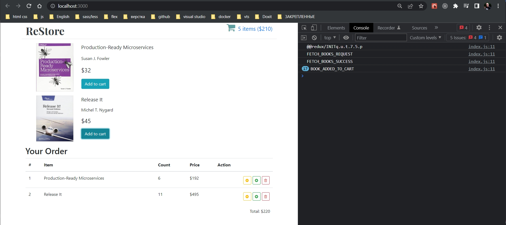


И так теперь когда мы убедились в том что наш код работает, давайте не будем его оставлять в таком состоянии, поскольку наш case "BOOK_ADDED_TO_CART" вырос довольно сильно. 

Давайте сделаем этот код немного лучше и вынесем некоторые части этого кода в отдельные функции.

В первую очередь я бы хотел бы вынести обновление нашего массива в отдельную функцию.


Создаю функцию updateCartItems которая будет заниматься обновлением массива. Эта функция будет принимать несколько аргументов.

1. В первую очередь ей понадобится cartItems.
2. затем ей понадобится тот элемент который мы будем обновлять item, добавлять к массиву или заменять им существующий элемент массива.
3. Ну и нам нужен index для того что бы знать куда именно мы будем вставлять этот элемент.

В теле функции пишу условие что если index это новый элемент index === -1, то ноужно просто его добавить в массив. Я возвращаю новый массив который состоит из всех элементов ...cartItems, и плюс новый элемент item.

Если же index это любое другое число, то мы обновляем существующий ...cartItems.slice(0, index) т.е. копирую все элементы до обновляемого элемента, затем вставляю обновленный элемент вместо существующего item, и затем добавляю второй кусок массива от измененного элемента и до конца массива ...cartItems.slice(index + 1).

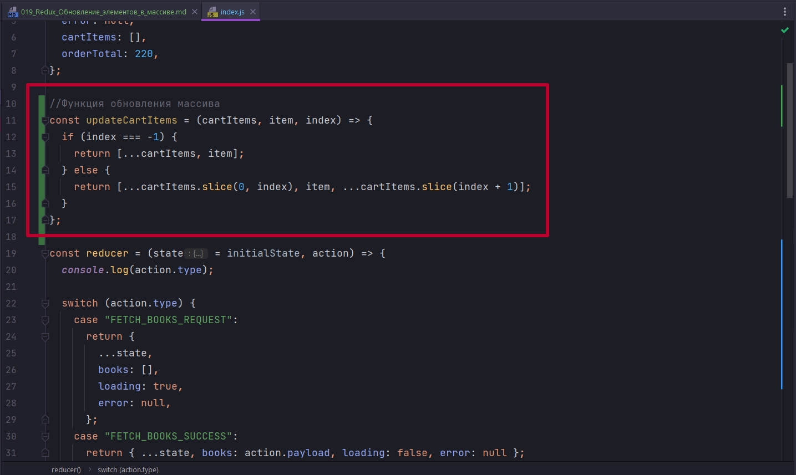

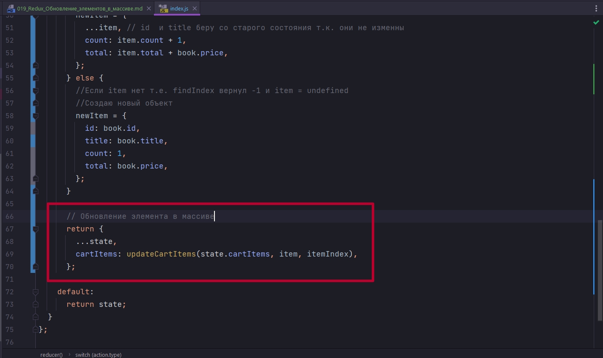

То место где мы создаем новый элемент тоже по сути может быть новой функцией. 

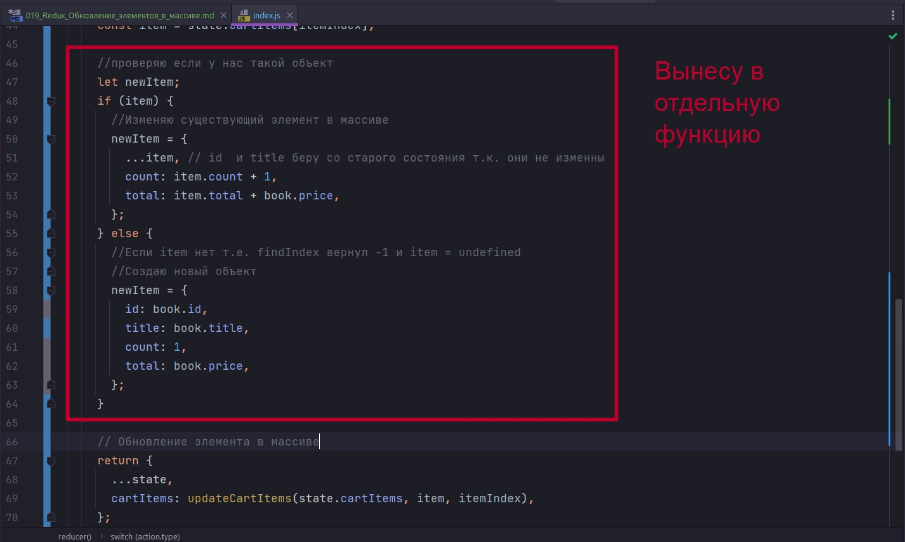

Этим кодом мы обновляем наш список покупок. По этому функцию назову updateCartItem.

1. В первую очередь нам понадобится книжка book которую мы добавляем к заказу. И нам понадобится элемент item списка заказов который мы будем обновлять. При этом если item = undefined мы знаем что такого элемента не существует и это первая книжка которую нам нужно создать.

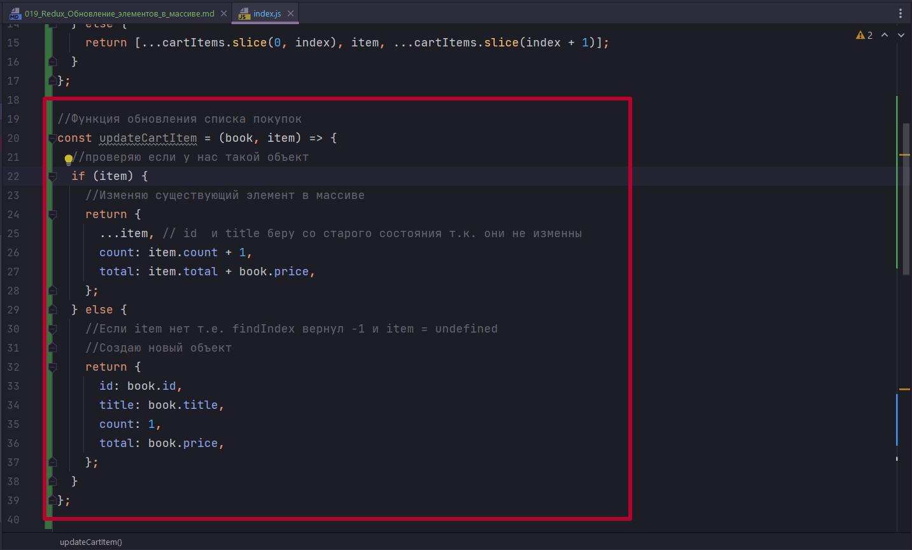

и даже этот код можно сделать немножечко проще. Вместо того что бы рассматривать два случая когда у нас существует предыдущий элемент и не существует предыдущий элемент. Давайте сделаем так что предыдущий элемент у нас существует всегда. Только в том случае если его действительно нет, мы сделаем нулевой элемент т.е. у которого ноль книг и нулевая цена. Таким образом когда мы будем добавлять еще одну книжку к этому элементу мы получим как раз нужный результат.

И для того что бы это сделать мы используем синтаксис деструктуризации для того что бы получить значения id, title, count, total

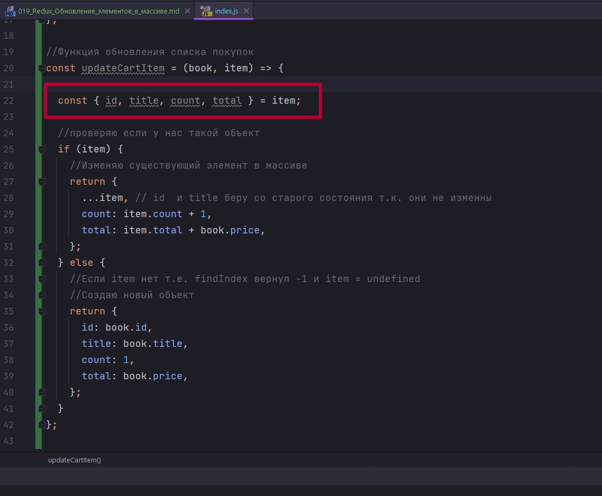

Но если этих значений в item нет, то мы дадим им значения по умолчанию.

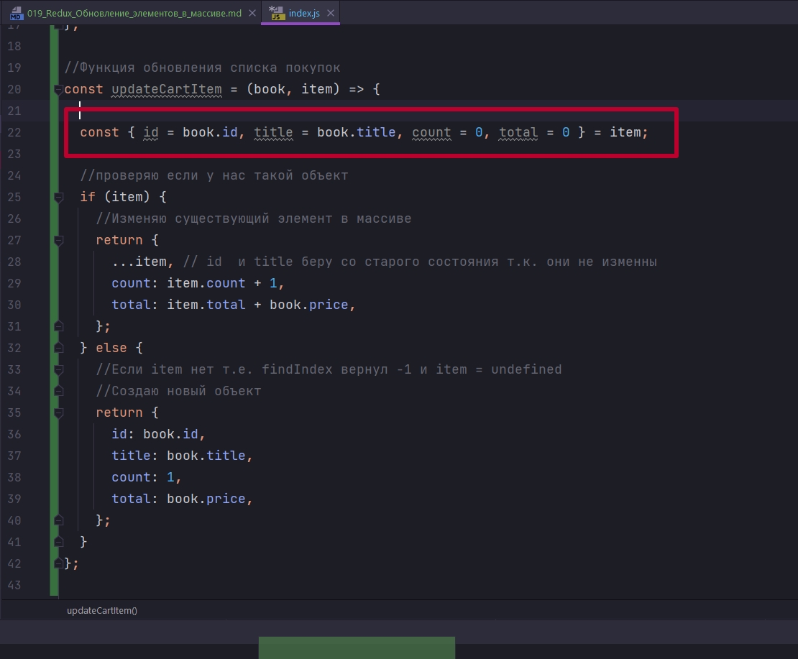

Но такой код не будет работать если item = undefined, он попросту сломается. Нам нужно сделать так что если item = undefined, то он по умолчанию будет пустым объектом.

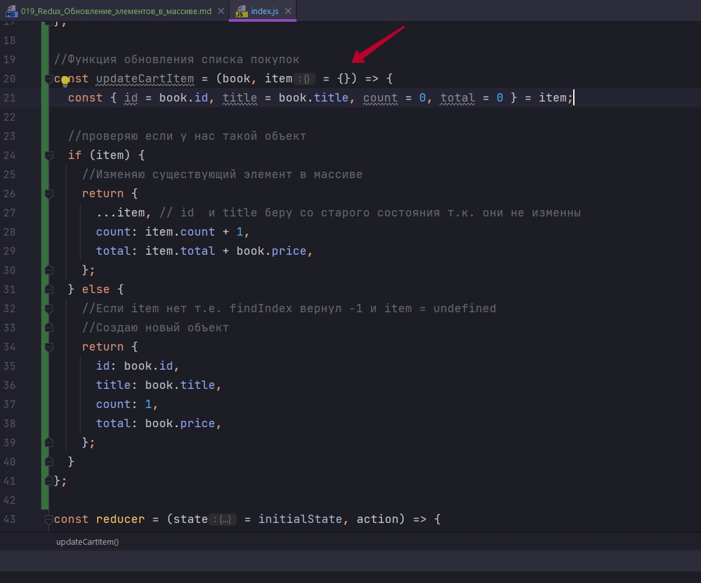

Таким образом если мы будем деструктурировать элементы, если мы работаем с пустым объектом, мы получим значения по умолчанию.

И теперь наши значения id, title, count, total будут значениями либо из существующего item т.е. либо существующие значения либо нули.

И теперь когда у меня есть вот такие гарантированные значения   const { id = book.id, title = book.title, count = 0, total = 0 } = item; Мы вместо того что бы писать if мы можем попросту вернуть один обновленный объект.

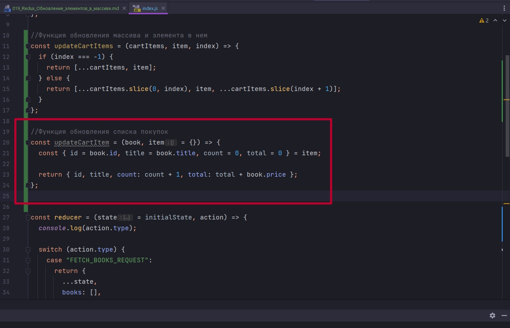

Вот такой вот элегантный прием в коде с использованием деструктуризации  и значений по умолчанию в деструктуризации, позволил нам написать намного более компактный и более читабельный код

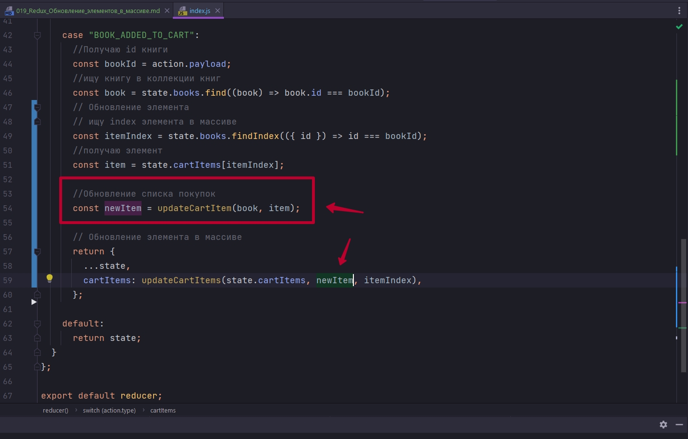

```js
//src/components/reducers/index.js
const initialState = {
  books: [],
  loading: true,
  error: null,
  cartItems: [],
  orderTotal: 220,
};

//Функция обновления массива и элемента в нем
const updateCartItems = (cartItems, item, index) => {
  if (index === -1) {
    return [...cartItems, item];
  } else {
    return [...cartItems.slice(0, index), item, ...cartItems.slice(index + 1)];
  }
};

//Функция обновления списка покупок
const updateCartItem = (book, item = {}) => {
  const { id = book.id, title = book.title, count = 0, total = 0 } = item;

  return { id, title, count: count + 1, total: total + book.price };
};

const reducer = (state = initialState, action) => {
  console.log(action.type);

  switch (action.type) {
    case "FETCH_BOOKS_REQUEST":
      return {
        ...state,
        books: [],
        loading: true,
        error: null,
      };
    case "FETCH_BOOKS_SUCCESS":
      return { ...state, books: action.payload, loading: false, error: null };
    case "FETCH_BOOKS_FAILURE":
      return { ...state, books: [], loading: false, error: action.payload };

    case "BOOK_ADDED_TO_CART":
        //Получаю id книги
        const bookId = action.payload;
        //ищу объект книги в коллекции книг
        const book = state.books.find((book) => book.id === bookId);
        // Обновление элемента
        // ищу объект по index элемента в массиве
        const itemIndex = state.books.findIndex(({ id }) => id === bookId);
        //itemIndex переменная в которой содержится индекс массива, получаю искомый объект
        const item = state.cartItems[itemIndex];

      //Обновление списка покупок
      const newItem = updateCartItem(book, item);

      // Обновление элемента в массиве
      return {
        ...state,
        cartItems: updateCartItems(state.cartItems, newItem, itemIndex),
      };

    default:
      return state;
  }
};

export default reducer;

```


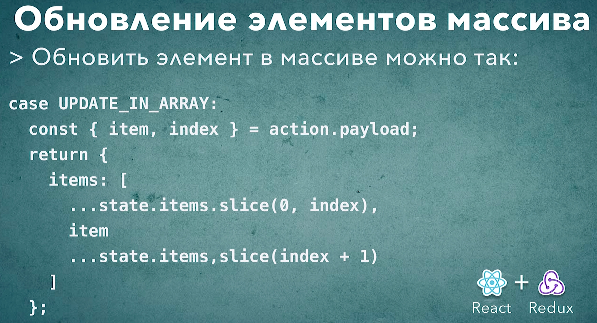

Смотри больше на код а не на скрины.


