# 020_Redux_удаление_элемента_из_массива

Функциональность нашего маленького интернет магазина уже почти закончена. Для того что бы окончательно реализовать базовую функциональность нам нужно оживить три кнопки.

1. Левая кнопка удаляет одну из книг из нашего заказа.
2. Средняя кнопка добавляет еще одну книгу к нашему заказу.
3. Правая кнопка удаляет полностью строку из заказа не зависимо от того сколько в ней книг.


Первое что я сделаю это добавлю еще несколько action creators. А именно bookRemoveFromCart и allBooksRemoveFromCart. 

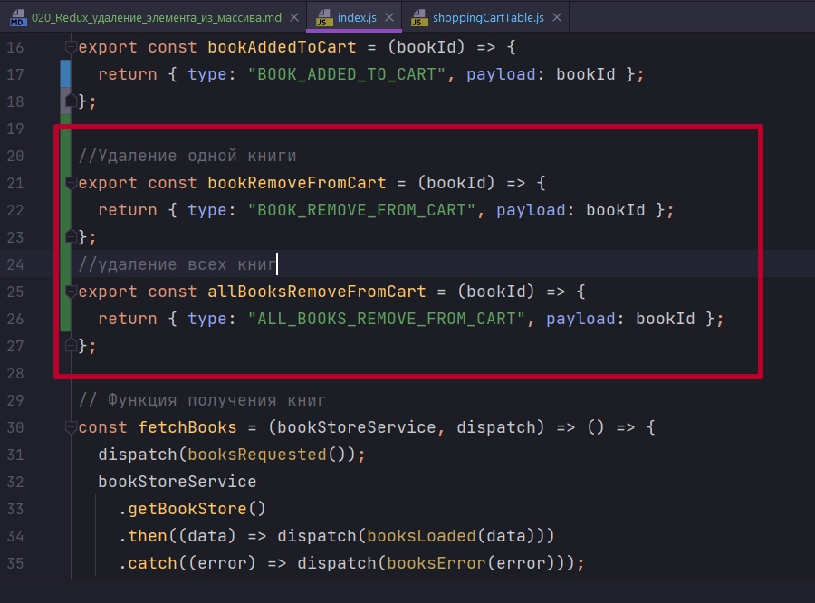

Ну и конечно когда мы говорим all, то мы говорим что это книги определенного типа, это книги с определенным id. И именно для этого мы передаем и в bookRemoveFromCart и allBooksRemoveFromCart bookId т.е. id той книги которую мы удаляем из нашего заказа.

```js
//src/components/actions/index.js

// Action Creators
const booksRequested = () => {
    return { type: "FETCH_BOOKS_REQUEST" };
};

const booksLoaded = (newBooks) => {
    return { type: "FETCH_BOOKS_SUCCESS", payload: newBooks };
};

const booksError = (error) => {
    return { type: "FETCH_BOOKS_FAILURE", payload: error };
};

export const bookAddedToCart = (bookId) => {
    return { type: "BOOK_ADDED_TO_CART", payload: bookId };
};

//Удаление одной книги
export const bookRemoveFromCart = (bookId) => {
    return { type: "BOOK_REMOVE_FROM_CART", payload: bookId };
};
//удаление всех книг
export const allBooksRemoveFromCart = (bookId) => {
    return { type: "ALL_BOOKS_REMOVE_FROM_CART", payload: bookId };
};

// Функция получения книг
const fetchBooks = (bookStoreService, dispatch) => () => {
    dispatch(booksRequested());
    bookStoreService
        .getBookStore()
        .then((data) => dispatch(booksLoaded(data)))
        .catch((error) => dispatch(booksError(error)));
};

export { fetchBooks };

```

Теперь мы можем использовать наши action creator в нашем компоненте ShoppingCartTable. После импортирования action creators в компонент мне нужно их передать в компонент под именами onIncrease, onDecrease, onDelete. Сделаем это при помощи функции mapDispatchToProps. Все что будут далеть наш action creators эт вызывать функции с нужными паарметрами и затем передавать созданное действие в Redux Store. И в этом случае мы можем в mapDispatchToProps передать не функцию, а обычный объект. И тогда Redux за нас обернет результирующие функции в bindActionCreators и сделает так что бы action creators автоматически передавали свои действия в redux store.

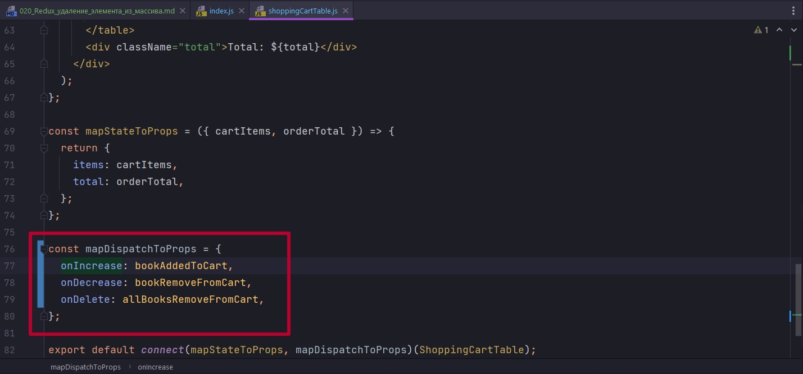

id я передаю в функции onClick.

```js
import React from "react";
import { connect } from "react-redux";
import {
  bookAddedToCart,
  bookRemoveFromCart,
  allBooksRemoveFromCart,
} from "../../actions/index";
import "./shoppingCartTable.css";

const ShoppingCartTable = ({
  items,
  total,
  onIncrease,
  onDecrease,
  onDelete,
}) => {
  const renderRow = (item, index) => {
    const { id, title, count, total } = item;
    return (
      <tr key={id}>
        <td>{index + 1}</td>
        <td>{title}</td>
        <td>{count}</td>
        <td>${total}</td>
        <td>
          <button
            onClick={() => onDelete(id)}
            className="btn btn-outline-danger btn-sm float-right"
          >
            <i className="fa fa-trash-o" />
          </button>
          <button
            onClick={() => onIncrease(id)}
            className="btn btn-outline-success btn-sm float-right"
          >
            <i className="fa fa-plus-circle" />
          </button>
          <button
            onClick={() => onDecrease(id)}
            className="btn btn-outline-warning btn-sm float-right"
          >
            <i className="fa fa-minus-circle" />
          </button>
        </td>
      </tr>
    );
  };

  return (
    <div className="shopping-cart-table">
      <h2>Your Order</h2>
      <table className="table">
        <thead>
          <tr>
            <th>#</th>
            <th>Item</th>
            <th>Count</th>
            <th>Price</th>
            <th>Action</th>
          </tr>
        </thead>
        <tbody>{items.map(renderRow)}</tbody>
      </table>
      <div className="total">Total: ${total}</div>
    </div>
  );
};

const mapStateToProps = ({ cartItems, orderTotal }) => {
  return {
    items: cartItems,
    total: orderTotal,
  };
};

const mapDispatchToProps = {
  onIncrease: bookAddedToCart,
  onDecrease: bookRemoveFromCart,
  onDelete: allBooksRemoveFromCart,
};

export default connect(mapStateToProps, mapDispatchToProps)(ShoppingCartTable);

```

Теперь действия реализованы и наши кнопнки начнут работать автоматически.

И так кнопка с плюсом уже работает, т.к. кнопка + и кнопка Add to cart используют один и тот же action creator и одно и тоже выполнение действия из функции reducer.

action creator отправка действия

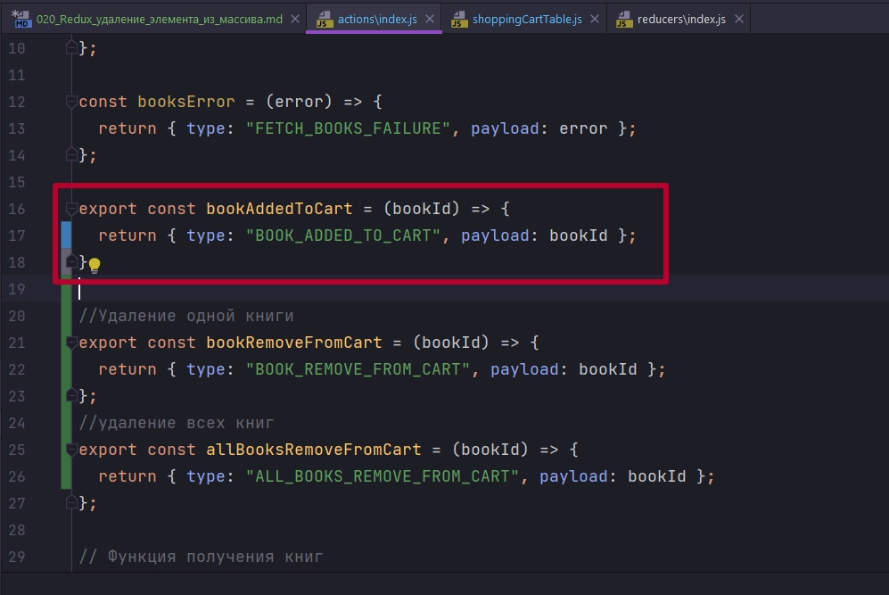

И выполнение действия. Обновление элемента в массиве если я жму кнопку +

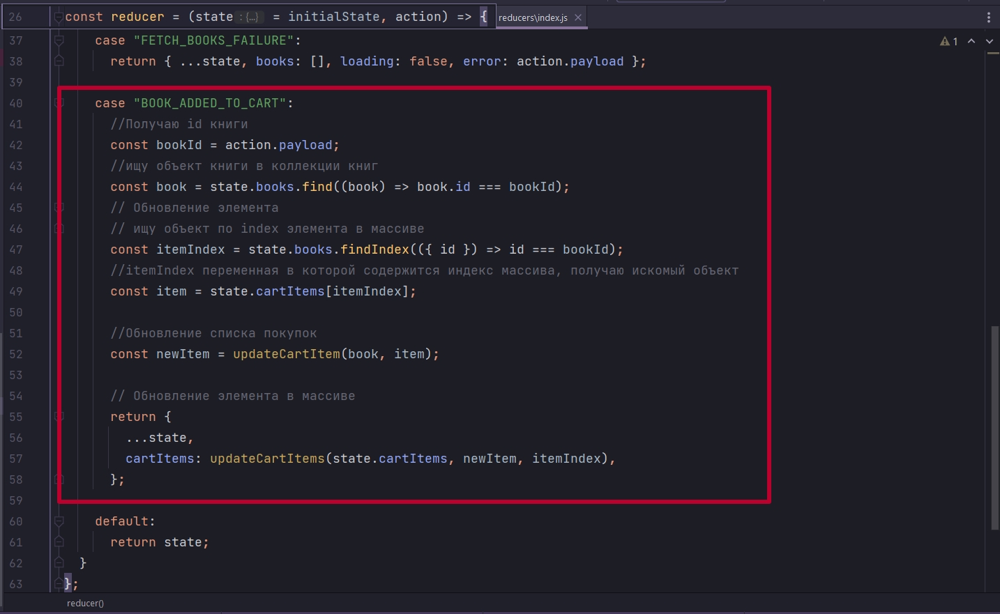

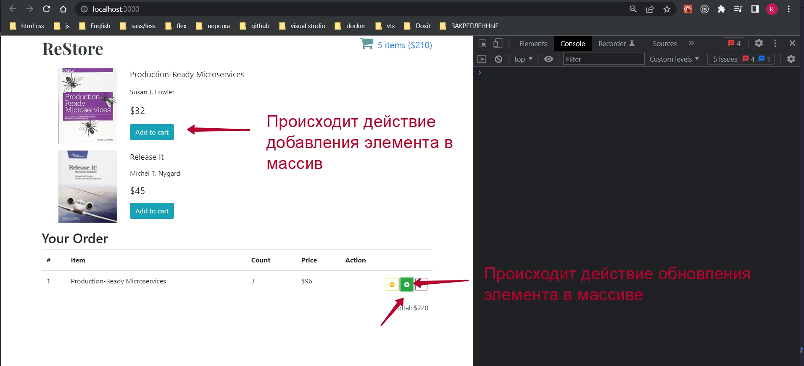

Осталось написать код для уменьшения количества книг, и для удаления всех книг одного типа.

Переходим в reducer.

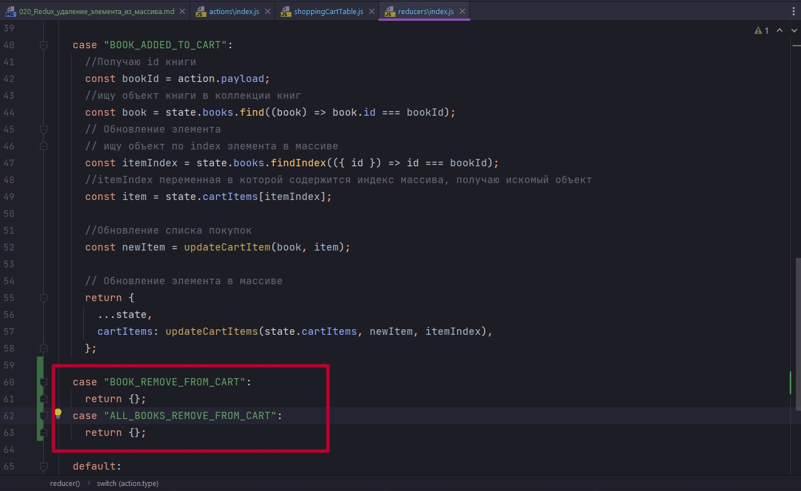

Если мы внимательно посмотрим на логику нашего приложения, то станет очевидно что для того что бы удалить книгу из заказа, мы будем выполнять большинство тех же действий которые мы выполняем для того что бы добавить книгу к заказу.

Нам точно так же нужно будет получить bookId, объект с книгой book, индекс существующего элемента itemIndex, ну и сам элемент item для того что бы уменьшит количество книг. 

Будет логично не копировать весь этот код. А вынести его в отдельную функцию и посмотреть как мы можем его переиспользовать.


Создаю еще одну функцию updateOrder. Для того что бы нам обновить наш Order нам понадобится текущий state, и вторым параметром нам нужно каким-то образом узнать каким именно способом мы обновляем наш заказ, добавлям мы книжки или удаляем.

Но пока что начну с того что просто добавлю туда весь код добавления книги.

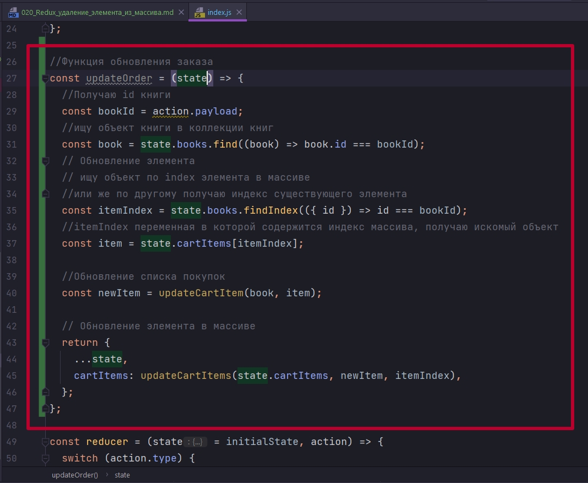

И так теперь еще начинаем рефакторить. Вторым аргументом передаю bookId для того что бы мне не нужно было вытаскивать его из action.payload, т.е. я ужа нахожусь не в функции reducer и action.payload у меня просто нет.

И короме того получим из нашего объекта state все что нужно.

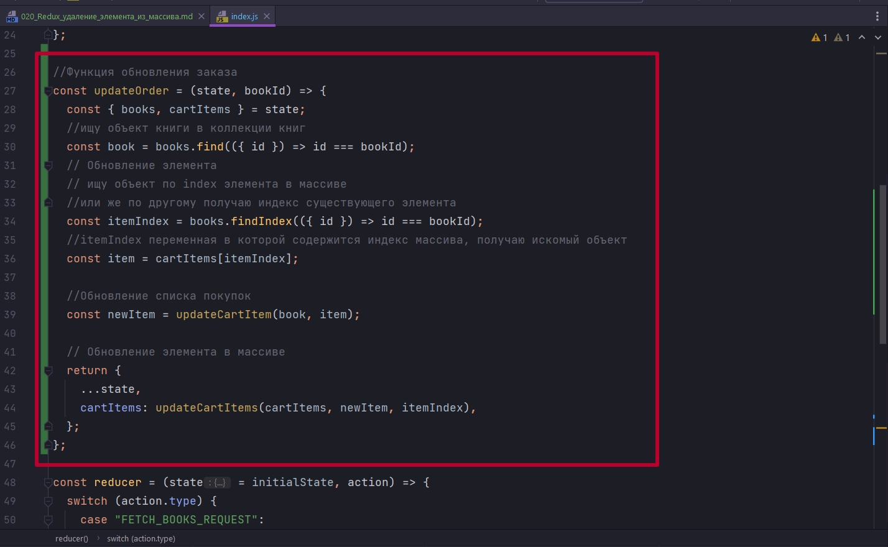

Добавляю эту функцию певым параметорм в которую передаю state а вторым action.payload в котором содержится id книги.

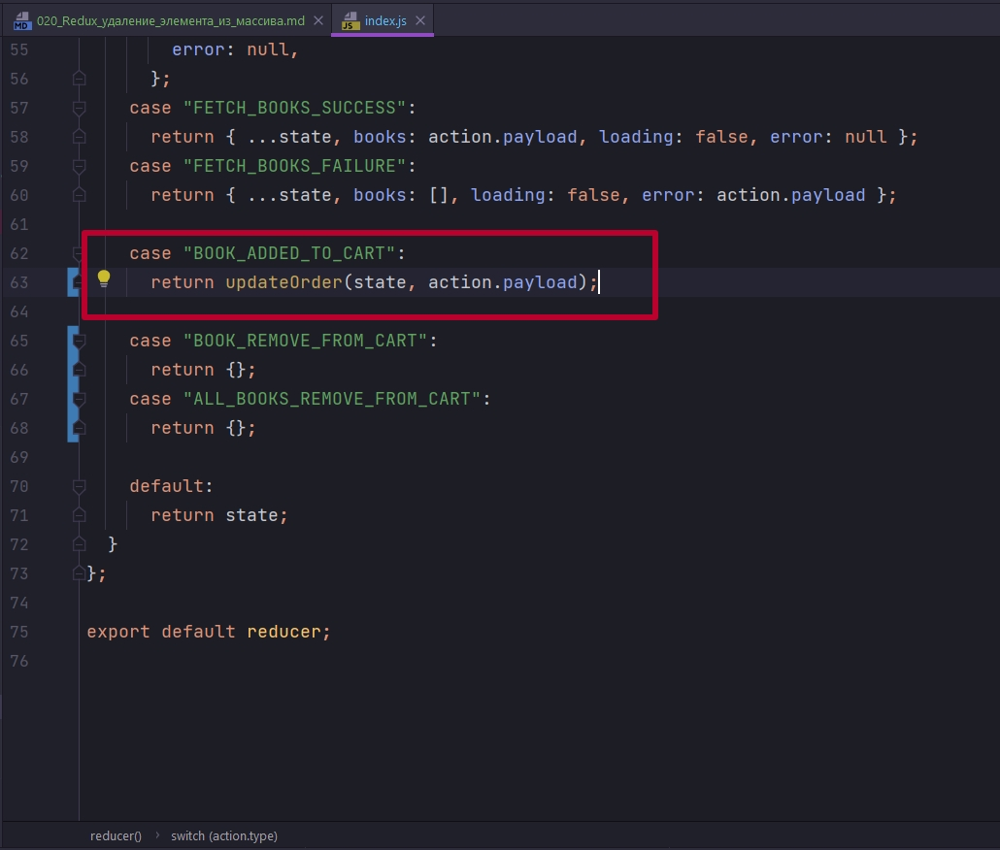

```js
//src/components/reducers/index.js
const initialState = {
    books: [],
    loading: true,
    error: null,
    cartItems: [],
    orderTotal: 220,
};

//Функция обновления массива и элемента в нем
const updateCartItems = (cartItems, item, index) => {
    if (index === -1) {
        return [...cartItems, item];
    } else {
        return [...cartItems.slice(0, index), item, ...cartItems.slice(index + 1)];
    }
};

//Функция обновления списка покупок
const updateCartItem = (book, item = {}) => {
    const { id = book.id, title = book.title, count = 0, total = 0 } = item;

    return { id, title, count: count + 1, total: total + book.price };
};

//Функция обновления заказа
const updateOrder = (state, bookId) => {
    const { books, cartItems } = state;
    //ищу объект книги в коллекции книг
    const book = books.find(({ id }) => id === bookId);
    // Обновление элемента
    // ищу объект по index элемента в массиве
    //или же по другому получаю индекс существующего элемента
    const itemIndex = books.findIndex(({ id }) => id === bookId);
    //itemIndex переменная в которой содержится индекс массива, получаю искомый объект
    const item = cartItems[itemIndex];

    //Обновление списка покупок
    const newItem = updateCartItem(book, item);

    // Обновление элемента в массиве
    return {
        ...state,
        cartItems: updateCartItems(cartItems, newItem, itemIndex),
    };
};

const reducer = (state = initialState, action) => {
    switch (action.type) {
        case "FETCH_BOOKS_REQUEST":
            return {
                ...state,
                books: [],
                loading: true,
                error: null,
            };
        case "FETCH_BOOKS_SUCCESS":
            return { ...state, books: action.payload, loading: false, error: null };
        case "FETCH_BOOKS_FAILURE":
            return { ...state, books: [], loading: false, error: action.payload };

        case "BOOK_ADDED_TO_CART":
            return updateOrder(state, action.payload);

        case "BOOK_REMOVE_FROM_CART":
            return {};
        case "ALL_BOOKS_REMOVE_FROM_CART":
            return {};

        default:
            return state;
    }
};

export default reducer;

```

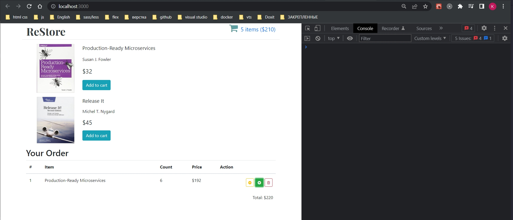

Все так же работатет.

И теперь если мы с вами посмотрим на то что же нужно сделать для того что бы удалить книгу из заказа, то мы увидим что нужно изменить не так много. Единственные места которые нужно будет изменить это в функции updateCartItem

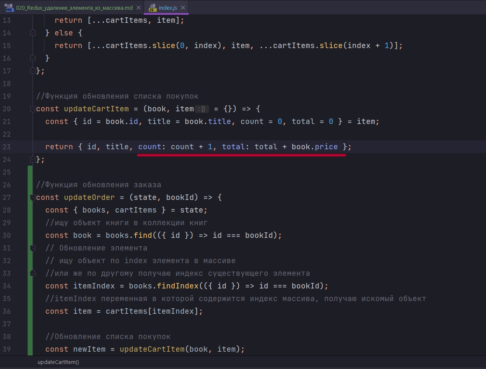

Здесь мы всегда добавляем +1 к количеству книг, и добавляем цену к общей стоимости заказа.

Но теперь нам нужно поддержать не только добавление книги, но еще и удаление книги.

Первая мысль которая может придти в голову это сказать. Ну если у нас есть два действия добавление и удаление давайте добавим еще один параметр который будет нам говорить что нам нужно делать. И давате добавим булевый параметр shouldAdd, а затем в интересующих меня полях напишем пару логических выражений.

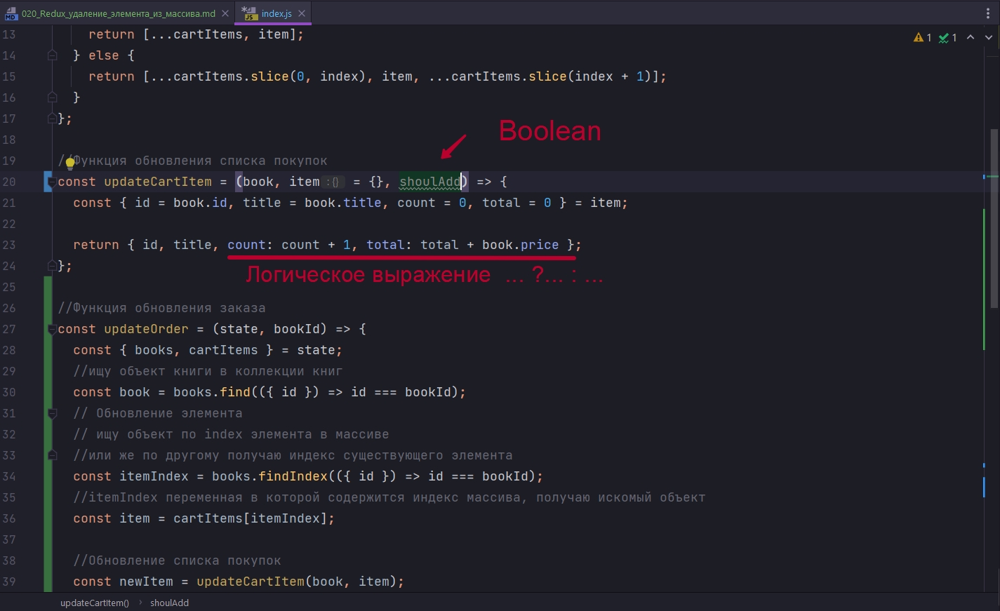


Но если честно, то это плохое решение.

Вместо boolean мы можем передать количество книг которые мы хотим добавить. Передаю третьим параметром quantity. Именно это количество книг мы будем добавлять к количеству книг к строке. Ну а цену мы будем умножать на то количество книг которое мы будем добавлять.

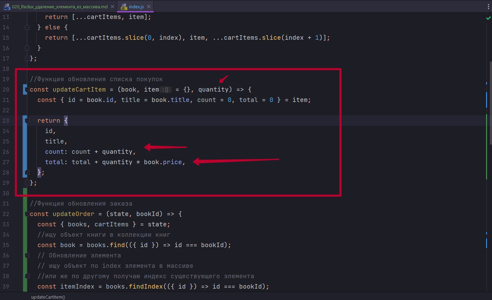

А теперь если у вас возник вопрос. А как же это нам поможет удалять книжки из заказа? Ведь мы все равно используем +. Для того что бы удалить книжку, нам нужно добавить -1 книжку. Т.е. если в качестве quantity мы передадим -1, то мы уменьшим количество книг на 1 и отнимем от общей стоимости количество книг умноженное на цену.

Добавлю quantity в качестве третьего аргумента в updateOrder. И передадим количество книг в updateCartItem.

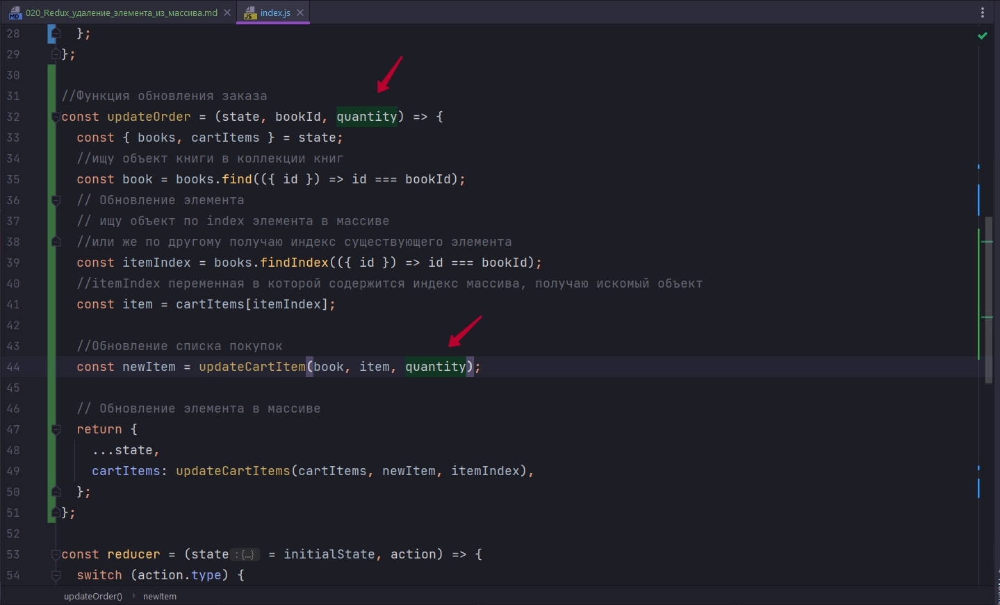

и теперь вернемся в reducer и добавим в качестве quantity 1 в BOOK_ADDED_TO_CART

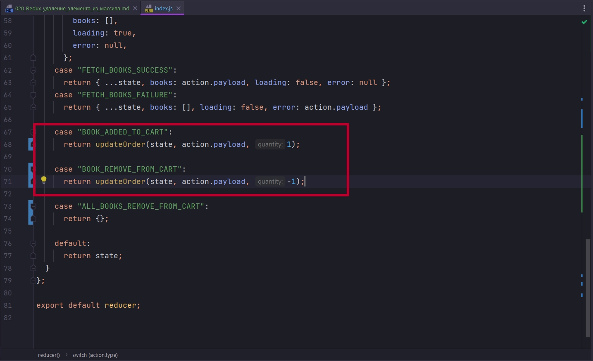

Всего парой строк кода и одним дополнительным параметром у функции мы с вами избежали огромного количесва copy paste.

```js
//src/components/reducers/index.js
const initialState = {
  books: [],
  loading: true,
  error: null,
  cartItems: [],
  orderTotal: 220,
};

//Функция обновления массива и элемента в нем
const updateCartItems = (cartItems, item, index) => {
  if (index === -1) {
    return [...cartItems, item];
  } else {
    return [...cartItems.slice(0, index), item, ...cartItems.slice(index + 1)];
  }
};

//Функция обновления списка покупок
const updateCartItem = (book, item = {}, quantity) => {
  const { id = book.id, title = book.title, count = 0, total = 0 } = item;
  console.log("updateCartItem", quantity);
  return {
    id,
    title,
    count: count + quantity,
    total: total + quantity * book.price,
  };
};

//Функция обновления заказа
const updateOrder = (state, bookId, quantity) => {
  const { books, cartItems } = state;
  //ищу объект книги в коллекции книг
  const book = books.find(({ id }) => id === bookId);
  // Обновление элемента
  // ищу объект по index элемента в массиве
  //или же по другому получаю индекс существующего элемента
  const itemIndex = books.findIndex(({ id }) => id === bookId);
  //itemIndex переменная в которой содержится индекс массива, получаю искомый объект
  const item = cartItems[itemIndex];

  //Обновление списка покупок
  const newItem = updateCartItem(book, item, quantity);

  // Обновление элемента в массиве
  return {
    ...state,
    cartItems: updateCartItems(cartItems, newItem, itemIndex),
  };
};

const reducer = (state = initialState, action) => {
  switch (action.type) {
    case "FETCH_BOOKS_REQUEST":
      return {
        ...state,
        books: [],
        loading: true,
        error: null,
      };
    case "FETCH_BOOKS_SUCCESS":
      return { ...state, books: action.payload, loading: false, error: null };
    case "FETCH_BOOKS_FAILURE":
      return { ...state, books: [], loading: false, error: action.payload };

    case "BOOK_ADDED_TO_CART":
      return updateOrder(state, action.payload, 1);

    case "BOOK_REMOVE_FROM_CART":
      return updateOrder(state, action.payload, -1);

    case "ALL_BOOKS_REMOVE_FROM_CART":
      return {};

    default:
      return state;
  }
};

export default reducer;

```


И как видите мы може уйти в минус. Однако лучше сделать когда мы доходим до ноля удалить строку полностью.

У нас есть функция updateCartItems - это именно та функция которая отвечает за обновление массива. Эта функция умеет добавлять элемент к концу массива. Эта функция умеет обновлять массив и заменять текущий элемент новым. Но теперь нам нужно сделать так что бы эта функция еще умела и удалять элемент.

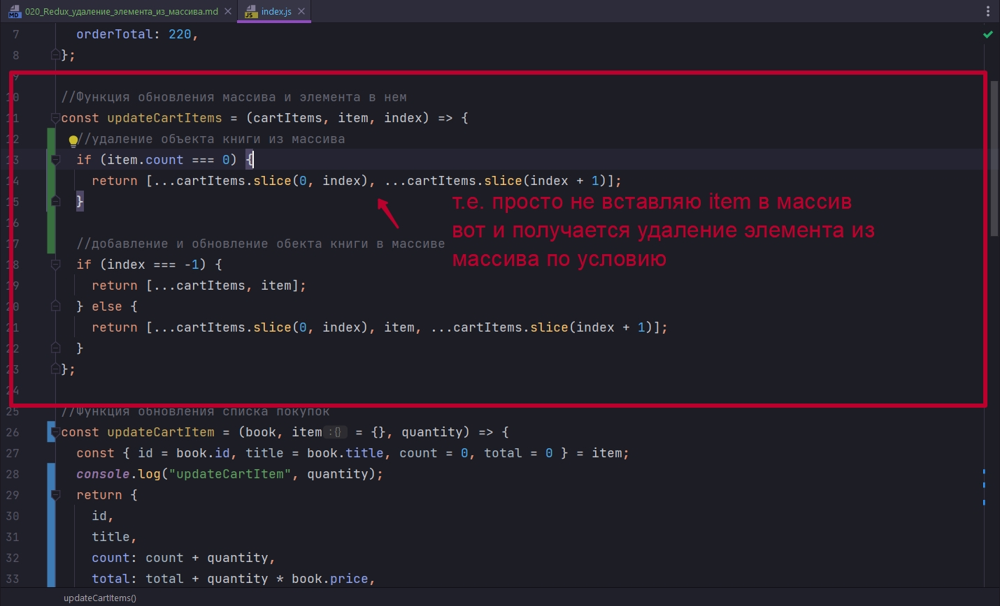


Т.е. мы создаем новый массив в котором есть все элементы до нужного ...cartItems.slice(0, index) и все элементы после нужного ...cartItems.slice(index + 1), нужный же элемент удаляется.

```js
//src/components/reducers/index.js
const initialState = {
  books: [],
  loading: true,
  error: null,
  cartItems: [],
  orderTotal: 220,
};

//Функция обновления массива и элемента в нем
const updateCartItems = (cartItems, item, index) => {
  //удаление объекта книги из массива
  if (item.count === 0) {
    return [...cartItems.slice(0, index), ...cartItems.slice(index + 1)];
  }

  //добавление и обновление обекта книги в массиве
  if (index === -1) {
    return [...cartItems, item];
  } else {
    return [...cartItems.slice(0, index), item, ...cartItems.slice(index + 1)];
  }
};

//Функция обновления списка покупок
const updateCartItem = (book, item = {}, quantity) => {
  const { id = book.id, title = book.title, count = 0, total = 0 } = item;
  console.log("updateCartItem", quantity);
  return {
    id,
    title,
    count: count + quantity,
    total: total + quantity * book.price,
  };
};

//Функция обновления заказа
const updateOrder = (state, bookId, quantity) => {
  const { books, cartItems } = state;
  //ищу объект книги в коллекции книг
  const book = books.find(({ id }) => id === bookId);
  // Обновление элемента
  // ищу объект по index элемента в массиве
  //или же по другому получаю индекс существующего элемента
  const itemIndex = books.findIndex(({ id }) => id === bookId);
  //itemIndex переменная в которой содержится индекс массива, получаю искомый объект
  const item = cartItems[itemIndex];

  //Обновление списка покупок
  const newItem = updateCartItem(book, item, quantity);

  // Обновление элемента в массиве
  return {
    ...state,
    cartItems: updateCartItems(cartItems, newItem, itemIndex),
  };
};

const reducer = (state = initialState, action) => {
  switch (action.type) {
    case "FETCH_BOOKS_REQUEST":
      return {
        ...state,
        books: [],
        loading: true,
        error: null,
      };
    case "FETCH_BOOKS_SUCCESS":
      return { ...state, books: action.payload, loading: false, error: null };
    case "FETCH_BOOKS_FAILURE":
      return { ...state, books: [], loading: false, error: action.payload };

    case "BOOK_ADDED_TO_CART":
      return updateOrder(state, action.payload, 1);

    case "BOOK_REMOVE_FROM_CART":
      return updateOrder(state, action.payload, -1);

    case "ALL_BOOKS_REMOVE_FROM_CART":
      return {};

    default:
      return state;
  }
};

export default reducer;

```

Теперь осталось реализовать удаление всей строки. Для того что бы удалить всю строку нам нужно уменьшить количество книг на количество которое есть в заказе.

Для начало в reducer в case ALL_BOOKS_REMOVE_FROM_CART найду элемент с нужным id т.е.  const item = state.cartItems.find(({ id }) => id === action.payload);

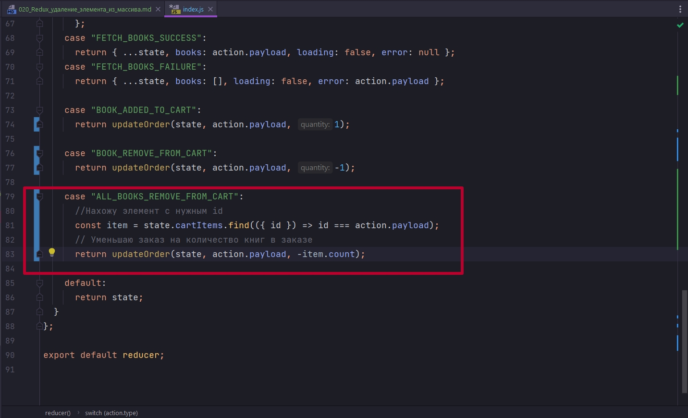

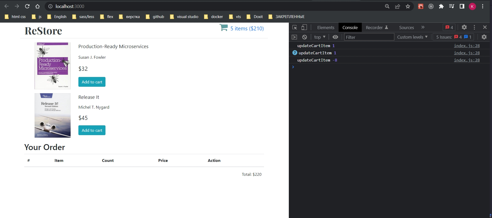

```js
//src/components/reducers/index.js
const initialState = {
  books: [],
  loading: true,
  error: null,
  cartItems: [],
  orderTotal: 220,
};

//Функция обновления массива и элемента в нем
const updateCartItems = (cartItems, item, index) => {
  //удаление объекта книги из массива
  if (item.count === 0) {
    return [...cartItems.slice(0, index), ...cartItems.slice(index + 1)];
  }

  //добавление и обновление обекта книги в массиве
  if (index === -1) {
    return [...cartItems, item];
  } else {
    return [...cartItems.slice(0, index), item, ...cartItems.slice(index + 1)];
  }
};

//Функция обновления списка покупок
const updateCartItem = (book, item = {}, quantity) => {
  const { id = book.id, title = book.title, count = 0, total = 0 } = item;
  console.log("updateCartItem", quantity);
  return {
    id,
    title,
    count: count + quantity,
    total: total + quantity * book.price,
  };
};

//Функция обновления заказа
const updateOrder = (state, bookId, quantity) => {
  const { books, cartItems } = state;
  //ищу объект книги в коллекции книг
  const book = books.find(({ id }) => id === bookId);
  // Обновление элемента
  // ищу объект по index элемента в массиве
  //или же по другому получаю индекс существующего элемента
  const itemIndex = books.findIndex(({ id }) => id === bookId);
  //itemIndex переменная в которой содержится индекс массива, получаю искомый объект
  const item = cartItems[itemIndex];

  //Обновление списка покупок
  const newItem = updateCartItem(book, item, quantity);

  // Обновление элемента в массиве
  return {
    ...state,
    cartItems: updateCartItems(cartItems, newItem, itemIndex),
  };
};

const reducer = (state = initialState, action) => {
  switch (action.type) {
    case "FETCH_BOOKS_REQUEST":
      return {
        ...state,
        books: [],
        loading: true,
        error: null,
      };
    case "FETCH_BOOKS_SUCCESS":
      return { ...state, books: action.payload, loading: false, error: null };
    case "FETCH_BOOKS_FAILURE":
      return { ...state, books: [], loading: false, error: action.payload };

    case "BOOK_ADDED_TO_CART":
      return updateOrder(state, action.payload, 1);

    case "BOOK_REMOVE_FROM_CART":
      return updateOrder(state, action.payload, -1);

    case "ALL_BOOKS_REMOVE_FROM_CART":
      //Нахожу элемент с нужным id
      const item = state.cartItems.find(({ id }) => id === action.payload);
      // Уменьшаю заказ на количество книг в заказе
      return updateOrder(state, action.payload, -item.count);

    default:
      return state;
  }
};

export default reducer;

```

У нас с вами появилась одна очень-очень удобная функция на котрую вы можете смотреть если вам вдруг понадобиться вспомнить как именно работать с массивами в Redux. Эта функция updateCartItems. Она умеет удалять элементы из массива если количество книг равно нулю. Она умеет добавлять новые жлементы к массиву, и она умеет обновлять существующий массив. Это все те три действия которые вам могут понадобится в ваших собственных проектах.

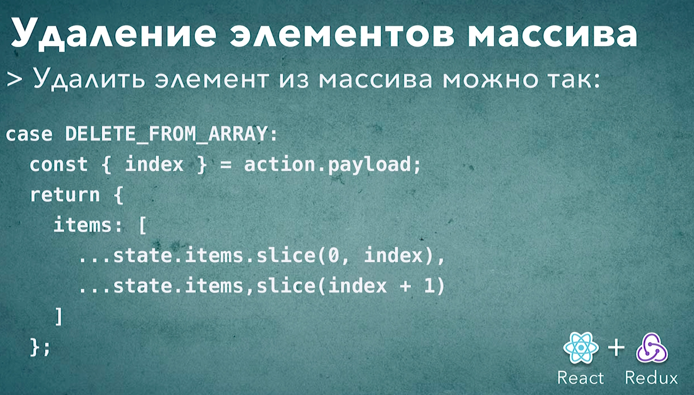


