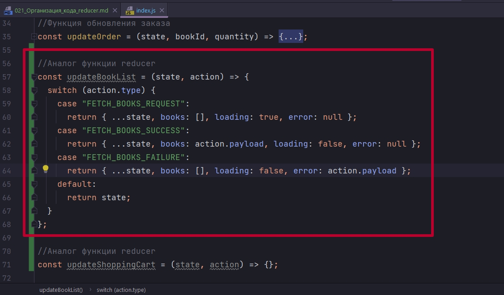
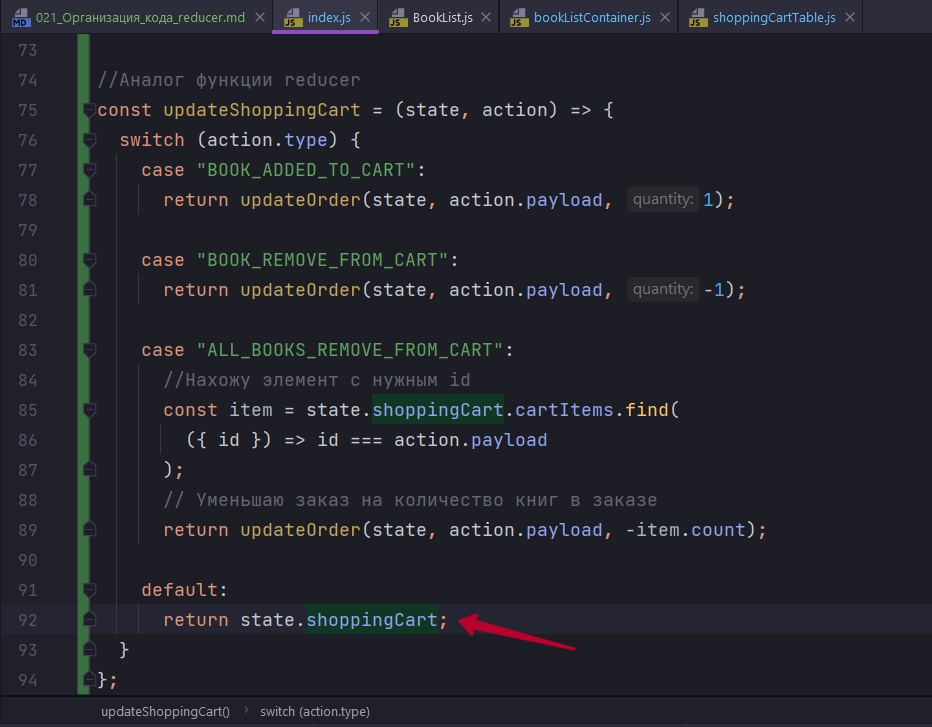

# 021_Организация_кода_reducer

Мы написали небольшое приложение. Но размер reducer уже угрожающий. Мы уже вышли за сотню строк кода. И при этом у нас всего шесть действий. А что будет если в нашем приложении будет сотни действий как в крупных приложениях?

Уже на этом этапе нужно задумываться как правильно организовать наш код нашего reducer так что бы при увеличении нашего приложения наш reducer хорошо масштабировался и мы могли работать с этим кодом.

Если мы посмотрим на те действия с которыми работает наш reducer. То мы увидим что действия делятся на две категории.

1. Категория это действия которые работают со списком книг FETCH_BOOKS_REQUEST, FETCH_BOOKS_SUCCESS, FETCH_BOOKS_FAILURE
2. И втрой тип действия это е действия которые работают со списком заказа BOOK_ADDED_TO_CART, BOOK_REMOVE_FROM_CART, ALL_BOOKS_REMOVE_FROM_CART

Когда у нас есть такие категории дейтсвий, которые обновляют связанные между собой структуры данных в state. У нас есть хороший шанс разбить reducer на более мелкие функции.


Мы создадим одну функцию которая будет работать со списком книг. И другую отдельную функцию которая будет работать со списком заказов.

И для того что бы эти функции работали независимо. Для того что бы нам не нужно было писать логику объединения разных объектов, мы разобьем наш глобальный state на два объекта.

В initialState мы создадим объект booksList:{} в нутри него поместим books, loading, error.

И мы создадим второй объект shoppingCart:{}  в который поместим cartItems, orderTotal.


А теперь попробуем разбить логику нашего reducer на две функции. Первую функцию мы назовем updateBookList которая будет отвечать только за работу с объектом bookList.

А вторую функцию мы назовем updateShoppingCart котора будет соответственно отвечать за работу с объектом shoppingCart.

Функция updateBookList будет точно так же принимать кк и reducer state и action.


Начну писать код с updateBookList 



Для того что бы этот код начал работать нам нужно пересмотреть структуру этого кода. До того как мы начали этот рефакторинг, и те поля которые относятся к списку книг


И те которые относились к списку покупок, находились в глобальном state


По этому мне нужно было писать вот такие выражения ...state для того что бы сохранить остальные поля state.

Теперь же наша функция работает только с объектом bookList. По этому вот эта строка копирования ...state нам больше не нужна.


И теперь сразу же перенесу последние три действия в updateShoppingCart.


Поскольку мы немного обновили структуру нашего глобального state, нам нужно будет обновить нашу функцию updateOrder, поскольку поля теперь будут находится немного в дугом месте. Данные теперь будут находится немного в другом месте. books и cartItems раньше были непосредственно в state. Теперь же books будет в bookList:{book}, ну а cartItems в shoppingCart:{cartItems}.


И если раньше функция updateOrder возвращала полный state, то теперь мне нужно вернуть ту часть которая отвечает за shoppingCart. Пока что вместо полного state мы будем возвращать   orderTotal: 0. ПОТОМ ИЗМЕНЮ ЭТО.


Теперь мы можем переписать код reducer для того что бы использовать функции updateBookList и updateShoppingCart.


Мы знаем что наша функция updateBookList умеет обрабатывать вот эти три типа действия FETCH_BOOKS_REQUEST, FETCH_BOOKS_SUCCESS, FETCH_BOOKS_FAILURE, по этому когда одно из этих действий приходит мы вызываем updateBookList для того что бы обновить поле bookList в глобальном стейте. Ну а оставшуюся часть ...state мы сохраняем как есть.

Точно так же мы можем переписать наш reducer для других трех действий.


```js
//src/components/reducers/index.js
const initialState = {
  bookList: { books: [], loading: true, error: null },
  shoppingCart: { cartItems: [], orderTotal: 0 },
};

//Функция обновления массива и элемента в нем
const updateCartItems = (cartItems, item, index) => {
  //удаление объекта книги из массива
  if (item.count === 0) {
    return [...cartItems.slice(0, index), ...cartItems.slice(index + 1)];
  }

  //добавление и обновление обекта книги в массиве
  if (index === -1) {
    return [...cartItems, item];
  } else {
    return [...cartItems.slice(0, index), item, ...cartItems.slice(index + 1)];
  }
};

//Функция обновления списка покупок
const updateCartItem = (book, item = {}, quantity) => {
  const { id = book.id, title = book.title, count = 0, total = 0 } = item;
  console.log("updateCartItem", quantity);
  return {
    id,
    title,
    count: count + quantity,
    total: total + quantity * book.price,
  };
};

//Функция обновления заказа
const updateOrder = (state, bookId, quantity) => {
  const {
    bookList: { books },
    shoppingCart: { cartItems },
  } = state;

  //ищу объект книги в коллекции книг
  const book = books.find(({ id }) => id === bookId);
  // Обновление элемента
  // ищу объект по index элемента в массиве
  //или же по другому получаю индекс существующего элемента
  const itemIndex = books.findIndex(({ id }) => id === bookId);
  //itemIndex переменная в которой содержится индекс массива, получаю искомый объект
  const item = cartItems[itemIndex];

  //Обновление списка покупок
  const newItem = updateCartItem(book, item, quantity);

  // Обновление элемента в массиве
  return {
    orderTotal: 0,
    cartItems: updateCartItems(cartItems, newItem, itemIndex),
  };
};

//Аналог функции reducer
const updateBookList = (state, action) => {
  switch (action.type) {
    case "FETCH_BOOKS_REQUEST":
      return { books: [], loading: true, error: null };
    case "FETCH_BOOKS_SUCCESS":
      return { books: action.payload, loading: false, error: null };
    case "FETCH_BOOKS_FAILURE":
      return { books: [], loading: false, error: action.payload };
    default:
      return state;
  }
};

//Аналог функции reducer
const updateShoppingCart = (state, action) => {
  switch (action.type) {
    case "BOOK_ADDED_TO_CART":
      return updateOrder(state, action.payload, 1);

    case "BOOK_REMOVE_FROM_CART":
      return updateOrder(state, action.payload, -1);

    case "ALL_BOOKS_REMOVE_FROM_CART":
      //Нахожу элемент с нужным id
      const item = state.cartItems.find(({ id }) => id === action.payload);
      // Уменьшаю заказ на количество книг в заказе
      return updateOrder(state, action.payload, -item.count);

    default:
      return state;
  }
};

const reducer = (state = initialState, action) => {
  switch (action.type) {
    case "FETCH_BOOKS_REQUEST":
    case "FETCH_BOOKS_SUCCESS":
    case "FETCH_BOOKS_FAILURE":
      return {
        ...state,
        bookList: updateBookList(state, action),
      };
    case "BOOK_ADDED_TO_CART":
    case "BOOK_REMOVE_FROM_CART":
    case "ALL_BOOKS_REMOVE_FROM_CART":
      return {
        ...state,
        shoppingCart: updateShoppingCart(state, action),
      };
    default:
      return state;
  }
};

export default reducer;

```

Совершенно очевидно что теперь мы можем разнести эти функции по разным файлам. 

Но перед тем как мы это будет делать нам нужно обновить код компонента. Поскольку наши компоненты еще работают со старой структурой нашего глобального state. Теперь мы добавили новые объекты в глобальный state а именно bookList и shoppingCart. И для того что бы наш код не сломался нам нужно обновить те компоненты которые подключены к redux store.


```js
import React, { Component } from "react";
import { connect } from "react-redux";
import withBookStoreService from "../hoc/withBookStoreService";
import { fetchBooks, bookAddedToCart } from "../../actions";
import compose from "../../utils";
import "./bookListContainer.css";
import Spinner from "../Spinner/Spinner";
import ErrorIndicator from "../ErrorIndicator/ErrorIndicator";
import BookList from "./BookList/BookList";

class BookListContainer extends Component {
  componentDidMount() {
    this.props.fetchBooks();
  }

  render() {
    const { books, loading, error, onAddedToCart } = this.props;
    //Если loading:true идет загрузка
    if (loading) {
      return <Spinner />;
    }

    if (error) {
      return <ErrorIndicator />;
    }

    return <BookList books={books} onAddedToCart={onAddedToCart} />;
  }
}

//Эта функция определяет, какие свойства
// получит компонент из Redux
const mapStateToProps = ({ bookList: { books, loading, error } }) => {
  //передаю свойства из глобального state в компонент
  // далее в компоненте достаю их из props
  return {
    books,
    loading,
    error,
  };
};

//Передаю значения в store
const mapDispatchToProps = (dispatch, { bookStoreService }) => {
  return {
    fetchBooks: fetchBooks(bookStoreService, dispatch),
    onAddedToCart: (id) => dispatch(bookAddedToCart(id)),
  };
};

export default compose(
  withBookStoreService(),
  connect(mapStateToProps, mapDispatchToProps)
)(BookListContainer);

```


```js
import React from "react";
import { connect } from "react-redux";
import {
  bookAddedToCart,
  bookRemoveFromCart,
  allBooksRemoveFromCart,
} from "../../actions/index";
import "./shoppingCartTable.css";

const ShoppingCartTable = ({
  items,
  total,
  onIncrease,
  onDecrease,
  onDelete,
}) => {
  const renderRow = (item, index) => {
    const { id, title, count, total } = item;
    return (
      <tr key={id}>
        <td>{index + 1}</td>
        <td>{title}</td>
        <td>{count}</td>
        <td>${total}</td>
        <td>
          <button
            onClick={() => onDelete(id)}
            className="btn btn-outline-danger btn-sm float-right"
          >
            <i className="fa fa-trash-o" />
          </button>
          <button
            onClick={() => onIncrease(id)}
            className="btn btn-outline-success btn-sm float-right"
          >
            <i className="fa fa-plus-circle" />
          </button>
          <button
            onClick={() => onDecrease(id)}
            className="btn btn-outline-warning btn-sm float-right"
          >
            <i className="fa fa-minus-circle" />
          </button>
        </td>
      </tr>
    );
  };

  return (
    <div className="shopping-cart-table">
      <h2>Your Order</h2>
      <table className="table">
        <thead>
          <tr>
            <th>#</th>
            <th>Item</th>
            <th>Count</th>
            <th>Price</th>
            <th>Action</th>
          </tr>
        </thead>
        <tbody>{items.map(renderRow)}</tbody>
      </table>
      <div className="total">Total: ${total}</div>
    </div>
  );
};

const mapStateToProps = ({ shoppingCart: { cartItems, orderTotal } }) => {
  return {
    items: cartItems,
    total: orderTotal,
  };
};

const mapDispatchToProps = {
  onIncrease: bookAddedToCart,
  onDecrease: bookRemoveFromCart,
  onDelete: allBooksRemoveFromCart,
};

export default connect(mapStateToProps, mapDispatchToProps)(ShoppingCartTable);

```

Т.е. из глобального стейта я деструктурирую объекты bookList и shoppingCart, и потом деструктурирую из них нужные мне поля которые будут значениями в компоненте. Вот такая двойная деструктуризация.


Я все еще не могу удалить строку которая в себе содержить объект с книгой. И как можно видеть в devTools я все еще достаю cartItems из старого глобального state, а не из поля shoppingCart в обновленном глобальном state. ИСПРАВЛЯЮ


```js
//src/components/reducers/index.js
const initialState = {
  bookList: { books: [], loading: true, error: null },
  shoppingCart: { cartItems: [], orderTotal: 0 },
};

//Функция обновления массива и элемента в нем
const updateCartItems = (cartItems, item, index) => {
  //удаление объекта книги из массива
  if (item.count === 0) {
    return [...cartItems.slice(0, index), ...cartItems.slice(index + 1)];
  }

  //добавление и обновление обекта книги в массиве
  if (index === -1) {
    return [...cartItems, item];
  } else {
    return [...cartItems.slice(0, index), item, ...cartItems.slice(index + 1)];
  }
};

//Функция обновления списка покупок
const updateCartItem = (book, item = {}, quantity) => {
  const { id = book.id, title = book.title, count = 0, total = 0 } = item;
  console.log("updateCartItem", quantity);
  return {
    id,
    title,
    count: count + quantity,
    total: total + quantity * book.price,
  };
};

//Функция обновления заказа
const updateOrder = (state, bookId, quantity) => {
  const {
    bookList: { books },
    shoppingCart: { cartItems },
  } = state;

  //ищу объект книги в коллекции книг
  const book = books.find(({ id }) => id === bookId);
  // Обновление элемента
  // ищу объект по index элемента в массиве
  //или же по другому получаю индекс существующего элемента
  const itemIndex = books.findIndex(({ id }) => id === bookId);
  //itemIndex переменная в которой содержится индекс массива, получаю искомый объект
  const item = cartItems[itemIndex];

  //Обновление списка покупок
  const newItem = updateCartItem(book, item, quantity);

  // Обновление элемента в массиве
  return {
    orderTotal: 0,
    cartItems: updateCartItems(cartItems, newItem, itemIndex),
  };
};

//Аналог функции reducer
const updateBookList = (state, action) => {
  switch (action.type) {
    case "FETCH_BOOKS_REQUEST":
      return { books: [], loading: true, error: null };
    case "FETCH_BOOKS_SUCCESS":
      return { books: action.payload, loading: false, error: null };
    case "FETCH_BOOKS_FAILURE":
      return { books: [], loading: false, error: action.payload };
    default:
      return state;
  }
};

//Аналог функции reducer
const updateShoppingCart = (state, action) => {
  switch (action.type) {
    case "BOOK_ADDED_TO_CART":
      return updateOrder(state, action.payload, 1);

    case "BOOK_REMOVE_FROM_CART":
      return updateOrder(state, action.payload, -1);

    case "ALL_BOOKS_REMOVE_FROM_CART":
      //Нахожу элемент с нужным id
      const item = state.shoppingCart.cartItems.find(
        ({ id }) => id === action.payload
      );
      // Уменьшаю заказ на количество книг в заказе
      return updateOrder(state, action.payload, -item.count);

    default:
      return state;
  }
};

const reducer = (state = initialState, action) => {
  switch (action.type) {
    case "FETCH_BOOKS_REQUEST":
    case "FETCH_BOOKS_SUCCESS":
    case "FETCH_BOOKS_FAILURE":
      return {
        ...state,
        bookList: updateBookList(state, action),
      };
    case "BOOK_ADDED_TO_CART":
    case "BOOK_REMOVE_FROM_CART":
    case "ALL_BOOKS_REMOVE_FROM_CART":
      return {
        ...state,
        shoppingCart: updateShoppingCart(state, action),
      };
    default:
      return state;
  }
};

export default reducer;

```


Теперь все работает корректно.

Это означает что мы смогли разбить код нашего reducer на две независимые функции.

Но все равно этот код мне совсем не нравится. Мне он не нравится по одной простой причине. Прямо сейчас наш reducer должен знать списко все тех действий которые приводят к примеру обновления списка книг. Я не хочу поддерживать такую связь когда reducer знает о списке действий которые нужны для обновления книг. И кроме того к примеру в функции updateBookList мы имеем все тот же список действий который нужен для обновления списка книг.

В идеальном случае я бы хотел что бы код моего reducer был  еще проще. Что бы каждый раз когда мы получал какое-нибудь действие мы просто возвращади из нашего reducer объект с методами в которыз содержались бы функции на другие функции редюссеры.


Но если сейчас мы попытаемся запустить такой код, то он сломается поскольку наша функция updateBookList только с вот этими типами действий FETCH_BOOKS_REQUEST,FETCH_BOOKS_SUCCESS, FETCH_BOOKS_FAILURE. И если к этой функции придет какой-нибудь тип действий о котором она не знает, то updateBookList попросту вернет undefined.

На самом деле исправить эту ситуацию очень просто. Мы можем использовать туже стратегию которую использует сам reducer. Если мы не знаем про тип действий, который нас просят обработать, мы будем просто возвращать тот state который был до этого. Но в этом случае мы возвращаем не весь state, а один объект из state, который будет работать с конкретным reducer-ом, нам нужно написать вот такое выражение.




```js
//src/components/reducers/index.js
const initialState = {
  bookList: { books: [], loading: true, error: null },
  shoppingCart: { cartItems: [], orderTotal: 0 },
};

//Функция обновления массива и элемента в нем
const updateCartItems = (cartItems, item, index) => {
  //удаление объекта книги из массива
  if (item.count === 0) {
    return [...cartItems.slice(0, index), ...cartItems.slice(index + 1)];
  }

  //добавление и обновление обекта книги в массиве
  if (index === -1) {
    return [...cartItems, item];
  } else {
    return [...cartItems.slice(0, index), item, ...cartItems.slice(index + 1)];
  }
};

//Функция обновления списка покупок
const updateCartItem = (book, item = {}, quantity) => {
  const { id = book.id, title = book.title, count = 0, total = 0 } = item;
  console.log("updateCartItem", quantity);
  return {
    id,
    title,
    count: count + quantity,
    total: total + quantity * book.price,
  };
};

//Функция обновления заказа
const updateOrder = (state, bookId, quantity) => {
  const {
    bookList: { books },
    shoppingCart: { cartItems },
  } = state;

  //ищу объект книги в коллекции книг
  const book = books.find(({ id }) => id === bookId);
  // Обновление элемента
  // ищу объект по index элемента в массиве
  //или же по другому получаю индекс существующего элемента
  const itemIndex = books.findIndex(({ id }) => id === bookId);
  //itemIndex переменная в которой содержится индекс массива, получаю искомый объект
  const item = cartItems[itemIndex];

  //Обновление списка покупок
  const newItem = updateCartItem(book, item, quantity);

  // Обновление элемента в массиве
  return {
    orderTotal: 0,
    cartItems: updateCartItems(cartItems, newItem, itemIndex),
  };
};

//Аналог функции reducer
const updateBookList = (state, action) => {
  switch (action.type) {
    case "FETCH_BOOKS_REQUEST":
      return { books: [], loading: true, error: null };
    case "FETCH_BOOKS_SUCCESS":
      return { books: action.payload, loading: false, error: null };
    case "FETCH_BOOKS_FAILURE":
      return { books: [], loading: false, error: action.payload };
    default:
      return state.bookList;
  }
};

//Аналог функции reducer
const updateShoppingCart = (state, action) => {
  switch (action.type) {
    case "BOOK_ADDED_TO_CART":
      return updateOrder(state, action.payload, 1);

    case "BOOK_REMOVE_FROM_CART":
      return updateOrder(state, action.payload, -1);

    case "ALL_BOOKS_REMOVE_FROM_CART":
      //Нахожу элемент с нужным id
      const item = state.shoppingCart.cartItems.find(
        ({ id }) => id === action.payload
      );
      // Уменьшаю заказ на количество книг в заказе
      return updateOrder(state, action.payload, -item.count);

    default:
      return state.shoppingCart;
  }
};

const reducer = (state = initialState, action) => {
  return {
    bookList: updateBookList(state, action),
    shoppingCart: updateShoppingCart(state, action),
  };
};

export default reducer;

```

Получается так что теперь наш reducer состоит из двух независимых функций и каждая из этих функций, занимается тем что обновляет свою часть глобального state.

Но есть еще один аспект который мы можем улучшить.

Прямо сейчас наш глобальный reducer занимается тем что инициализирует наш глобальный state. Но теперь когда у нас есть две отдельные функции, и эти функции отвечают за сответствующие части state, будет логично перенести инициализацию в эти функции.


После чего я могу вообще удалить initialState.

Теперь эти функции updateBookList и updateShoppingCart знают все что не обходимо для того что бы работать с reducer. И теперь будет совсем не сложно вынести эти функции в разные файлы.

В папке reducers создаю файл updateBookList.js.

```js
//src/reducers/updateBookList.js

//Аналог функции reducer
const updateBookList = (state, action) => {
  //initialState
  if (state === undefined) {
    return { books: [], loading: true, error: null };
  }

  switch (action.type) {
    case "FETCH_BOOKS_REQUEST":
      return { books: [], loading: true, error: null };
    case "FETCH_BOOKS_SUCCESS":
      return { books: action.payload, loading: false, error: null };
    case "FETCH_BOOKS_FAILURE":
      return { books: [], loading: false, error: action.payload };
    default:
      return state.bookList;
  }
};

export default updateBookList;

```

И файл updateShoppingCart.js в который помимо функции updateShoppingCart выношу все функции которые связаны с обновлением элемента в корзине.

```js
//src/reducers/updateShoppingCart.js

//Функция обновления массива и элемента в нем
const updateCartItems = (cartItems, item, index) => {
  //удаление объекта книги из массива
  if (item.count === 0) {
    return [...cartItems.slice(0, index), ...cartItems.slice(index + 1)];
  }

  //добавление и обновление обекта книги в массиве
  if (index === -1) {
    return [...cartItems, item];
  } else {
    return [...cartItems.slice(0, index), item, ...cartItems.slice(index + 1)];
  }
};

//Функция обновления списка покупок
const updateCartItem = (book, item = {}, quantity) => {
  const { id = book.id, title = book.title, count = 0, total = 0 } = item;
  console.log("updateCartItem", quantity);
  return {
    id,
    title,
    count: count + quantity,
    total: total + quantity * book.price,
  };
};

//Функция обновления заказа
const updateOrder = (state, bookId, quantity) => {
  const {
    bookList: { books },
    shoppingCart: { cartItems },
  } = state;

  //ищу объект книги в коллекции книг
  const book = books.find(({ id }) => id === bookId);
  // Обновление элемента
  // ищу объект по index элемента в массиве
  //или же по другому получаю индекс существующего элемента
  const itemIndex = books.findIndex(({ id }) => id === bookId);
  //itemIndex переменная в которой содержится индекс массива, получаю искомый объект
  const item = cartItems[itemIndex];

  //Обновление списка покупок
  const newItem = updateCartItem(book, item, quantity);

  // Обновление элемента в массиве
  return {
    orderTotal: 0,
    cartItems: updateCartItems(cartItems, newItem, itemIndex),
  };
};

//Аналог функции reducer
const updateShoppingCart = (state, action) => {
  //initialState
  if (state === undefined) {
    return { cartItems: [], orderTotal: 0 };
  }
  switch (action.type) {
    case "BOOK_ADDED_TO_CART":
      return updateOrder(state, action.payload, 1);

    case "BOOK_REMOVE_FROM_CART":
      return updateOrder(state, action.payload, -1);

    case "ALL_BOOKS_REMOVE_FROM_CART":
      //Нахожу элемент с нужным id
      const item = state.shoppingCart.cartItems.find(
        ({ id }) => id === action.payload
      );
      // Уменьшаю заказ на количество книг в заказе
      return updateOrder(state, action.payload, -item.count);

    default:
      return state.shoppingCart;
  }
};

export default updateShoppingCart;

```

И главный reducer

```js
//src/components/reducers/index.js
import updateBookList from "./updateBookList";
import updateShoppingCart from "./updateShoppingCart";

const reducer = (state, action) => {
  return {
    bookList: updateBookList(state, action),
    shoppingCart: updateShoppingCart(state, action),
  };
};

export default reducer;

```

Наши функции которые отвечают за обновление своих частей глобального state находятся в отдельных независимых файлах


