# 022_Store_Enhancers

У хороших библиотек всегда есть механизмы которые позволяют рассширить или изменить их базовый функционал. Ведь автор библиотеки попросту не может предсказать все варианты использования своего детища.

Намного проще реализовать только базовый функционал библиотеки. Но а разработчикам предоставить механизм расширния или изменения работы этого самого базового функционала.

Redux в этом смысле очено хороша библиотека поскольку он позволяет изменять фактически каждый аспект своей работы.

Давайте представим что у нас появилась такая идея. Было бы классно изменить store таким образом что бы он принимал не только объекты в качестве действий, но и обычные строки.

Ведь часто бывает так что в качестве действий мы передаем вот такой объект который содержит только тип.

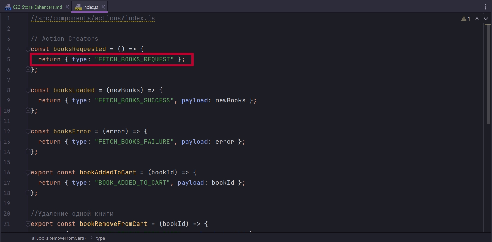

Почему бы нам не сделать так что бы вот эту обертку, т.е. этот объект, передавать было необязательно.

Давайте для начало проведем простой экспереметр. Для этого перехожу в файл где я создаю store. И пямо после того как я создаю store я вызову store.dispatch("HELLO_WORLD").

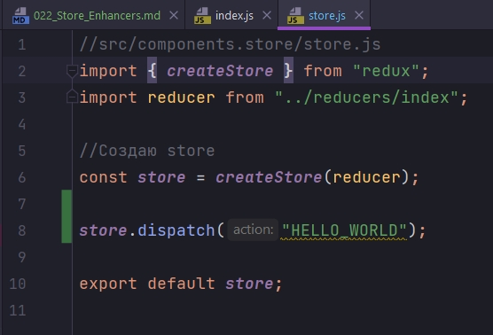

Это действие не будет делать совершенно ничего. Но мы же знаем что если передавать в store неизвестное действие, то это не должно ломать глобальное хранилище.

ОДНАКО ЧТО ПРОИСХОДИТ 

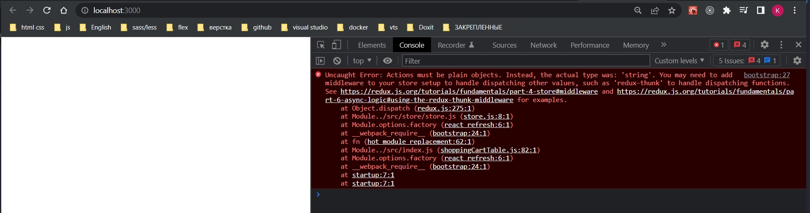

Мы получили ошибку что действия должны быть обычными объектами. 

Но что если мы хотим изменить это поведение и что бы store интерпретировал обычную строку как объект с таким же типом.


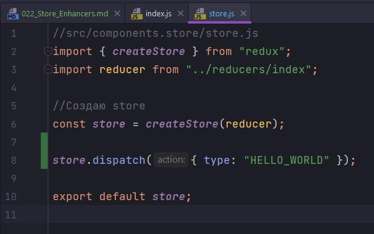

Как нам поступить?

Вот это вот условие


обрабатывается и проверяется в методе dispatch. По этому самый логичный способ будет изменить то как работает в нашем store метод dispatch.

Самый не красивый способ Monkey Patching. Не очень красивый способ, но все же он демонстрирует как можно заменить один из методов API, на свою собственную реализацию этого метода.

Первое что нам нужно сделать это созранить оригинальный метод dispatch.

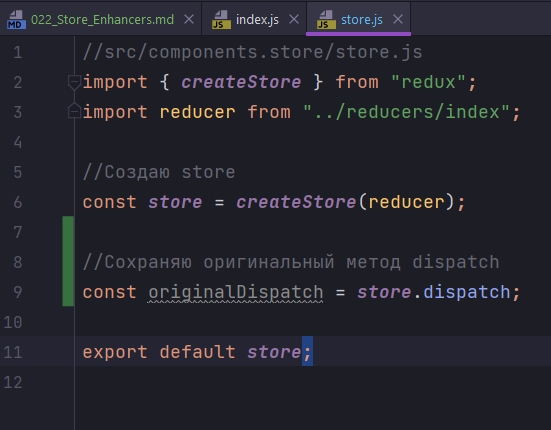

Я не вызываю функцию dispatch, таким образм я сохраняю ссылку на эту функцию. Таким образом в originalDispatch сохранена оригинальная функция настоящая, которая была определена в объекте store.

Теперь мы можем подменить в store его собственную функцию dispatch, на нашу собственную реализацию. В объете store обращаюсь к функции dispatch и присваиваю ей функцию, которая принимает только action. В теле пишу проверку что если тип действия это строка, то тогда мы вызовем originalDispatch, то тогда мы вызвем объект с типом action.

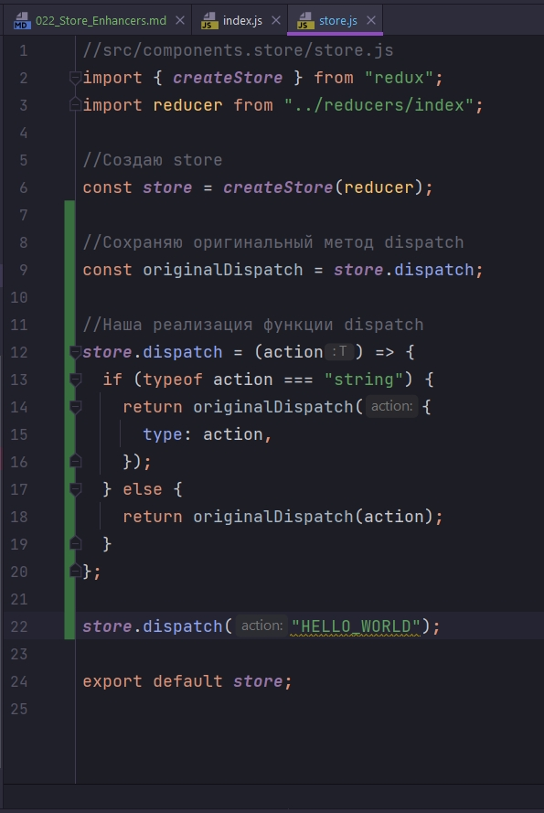

Поскольку action в этом случае это обычный string, мы создаем обертку и передаем этот объект в originalDispatch. Ну а если тип нашего действия не строка, то мы поросто передаем в originalDispatch объект action. Т.е. мы ни как е вмешиваемся в работу оригинальной функции dispatch.

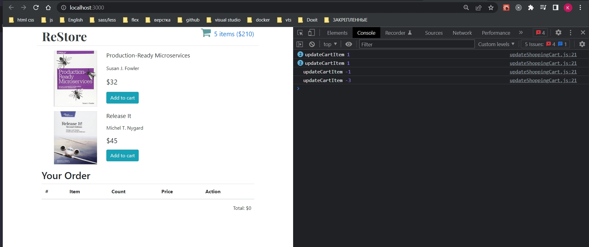

Теперь наш store научился принимать строки в качестве действий, т.е. не только объекты, но еще и строки. Это все благодаря тому коду который мы написали.

Конечно писать такой код в production приложениях это очень-очень плохая идея!!!! Monkey patching применяется только в самом крайнем случае, когда сама библиотека не поддерживает ни каких механизмов расширения.


В Redux есть два механизма расширения базовой функциональности.

1. Первый механизм это store Enhancers. Это функции которые позволяют изменить то как работает весь объект store.
2. Но чаще всего вам не нужно менять механизмы всего store. Чаще всего самое интересное происходит в функции dispatch. И для того что бы изменить механику работы функции dispatch есть второй механизм расширения который называется Redux Middleware.

В этом курсе мы рассмотрим оба механизма.

И первым мы рассмотрим как работает Store Enhancers поскольку механика Middleware основывается на механике Store Enhancers.

И так что такое Store Enhancers в контексте Redux? 

Это очень интересная функция. Создаю функцию enhancer, эта функция принимает createStore и возвращает новую версию createStore. Т.е. мы можем использовать уже существующий механизм createStore, ну или мы можем полностью переписать этот механизм поскольку мы можем заменить нашу функцию createStore и написать свою собственную реализацию всего Redux.

И так продолжаем. Функция createStore будет возвращать функцию, которая принимает все аргументы ...args. Аргументы мы не будем модифицировать поскольку это будет функция createStore. Т.е. в первой функции аргумент createStore это оригинальный createStore, а во второй функции ...args это измененная функции createStore.

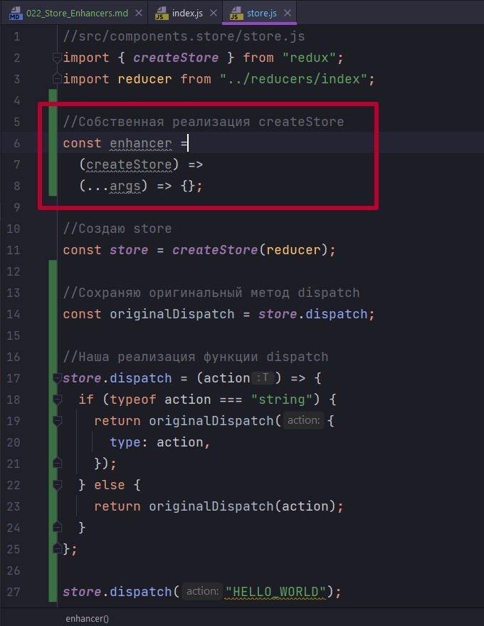

И так как именно будет работать наш с вами улючшенный store? Что именно мы будем улучшать?

У нас есть блок кода который это описывает. 

Для начало создадим новый store. Для этого я использую оригинальный createStore(...args). В который передаю все ...args т.е. мы не будем пмодифицировать аргументы.

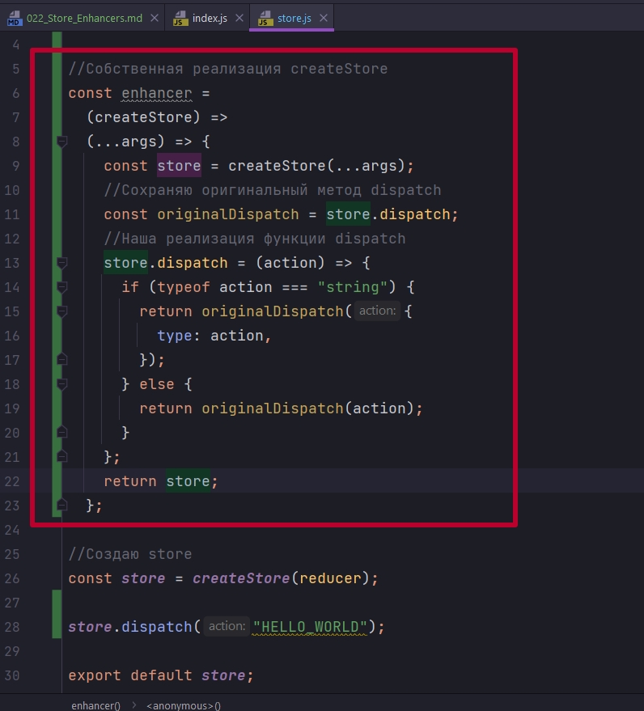


enhancer передается в качестве последнего аргумена в createStore

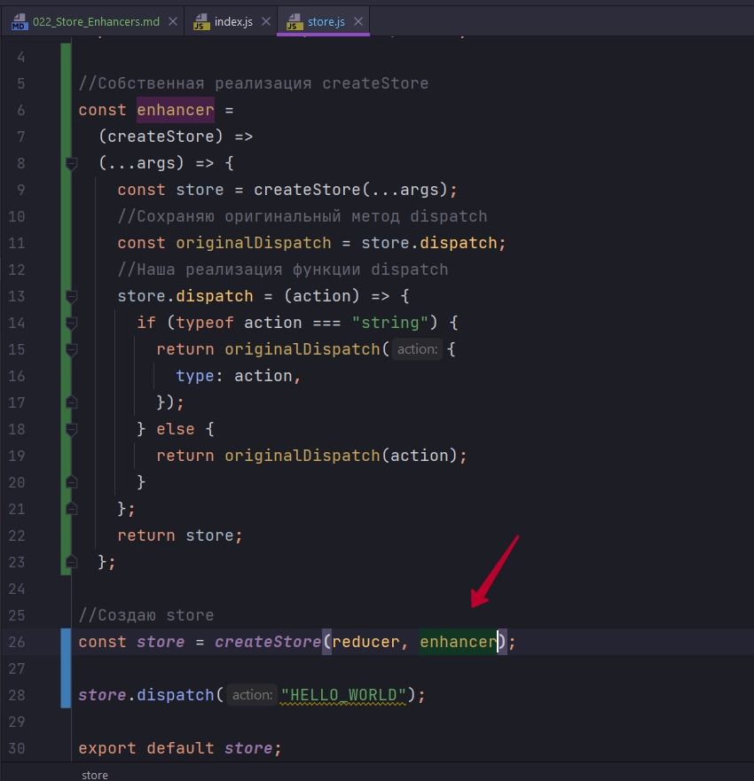

Теперь наш store который мы создадим, будет с обновленной, измененной и улучшенной функцией dispatch. Которая теперь сможет принимать еще и строки.

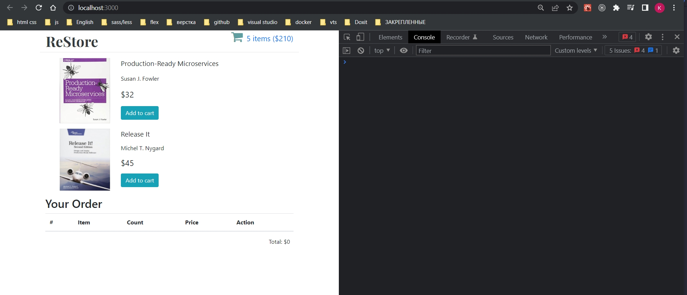

В приложении нет ошибок. Оно не сломалось.

У вас может возникнуть вопрос. А чем этот enhancer лучше чем обычный Monkey Patching? Мы попросту взфли тот же код который писали для Monkey Patching, скопировали этот код в функцию, и мы точно так же подменяем реализацию функции dispatch в store.

Не ужели жтот подход хоть чем-то лучше? 

Во-первых даже то что мы обернули тот код, который изменяет функциональность store в отдельную функцию уже делает этот код немножко лучше. Хотябы потому что эту функцию очень легко тестировать и распостранять ввиде отдельного node module т.е. переиспользуемого модуля.

Ну а во-вторых, отличие которое намного более важное, это то что такой паттерн позволяет использовать функциональную композацию. Другими словами если у нас с вами есть пять или шесть функций enhancers, и каждая из этих функций отвечает за изменение своего аспекта работы store, мы можем использовать функциональную композицию для того что бы объеденить их как бы в один enhancer который последовательно применяет каждое из изменений.


Давайте создадим еще один enhancer который будет писать каждое действие которое передается в функцию dispatch.

ЭТА ЧАСТЬ ВИДЕО ОНА ПРОСТО ОБРАЗОВАТЕЛЬНАЯ ENHANCERS ДОВОЛЬНО РЕДКО ИСПОЛЬЗУЮТСЯ В ПРОККТАХ!!!

Существующий enhancer я переименую в stringEnhancer

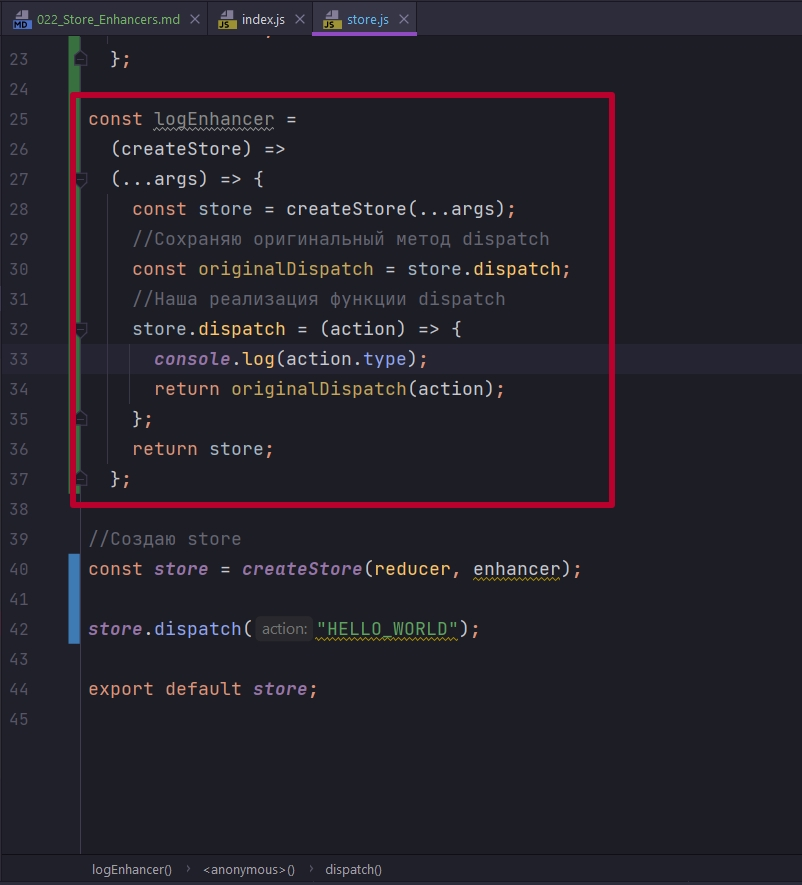

```js
//src/components.store/store.js
import { createStore } from "redux";
import reducer from "../reducers/index";

//Собственная реализация createStore
const stringEnhancer =
  (createStore) =>
  (...args) => {
    const store = createStore(...args);
    //Сохраняю оригинальный метод dispatch
    const originalDispatch = store.dispatch;
    //Наша реализация функции dispatch
    store.dispatch = (action) => {
      if (typeof action === "string") {
        return originalDispatch({
          type: action,
        });
      } else {
        return originalDispatch(action);
      }
    };
    return store;
  };

const logEnhancer =
  (createStore) =>
  (...args) => {
    const store = createStore(...args);
    //Сохраняю оригинальный метод dispatch
    const originalDispatch = store.dispatch;
    //Наша реализация функции dispatch
    store.dispatch = (action) => {
      console.log(action.type);
      return originalDispatch(action);
    };
    return store;
  };

//Создаю store
const store = createStore(reducer, logEnhancer);

// store.dispatch("HELLO_WORLD");

export default store;

```

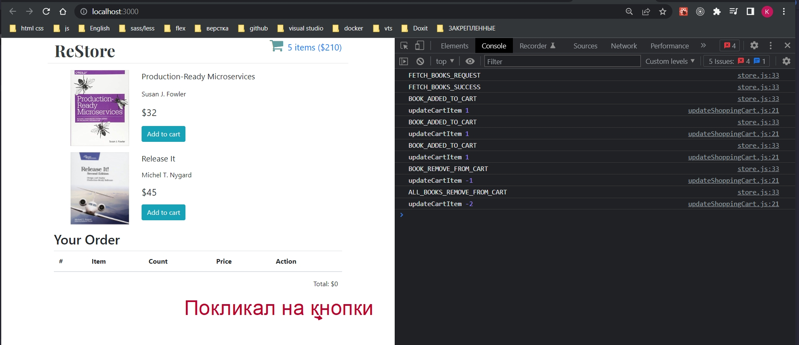

Теперь вознакает вопрос как сделать так что бы logEnhancer и stringEnhancer оба работали одновременно?

Каждая из этих функций принимает createStore и возвращает новый createStore. 

Для этого я должен последовательно использовать эти функции. В Redux есть своя собственная функция compose

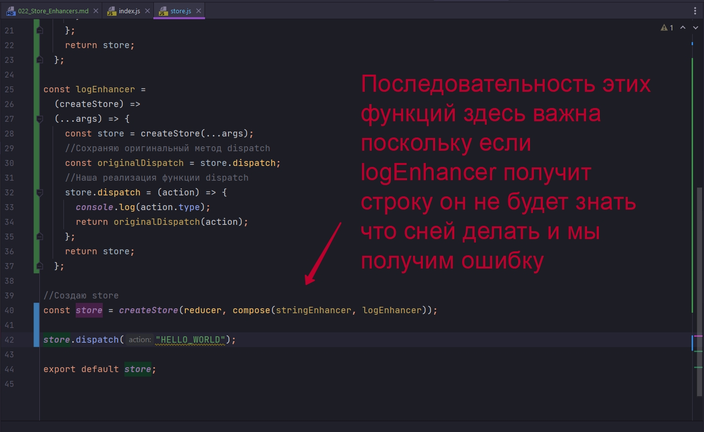

```js
//src/components.store/store.js
import { createStore, compose } from "redux";
import reducer from "../reducers/index";

//Собственная реализация createStore
const stringEnhancer =
  (createStore) =>
  (...args) => {
    const store = createStore(...args);
    //Сохраняю оригинальный метод dispatch
    const originalDispatch = store.dispatch;
    //Наша реализация функции dispatch
    store.dispatch = (action) => {
      if (typeof action === "string") {
        return originalDispatch({
          type: action,
        });
      } else {
        return originalDispatch(action);
      }
    };
    return store;
  };

const logEnhancer =
  (createStore) =>
  (...args) => {
    const store = createStore(...args);
    //Сохраняю оригинальный метод dispatch
    const originalDispatch = store.dispatch;
    //Наша реализация функции dispatch
    store.dispatch = (action) => {
      console.log(action.type);
      return originalDispatch(action);
    };
    return store;
  };

//Создаю store
const store = createStore(reducer, compose(stringEnhancer, logEnhancer));

store.dispatch("HELLO_WORLD");

export default store;

```

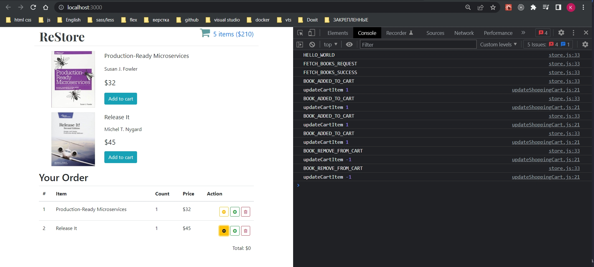

Наш код отлично работает.

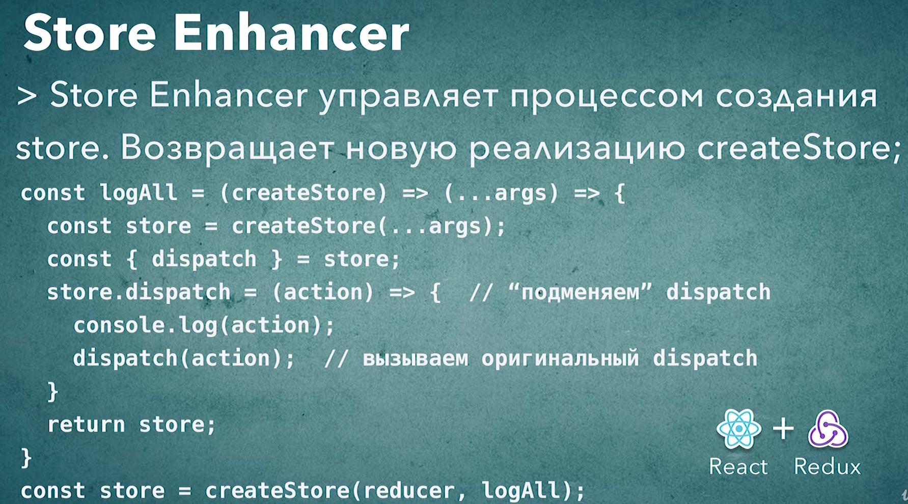

