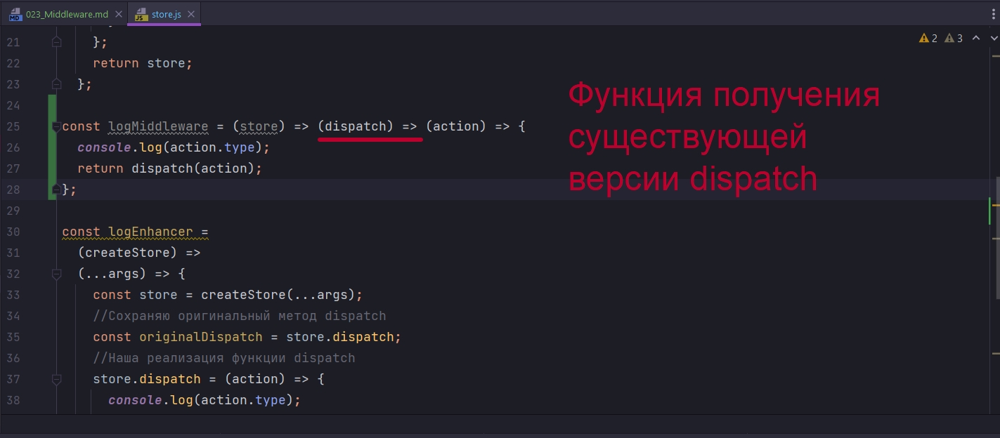

# 023_Middleware

Если мы более внимательно посмотрим на код наших enhancer-ов то мы заметим что  мы заметим что мы заменяем функциональность функции dispatch.

```js
//src/components.store/store.js
import { createStore, compose } from "redux";
import reducer from "../reducers/index";

//Собственная реализация createStore
const stringEnhancer =
  (createStore) =>
  (...args) => {
    const store = createStore(...args);
    //Сохраняю оригинальный метод dispatch
    const originalDispatch = store.dispatch;
    //Наша реализация функции dispatch
    store.dispatch = (action) => {
      if (typeof action === "string") {
        return originalDispatch({
          type: action,
        });
      } else {
        return originalDispatch(action);
      }
    };
    return store;
  };

const logEnhancer =
  (createStore) =>
  (...args) => {
    const store = createStore(...args);
    //Сохраняю оригинальный метод dispatch
    const originalDispatch = store.dispatch;
    //Наша реализация функции dispatch
    store.dispatch = (action) => {
      console.log(action.type);
      return originalDispatch(action);
    };
    return store;
  };

//Создаю store
const store = createStore(reducer, compose(stringEnhancer, logEnhancer));

store.dispatch("HELLO_WORLD");

export default store;

```

И тут возникает существенный вопрос. Если все что мы хотим сделать это изменить механику функции dispatch, нужноли нам в действительности изменять весь store?

И функции middleware в действительности работают именно так. Они модифицирую то как будет работать функция dispatch.

Что же такое функция middleware?

Точно так же как Store Enhancer - это функция как бы подменяет createStore, middleware - это функция которая подменяет только dispatch. Т.е. при помощи middleware мы не можем изменить процесс создания store. Мы можем изменить только то как работает dispatch. И в большую часть времени это то что нам нужно.


По аналогии с logEnhancer создадим logMiddleware. logMiddleware принимает на вход функцию dispatch и возвражает новую функцию dispatch. И наша новая версия dispatch, функция которую мы возвращаем, принимает action.


А теперь еще одно маленькое отличие!!! Enhancer это функция которая контролирует процесс создания store. По этому у этой функции есть доступ к store. 

Если бы у функции middleware была бы вот такая сигнатура, то у неее не было бы доступа к store.


Но для этих middleware иметь этот доступ важно. По этому в функции middleware есть еще один аргумент который называется store. Но только для удобства использования этот аргумент передается ввиде еще одной функции. По настоящему сигнатура выглядит вот так.


Это не должно вас пугать. Вот так тоже можно


таким не сложным способом мы создали функцию middleware которая делает тоже самое что и logEnhancer. Только кода нам понадобилось намного меньше.




Существующую функцию dispatch мы можем использовать для того что бы выполнить наше действие. К примеру наш logMiddleware печатает тип действия console.log(action.type) а затем передает это действие в dispatch так что бы настоящий dispatch сработал и передал это действие в reducer и что бы state обновился. 

Ну а самая левая функция, первая функция, служит для того что бы получить доступ к функциям store. К примеру нам захочется вывести не только тип действия, но еще и state который был в момент исполнения этого действия, мы можем использовать store.getState()


А теперь создадим stringMiddleware.

ИЗМЕНЕННАЯ ФУНКЦИЯ DISPATCH ПРИНИМАТ ACTION!!! САМА АНОНИМНАЯ ФУНКЦИЯ И ЕСТЬ ФУНКЦИЯ DISPATCH.


Заметьте!!! Здесь мы не используем store!! Для того что бы не получать предупреждения мы можем удалить аргумент, но не саму функцию!!!! Иначе наша функция middleware сломается.

Остался только один вопрос как использвать эти функции?

Для того что бы использовать функции middleware нам понадобится еще ода функция которая называется applyMiddleware, она есть в пакете redux. Интересный факт, функция applyMiddleware сама по себе является Store Enhancer-ом. Она используется точно так же как Store Enhancer. Мы будем использовать applyMiddleware в качестве последнего аргумента в createStore


```js
//src/components.store/store.js
import { createStore, applyMiddleware } from "redux";
import reducer from "../reducers/index";

const logMiddleware = (store) => (dispatch) => (action) => {
  console.log(action.type, store.getState());
  return dispatch(action);
};

const stringMiddleware = () => (dispatch) => (action) => {
  if (typeof action === "string") {
    return dispatch({
      type: action,
    });
  } else {
    return dispatch(action);
  }
};

//Создаю store
const store = createStore(
  reducer,
  applyMiddleware(stringMiddleware, logMiddleware)
);

store.dispatch("HELLO_WORLD");

export default store;

```


ПОВТОР ПРОЦЕССА!!!

Сперва мы вызываем store.dispatch() и передаем туда действие


Это действие пока еще не попадает в reducer. 

Вместо этого действие перехватывается функцией applyMiddleware. applyMiddleware будет последовательно вызывать каждую функцию middleware. Сначало вызовется stringMiddleware, вот это действие


В качестве действия или action мы получим обычную строку. И логика нашего middleware скажет Ok если это строка, то мы вызываем dispatch с вот таким вот объектом


stringMiddleware это еще не настоящий dispatch самого store. ЭТО ССЫЛКА НА СЛЕДУЮЩИЙ MIDDLEWARE КОТОРЫЙ ИДЕТ ПО ПОРЯДКУ В НАШЕЙ ЦЕПОЧКЕ APPLYMIDDLEWARE.

stringMiddleware по настоящему вызовет вот эту функцию в logMiddleware


И эта функция в action получит наше событие. Мы напечатаем тип этого действия в консоли, а затем снова вызовем dispatch. И поскольку logMiddleware последний в цепочке, то это уже будет настоящий dispatch который передаст наше действие в reducer.

По этому аргумент dispatch в функции middleware которая передает ссылку в другой middleware чаще всего называется next.

Название этого аргумента next вы чаще всего будете встречать в документации.


И самый последний аспект работы middleware. Первый аргумент store это на самом деле не весь store, а только две функции из store. Мы не получаем полный доступ к store когда мы работаем с middleware. Все что мы получаем это две функции getState и dispatch


