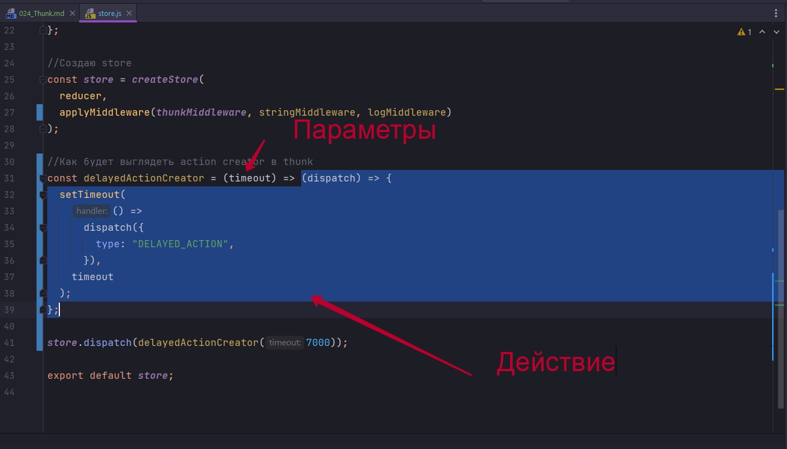

# 024_Thunk

В экосистеме React Redux есть масса модулей которые делают практически все что можно сделать со store. Один из самых популярных middleware в этой экосистеме это Thunk Middleware. Он используется практически в каждом проекте.

Установим и посмотрим как он работает.

```shell
npm install redux-thunk
```

После установки возвращаюсь к нашему файлу store.js. Импортирую его. И добавим его к нашему списку middleware. И добавлю его на первой позиции.


```js
//src/components.store/store.js
import { createStore, applyMiddleware } from "redux";
import reducer from "../reducers/index";
import thunkMiddleware from "redux-thunk";

const logMiddleware =
  ({ getState, dispatch }) =>
  (next) =>
  (action) => {
    console.log(action.type, getState());
    return next(action);
  };

const stringMiddleware = () => (next) => (action) => {
  if (typeof action === "string") {
    return next({
      type: action,
    });
  } else {
    return next(action);
  }
};

//Создаю store
const store = createStore(
  reducer,
  applyMiddleware(thunkMiddleware, stringMiddleware, logMiddleware)
);

store.dispatch("HELLO_WORLD");

export default store;

```

thunkMiddleware - это очень простой middleware который позволяет использовать функции в качестве действий. 

Создаю новое действие myAction это будет функцией, которую вызовет наш thunkMiddleware если мы передадим эту функцию в store как обычное действие. Эта функция получит на вход dispatch. Мы можем использовать dispatch для того что бы передать в store несколько событий. Или к примеру мы можем использовать таймер для того что бы передать действие в store с определенной задержкой.


```js
//src/components.store/store.js
import { createStore, applyMiddleware } from "redux";
import reducer from "../reducers/index";
import thunkMiddleware from "redux-thunk";

const logMiddleware =
  ({ getState, dispatch }) =>
  (next) =>
  (action) => {
    console.log(action.type, getState());
    return next(action);
  };

const stringMiddleware = () => (next) => (action) => {
  if (typeof action === "string") {
    return next({
      type: action,
    });
  } else {
    return next(action);
  }
};

//Создаю store
const store = createStore(
  reducer,
  applyMiddleware(thunkMiddleware, stringMiddleware, logMiddleware)
);

const myAction = (dispatch) => {
  setTimeout(
    () =>
      dispatch({
        type: "DELAYED_ACTION",
      }),
    2000
  );
};

store.dispatch(myAction);

export default store;

```

После того как мы написали свою функцию, мы вызываем store.dispatch, точно так же как с обычными действиями, и передаем в этот раз в dispatch вместо объекта или строки, функцию myAction. Ну а thunkMiddleware сделает так что бы эта функция сработала.


И вот DELAYED_ACTION появляется через пару секунд после основных действий. Не смотря на то что мы в действительности передали функцию сразу же как только сконструировали store. Эта функция запустилась, установила timeout, и само действие выполнилось только через две секунды.

Это довольно одобный способ описывать асинхронные действия или целые процессы в виде actions в виде обычных действий. Мы передаем в store функцию и эта функция уже самостоятельно будет решать, когда, как и сколько раз вызывать dispatch и какие действия передавать в этот самый dispatch.

По thunkMiddleware написана масса статей. Однако весь исходный код thunk занимает 14 строк.


Если для thunk функция это action


То action creator это будет функция, которая создает функцию. Функция которая создает action.

Давайте запишем как будет выглядеть action creator для thunk.

Создаю функцию myActionCreator


```js
//src/components.store/store.js
import { createStore, applyMiddleware } from "redux";
import reducer from "../reducers/index";
import thunkMiddleware from "redux-thunk";

const logMiddleware =
  ({ getState, dispatch }) =>
  (next) =>
  (action) => {
    console.log(action.type, getState());
    return next(action);
  };

const stringMiddleware = () => (next) => (action) => {
  if (typeof action === "string") {
    return next({
      type: action,
    });
  } else {
    return next(action);
  }
};

//Создаю store
const store = createStore(
  reducer,
  applyMiddleware(thunkMiddleware, stringMiddleware, logMiddleware)
);

//Как будет выглядеть action creator в thunk
const myActionCreator = () => (dispatch) => {
  setTimeout(
    () =>
      dispatch({
        type: "DELAYED_ACTION",
      }),
    2000
  );
};

store.dispatch(myActionCreator);

export default store;

```
myActionCreator - это функция которая создает новое действие.

Почему нам важно помнить про action creator? 

Action creators - это функции которые упрощают создание действий. В нашем случае действие это функция.

Допустим у нас есть ситуация когда мы хотим контролировать на сколько секунд будет задержка. Мы могли бы к action creator добавить параметр  и сказать что у нас здесь есть timeout. И использовать этот timeout в нашем действии


Дам этой функции очевидное название delayedActionCreator что бы было очень очевидно что же он делает.


```js
//src/components.store/store.js
import { createStore, applyMiddleware } from "redux";
import reducer from "../reducers/index";
import thunkMiddleware from "redux-thunk";

const logMiddleware =
    ({ getState, dispatch }) =>
        (next) =>
            (action) => {
                console.log(action.type, getState());
                return next(action);
            };

const stringMiddleware = () => (next) => (action) => {
    if (typeof action === "string") {
        return next({
            type: action,
        });
    } else {
        return next(action);
    }
};

//Создаю store
const store = createStore(
    reducer,
    applyMiddleware(thunkMiddleware, stringMiddleware, logMiddleware)
);

//Как будет выглядеть action creator в thunk
const delayedActionCreator = (timeout) => (dispatch) => {
    setTimeout(
        () =>
            dispatch({
                type: "DELAYED_ACTION",
            }),
        timeout
    );
};

store.dispatch(delayedActionCreator(7000));

export default store;

```

Затем в нашем коде мы можем использовать этот action creator как и любой другой action creator. И в тех местах в коде где мы используем этот action creator мы можем больше не задумываться о том что именно он делает, создает обычные действия объекты или создает действия функции. Нашему коду будет все равно. Это обычный action creator который принимает параметры и он создает действие.



Ну а как именно это действие будет обрабатывать это уже детали которые нас не интересуют совершенно.

Давайте использую туже технику мы создадим Action Creator который будет получать список книг.

Перехожу в actions/index.js и переименовываю функцию fetchBooks в fetchBooksOld для того что бы на экране у нас был старый код и новый код.

Наш новый action creator мы назовем его точно так же fetchBooks. fetchBooks не нужны ни какие дополнительные аргументы, потому что мы всегда получаем список книг. Если бы нам нужно былобы получать делали какой-нибудт одной книжки, то в параметры можно было бы добавить id той книжки которую мы получаем.

И мы создаем новое действие. Что такое действие? Действие это функция которая принимает dispatch и которое получает наш список книг.


Для того что бы мы могли написать код внутри fetchBooks нужен еще один аргумент - это bookStoreService, это тот сервис который мы будем использовать для того что бы получить книжки. По этому нам понадобится еще одна функция, т.е. у нас будет функция которая возвращает action creator


И наша функция возвращающая action creator будет принимать bookStoreService


Мы вызываем dispatch, передаем туда действие booksRequested(), запускаем процесс получения книг bookStoreService.getBookStore(), как только мы получаем данные .then((data) => dispatch(booksLoaded(data))), как только появляется ошибка .catch((error) => dispatch(booksError(error)));

Наша новая функция очень похожа на старую функцию. Единственное чем они по сути отличаются это сигнатурой. Новая функция напиана таким образом что бы работать с thunk. 

Теперь перейдем к BookListContainer и посмотрим как мы можем вызывать эту функцию.


В новом вызове мы должны передать функцию, вызвать в ручную dispatch и передать туда результат вызова fetchBooks(bookStoreService) и вызвать сам action creator для того что бы создать действие ().


Для меня этот вызов еще сложнее. Вот это выражение вернут функцию которая принимает dispatch


Прямо сейчас может быть не совсем очевидно чем этот код лучше чем предыдущий, потому что для меня он выглядит сложнее чем прошлый.

Но этот код можно сделать куда читабельнее если мы будем использовать bindActionCreators.

bindActionCreators делает так, что когда мы вызываем action creator, он сразу же вызывает функцию dispatch.

Импортирую bindActionCreators из пекета redux. В mapDispatchToProps возвращаю bindActionCreators который в качестве первого аргумента принимает объект с action creators, а в качестве второго аргумента функцию dispatch.


И этот код читать куда лучше.

Мы передаем действие fetchBooks, которое создаст функцию fetchBooks(bookStoreService) и эту функцию обработает thunk.

И мы передаем обычный action creator bookAddedToCart который создает совершенно обычное действие, объект.


В этом месте у вас может возникнуть естественный вопрос. А зачем же нам нужен thunk если мы получали список книг без него? Просто используя обычную функцию


И это будет очень правильное замечание!!! Среди начинающих React разработчиков есть заблуждение что для того что бы использовать асинхронные действия с Redux, для того что бы получать данные с сервера и записывать их в Redux нам обязательно нужен какой-нибудь middleware вроде thunk который сделает это за нас. Но как мы с вами увидели в этом блоке курса с асинхронными действиями можно работать и без thunk, в чистом redux.

Все что делаем thunk он немного упрощает работу с вот такими вот функциями


И в комбинации с mapDispatchToProps и bindActionCreators thunk позволяет читать более чистый и более читабельный код.


ВАЖНОЕ ЗАМЕЧАНИЕ!!! ЧТО ДЛЯ ТЕХ РАЗРАБОТЧИКОВ КОТОРЫЕ РАНЬШЕ НЕ РАБОТАЛИ С REDUX,РАНЬШЕ НЕ РАБОТАЛИ С THUNK МОЖЕТ БЫТЬ СОВЕРШЕННО НЕ ПРИНЦИПИАЛЬНО ЧЕМ ЭТОТ СИНТАКСИС ОТЛИЧАЕТСЯ ОТ ЭТОГО


И ЗАЧЕМ ЭТОТ THUNK ВООБЩЕ НУЖЕН? Это совершенно естественно и совершенно нормально!!

Кароче он работал работа с объектами. Но в какой-то момент он не захотел пытаться запомнить что какие-то из функций являются в действительности actionCreators т.е. какие функции создают действия, а какие функции нужно вызывать самостоянтельно, поскольку они не создают действие, а запускают вот такие вот процессы


и только тогда роль thunk для меня стала немножечко очевидной. Поскольку thunk позволил интерпретировать абсолютно все функции как action creator а это в свою очередь помогло писать немного более чистый код в mapDispatchToProps.


