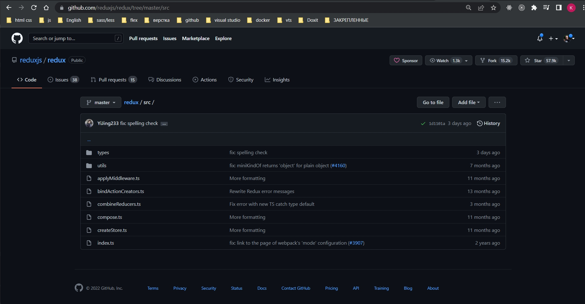
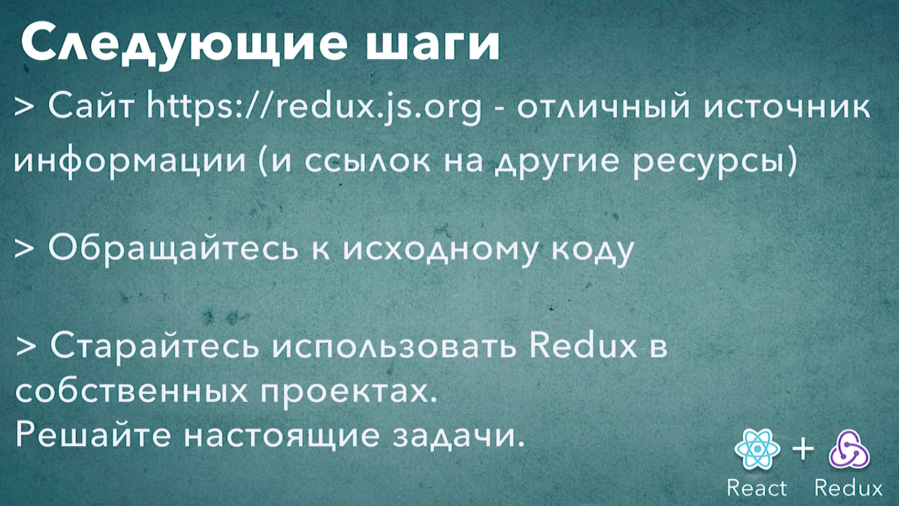

# 025_Redux_следующие_шаги

Самое лучшее что сейчас можно сделать это применить эти знания на практике. Но когда вы поймете что хорошо ориентируетесь в Redux можно найти еще несколько интересных источноков которые еще больше углубят ваши знания и ваше понимание того как работает Redux и того какие проблемы и задачи можно решать при помощи Redux.
Отличный источник информации это сайт: <https://redux.js.org>

Нажимаю на кнопку getStarted. Эта кнопка перенесет нас в раздел документации и туториолов и рецептов.

Самый интересный раздел это Recipes - у меня его в документации просто нет. Из того чего мы не покрывали с вами в этом курсе это Normalizing State Shape и Updating Normalized Data. Кроме всего этого вам интересно будет почитать о переиспользовании логики Reusing Reducer Logic и initializing State.

Читайте код redux, дополнительных библиотек и middleware <https://github.com/reduxjs/redux>. 

Бывает так что прочесть исходники и понть как именно работает компонент чем читать десятки статей в интернете и понять что он делает. Если мы зайдем в исходники redux то вы увидите что это не такая большая библиотека.

Если вам интересно как работает функция compose, то нет ничего проще чем зайти на github и почитать это 10 или 15 строк кода.

Начинайте писать проекты. Работайте со своим собственным кодом и со своими собственными задачами. Потому что никакие видеокурсы онлайн туториалы или блок посты не заменят вам настоящий собственный опыт.

