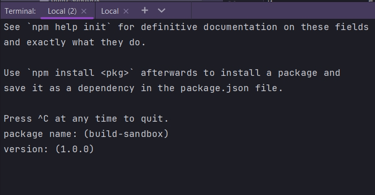

# 001_Cоздаем_новый_проект

Называю папку проекта build-sandbox

Создаю пустой файл package.json

```shell
npm init -y
```

-y  если не хочу отвечать на вопросы и установить все по умолчанию. Флаг -y означает yes.

Для интереса в этом видео исполню 

```shell
npm init 
```


И так имя пакета. Если мы здесь ничего не напишем, то наш пакет так и будет называться build-sandbox



version - можно установить другую версию, но 1.0.0. отлично подходит.


description - хдесь можно добавить небольшое текстовое описание вашего проекта. Sandbox to play with React build tools


Теперь entry point


Этот вопрос имеет отношение к Node.js приложениям. Какой файл в проекте будет считаться главным файлом. Но в нашем React приложении это значение использоваться не будет по этому мы можем оставить его по умолчанию.

Далее test command


Это команда для тестирования. У нас пока что не подключены ни какие библиотеки для тестирования, по этому мы пропустим команду для тестирования. Мы всегда сможем добавить ее позже.

git repository


Если у вашего проекта есть git репозиторий, то здесь можно оставить ссылку. Таким образом люди которые скачивают и используют ваш пакет будут знать где найти исходный код этого пакета или где оставлять bag report. Это поле тоже можно оставить пустым.

keywords


ключевые слова нужны исключительно для индексации и поиска, поскольку мы не собираемся публиковать наш package тоже можно оставить это поле пустым.


ISC - это opensource license


```json
{
  "name": "build-sandbox",
  "version": "1.0.0",
  "description": "Sandbox to play with React build tools",
  "main": "index.js",
  "scripts": {
    "test": "echo \"Error: no test specified\" && exit 1"
  },
  "author": "Konstantin Atroshchenko <kostay375298918971@gmail.com>",
  "license": "ISC"
}

```

Создам небольшую структуру из файлов и папок. Создаю папку src и в ней файл main.js

```js
//src/main.js

class App {
  run() {
    const name = "World";
    console.log(`Hello ${name}`);
  }
}

const app = new App();
app.run();

```

этот маленький файл будет полигоном когда мы начнем работать с babel в следующих видео.

```html
<!DOCTYPE html>
<html lang="en">
  <head>
    <meta charset="UTF-8" />
    <meta
      name="viewport"
      content="width=device-width, user-scalable=no, initial-scale=1.0, maximum-scale=1.0, minimum-scale=1.0"
    />
    <meta http-equiv="X-UA-Compatible" content="ie=edge" />
    <title>Document</title>
  </head>
  <body>
    <div id="root"></div>
    <script src="src/main.js"></script>
  </body>
</html>

```


