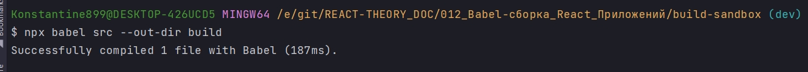
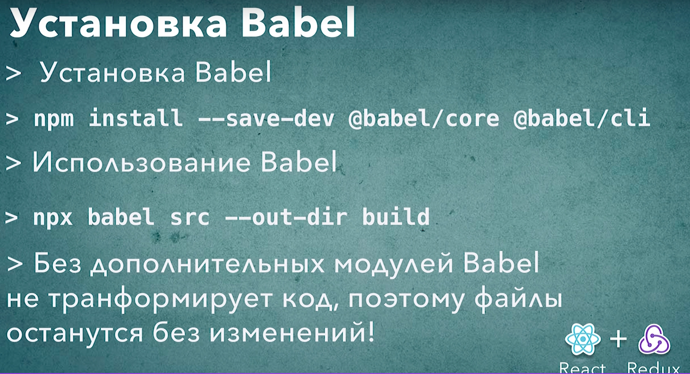

# 002_Установка_Babel

Теперь когда у меня есть тестовый проект мы можем преобразовать его таким образом что бы этот код мог запускаться на более старых версиях браузеера. К примеру на тех браузерах которые не поддерживают классы или не поддерживают const.

Устанавливаю Babel

```shell
npm install --save-dev @babel/core @babel/cli
```

Флаг --save-dev он говорит npm что те зависимости которые мы будем устанавливать это зависимости которые используются исключительно для разработки. Отсюда флаг -dev. Этот флаг нужен нам разработчикам что бы понимать какие зависимости мы используем во время разработки. К примеру библиотеки для сборки или трансформации кода.

Второй аспект который раньше мы не встречали это вот такой формат имени пакета @babel/core. Это относительно новая возможность babel которая называется name spase или пространство имен. Эта возможность позволяет организациям создавать name spase к примеру add babel и затем в рамках этого name spase публиковать свои собственные официальные пакеты. Эта возможность позволяет немножко лучше структурировать те пакеты с которыми работает организация. На самом деле это будет самый обыкновенный пакет который будет установлен точно также как те другие пакеты которые мы устанавливали раньше к примеру react или redux.

```json
{
  "name": "build-sandbox",
  "version": "1.0.0",
  "description": "Sandbox to play with React build tools",
  "main": "index.js",
  "scripts": {
    "test": "echo \"Error: no test specified\" && exit 1"
  },
  "author": "Konstantin Atroshchenko <kostay375298918971@gmail.com>",
  "license": "ISC",
  "devDependencies": {
    "@babel/cli": "^7.17.6",
    "@babel/core": "^7.17.9"
  }
}

```

Здесь те зависимости которые мы установили попали в блок devDependencies. Таким образом мы знаем что эти библиотеки нужны только на этапе разработки. 

Ну а теперь когда Babel установлен давайте перейдем назад в консоль и попробуем исполнить какую-нибудь команду и сказать babel что нужно трансформировать наш js файл. 

Для этого используем команду npx. npx - это утилита которая может запустить в качестве скрипта один из тех пакетов которые мы установили. Запустить его просто как обычное Node.js приложение. 

Прописываю в консоли npx babel и для того что бы babel заработал нужно указать пару параметров. Первый параметр это то откуда мы будем брать исходные файлы, и это папка src. Ну а второй флаг который мы укажем это --out-dir это путь к той папке куда мы будем складывать трансформированные файлы т.е. те файлы которые будут преображаены в более старую версию ECMAScript, и мы укажем папку build

```shell
npx babel src --out-dir build
```



Успешно преобразован один файл при помощи babel.

В среде разработке появилась папка build в которой есть файл main.js. Называется точно так же как тот файл который мы создали в папке src. Ну и если мы откроем файл main.js мы увидим что абсолютно ничего не изменилось.

```js
//src/main.js
class App {
  run() {
    const name = "World";
    console.log(`Hello ${name}`);
  }

}

const app = new App();
app.run();
```

Что же здесь произошло? 

А все дело в том что Babel это модульный транспилятор. И для того что бы он начал преображать наш код, для того что бы он начал работать нам нужно указать какие именно аспекты языка мы хотим преобразовывать. Это очень удобная особенность которая позволяет вам настроить поведение babel именно таким образом как нужно для вашего проекта.

И как правильно это сделать мы посмотрим в следующих видео.




