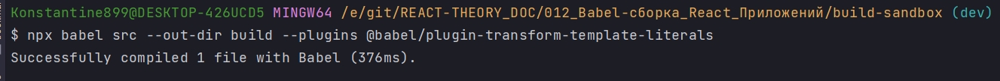
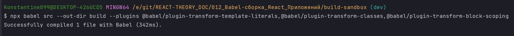
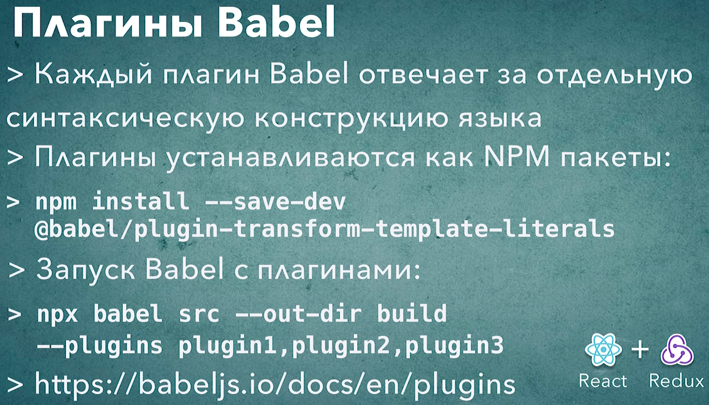

# 003_Плагины_Babel

И так Babel это модульный компилятор. Хотя я везде встречал что это траспилятьр кода. Для каждого преобразования, для каждой конструкции языка которую будет преобразовывоть Babel, нужно установить отдельный плагин. К примеру для того что бы Babel начал преобразовывать вот такой код.

```js
//src/main.js

class App {
  run() {
    const name = "World";
    console.log(`Hello ${name}`);
  }
}

const app = new App();
app.run();

```

Что бы преобразовать template literals в обычные строки есть плагин

```shell
npm install --save-dev @babel/plugin-transform-template-literals
```

Babel плагины это самые обычные npm пакеты.

После установки плагина можно запустить babel снова. Но в этот раз мы добавим еще один аргумент который сообщит babel что нужно этот плагин начать использовать.

```shell
npx babel src --out-dir build --plugins @babel/plugin-transform-template-literals
```

npx babel - запускаю babel
src - указываю с какой дирректории взять файлы
--out-dir - флаг с помощью которого указываю куда я хочу положить транспилорованные файлы
build - Название дирректории в которую будут складывать транспилированные файлы.
--plugins - флаг после готорого указываю плагины которые я хочу использовать



Файл находится в build/main.js

```js
//src/main.js
class App {
  run() {
    const name = "World";
    console.log("Hello ".concat(name));
  }

}

const app = new App();
app.run();
```

Как видите наш код изменился. Как видите вместо template literals, который появился только в ECMAScript 2015, у нас используются самые обычые строки которые были с самой первой версии JS. И используется метод concat для того что бы объеденить строку со значением переменной name.

И сравним. Тот код который мы написали

```js
//src/main.js

class App {
  run() {
    const name = "World";
    console.log(`Hello ${name}`);
  }
}

const app = new App();
app.run();

```

А вот код который сгенерировал Babel

```js
//src/main.js
class App {
  run() {
    const name = "World";
    console.log("Hello ".concat(name));
  }

}

const app = new App();
app.run();
```

Ну а алгоритм преобразования описан в том самом плагине который мы только что установили.

```json
{
  "name": "build-sandbox",
  "version": "1.0.0",
  "description": "Sandbox to play with React build tools",
  "main": "index.js",
  "scripts": {
    "test": "echo \"Error: no test specified\" && exit 1"
  },
  "author": "Konstantin Atroshchenko <kostay375298918971@gmail.com>",
  "license": "ISC",
  "devDependencies": {
    "@babel/cli": "^7.17.6",
    "@babel/core": "^7.17.9",
    "@babel/plugin-transform-template-literals": "^7.16.7"
  }
}

```

Плагины: <https://babeljs.io/docs/en/plugins>

Список плагинов: <https://babeljs.io/docs/en/plugins-list>

Давайте сделаем так что бы класс преобразовался в обычную функцию, так как мы писали в ECMAScript 5. НУ и кроме того сделаем что бы кроме const был стандартный var.

```shell
npm install --save-dev @babel/plugin-transform-classes @babel/plugin-transform-block-scoping
```

```json
{
  "name": "build-sandbox",
  "version": "1.0.0",
  "description": "Sandbox to play with React build tools",
  "main": "index.js",
  "scripts": {
    "test": "echo \"Error: no test specified\" && exit 1"
  },
  "author": "Konstantin Atroshchenko <kostay375298918971@gmail.com>",
  "license": "ISC",
  "devDependencies": {
    "@babel/cli": "^7.17.6",
    "@babel/core": "^7.17.9",
    "@babel/plugin-transform-block-scoping": "^7.16.7",
    "@babel/plugin-transform-classes": "^7.16.7",
    "@babel/plugin-transform-template-literals": "^7.16.7"
  }
}

```
Запускаю 

```shell
npx babel src --out-dir build --plugins @babel/plugin-transform-template-literals, @babel/plugin-transform-classes, @babel/plugin-transform-block-scoping
```



```js
function _classCallCheck(instance, Constructor) { if (!(instance instanceof Constructor)) { throw new TypeError("Cannot call a class as a function"); } }

function _defineProperties(target, props) { for (var i = 0; i < props.length; i++) { var descriptor = props[i]; descriptor.enumerable = descriptor.enumerable || false; descriptor.configurable = true; if ("value" in descriptor) descriptor.writable = true; Object.defineProperty(target, descriptor.key, descriptor); } }

function _createClass(Constructor, protoProps, staticProps) { if (protoProps) _defineProperties(Constructor.prototype, protoProps); if (staticProps) _defineProperties(Constructor, staticProps); Object.defineProperty(Constructor, "prototype", { writable: false }); return Constructor; }

//src/main.js
var App = /*#__PURE__*/function () {
  function App() {
    _classCallCheck(this, App);
  }

  _createClass(App, [{
    key: "run",
    value: function run() {
      var name = "World";
      console.log("Hello ".concat(name));
    }
  }]);

  return App;
}();

var app = new App();
app.run();
```

Теперь ни class ни const. Вместо этого унас есть обычная функция которая конструирует классы альтернативным способом. Если запустить этот код в браузере  вы увидите что результат точно такой же как и для кода который мы писали в оригинальном файле. Но только транспилированный файл полностью совместим со старыми браузерами.

Конечно этими тремя плагинами мы покрыли только часть тех трансформаций которые нам нужны будут для того что бы преобразовать совершенно любой код.




