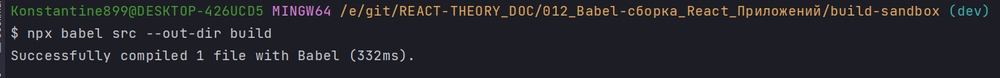

# 004_Файлы_конфигурации_babelrc

У Babel есть намного более простой и удобный механизм для компилятора. И так сам для себя начал гуглить транспилятор или компилятор. И так мой вывод. Когда происходит процесс транспиляции, транспилирование файла написанного более  новой версией ECMAScript в файл написанный на старой версии ECMAScript, Т.е. логически транспилированный файл остается написанным на одном и том же уровне что и файл написанный в более новой версии ECMAScript, т.е. максимально приближенный к человеческомц языку только каждый в своей версии ECMAScript.

Но однако это и компилятор, который построчно проходится по коду,который определяе фунции и переменные.... Забыл как работает компилятор. Читай свой конспект с андерсона. Плохо помню проходится по глобальному скоупу, запоминает функции и переменные, выделяет для них место в пямяти, после проходится по локальным областям видимости в функциях, так же выделяет место в памяти. Далее преобразует код в байт код, а байт код преобразуется уже в машинные код и исполняется процессором.

И так по видео.

Babel поддерживает несколько форматов конфигурационных файлов. Это могут быть json файлы или js файлы. json файлы распостранены намного больше.

Создаю .babelrc. В этом файле  мы размещаем объект. Внутри этого объекта можно указать параметры конфигурации. И первый параметри который мы укажем это plugins. Список плагинов которые будет использовать babel.

plugins это будет массив в который мы передадим строки с названиями плагинов.

```json
{
  "plugins": [
    "@babel/plugin-transform-template-literals",
    "@babel/plugin-transform-classes",
    "@babel/plugin-transform-block-scoping"
  ]
}
```

Теперь когда у нас есть файл с конфигурацией babel будет находить его каждый раз когда мы будем запускать babel

```shell
npx babel src --out-dir build
```

src - папка откуда беру файлы

--out-dir - флаг указывающий куда нужно сложить транспилированные файлы

build - название дирректории куда будут сложены транспилированные файлы.



```js
function _classCallCheck(instance, Constructor) { if (!(instance instanceof Constructor)) { throw new TypeError("Cannot call a class as a function"); } }

function _defineProperties(target, props) { for (var i = 0; i < props.length; i++) { var descriptor = props[i]; descriptor.enumerable = descriptor.enumerable || false; descriptor.configurable = true; if ("value" in descriptor) descriptor.writable = true; Object.defineProperty(target, descriptor.key, descriptor); } }

function _createClass(Constructor, protoProps, staticProps) { if (protoProps) _defineProperties(Constructor.prototype, protoProps); if (staticProps) _defineProperties(Constructor, staticProps); Object.defineProperty(Constructor, "prototype", { writable: false }); return Constructor; }

//src/main.js
var App = /*#__PURE__*/function () {
  function App() {
    _classCallCheck(this, App);
  }

  _createClass(App, [{
    key: "run",
    value: function run() {
      var name = "World";
      console.log("Hello ".concat(name));
    }
  }]);

  return App;
}();

var app = new App();
app.run();
```

В этом курсе мы затрагиваем только самые основные аспекты конфигурации babel. Если вам интересно копнуть немножко глубже и почитать немноэко больше делалей о том какие именно аспекты работы Babel можно сконфигурировать и как работает конфигурация для немного более сложных проектов. То эту информацияю можно найти на официальной страничке Babel. 

<https://babeljs.io/docs/en/configuration>

