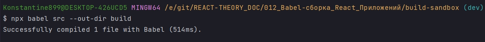
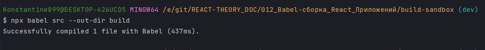
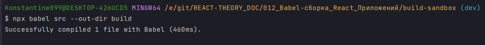
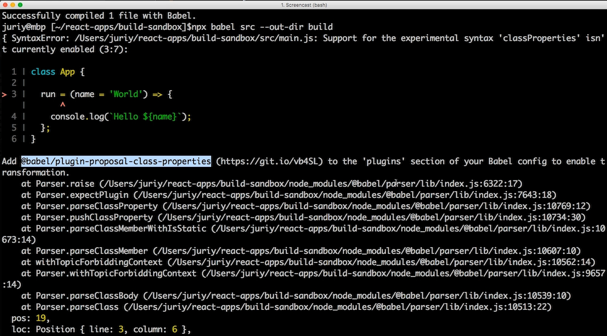
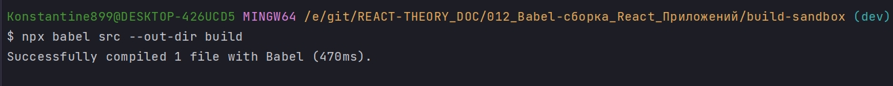
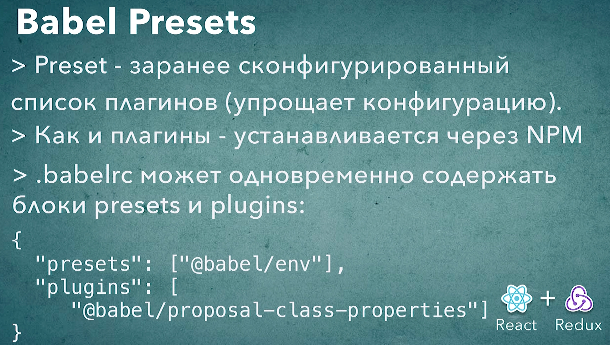

# 005_Babel_Presets

Мы уже знаем как вынести конфигурацию плагинов Babel в отдельный файл, но даже с этой возможностью настройка babel под свои нужды может быть весьма трудозатратым процессом. Если поробовать перечислить все те плагины которые нужны для того что бы преобразовать ваш код с ECMAScript 2019 в ECMAScript 5, то у вас получиться список где-то из 30 плагинов. Ну и совершенно что хранить такой список вручную и поддерживать совершенно не удобно.

Что бы упростить эту конфигурацию у Babel есть еще один механизм который называется presets. presets - это просто заранее сконфигурированный список плагинов который можно передать в Babel что бы не перечислять плагины по одному.

<https://babeljs.io/docs/en/babel-preset-env> 

```shell
npm install --save-dev @babel/preset-env
```
Этот пресет содержит в себе все плагины для того что бы поддержать самый свежий стандарт ECMAScript

В .babelrc полностью удалим блок plugins и вместо него поставим блок presets.

```json
{
  "presets": [
    "@babel/preset-env"
  ]
}
```

Можно сократить конфигурацию и убрать preset

```json
{
  "presets": [
    "@babel/env"
  ]
}
```

Перезапускаю


```shell
npx babel src --out-dir build

```



```js
"use strict";

function _classCallCheck(instance, Constructor) { if (!(instance instanceof Constructor)) { throw new TypeError("Cannot call a class as a function"); } }

function _defineProperties(target, props) { for (var i = 0; i < props.length; i++) { var descriptor = props[i]; descriptor.enumerable = descriptor.enumerable || false; descriptor.configurable = true; if ("value" in descriptor) descriptor.writable = true; Object.defineProperty(target, descriptor.key, descriptor); } }

function _createClass(Constructor, protoProps, staticProps) { if (protoProps) _defineProperties(Constructor.prototype, protoProps); if (staticProps) _defineProperties(Constructor, staticProps); Object.defineProperty(Constructor, "prototype", { writable: false }); return Constructor; }

//src/main.js
var App = /*#__PURE__*/function () {
  function App() {
    _classCallCheck(this, App);
  }

  _createClass(App, [{
    key: "run",
    value: function run() {
      var name = "World";
      console.log("Hello ".concat(name));
    }
  }]);

  return App;
}();

var app = new App();
app.run();
```

Вернемся в наш файл и добавим еще синтаксис для того что бы проверить что он действительно будет работать.

```js
//src/main.js

class App {
  constructor() {
    this.run = (name = "World") => {
      console.log(`Hello ${name}`);
    };
  }
}

const app = new App();
app.run();

```



```js
"use strict";

function _defineProperties(target, props) { for (var i = 0; i < props.length; i++) { var descriptor = props[i]; descriptor.enumerable = descriptor.enumerable || false; descriptor.configurable = true; if ("value" in descriptor) descriptor.writable = true; Object.defineProperty(target, descriptor.key, descriptor); } }

function _createClass(Constructor, protoProps, staticProps) { if (protoProps) _defineProperties(Constructor.prototype, protoProps); if (staticProps) _defineProperties(Constructor, staticProps); Object.defineProperty(Constructor, "prototype", { writable: false }); return Constructor; }

function _classCallCheck(instance, Constructor) { if (!(instance instanceof Constructor)) { throw new TypeError("Cannot call a class as a function"); } }

//src/main.js
var App = /*#__PURE__*/_createClass(function App() {
  _classCallCheck(this, App);

  this.run = function () {
    var name = arguments.length > 0 && arguments[0] !== undefined ? arguments[0] : "World";
    console.log("Hello ".concat(name));
  };
});

var app = new App();
app.run();
```

Если бы мыи дальше добавляли по одному плагину в конфигурацию для  тех возможностей языка которые мы хотим поддержать, то сейчас нам нужно было бы добавить еще два плагина. Один плагин для поддержания функций стрелок. Ну а второй плагин для поддержания параметров по умолчанию.

Но пресет @babel/preset-env не поддерживает ни каких эксперементальных возможностей.

Использование полей классов

```js
//src/main.js

class App {
  run = (name = "World") => {
    console.log(`Hello ${name}`);
  };
}

const app = new App();
app.run();

```
Видимо они вошли в стандарт так как ни каких ошибок



```js
"use strict";

function _defineProperties(target, props) { for (var i = 0; i < props.length; i++) { var descriptor = props[i]; descriptor.enumerable = descriptor.enumerable || false; descriptor.configurable = true; if ("value" in descriptor) descriptor.writable = true; Object.defineProperty(target, descriptor.key, descriptor); } }

function _createClass(Constructor, protoProps, staticProps) { if (protoProps) _defineProperties(Constructor.prototype, protoProps); if (staticProps) _defineProperties(Constructor, staticProps); Object.defineProperty(Constructor, "prototype", { writable: false }); return Constructor; }

function _classCallCheck(instance, Constructor) { if (!(instance instanceof Constructor)) { throw new TypeError("Cannot call a class as a function"); } }

function _defineProperty(obj, key, value) { if (key in obj) { Object.defineProperty(obj, key, { value: value, enumerable: true, configurable: true, writable: true }); } else { obj[key] = value; } return obj; }

//src/main.js
var App = /*#__PURE__*/_createClass(function App() {
  _classCallCheck(this, App);

  _defineProperty(this, "run", function () {
    var name = arguments.length > 0 && arguments[0] !== undefined ? arguments[0] : "World";
    console.log("Hello ".concat(name));
  });
});

var app = new App();
app.run();
```

обычно если Babel выдает ошибку, то он предлагает какой плагин использовать что бы эксперементаьные фишки тоже транспилировались.



```json
{
  "presets": ["@babel/env"],
  "plugins": [
    "@babel/plugin-proposal-class-properties"
  ]
}
```

Точно так же как и с пресетами слово plugin можно удалить что бы названия были немножечко компактнее.

```json
{
  "presets": ["@babel/env"],
  "plugins": [
    "@babel/proposal-class-properties"
  ]
}
```

теперь нужно не забыть установить этот плагин

```shell
npm install --save-dev @babel/plugin-proposal-class-properties
```

И пререзапускаю



ИТОГИ: У Babel есть presets преднастройки, это список заранее сконфигурированных плагинов которые можно передать в babel для того что бы не перечислять их вручную. На самом деле пресеты могут быть куда умнее чем список плагинов. Они могут выбирать какие именно плагины вам нужны.

Кроме того нужно знать что мы можем миксовать в нашей конфигурации блок presets и блок plugins.



