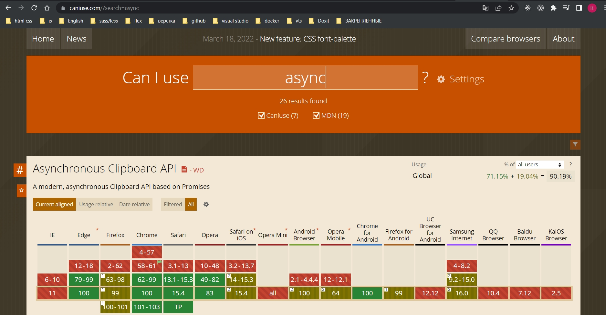
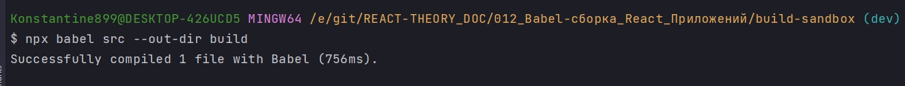
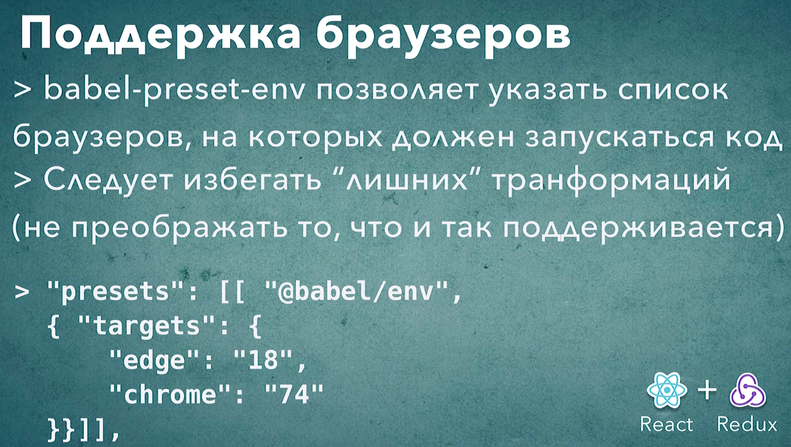

# 006_Оптимизация_сборки_для_конкретных_браузеров

Браузеры развиваются. Не так быстро как бы нам разработчикам хотелось бы, но на смену устаревшим версиям приходят более
новые с более полной поддержкой стандартов ECMAScript.

Но @babel/preset-env трансформирует абсолютно все аспекты языка.

Но вот вопрос. Всег да ли это нужно?

Если вы разрабатываете внутреннее приложение для корпораций где стандартный браузер это chrome. И вам настолько повезло
что chrome обновляется автоматически и регулярно, то большинство трансформаций вам попросту не нужно.

Ну правда!!! Зачем тратить время на сборку, генерировать код который будет куда больше оригинального да еще и лишать
браузер возможности использовать те внутренние оптимизации которые были созданы специально для нового синтаксиса.
Намного лучше будет трансформировать только тот код, который ваши целевые браузеры действительно не смогут понять. К
примеру только эксперементальные возможности и самые свежие конструкции которые уже стали частью стандарта, но еще не
успели войти в новую версию браузера.

<https://caniuse.com/>



Поддержка асинхронных функций появилась в chrome 55, microsoft age 15, firefox 52. Эти версии браузеров вышли в 2016
году. И если ваше приложение расчитано на браузеры более свежих версий, то преобразовывать код асинхронныз функций вам
не нужно.

С другой стороны Internet Explorer 11, который все еще используется в корпоративной среде, не поддерживает асинхронные
функции.

К примеру вы определи какие именно браузеры вы хотите поддержать. Но теперь из этого списка браузеров вам как то нужно
получить список тех трансформаций, которые вам нужны в вашем .babelrc. Это совсем не простая задача учитывая сколько в
мире браузеров.

Возможности @babel/preset-env. Поддержка конкретных версий браузера.

В .babelrc помимо самого пресета мы можем указать дополнительные свойства этого пресета.

Если мы хотим передать в пресет дополнительные параметры, то вместо пресета нам нужно передать массив. Где первым
элементом будет сам пресет, ну а вторым параметром будет объект с настройками для этого пресета.

И параметр который отвечает за список браузеров, которые мы с вами собираемся поддерживать, это параметр targets цели. В
targets передаю объект в котором указываю верссии браузеров.

```json
{
  "presets": [
    [
      "@babel/env",
      {
        "targets": {
          "edge": "18",
          "chrome": "74"
        }
      }
    ]
  ],
  "plugins": [
    "@babel/proposal-class-properties"
  ]
}
```

Те браузеры которые мы указали поддерживают это конструкции

```js
//src/main.js

class App {
    run = (name = "World") => {
        console.log(`Hello ${name}`);
    };
}

const app = new App();
app.run();

```

Единственная конструкция которая не поддерживается это поля классов.

Перезапускаю процесс сборки.

```shell
npx babel src --out-dir build
```



```js
"use strict";

function _defineProperty(obj, key, value) {
    if (key in obj) {
        Object.defineProperty(obj, key, {value: value, enumerable: true, configurable: true, writable: true});
    } else {
        obj[key] = value;
    }
    return obj;
}

//src/main.js
class App {
    constructor() {
        _defineProperty(this, "run", (name = "World") => {
            console.log(`Hello ${name}`);
        });
    }

}

const app = new App();
app.run();
```

Единственный аспект который babel решил транспилоровать это поля классов.

@babel/preset-env умеет определять какие именно части языка нужно трасформировать основываясь на тех браузерах которые
вы передадите в этот пресет. Т.е. внутри @babel/preset-env есть табличка со списком тех возможностей которые
поддерживаются теми или иными браузерами. И затем зная какие именно браузеры вы хотите поддержать @babel/preset-env
будет выбирать те трасформации которые нужны.

И так эксперемент с асинхронной функцией

```js
//src/main.js

class App {
    run = async (name = "World") => {
        console.log(`Hello ${name}`);
    };
}

const app = new App();
app
    .run()
    .then(() => console.log("done"))
    .catch((error) => console.log(error));

```

Транспилированный код

```js
"use strict";

function _defineProperty(obj, key, value) {
    if (key in obj) {
        Object.defineProperty(obj, key, {value: value, enumerable: true, configurable: true, writable: true});
    } else {
        obj[key] = value;
    }
    return obj;
}

//src/main.js
class App {
    constructor() {
        _defineProperty(this, "run", async (name = "World") => {
            console.log(`Hello ${name}`);
        });
    }

}

const app = new App();
app.run().then(() => console.log("done")).catch(error => console.log(error));
```

Мы видим что в транспилированном коде наша функция просто стала асинхронной. Т.е. Babel понял что ключевое слово async
это что-то что браузер понимает из коробки и трансформировать эту конструкцию не нужно.

И теперь продолжим эксперемент. Заменим chrome 74 версии на 54.

```json
{
  "presets": [
    [
      "@babel/env",
      {
        "targets": {
          "edge": "18",
          "chrome": "54"
        }
      }
    ]
  ],
  "plugins": [
    "@babel/proposal-class-properties"
  ]
}
```

```shell
 npx babel src --out-dir build

```
И вот транспилированный код

```js
"use strict";

function asyncGeneratorStep(gen, resolve, reject, _next, _throw, key, arg) { try { var info = gen[key](arg); var value = info.value; } catch (error) { reject(error); return; } if (info.done) { resolve(value); } else { Promise.resolve(value).then(_next, _throw); } }

function _asyncToGenerator(fn) { return function () { var self = this, args = arguments; return new Promise(function (resolve, reject) { var gen = fn.apply(self, args); function _next(value) { asyncGeneratorStep(gen, resolve, reject, _next, _throw, "next", value); } function _throw(err) { asyncGeneratorStep(gen, resolve, reject, _next, _throw, "throw", err); } _next(undefined); }); }; }

function _defineProperty(obj, key, value) { if (key in obj) { Object.defineProperty(obj, key, { value: value, enumerable: true, configurable: true, writable: true }); } else { obj[key] = value; } return obj; }

//src/main.js
class App {
  constructor() {
    _defineProperty(this, "run", /*#__PURE__*/_asyncToGenerator(function* (name = "World") {
      console.log(`Hello ${name}`);
    }));
  }

}

const app = new App();
app.run().then(() => console.log("done")).catch(error => console.log(error));
```

Babel стал использовать _asyncToGenerator. И для того что бы съэмитировать работу асинхронной функции Babel использует синтаксис Generate.

А теперь "ie": "11"

```json
{
  "presets": [
    [
      "@babel/env",
      {
        "targets": {
          "edge": "18",
          "chrome": "54",
          "ie": "11"
        }
      }
    ]
  ],
  "plugins": [
    "@babel/proposal-class-properties"
  ]
}
```

И вот транспилированный код

```js
"use strict";

function asyncGeneratorStep(gen, resolve, reject, _next, _throw, key, arg) { try { var info = gen[key](arg); var value = info.value; } catch (error) { reject(error); return; } if (info.done) { resolve(value); } else { Promise.resolve(value).then(_next, _throw); } }

function _asyncToGenerator(fn) { return function () { var self = this, args = arguments; return new Promise(function (resolve, reject) { var gen = fn.apply(self, args); function _next(value) { asyncGeneratorStep(gen, resolve, reject, _next, _throw, "next", value); } function _throw(err) { asyncGeneratorStep(gen, resolve, reject, _next, _throw, "throw", err); } _next(undefined); }); }; }

function _defineProperties(target, props) { for (var i = 0; i < props.length; i++) { var descriptor = props[i]; descriptor.enumerable = descriptor.enumerable || false; descriptor.configurable = true; if ("value" in descriptor) descriptor.writable = true; Object.defineProperty(target, descriptor.key, descriptor); } }

function _createClass(Constructor, protoProps, staticProps) { if (protoProps) _defineProperties(Constructor.prototype, protoProps); if (staticProps) _defineProperties(Constructor, staticProps); Object.defineProperty(Constructor, "prototype", { writable: false }); return Constructor; }

function _classCallCheck(instance, Constructor) { if (!(instance instanceof Constructor)) { throw new TypeError("Cannot call a class as a function"); } }

function _defineProperty(obj, key, value) { if (key in obj) { Object.defineProperty(obj, key, { value: value, enumerable: true, configurable: true, writable: true }); } else { obj[key] = value; } return obj; }

//src/main.js
var App = /*#__PURE__*/_createClass(function App() {
  _classCallCheck(this, App);

  _defineProperty(this, "run", /*#__PURE__*/_asyncToGenerator( /*#__PURE__*/regeneratorRuntime.mark(function _callee() {
    var name,
        _args = arguments;
    return regeneratorRuntime.wrap(function _callee$(_context) {
      while (1) {
        switch (_context.prev = _context.next) {
          case 0:
            name = _args.length > 0 && _args[0] !== undefined ? _args[0] : "World";
            console.log("Hello ".concat(name));

          case 2:
          case "end":
            return _context.stop();
        }
      }
    }, _callee);
  })));
});

var app = new App();
app.run().then(function () {
  return console.log("done");
}).catch(function (error) {
  return console.log(error);
});
```

ie 11 не поддерживает даже синтаксис Generate. Теперь вместо генераторов используется вспомогательная библиотека которая называется regeneratorRuntime

Ключевой для этого урока момент это насколько просто мы переключали уровни поддержки. Не вникая при этом в детали какие именно трансформации нам нужны и какие именно возможности поддерживаются конкретными версиями браузеров.



