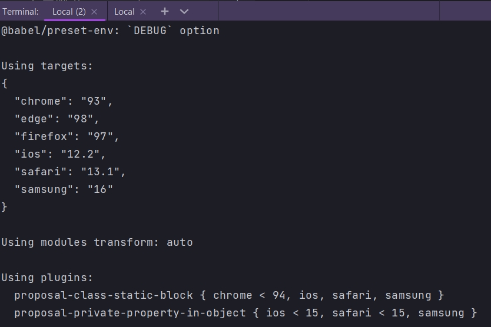

# 007_Динамический_выбор_браузеров_browserlist

Возможности @babel/preset-env не заканчиваются на выборе конкретных браузеров. В качестве целевой платформы targets можно указать выражение которое будет исполняться динамически и выбирать за вас нужные браузеры по каким нибудь признакам. 

К примеру можно указать последнии две версии chrome. Нужно немножко изменить синтаксис targets. Теперь это будет массив. И это будет массив сторок. Каждая строка это выражение.

```json
{
  "presets": [
    [
      "@babel/env",
      {
        "targets": [
          "last 2 chrome versions"
        ]
      }
    ]
  ],
  "plugins": [
    "@babel/proposal-class-properties"
  ]
}
```

```shell
npx babel src --out-dir build  
```


По мимо того как будут выходить новые версии chrome, это выражение будет давать разные результаты и мы будем автоматически поддерживать только свежие версии и опускать поддержку тех версий которые нам больше не интересны.

Эти выражения можно комбинировать.

```js
{
  "presets": [
    [
      "@babel/env",
      {
        "targets": [
          "last 2 chrome versions",
          "last 2 firefox versions",
          "last 2 ios versions"
        ]
      }
    ]
  ],
  "plugins": [
    "@babel/proposal-class-properties"
  ]
}
```

Теперь можно былобы перезагрузить build и посмотреть что он все еще работает. Но вот интересный вопрос. Как нам узнать какие именно браузеры мы поддерживаем?

Зделать это очень просто. Можно добавить еще один параметр который называется debug в нашу конфигурацию presets. И тогда, во время сборки, мы в консоли увидим под какие именно браузеры мы собираем наш код.

```json
{
  "presets": [
    [
      "@babel/env",
      {
        "debug": true,
        "targets": [
          "last 2 chrome versions",
          "last 2 firefox versions",
          "last 2 ios versions"
        ]
      }
    ]
  ],
  "plugins": [
    "@babel/proposal-class-properties"
  ]
}
```

```shell
npx babel src --out-dir build 
```


Мы видим браузеры которые мы поддерживаем. А так же список плагинов, список трансформаций которые будут использоваться babel для этих целевых браузеров. Рядом с каждой трансформацией будет версия браузера для которой эта трансформация нужна.

И последняя строка 

```shell
Using polyfills: No polyfills were added, since the `useBuiltIns` option was not set.
```
говорит что мы не используем полифилы.


Использовать дополнительную опцию "debug": true, довольно полезно в пресете  @babel/preset-env.

Но есть и другие способы определить как определить какие именно браузеры будут поддерживаться.

<https://browserl.ist/>

browserl.ist - это и есть библиотека которая отвечает за выбор браузеров в нашем приложении. Это open source библиотека.

<https://github.com/browserslist/browserslist>

Если вам интересно какие еще выражения поддерживает эта библиотека, то можно почитать документацию. Тут довольно много полезных примеров о том как именно еще можно указать какие конкретно браузеры вы хотите поддержать.


Еще выражение.

```json
{
  "presets": [
    [
      "@babel/env",
      {
        "debug": true,
        "targets": [
          "> 0.3%"
        ]
      }
    ]
  ],
  "plugins": [
    "@babel/proposal-class-properties"
  ]
}
```

Это выражение означает что мы хотим поддержать все браузеры у которых количество пользователей в мире > 0.3%.


Но мы не хотим поддерживать абсолютно ни какую версию Internet Explorer.

```json
{
  "presets": [
    [
      "@babel/env",
      {
        "debug": true,
        "targets": [
          "> 0.3%",
          "not ie > 0"
        ]
      }
    ]
  ],
  "plugins": [
    "@babel/proposal-class-properties"
  ]
}
```



Использовать такие выражения в реальном проекте не всегда хорошая идея. К примеру мировая статистика ни имеет ничего общего с демографией ваших пользователей. И ваших конкретных условий бизнеса.

По этому лучшим подходом будет указать конкретные браузеры которые вы собираетес поддержать.


